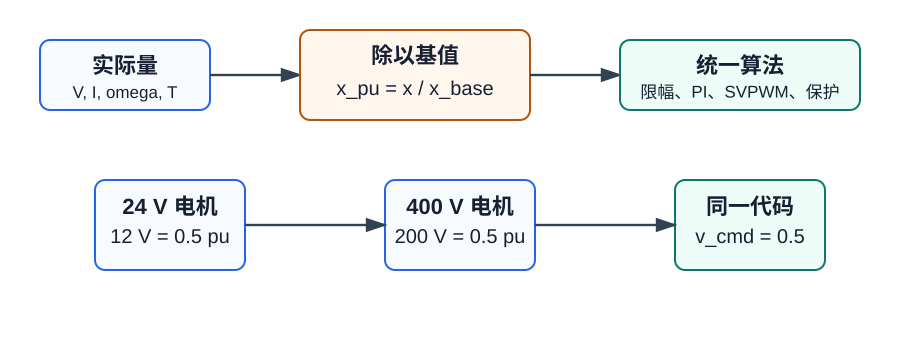

# FOUND-01 标幺值系统：把不同电机变成同一套算法

标幺值不是为了让公式变得好看，而是为了让算法能复用。24 V 小电机和 400 V 伺服电机的物理数值差很多，但控制器真正关心的是“当前电压占可用电压的多少”“当前电流占额定电流的多少”。把这些量都换成标幺值以后，同一套限幅、PI、弱磁和SVPWM代码就能迁移。



## 1. 基本定义

任意物理量的标幺值为：

$$
x_{pu} = \frac{x_{actual}}{x_{base}}
$$

反算实际量：

$$
x_{actual} = x_{pu} \cdot x_{base}
$$

电机控制里最先选的通常是电压基值、电流基值和角速度基值。其他基值由物理关系推导出来，不能随意独立填写。

| 量 | 常用基值 | 说明 |
| --- | --- | --- |
| 相电压 | $V_{base}$ | 常取线性调制区最大相电压 |
| 相电流 | $I_{base}$ | 常取额定峰值电流或保护电流 |
| 电角速度 | $\omega_{base}$ | 常取额定电角速度或最高电角速度 |
| 阻抗 | $Z_{base}=V_{base}/I_{base}$ | 电阻、电感换算的桥 |
| 电感 | $L_{base}=Z_{base}/\omega_{base}$ | 用于电流环参数归一化 |

## 2. 基值选择的工程规则

第一，基值要覆盖最大工作范围。若 $I_{base}$ 取太小，过载时标幺值会超过 1，定点实现会提前饱和。

第二，基值要保留足够分辨率。若 $I_{base}$ 取太大，低电流控制时每一位对应的实际电流太粗，电流环会抖。

第三，电压基值要与调制方式一致。SVPWM线性区常用：

$$
V_{phase,max} = \frac{V_{dc}}{\sqrt{3}}
$$

若代码里 $v_d,v_q$ 的限幅使用 $V_{dc}/\sqrt{3}$，那么 $V_{base}$ 就应和它保持一致，否则“0.9 pu”在不同模块里含义会变。

## 3. PI参数如何换成标幺值

连续电流环对象为：

$$
G(s)=\frac{1}{L_s s + R_s}
$$

零极点对消设计：

$$
K_p = \omega_c L_s
$$

$$
K_i = \omega_c R_s
$$

换成标幺值后，电压命令和电流误差都已经归一，因此比例增益要乘上电流基值再除以电压基值：

$$
K_{p,pu} = K_p \frac{I_{base}}{V_{base}}
$$

离散积分项常写成：

$$
u_i[k] = u_i[k-1] + K_{i,pu} T_s e_i[k]
$$

其中：

$$
K_{i,pu}=K_i\frac{I_{base}}{V_{base}}
$$

## 4. DSP代码骨架

```c
typedef struct {
    float v_base;
    float i_base;
    float w_base;
    float z_base;
    float l_base;
} pu_base_t;

static inline pu_base_t pu_make_base(float v_base, float i_base, float w_base)
{
    pu_base_t b;
    b.v_base = v_base;
    b.i_base = i_base;
    b.w_base = w_base;
    b.z_base = v_base / i_base;
    b.l_base = b.z_base / w_base;
    return b;
}

static inline float pu_from_actual(float actual, float base)
{
    return actual / base;
}

static inline float pu_to_actual(float pu, float base)
{
    return pu * base;
}
```

## 5. 调试检查点

| 检查项 | 正确现象 | 常见错误 |
| --- | --- | --- |
| 电流采样 | 空载时三相电流接近 0 pu | ADC offset 未扣除 |
| 电压限幅 | $v_d^2+v_q^2 \leq 1$ | 电压基值和SVPWM限幅不一致 |
| PI增益 | 换电机后只改基值和物理参数 | 直接复制旧工程整数增益 |
| 保护阈值 | 过流阈值有实际物理含义 | 标幺阈值和硬件保护脱节 |

标幺值的关键不是“除一下”，而是所有模块共用同一套基值表。基值表一旦错，后面的定点、PI、弱磁和SVPWM都会跟着错。
