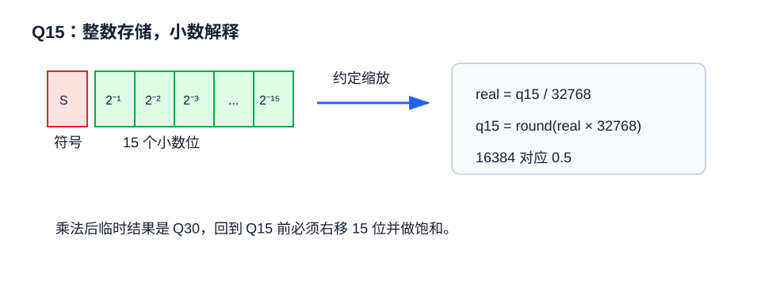

# FOUND-02 定点数与Q格式：让没有FPU的DSP稳定跑FOC

定点数的本质是“整数加小数点位置约定”。DSP只做整数运算，但我们约定某个整数代表实际值的若干分之一。例如 Q15 使用 15 个小数位，`16384` 表示 `0.5`。



## 1. Q格式定义

Qm.n 表示整数部分有 m 位，小数部分有 n 位。电机控制中常见的是 Q15、Q14、Q12。

$$
x_{q15} = round(x \cdot 2^{15})
$$

$$
x = \frac{x_{q15}}{2^{15}}
$$

| 格式 | 存储类型 | 表示范围 | 分辨率 | 常见用途 |
| --- | --- | --- | --- | --- |
| Q15 | int16 | $[-1,1)$ | $1/32768$ | sin, cos, duty |
| Q14 | int16 | $[-2,2)$ 或工程自定义 | $1/16384$ | 电流、电压 |
| Q30 | int32 | 中间结果 | $1/2^{30}$ | Q15乘法结果 |
| Q28 | int32 | 较大动态范围 | $1/2^{28}$ | PI积分项 |

## 2. 乘法为什么要移位

两个 Q15 相乘：

$$
(a \cdot 2^{15}) (b \cdot 2^{15}) = ab \cdot 2^{30}
$$

结果是 Q30。若要回到 Q15，需要右移 15 位：

$$
y_{q15} = sat16((a_{q15} \cdot b_{q15}) >> 15)
$$

## 3. 最小可用代码

```c
#include <stdint.h>

static inline int16_t sat16(int32_t x)
{
    if (x > 32767) return 32767;
    if (x < -32768) return -32768;
    return (int16_t)x;
}

static inline int16_t q15_mul(int16_t a, int16_t b)
{
    int32_t p = (int32_t)a * (int32_t)b;
    p += (p >= 0) ? (1 << 14) : -(1 << 14);
    return sat16(p >> 15);
}

static inline int16_t q15_from_float(float x)
{
    if (x >= 0.999969f) x = 0.999969f;
    if (x < -1.0f) x = -1.0f;
    return (int16_t)(x * 32768.0f);
}
```

这里的舍入很重要。若直接右移，相当于向零或向负无穷截断，长期积分会产生偏差。

## 4. 定点PI控制器

电流误差用 Q15，比例增益用 Q15，积分项用 Q31 或 Q28 保存。

```c
typedef struct {
    int16_t kp_q15;
    int16_t ki_ts_q15;
    int32_t integ_q30;
    int16_t out_min_q15;
    int16_t out_max_q15;
} pi_q15_t;

int16_t pi_q15_step(pi_q15_t *pi, int16_t ref, int16_t fb)
{
    int16_t err = sat16((int32_t)ref - fb);
    int16_t p = q15_mul(pi->kp_q15, err);
    pi->integ_q30 += (int32_t)pi->ki_ts_q15 * err;

    int32_t u_q15 = (int32_t)p + (pi->integ_q30 >> 15);

    if (u_q15 > pi->out_max_q15) {
        u_q15 = pi->out_max_q15;
        if (err > 0) pi->integ_q30 -= (int32_t)pi->ki_ts_q15 * err;
    }
    if (u_q15 < pi->out_min_q15) {
        u_q15 = pi->out_min_q15;
        if (err < 0) pi->integ_q30 -= (int32_t)pi->ki_ts_q15 * err;
    }
    return (int16_t)u_q15;
}
```

## 5. 定点实现检查表

| 问题 | 快速判断 | 修正方式 |
| --- | --- | --- |
| 电流环有细碎抖动 | 低电流时命令跳变明显 | 提高基值分辨率或改用Q格式 |
| PI积分突然翻转 | 积分项溢出 | 积分使用 int32 并限幅 |
| 高速角度抖动 | sin/cos 查表分辨率不足 | 提高表长或使用CORDIC |
| SVPWM占空比越界 | 乘法后未饱和 | 每个边界都做 sat |

定点数不是把 `float` 全部替换成 `int16_t`。真正的移植顺序是先标幺化，再选Q格式，再逐个变量证明范围，最后才写代码。
