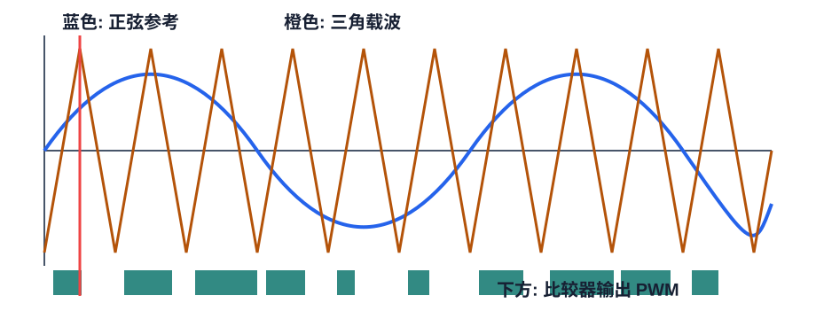

# FOUND-03 SPWM原理与DSP实现：从正弦参考到定时器比较值

SPWM 的思路非常直接：用三相正弦参考分别和同一个三角载波比较。参考值高于载波时上管导通，低于载波时下管导通。参考越高，脉冲越宽；参考越低，脉冲越窄。



## 1. 三相参考波

三相电压参考为：

$$
v_a^*=m\sin(\theta)
$$

$$
v_b^*=m\sin(\theta-\frac{2\pi}{3})
$$

$$
v_c^*=m\sin(\theta+\frac{2\pi}{3})
$$

其中 $m$ 是调制度。在线性区内，$m$ 越大，输出基波电压越大。


## 2. 从参考波到占空比

DSP 里通常不真的生成三角波去比较，而是直接把归一化参考换算成占空比：

$$
d_a=\frac{v_a^*+1}{2}
$$

$$
d_b=\frac{v_b^*+1}{2}
$$

$$
d_c=\frac{v_c^*+1}{2}
$$

若定时器采用中心对齐模式，周期寄存器为 `TBPRD`，比较值为：

$$
CMPA=d_a\cdot TBPRD
$$

这等价于“参考波和载波比较”，只是省掉了实时比较载波的步骤。

## 3. 含零序注入的 SPWM

普通 SPWM 的三相参考是三条独立正弦。它容易理解，但有一个明显浪费：三相 duty 的最大值和最小值经常没有同时贴近 0 和 1，直流母线两端还有可用空间。零序注入的想法是给三相参考同时加上同一个量，让三相波形整体上下平移，把可用 duty 区间用满。

关键点是：三相同时加同一个零序分量，不会改变线电压。

$$
v_{ab}=(v_a+v_0)-(v_b+v_0)=v_a-v_b
$$

$$
v_{bc}=(v_b+v_0)-(v_c+v_0)=v_b-v_c
$$

电机绕组真正看到的是线电压和空间矢量，因此合适的零序分量不会改变目标转矩方向，却能改善母线利用率。

### 3.1 最大最小值零序注入

工程里最常用的写法是先算三相正弦参考，再取最大值和最小值：

$$
v_{max}=\max(v_a^*,v_b^*,v_c^*)
$$

$$
v_{min}=\min(v_a^*,v_b^*,v_c^*)
$$

然后注入：

$$
v_0=-\frac{v_{max}+v_{min}}{2}
$$

得到修正后的三相参考：

$$
v_a'=v_a^*+v_0,\quad v_b'=v_b^*+v_0,\quad v_c'=v_c^*+v_0
$$

这个公式的含义非常朴素：把当前三相参考的最高点和最低点关于 0 对称地摆放。换句话说，如果三相中最高的是 $0.82$、最低的是 $-0.56$，它们的中心在 $0.13$，那就整体减去 $0.13$，让最高和最低尽量平均分布在正负两侧。

### 3.2 与三次谐波注入的关系

最大最小值法在连续正弦情况下等价于注入一个合适的三次谐波零序分量。三次谐波在三相中同相：

$$
\sin(3\theta)=\sin(3(\theta-\frac{2\pi}{3}))=\sin(3(\theta+\frac{2\pi}{3}))
$$

所以它属于零序分量，会出现在相对直流中点的相电压参考里，但不会出现在线电压里。实际 DSP 代码通常不显式计算三次谐波，而是用最大最小值法，因为它不需要分段判断，也不依赖三角函数推导。

### 3.3 母线利用率提升

普通 SPWM 在线性区的相电压基波峰值约为：

$$
V_{1,\max}^{SPWM}=\frac{V_{dc}}{2}
$$

含零序注入后，线性区可以达到 SVPWM 的内切圆边界：

$$
V_{1,\max}^{ZSPWM}=\frac{V_{dc}}{\sqrt{3}}
$$

提升比例为：

$$
\frac{V_{dc}/\sqrt{3}}{V_{dc}/2}=\frac{2}{\sqrt{3}}\approx1.1547
$$

也就是常说的母线利用率提升约 15%。注意这里仍然是线性调制区：零序注入把正弦参考更好地塞进 PWM 约束内，但不等于过调制。超过这个边界后，应进入限幅或过调制策略，参考 [ALG-10 过调制与六阶梯波](../algorithm/ALG-10-Overmodulation.md)。

### 3.4 DSP 实现

```c
spwm_out_t zspwm_step(float theta, float modulation)
{
    const float two_pi_over_3 = 2.09439510239f;
    float va = modulation * sinf(theta);
    float vb = modulation * sinf(theta - two_pi_over_3);
    float vc = modulation * sinf(theta + two_pi_over_3);

    float vmax = va;
    if (vb > vmax) vmax = vb;
    if (vc > vmax) vmax = vc;

    float vmin = va;
    if (vb < vmin) vmin = vb;
    if (vc < vmin) vmin = vc;

    float vzero = -0.5f * (vmax + vmin);

    spwm_out_t out;
    out.duty_a = clamp01(0.5f + 0.5f * (va + vzero));
    out.duty_b = clamp01(0.5f + 0.5f * (vb + vzero));
    out.duty_c = clamp01(0.5f + 0.5f * (vc + vzero));
    return out;
}
```

如果前面的 `va/vb/vc` 已经按半母线归一化到 $[-1,1]$，占空比换算使用 `0.5f + 0.5f * v`。如果像 SVPWM 代码那样把 $\alpha\beta$ 电压按 $V_{dc}$ 归一化成相 duty 偏移量，则常见写法会变成 `0.5f + va + vzero`。两种写法不能混用，调试时要先统一归一化基准。

### 3.5 普通 SPWM、零序 SPWM、SVPWM 的边界

| 方法 | 输入形式 | 核心动作 | 适合阶段 |
| --- | --- | --- | --- |
| 普通 SPWM | 三相正弦 $v_a^*,v_b^*,v_c^*$ | 直接映射 duty | 入门、低压验证、理解载波比较 |
| 零序注入 SPWM | 三相正弦加零序 $v_0$ | 平移三相参考，提高母线利用率 | 从 SPWM 过渡到 SVPWM 的工程实现 |
| SVPWM | $\alpha\beta$ 电压矢量 | 用空间矢量或等效零序法合成 duty | FOC 主流实现、需要扇区和采样窗口管理 |

零序注入 SPWM 可以看作“用 SPWM 的入口写出 SVPWM 的效果”。当控制器已经在 dq 或 $\alpha\beta$ 坐标系中工作时，不必强行绕回三相正弦参考，直接使用 [FOUND-04 SVPWM](FOUND-04-SVPWM-Principle-DSP.md) 的空间矢量接口更自然。

### 3.6 调试检查

| 检查项 | 正确现象 | 错误线索 |
| --- | --- | --- |
| 线电压 | 与普通 SPWM 的基波相位一致 | 加零序后相序反了，说明符号或相序错 |
| 三相 duty | 整体上下平移，最大最小值更贴近边界 | 某一相单独偏移，说明零序没有三相同加 |
| duty 范围 | 线性区内不触碰 0 或 1 | 调制度定义过大或归一化基准混用 |
| 电流波形 | 同调制度下电流基波能力更高 | 低速电流畸变明显，先查死区和采样点 |

## 4. DSP 实现

```c
#include <math.h>

typedef struct {
    float duty_a;
    float duty_b;
    float duty_c;
} spwm_out_t;

static inline float clamp01(float x)
{
    if (x < 0.0f) return 0.0f;
    if (x > 1.0f) return 1.0f;
    return x;
}

spwm_out_t spwm_step(float theta, float modulation)
{
    const float two_pi_over_3 = 2.09439510239f;
    float va = modulation * sinf(theta);
    float vb = modulation * sinf(theta - two_pi_over_3);
    float vc = modulation * sinf(theta + two_pi_over_3);

    spwm_out_t out;
    out.duty_a = clamp01(0.5f + 0.5f * va);
    out.duty_b = clamp01(0.5f + 0.5f * vb);
    out.duty_c = clamp01(0.5f + 0.5f * vc);
    return out;
}

void spwm_write_timer(spwm_out_t u, unsigned period)
{
    PWM_CMPA = (unsigned)(u.duty_a * period);
    PWM_CMPB = (unsigned)(u.duty_b * period);
    PWM_CMPC = (unsigned)(u.duty_c * period);
}
```

## 5. 中心对齐、采样点和死区

中心对齐 PWM 让开关动作围绕周期中心对称，低次谐波更小，也方便在 PWM 中点附近采样电流。死区时间必须由互补 PWM 外设插入，不建议在算法层手动错开占空比，否则三相调制一致性会被破坏。

| 项目 | 建议 |
| --- | --- |
| PWM 模式 | 中心对齐，上下计数 |
| 电流采样 | 在载波中点或电流纹波较小处触发 ADC |
| 死区 | 由 PWM 外设插入，按功率器件开关速度配置 |
| 限幅 | duty 保持在安全边界，如 2% 到 98% |

## 6. SPWM 的局限

普通 SPWM 容易理解，也容易实现，但直流母线利用率低于含零序注入的调制。零序注入可以补上母线利用率短板，但它仍然没有显式表达空间矢量扇区、零矢量分配、电流采样窗口和过调制边界。若系统需要自然接入 FOC 的 $v_\alpha,v_\beta$，或者需要围绕扇区管理采样和保护，就应进入 SVPWM。

## 7. 调试方法

先不上功率，示波器只看三路 PWM。正确现象是三相占空比相差 120 电角度，调制度从 0 增大时占空比摆幅同步增大。

| 现象 | 可能原因 |
| --- | --- |
| 三相同相变化 | 角度偏移没有加正负 $2\pi/3$ |
| 某一相占空比反向 | 相序或符号约定错 |
| 低占空比丢脉冲 | 死区或最小脉宽限制太大 |
| 电流有尖峰 | ADC 采样点靠近开关瞬间 |
