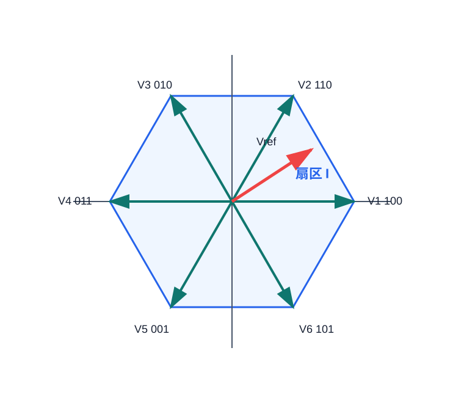
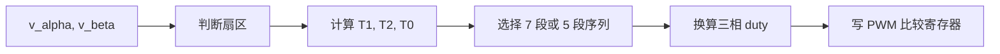

# FOUND-04 SVPWM原理与DSP实现：用相邻矢量合成参考电压

SVPWM 不再把三相看成三条独立正弦，而是把逆变器的开关状态看成空间矢量。参考电压落在哪个扇区，就用该扇区相邻的两个有效矢量和零矢量在一个 PWM 周期内加权合成。



## 1. 六个有效矢量

两电平三相逆变器每相只有上管或下管两种状态，共有 8 个状态。其中 `000` 和 `111` 是零矢量，其余 6 个是有效矢量。

| 矢量 | 开关状态 | 角度 |
| --- | --- | --- |
| V1 | 100 | 0 度 |
| V2 | 110 | 60 度 |
| V3 | 010 | 120 度 |
| V4 | 011 | 180 度 |
| V5 | 001 | 240 度 |
| V6 | 101 | 300 度 |



## 2. 作用时间

在某个扇区内，参考矢量由相邻两个有效矢量合成：

$$
\vec{V}_{ref}T_s=\vec{V}_xT_1+\vec{V}_yT_2+\vec{V}_0T_0
$$

并且：

$$
T_0=T_s-T_1-T_2
$$

如果 $T_1+T_2>T_s$，说明参考电压超过线性调制能力，需要限幅或进入过调制。

## 3. 零序注入等效算法

工程代码常用零序注入形式，避免显式计算每个扇区的 $T_1,T_2$。先由 $\alpha\beta$ 反变换得到三相相电压，再减去最大值和最小值的平均数。

这和 [FOUND-03](FOUND-03-SPWM-Principle-DSP.md) 中的“含零序注入 SPWM”是同一个物理思想：三相同时平移不会改变线电压，但可以把三相 duty 更居中地放进 0 到 1 的 PWM 约束里。区别只在入口不同：FOUND-03 从三相正弦参考出发，本文从 $\alpha\beta$ 电压矢量出发。

$$
v_{zero}=-\frac{v_{max}+v_{min}}{2}
$$

$$
d_a=0.5+v_a+v_{zero}
$$

这种写法和空间矢量作用时间法本质一致。

归一化时要特别小心：如果 $v_a,v_b,v_c$ 表示相 duty 的偏移量，公式可以写成 `0.5 + v + v_zero`；如果它们按半母线归一化到 $[-1,1]$，则应写成 `0.5 + 0.5 * (v + v_zero)`。调制算法的很多“看起来只差 2 倍”的错误，都来自这里。

| 入口 | 中间量 | duty 写法 | 更适合的场景 |
| --- | --- | --- | --- |
| 零序 SPWM | 三相正弦参考 | `0.5 + 0.5 * (v + v_zero)` | 从载波比较过渡到母线利用率优化 |
| 等效 SVPWM | $\alpha\beta$ 反变换相电压 | `0.5 + v + v_zero` | FOC 输出 $v_\alpha,v_\beta$ 后直接调制 |

## 4. DSP 实现骨架

```c
typedef struct {
    float duty_a;
    float duty_b;
    float duty_c;
    int sector;
} svpwm_out_t;

static int svpwm_sector(float alpha, float beta)
{
    float x = beta;
    float y = 0.86602540378f * alpha - 0.5f * beta;
    float z = -0.86602540378f * alpha - 0.5f * beta;
    int n = 0;
    if (x > 0.0f) n += 1;
    if (y > 0.0f) n += 2;
    if (z > 0.0f) n += 4;
    static const int map[8] = {0, 2, 6, 1, 4, 3, 5, 0};
    return map[n];
}

static float clamp01(float x)
{
    if (x < 0.0f) return 0.0f;
    if (x > 1.0f) return 1.0f;
    return x;
}

svpwm_out_t svpwm_step(float alpha, float beta)
{
    float va = alpha;
    float vb = -0.5f * alpha + 0.86602540378f * beta;
    float vc = -0.5f * alpha - 0.86602540378f * beta;

    float vmax = va;
    if (vb > vmax) vmax = vb;
    if (vc > vmax) vmax = vc;
    float vmin = va;
    if (vb < vmin) vmin = vb;
    if (vc < vmin) vmin = vc;

    float vzero = -0.5f * (vmax + vmin);

    svpwm_out_t out;
    out.duty_a = clamp01(0.5f + va + vzero);
    out.duty_b = clamp01(0.5f + vb + vzero);
    out.duty_c = clamp01(0.5f + vc + vzero);
    out.sector = svpwm_sector(alpha, beta);
    return out;
}
```

## 5. 与 SPWM 的区别

| 维度 | SPWM | SVPWM |
| --- | --- | --- |
| 思考方式 | 三相分别比较载波 | 空间矢量合成 |
| 母线利用率 | 较低 | 更高 |
| 与 FOC 接口 | 需要从 dq 变回 abc | 自然接收 $\alpha\beta$ 电压 |
| 工程复杂度 | 低 | 中 |
| 常见用途 | 入门和低成本控制 | FOC 主流方案 |

## 6. 调试顺序

先让 $v_\alpha,v_\beta$ 画圆，确认扇区按 1 到 6 循环。再检查三相 duty 是否都在 0 到 1 内。最后低压上电，看相电流是否平滑。

| 现象 | 可能原因 |
| --- | --- |
| 扇区跳变顺序错 | Clarke/Park 符号约定或相序接反 |
| duty 超过边界 | 电压矢量未限幅 |
| 三相 duty 总体偏移 | 零序注入公式符号错 |
| 电机抖动但不转 | 电角度方向和相序不一致 |
