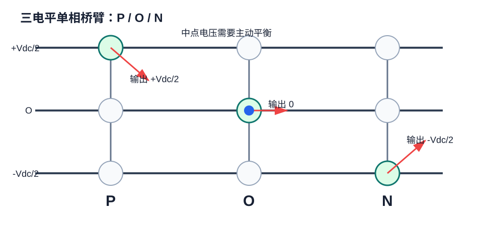

# FOUND-05 三电平SVPWM原理与DSP实现：多一个中点，多一层约束

三电平逆变器把每相输出从两种状态扩展为三种状态：接正母线 P、接中点 O、接负母线 N。输出电压阶梯更多，dv/dt 更低，谐波更小；代价是开关状态更多，中点电压需要主动平衡。



## 1. P/O/N 状态

| 状态 | 相电压 | 含义 |
| --- | --- | --- |
| P | $+V_{dc}/2$ | 相端接正母线 |
| O | $0$ | 相端接中点 |
| N | $-V_{dc}/2$ | 相端接负母线 |

三相组合共有：

$$
3^3 = 27
$$

个开关状态。不同状态可能产生相同空间矢量，这些状态称为冗余矢量。

## 2. 为什么冗余矢量重要

两电平SVPWM只需要考虑合成参考电压。三电平SVPWM还要考虑中点电压：

$$
V_{np} = V_{C1} - V_{C2}
$$

若长期偏向某一类冗余矢量，中点电容会被持续充电或放电，导致 $V_{C1}$ 和 $V_{C2}$ 不平衡。中点不平衡会带来器件过压、输出畸变和保护误触发。

## 3. 简化实现策略

工程上常用两层策略：

第一层按两电平SVPWM算出参考扇区和占空比，得到目标电压合成。

第二层在等效冗余状态之间选择，优先抵消中点偏差。

```c
typedef enum {
    TL_N = -1,
    TL_O = 0,
    TL_P = 1
} tl_state_t;

typedef struct {
    tl_state_t a;
    tl_state_t b;
    tl_state_t c;
} tl_vector_t;

static tl_vector_t choose_redundant_vector(
    tl_vector_t positive_np_current,
    tl_vector_t negative_np_current,
    float v_np_error,
    float i_np_est
) {
    float need_discharge_upper = v_np_error > 0.0f;
    float positive_will_help = i_np_est > 0.0f;

    if (need_discharge_upper == positive_will_help) {
        return positive_np_current;
    }
    return negative_np_current;
}
```

实际代码中的 `i_np_est` 由三相电流和当前开关状态估计，含义是“当前状态会让中点电流往哪个方向流”。

## 4. 三电平调制流程

| 步骤 | 动作 | 输出 |
| --- | --- | --- |
| 1 | 计算 $v_\alpha,v_\beta$ | 参考矢量 |
| 2 | 判断大扇区和小三角区 | 相邻矢量集合 |
| 3 | 计算作用时间 | $T_1,T_2,T_0$ |
| 4 | 查询冗余状态 | 候选开关序列 |
| 5 | 根据中点误差选择 | 最终P/O/N序列 |
| 6 | 写入PWM比较寄存器 | 三电平门极波形 |

## 5. 中点平衡的简单控制律

可以先用滞环策略验证：

```c
typedef struct {
    float upper;
    float lower;
    float band;
} neutral_balance_t;

int neutral_balance_sign(neutral_balance_t nb)
{
    float err = nb.upper - nb.lower;
    if (err > nb.band) return -1;
    if (err < -nb.band) return 1;
    return 0;
}
```

返回值为 0 时优先选择开关损耗更小或序列更对称的状态；返回值不为 0 时优先选择能把中点拉回来的冗余状态。

## 6. 调试风险

三电平SVPWM不能直接照搬两电平代码。必须逐项确认：

| 风险 | 表现 | 检查方法 |
| --- | --- | --- |
| 中点漂移 | 两个母线电容电压逐渐分开 | 低压母线先测 $V_{C1},V_{C2}$ |
| 门极互锁错误 | 同桥臂短路或异常发热 | 用示波器查P/O/N状态 |
| 冗余矢量选择反了 | 平衡控制越调越偏 | 反向测试中点电流估计 |
| 死区补偿缺失 | 小电流畸变明显 | 低速空载看相电流 |

三电平的核心不是“矢量数量更多”这么简单，而是电压合成和中点能量管理同时存在。能把这两件事分开调试，工程风险会低很多。
