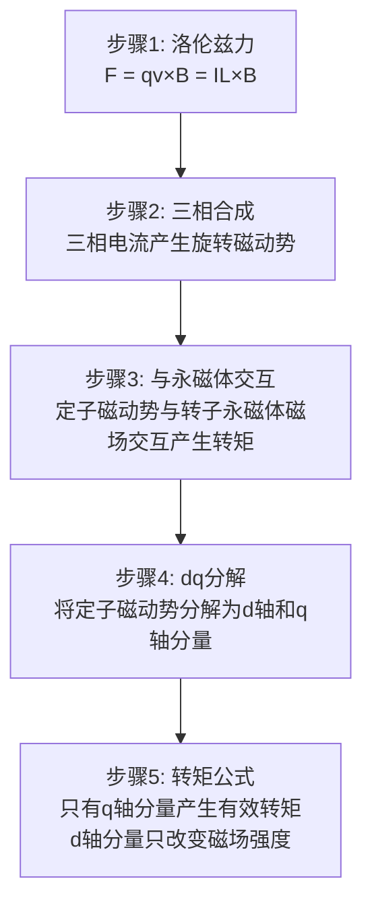
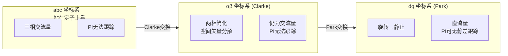

# HW-01B 电机学物理本质深入：从磁路到转矩的底层逻辑

**副标题：理解PMSM的物理本质，才能写出真正robust的控制算法**

---

## 1.  核心摘要  

**一句话讲清楚**：电机不是"通电就转"的黑盒，而是一个磁路-电路-机械三场耦合的物理系统——不理解磁阻决定电感、磁链决定转矩、饱和导致非线性的物理本质，就无法理解为什么PI参数会漂移、为什么解耦会失败、为什么MTPA在表贴式电机上退化为id=0。

**认知挂钩**：很多人以为Park变换只是"数学技巧"，**这是根本性误解！** Park变换的物理本质是"站在旋转磁场上观察"——就像你站在旋转木马上看另一匹木马，它是静止的。Id是"试图改变磁场强度"的电流，Iq是"产生推力"的电流，这个物理图像才是FOC的灵魂。

**与算法的关联**：
-  磁路→电感(Ld,Lq)→PI参数设计→电感饱和时Kp需自适应
-  凸极效应→Ld≠Lq→MTPA才有意义→表贴式PMSM退化为id=0
-  齿槽转矩→转矩脉动→低速爬行→需要前馈补偿
-  交叉耦合→d/q轴不独立→解耦前馈必要→否则高速时Id失控

**前置知识**：本模块是HW-01（电机本体基础）的深入补充，建议先完成HW-01的学习。

---

## 2.  问题引入  

### 工程师的真实困惑

**困惑1：为什么PI参数在不同工作点表现不同？**
```plain
工程师A："我按额定工况整定的PI参数，低速时好好的，高速或重载时电流环就震荡了。"
问题现象：
- 额定工况PI参数整定OK
- 重载时电流环出现震荡
- 高速弱磁时Id/Iq跟踪误差增大
- 同一组PI参数无法覆盖全工况
```

**困惑2：为什么我的MTPA没有效果？**
```plain
工程师B："我实现了MTPA算法，但id参考值始终接近0，和id=0控制没区别。"
问题现象：
- MTPA计算的Id参考值接近0
- 转矩提升微乎其微（<3%）
- 怀疑算法实现有bug
- 实际上可能是电机本身凸极比太小
```

**困惑3：为什么低速时电机一抖一抖的？**
```plain
工程师C："FOC跑起来了，但低速时电机明显有周期性抖动，像是被什么东西卡住了。"
问题现象：
- 低速（<100rpm）周期性转速波动
- 波动频率与转速成正比
- 高速时不明显
- 电流环波形有周期性扰动
```

**困惑4：为什么d轴电流在高速时压不住？**
```plain
工程师D："弱磁时给id负参考，但实际id总是偏大，好像有什么力在推它。"
问题现象：
- Id参考-5A，实际仅-2A
- Iq也出现不期望的波动
- 弱磁深度不够，转速上不去
- 电流环看似稳定但存在稳态偏差
```

### 核心问题

这些问题的根本原因：**不理解电机物理本质！**

| 问题表象 | 物理根因 | 本模块对应章节 |
|---------|---------|-------------|
| PI参数漂移 | 电感饱和→L随工作点变化 | 4.5 饱和与交叉耦合 |
| MTPA无效 | 凸极比不足→磁阻转矩太小 | 4.3 转矩产生机制 |
| 低速抖动 | 齿槽转矩→定位力矩 | 4.3 齿槽转矩 |
| d轴失控 | 交叉耦合→d/q轴不独立 | 4.5 交叉耦合效应 |

### 学习目标

读完本模块，你将能够：

 **理解磁路基本定律** - 磁动势、磁通、磁阻的物理含义及对电感的影响
 **掌握绕组设计原理** - 集中/分布绕组、分数槽配合对反EMF和转矩脉动的影响
 **深入理解转矩产生机制** - 从洛伦兹力到电磁转矩，磁阻转矩的物理条件
 **真正理解dq变换的物理本质** - Park变换不是数学技巧，而是坐标系选择
 **掌握饱和与交叉耦合** - 非线性效应的物理根源及工程对策

---

## 3.  直观理解  

### 磁路类比：水流模型

把磁路想象成水管系统：

| 磁路概念 | 水流类比 | 物理含义 |
|---------|---------|---------|
| 磁动势 F | 水泵压力 | 安匝数 NI，驱动磁通的"力" |
| 磁通 Φ | 水流量 | 磁力线的总量 |
| 磁阻 Rm | 水管阻力 | l/(μA)，μ是"水管光滑度" |
| 磁链 ψ | 水流推动水车的力矩 | NΦ，匝数×磁通 |
| 磁导率 μ | 水管内壁光滑度 | 材料的"导磁能力" |

**关键洞察**：磁导率μ不是常数！就像水管内壁会结垢（饱和），流量越大，阻力也越大。这就是电感饱和的物理根源。

**深入理解**：铁芯的B-H曲线就像弹簧的力-位移曲线——小力时位移线性增加（线性区），力大到一定程度位移增长变缓（膝区），再大力位移几乎不变（深度饱和）。电感L = N²·μ·A/l，μ下降→L下降→Kp = L·ωc偏大→电流环震荡。

### 绕组可视化：旋转磁场

三相绕组产生旋转磁场，就像三个人围成一圈，依次向中心推球：

- 每个人推的力度按正弦变化（正弦电流）
- 三个人相位差120°
- 球就绕中心旋转（旋转磁场）
- Park变换 = 你跳到球上，球对你就是静止的

**为什么必须理解这个？** 因为在定子上看（abc坐标系），电流是交流量，PI控制器无法无静差跟踪交流量。跳到转子上看（dq坐标系），电流变成直流量，PI控制器才能无静差跟踪。这就是FOC必须做Park变换的根本原因——不是数学游戏，是物理需求。

### 凸极效应：椭圆截面 vs 圆形截面

想象一根水管：
- **圆形截面**（表贴式PMSM）：无论从哪个方向看，截面积相同→水阻相同→Ld = Lq
- **椭圆截面**（内置式PMSM）：长轴方向截面积大→水阻小→L大；短轴方向截面积小→水阻大→L小

但这里有个**反直觉**的地方：内置式PMSM的d轴（永磁体方向）气隙更大，磁阻更大，所以Ld反而更小！

- 表贴式PMSM：气隙均匀 = 圆形截面 = Ld = Lq = 没有凸极效应
- 内置式PMSM：d轴气隙大（永磁体磁导率≈空气）、q轴气隙小（铁芯磁导率高）= Ld < Lq = 有凸极效应
- 凸极比 ρ = Lq/Ld 越大，MTPA效果越明显

**工程直觉**：如果你的电机凸极比 ρ < 1.3，别费劲搞MTPA了，收益不到5%，id=0控制就够了。

---

## 4.  技术原理  

### 4.1 磁路分析

#### 磁路基本定律

磁路分析与电路分析高度对偶，理解这个对偶关系是掌握电机物理的第一步：

| 电路 | 磁路 |
|------|------|
| 电动势 E (V) | 磁动势 F = NI (A·turns) |
| 电流 I (A) | 磁通 Φ (Wb) |
| 电阻 R = ρl/A (Ω) | 磁阻 Rm = l/(μA) (A·turns/Wb) |
| 欧姆定律：E = IR | 磁路欧姆定律：F = ΦRm |
| 基尔霍夫电压定律 | 安培环路定律：∮H·dl = NI |

**关键公式**：
- 安培环路定律：∮H·dl = NI（磁动势 = 安匝数）
- 磁路欧姆定律：F = Φ·Rm（磁动势 = 磁通×磁阻）
- 磁阻：Rm = l/(μ·A)（长度/磁导率×截面积）
- 磁链：ψ = N·Φ（匝数×磁通）
- 电感：L = N²/Rm = N²·μ·A/l

**对电控工程师的意义**：电感L直接由磁路参数决定。任何改变磁路的因素（气隙变化、铁芯饱和、温度变化）都会改变电感，进而影响PI参数。

#### 永磁体等效磁路

永磁体在磁路中可以等效为一个恒流源并联一个大内阻：

```plain
永磁体等效模型：
    ┌──[Rm_pm]──┐
    │           │
  F_pm = Hc·lm  Φ_pm
    │           │
    └───────────┘

其中：
- F_pm = Hc·lm：永磁体提供的磁动势（Hc为矫顽力，lm为磁体长度）
- Rm_pm = lm/(μr·Br·Am)：永磁体内磁阻（μr为相对回复磁导率，Br为剩磁，Am为截面积）
```

**工作点决定**：永磁体实际工作点由退磁曲线与外磁路负载线的交点决定。负载线斜率取决于外磁路磁阻。

**温度效应**：
- 温度升高→剩磁Br下降→ψf减小→转矩常数Kt下降
- NdFeB磁体：温度系数约-0.1%/°C → 温升80K → ψf下降约8%
- 铁氧体磁体：温度系数约-0.2%/°C → 温升影响更大
- 这就是为什么电机冷态和热态转矩输出不同的物理原因

#### 气隙磁路

气隙是磁路中磁阻最大的环节，因为空气的相对磁导率μr ≈ 1，而铁芯μr可达数千：

- 气隙磁阻：Rm_gap = δ/(μ0·A)（δ为气隙长度）
- 气隙长度δ直接决定电感大小：L ∝ 1/δ
- 气隙通常占磁路总磁阻的70%~90%

**内置式PMSM的凸极根源**：
- d轴方向：磁通路径经过永磁体→永磁体μr≈1→等效气隙大→Rm大→Ld小
- q轴方向：磁通路径经过铁芯→铁芯μr≈2000~5000→等效气隙小→Rm小→Lq大
- 结果：Ld < Lq，凸极比ρ = Lq/Ld > 1

**定量理解**：假设d轴等效气隙δd = 5mm（含永磁体厚度），q轴等效气隙δq = 0.5mm（仅机械气隙），则Lq/Ld ≈ δd/δq = 10。实际电机中由于漏磁等因素，凸极比通常在1.2~3.0之间。

### 4.2 绕组设计

#### 集中绕组 vs 分布绕组

| 特性 | 集中绕组 | 分布绕组 |
|------|---------|---------|
| 结构 | 每个齿上绕一个线圈 | 每相绕组分布在多个槽中 |
| 端部长度 | 短 | 长 |
| 铜损 | 低 | 高 |
| 绕组系数 | 高（~1.0） | 低（0.9~0.96） |
| 反EMF谐波 | 大（非正弦） | 小（接近正弦） |
| 齿槽转矩 | 通常较大 | 通常较小 |
| 适用场景 | 低成本、小功率 | 高性能、低噪声 |

**电控工程师关注点**：绕组方式影响反EMF波形质量→影响电流环跟踪精度。集中绕组的反EMF谐波含量高，会导致电流THD增大，需要更高带宽的电流环或谐波补偿。

#### 分数槽绕组

分数槽绕组是现代PMSM的主流选择，其核心参数是每极每相槽数q：

- q = Qs / (m × 2p)，其中Qs为槽数，m为相数，2p为极数
- 常见配合：12槽10极(q=0.4)、9槽8极(q=0.375)、6槽4极(q=0.5)

**槽极配合对性能的影响**：
- 合适的配合→绕组因子高→转矩密度大
- 不合适的配合→产生大量谐波→转矩脉动增大→振动噪声
- LCM(Qs, 2p)决定齿槽转矩周期数→LCM越大，齿槽转矩频率越高，幅值越小

**工程经验**：12槽10极是"黄金配合"之一——LCM(12,10)=60，齿槽转矩频率高、幅值小，且绕组因子较高。

#### 绕组系数

绕组系数kw决定了有效匝数，直接影响反EMF常数和转矩常数：

- 分布系数kd：分布绕组比集中绕组磁动势减小的比例
- 短距系数kp：短距绕组比整距绕组磁动势减小的比例
- 绕组系数kw = kd × kp

**对电控的影响**：
- 反EMF常数：Ke = kw × N × ω × Φ
- 转矩常数：Kt = 1.5 × p × kw × ψf
- kw越大→同样电流产生更大转矩→但谐波也更大

### 4.3 转矩产生机制

#### 从洛伦兹力到电磁转矩

转矩产生的物理过程，从微观到宏观：

1. **微观**：导体在磁场中受力——F = I × L × B（安培力/洛伦兹力）
2. **单相**：一相绕组的安培力产生切向推力
3. **三相**：三相绕组安培力合成→旋转转矩
4. **数学表达**：Te = 1.5·p·[ψf·Iq + (Ld-Lq)·Id·Iq]

**逐步推导**（物理直觉版）：



#### 转矩公式的物理解读

Te = 1.5·p·[ψf·Iq + (Ld-Lq)·Id·Iq]

| 转矩项 | 物理含义 | 存在条件 |
|-------|---------|---------|
| ψf·Iq | 永磁体磁场与q轴电流交互→永磁转矩 | 所有PMSM都有 |
| (Ld-Lq)·Id·Iq | d/q轴磁阻差异产生的磁阻转矩 | 仅Ld≠Lq（凸极效应）时 |

**关键推论**：
- **表贴式PMSM**：Ld = Lq → (Ld-Lq) = 0 → 磁阻转矩为零 → id=0是最优策略（MTPA退化为id=0）
- **内置式PMSM**：Ld < Lq → (Ld-Lq) < 0 → 当Id < 0时，磁阻转矩为正 → MTPA利用这个项增加转矩

**MTPA的物理本质**：在总电流Is² = Id² + Iq²受限的条件下，分配Id和Iq的比例，使总转矩最大。当凸极比ρ = Lq/Ld越大，磁阻转矩项的"杠杆"越大，Id偏移0的收益越大。

#### 齿槽转矩

齿槽转矩是永磁体与定子齿槽交互产生的定位力矩，即使不通电也存在：

- **产生机理**：永磁体磁场与齿槽结构交互→磁阻随转子位置周期性变化→产生趋势性力矩
- **周期性**：齿槽转矩一个机械周期内的波动次数 = LCM(Qs, 2p) / p
- **频率**：fcog = LCM(Qs, 2p) × n / 60（n为转速rpm）

**对控制的影响**：
- 低速时导致周期性转速波动（"爬行"现象）
- 速度环无法完全抑制（频率可能超出速度环带宽）
- 位置控制时导致定位精度下降

**抑制方法**：
- 电机设计层面：斜极/斜槽（最有效，可降低70%~90%）、分数槽、优化极弧系数
- 控制算法层面：前馈补偿（标定齿槽转矩表→在Iq参考中叠加补偿量）

### 4.4 dq轴推导的物理本质

#### 从三相abc到dq：不是数学技巧

**abc坐标系**：站在定子上看，三相电流ia, ib, ic随时间正弦变化→旋转磁场

**αβ坐标系**（Clarke变换）：把三相投影到两个正交轴→仍然是站在定子上看，但简化了维度。物理本质：空间矢量分解。

**dq坐标系**（Park变换）：**跳到转子上看！** 旋转磁场对你就是恒定的→Id和Iq是直流量

**三步变换的物理本质**：



**Id和Iq的物理含义**：
- **Id** = 沿d轴（永磁体方向）的磁化电流→改变气隙磁场强度
  - Id > 0：增磁（很少使用，会使铁芯更饱和，增加铁损）
  - Id < 0：弱磁（高速运行时抵消永磁体磁场，扩展转速范围）
  - Id = 0：不改变磁场强度（表贴式PMSM的默认策略）
- **Iq** = 沿q轴（永磁体方向超前90°电角度）的转矩电流→产生推力
  - Iq > 0：正转转矩
  - Iq < 0：反转转矩（制动/发电）

**为什么FOC要用dq？** 因为在dq坐标系中，Id和Iq是直流量，可以用PI控制器无静差跟踪。在abc坐标系中，电流是交流量，PI控制器无法跟踪——这就是FOC必须做坐标变换的根本物理原因。

**进一步理解**：如果把Park变换理解为"站在旋转磁场上观察"，那么：
- Id的变化→改变你站立的"磁场平台"的高度→影响磁场强度
- Iq的变化→你在"磁场平台"上施加的推力→产生转矩
- 解耦控制→确保推力不会改变平台高度，改变高度不会影响推力

### 4.5 饱和与交叉耦合效应

#### 磁饱和

**物理本质**：铁芯B-H曲线非线性——H（磁场强度）增大到一定程度，B（磁通密度）增长变缓。

```plain
B-H曲线示意：
B |        ___________
  |      /
  |    /   ← 膝区（开始饱和）
  |  /
  |/___________ H
  线性区  膝区  饱和区
```

**物理后果链**：
1. B增长变缓 → 磁导率μ = dB/dH下降
2. μ下降 → 电感L = N²·μ·A/l下降
3. L下降 → PI参数Kp = L·ωc偏大（按额定L整定的Kp在饱和区过大）
4. Kp偏大 → 电流环增益过高 → 震荡

**定量理解**：假设额定工况Ld = 2mH，深度弱磁时Id = -8A使铁芯饱和，Ld降至1.4mH。Kp按额定整定为2mH × 1000 = 2.0，但实际需要1.4mH × 1000 = 1.4。Kp偏大43%，电流环很可能震荡。

**工程对策**：
- 电感查表法：Ld(Id, Iq)、Lq(Id, Iq) → Kp随工作点动态调整
- 自适应PI：根据电流环闭环响应在线调整Kp/Ki
- 增益调度：预设多个工作点的PI参数，根据工况切换
- 保守整定：按最小电感整定Kp（牺牲额定工况响应速度）

#### 交叉耦合

**物理根源**：饱和时d/q轴磁路不独立，存在磁耦合。

理想情况（线性区）：
- ψd = Ld·Id + ψf（d轴磁链仅由Id和永磁体决定）
- ψq = Lq·Iq（q轴磁链仅由Iq决定）

实际情况（饱和区）：
- ψd = Ld·Id + Ldq·Iq + ψf（d轴磁链受Iq影响）
- ψq = Lq·Iq + Lqd·Id（q轴磁链受Id影响）

**交叉耦合的数学来源**：电压方程中的反EMF项

```plain
Vd = Rs·Id + Ld·dId/dt - ωe·Lq·Iq    ← 注意 -ωe·Lq·Iq 项
Vq = Rs·Iq + Lq·dIq/dt + ωe·Ld·Id + ωe·ψf  ← 注意 +ωe·Ld·Id + ωe·ψf 项
```

- Vd方程中的 -ωe·Lq·Iq：q轴电流在d轴产生的耦合电压
- Vq方程中的 +ωe·Ld·Id：d轴电流在q轴产生的耦合电压
- +ωe·ψf：永磁体反EMF

**高速时交叉耦合加剧**：ωe越大，耦合项越大。在2倍额定转速时，ωe翻倍，耦合电压翻倍，如果不加解耦前馈，Id和Iq会互相"拉扯"。

**工程对策**：解耦前馈
- Vd_ff = -ωe·Lq·Iq（补偿q轴对d轴的耦合）
- Vq_ff = ωe·(Ld·Id + ψf)（补偿d轴对q轴的耦合+反EMF）

**注意**：解耦前馈依赖电感参数的准确性。如果Ld、Lq因饱和而变化，前馈补偿不完整，仍有残余耦合。高级方案是使用在线电感辨识或电感查表。

#### 温度效应

温度是电机参数漂移的重要来源，影响多个参数：

| 参数 | 温度影响 | 量化关系 | 对控制的影响 |
|------|---------|---------|------------|
| ψf | 温度↑→Br↓→ψf↓ | NdFeB: -0.1%/°C | Kt下降→同样电流输出转矩减小 |
| Rs | 温度↑→Rs↑ | α≈0.00393/°C | Ki=Rs·ωc偏小→稳态误差增大 |
| Ld, Lq | 温度↑→μ略变→L略变 | 通常<5% | 影响较小，可忽略 |
| Br退磁 | 超过居里温度→不可逆退磁 | NdFeB: 310~400°C | 永久性损坏 |

**工程对策**：
- 温度补偿：通过定子电阻在线辨识估算绕组温度→查表修正ψf和Rs
- 电流环Ki自适应：Ki = Rs(T)·ωc
- 转矩常数补偿：Kt(T) = 1.5·p·ψf(T)

---

## 5.  交叉视角  

| 电机物理现象 | 对控制算法的影响 | 对应KB模块 |
|------------|----------------|-----------|
| 电感饱和(L随Id/Iq变化) | PI参数漂移→电流环失稳 | ALG-03(PI调节器) |
| 凸极效应(Ld≠Lq) | MTPA有效→id≠0最优 | ALG-11(MTPA) |
| 齿槽转矩 | 低速转矩脉动→爬行 | ALG-18(补偿算法) |
| 交叉耦合 | d/q轴不独立→解耦前馈必要 | ADV-ALG-07(前馈解耦) |
| 温度漂移(ψf,Rs变化) | 转矩常数变化→PI参数偏移 | ALG-03(PI整定) |
| 铁损 | 弱磁区效率下降→发热 | ALG-11(弱磁) |
| 反EMF谐波 | 电流环跟踪误差→THD增大 | ALG-14(THD分析) |
| 绕组方式 | 反EMF波形质量→电流跟踪精度 | HW-01(电机本体) |
| 气隙不均匀 | 电感位置相关性→参数时变 | ADV-ALG-07(前馈解耦) |
| 永磁体退磁 | 转矩常数永久下降→需重新标定 | HW-01(电机本体) |

**关键交叉理解**：
- 电感饱和 + 交叉耦合 → 高速弱磁区的双重挑战：Ld下降使Kp偏大，同时耦合项增大使解耦不完整
- 凸极效应 + 饱和 → MTPA曲线随饱和程度变化：轻载和重载的最优Id/Iq比例不同
- 齿槽转矩 + 反EMF谐波 → 低速时两者叠加，转矩脉动远比单独考虑时严重

---

## 6.  工程案例  

### 案例1：电感饱和导致电流环失稳

**现象**：某伺服电机额定电流3A，PI参数按额定整定。当负载增大到5A时，电流环开始震荡。

**诊断过程**：
1. 示波器观察电流波形：5A时Id和Iq出现约200Hz的低频震荡
2. 降低Kp至额定值的60%→震荡消失但响应变慢
3. 测量不同电流下的电感：Id=0A时Ld=2.0mH，Id=-5A时Ld=1.5mH，Id=-8A时Ld=1.2mH

**根因**：5A时铁芯进入饱和区，Ld从2mH降至1.2mH，Kp = Ld·ωc偏大1.67倍。

**解决方案**：采用电感查表法，Kp随Id/Iq动态调整：
- 测量Id∈[-10,0]A, Iq∈[0,10]A范围内的Ld和Lq
- 建立2D查表：Kp_d = Ld(Id,Iq)·ωc，Kp_q = Lq(Id,Iq)·ωc
- 线性插值实时更新PI参数

**效果**：全工况范围内电流环稳定，带宽波动<10%。

### 案例2：凸极比不足导致MTPA无效

**现象**：某内置式PMSM凸极比ρ = Lq/Ld = 1.15，实现MTPA后id参考仅比0小0.3A，几乎无改善。

**诊断过程**：
1. 参数确认：Ld = 3.5mH, Lq = 4.0mH, ψf = 0.08Wb, p = 4
2. 额定工况(id=0)：Te = 1.5×4×0.08×10 = 4.8Nm
3. MTPA工况：Id≈-0.3A, Iq≈9.996A → Te = 1.5×4×[0.08×9.996 + (3.5-4.0)×(-0.3)×9.996] ≈ 4.87Nm
4. 转矩提升：(4.87-4.8)/4.8 = 1.5%

**根因**：凸极比太小，磁阻转矩项(Ld-Lq)·Id·Iq占比不足5%。

**教训**：MTPA的经济性取决于凸极比，ρ < 1.3时MTPA收益有限（<5%），不值得增加算法复杂度。选择电机时，如果要用MTPA，应确保ρ > 1.5。

### 案例3：齿槽转矩导致低速爬行

**现象**：某12槽10极电机在50rpm时出现明显周期性转速波动，频率 = 10 × 转速/60。

**诊断过程**：
1. 确认波动频率：50rpm时，波动频率 = LCM(12,10)×50/60 = 60×50/60 = 50Hz
2. 断电手动旋转转子→感受到明显的"咔哒"定位感→确认齿槽转矩
3. 静态测试：锁定定子，缓慢旋转转子，测量转矩→齿槽转矩幅值0.15Nm

**根因**：齿槽转矩频率 = LCM(12,10)×n/60 = 60Hz@50rpm。速度环带宽约50Hz，无法完全抑制60Hz的扰动。

**解决方案**：在速度环前馈中加入齿槽转矩补偿表：
1. 静态转矩测试：缓慢旋转转子一圈，记录转矩vs角度
2. 提取基波和谐波分量（FFT分析）
3. 建立补偿表：Iq_comp(θ) = Tcog(θ) / Kt
4. 在Iq参考中叠加补偿量

**效果**：低速转速波动从±5rpm降至±0.5rpm。

### 案例4：交叉耦合导致弱磁时Id失控

**现象**：某电机在2倍额定转速运行时，Id参考-5A但实际Id仅-3A，同时Iq也出现波动。

**诊断过程**：
1. 检查电流环PI参数→正常
2. 检查角度估算→正常
3. 分析电压方程：2倍速时ωe翻倍，-ωe·Lq·Iq耦合项很大
4. 计算：ωe = 2×314 = 628 rad/s, Lq = 4mH, Iq = 10A → Vd_coupling = 628×0.004×10 = 25.1V

**根因**：高速时ωe·Lq·Iq交叉耦合项很大，未加解耦前馈导致d/q轴互相干扰。25.1V的耦合电压相当于d轴PI调节器需要额外输出25.1V来抵消，但PI输出范围有限，导致Id无法跟踪参考值。

**解决方案**：加入解耦前馈：
- Vd_ff = -ωe·Lq·Iq = -25.1V（补偿q轴对d轴的耦合）
- Vq_ff = ωe·(Ld·Id + ψf)（补偿d轴对q轴的耦合+反EMF）

**效果**：Id跟踪误差从2A降至0.2A，Iq波动消失。

### 案例5：温度漂移导致转矩常数偏差

**现象**：电机冷态转矩输出3Nm，运行30分钟后降至2.7Nm，下降10%。

**诊断过程**：
1. 测量运行前后定子电阻：冷态0.5Ω，热态0.7Ω
2. 估算温升：ΔT = (0.7-0.5)/(0.5×0.00393) = 101.5°C
3. 计算ψf变化：NdFeB温度系数-0.1%/°C → ψf下降约10%
4. 验证：Kt = 1.5×p×ψf → ψf下降10% → Kt下降10% → 转矩从3Nm降至2.7Nm 

**根因**：温升80K→NdFeB剩磁下降约10%→ψf下降→Kt下降。

**解决方案**：通过定子电阻在线辨识估算温度，查表修正ψf：
1. 在线辨识Rs（通过电压方程最小二乘法）
2. 计算温升：ΔT = (Rs_measured - Rs_25°C) / (Rs_25°C × α)
3. 查表修正：ψf(T) = ψf_25°C × [1 + α_ψf × ΔT]
4. 更新转矩常数：Kt(T) = 1.5 × p × ψf(T)

**效果**：转矩输出偏差从10%降至2%。

---

## 7.  实践练习  

### 计算题

**Q1**：某内置式PMSM参数：Ld = 2mH, Lq = 4mH, ψf = 0.05Wb, p = 4, 额定Iq = 10A。计算id = 0和MTPA两种策略下的转矩，并计算MTPA的转矩提升比例。

**提示**：
- MTPA条件：Id = (ψf - √(ψf² + 4(Ld-Lq)²·Iq²)) / (2(Ld-Lq))
- 先求Is² = Id² + Iq²在id=0时的值，再在Is约束下求MTPA

**Q2**：某电机额定工况Ld = 2mH，当Id = -8A时Ld降至1.4mH。电流环带宽设计为1000rad/s，计算额定和饱和两种工况下的Kp，并分析饱和时电流环的稳定性。

**提示**：
- Kp = Ld × ωc
- Kp偏大→增益裕度降低→可能震荡
- 计算Kp偏差百分比

### 设计题

**Q3**：设计一个电感查表方案，使PI参数随工作点自适应调整。说明需要测量哪些数据、查表维度、插值方法。

**提示**：
- 需要测量：不同Id/Iq组合下的Ld和Lq
- 查表维度：2D（Id, Iq）→ Ld, Lq
- 插值方法：双线性插值
- 考虑存储空间和实时性

**Q4**：某电机齿槽转矩为正弦分布，幅值0.1Nm，12槽10极。设计前馈补偿方案，说明如何标定补偿表。

**提示**：
- 齿槽转矩频率 = LCM(12,10) = 60次/机械转
- 补偿表：θ → Iq_comp
- 标定方法：静态转矩测试或电流注入法

### 诊断题

**Q5**：某电机在高速弱磁运行时，Id参考-5A但实际-2A，Iq也有波动。列出所有可能原因，并设计实验逐一排除。

**提示**：可能原因包括：
1. 交叉耦合未补偿
2. 电感参数不准确
3. 角度估算误差
4. 逆变器死区/压降
5. 电流采样偏置
6. 磁饱和导致电感变化

设计排除实验：固定其他变量，每次只改变一个因素，观察Id跟踪是否改善。

---

**模块导航**：
- ⬆ 上一模块：[HW-01 电机本体基础](HW-01-Motor-Basics.md)
- ⬇ 下一模块：[HW-02 电流采样](HW-02-Current-Sensing.md)
-  相关算法：[ALG-03 PI电流调节器](../algorithm/ALG-03-PI-Current-Regulator.md)
-  相关算法：[ALG-11 MTPA与弱磁](../algorithm/ALG-11-MTPA-Flux-Weakening.md)
-  高级专题：[ADV-ALG-07 前馈解耦](../advanced/algorithm/ADV-ALG-07-Feedforward-Decoupling.md)
-  知识检验：[HW-01B 测评](HW-01B-assessment.md)
