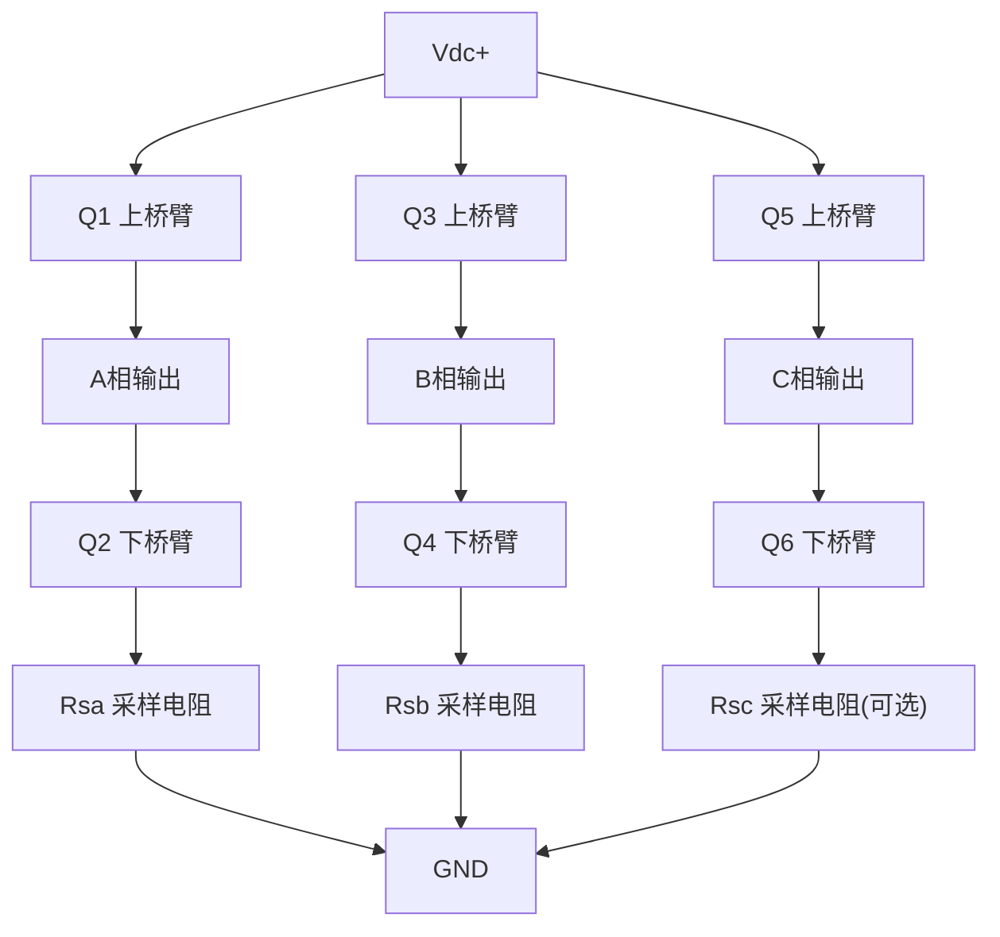

# HW-02 电流采样电路：FOC控制的感知之眼

**副标题：从采样电阻到ADC，理解电流信号的精确捕获**

---

## 1.  核心摘要  

**一句话讲清楚**：电流采样是FOC控制的"感知之眼"——采样精度决定电流环控制精度，采样延迟限制电流环带宽，ADC量化误差直接影响Id/Iq解算精度。

**认知挂钩**：很多人以为电流采样就是"量一下电流大小"，**这是严重误区！** 实际上，电流采样是一个**精密的信号链系统**：电流→电压→放大→滤波→ADC→数字值。任何一个环节的误差都会被放大到控制环路中，导致电流环震荡、转矩脉动、甚至失控。

**与算法的关联**：
-  **算法关联**：采样精度 → 决定电流环控制精度 → 1%采样误差 → 1%转矩误差
-  **算法关联**：采样延迟 → 限制电流环带宽 → 延迟越大，允许带宽越低
-  **算法关联**：ADC量化 → 影响Id/Iq精度 → 量化噪声在Park变换后放大
- 共模抑制 → 影响零漂 → 零漂导致Id偏置
- 采样时序 → 影响电流重建 → 时序错误导致采样值不代表真实电流

---

## 2.  问题引入  

### 工程师的真实困惑

**场景1：电流环震荡**

> 工程师A:"我的电流环参数怎么调都不稳定,电机一直嗡嗡响..."
>
> **问题现象:**
>
> - 电流波形有周期性波动
> - 低速时更明显
> - 换不同的采样电阻,现象变化

**场景2：Id电流不为零**

> 工程师B:"我明明设置Id=0,但实际Id始终有0.5A的偏移..."
>
> **问题现象:**
>
> - Id电流有固定偏置
> - 温度变化时偏置变化
> - 重启后偏移可能不同

**场景3：高速时电流失真**

> 工程师C:"低速时电流波形很好,但一上高速就变形..."
>
> **问题现象:**
>
> - 高速时电流波形畸变
> - Iq电流波动大
> - 转矩脉动增大

### 核心问题

这些问题的根本原因是什么？

**答案**：电流采样链路存在缺陷！

- 电流环震荡 → 采样延迟过大或采样噪声大
- Id偏置 → 零漂或共模抑制不足
- 高速失真 → 采样时序不正确或带宽不足

### 学习目标

读完本模块，你将能够：

 **理解电流采样拓扑** - 采样电阻位置、单/双/三相采样
 **掌握信号链设计** - 电流→电压→放大→滤波→ADC
 **理解关键参数** - 精度、带宽、延迟、共模抑制
 **建立软硬件关联** - 采样参数如何影响控制算法
 **解决实际问题** - 诊断和解决电流采样中的常见问题

---

## 3.  直观理解  

### 类比1：电流采样就像"称重"

**生活场景**：想象你在超市称水果。


**误差传递**：

> - 总误差 = 电阻误差 + 放大器误差 + ADC量化误差
> - 类似：称重误差 = 积误差 + 读数误差

**关键理解**：电流采样的总精度由信号链上所有环节的误差叠加决定。

### 类比2：采样延迟就像"反应时间"

**生活场景**：想象你在打乒乓球，球已经飞过来了，但你还没反应过来。


**延迟影响**：

> - 延迟越大 → 控制越滞后 → 系统越不稳定
> - 就像反应越慢 → 越接不到球

**关键理解**：采样延迟会降低控制系统的相位裕度，限制电流环带宽。

### 类比3：ADC量化就像"楼梯"

**生活场景**：想象你用楼梯去近似一个斜坡。

```plain
真实电流(斜坡)：
  ╱╱╱╱╱╱╱╱

量化后(楼梯)：
  ┌─┐┌─┐┌─┐
  │ ││ ││ │
  └─┘└─┘└─┘

量化误差 = 真实值 - 量化值
  最大量化误差 = ±0.5 LSB
```

**关键理解**：ADC位数越高，"楼梯"越细，量化误差越小。12位ADC的量化精度是1/4096 ≈ 0.024%。

### 关键概念速查

**采样电阻(Rshunt)**：将电流转换为电压的精密电阻，阻值通常0.001~0.01Ω

**运算放大器(Op-Amp)**：放大采样电阻上的微弱电压信号，增益通常10~50倍

**ADC(模数转换器)**：将模拟电压转换为数字值，分辨率通常12~16位

**共模电压(Vcm)**：采样电阻两端的共模电压，可能高达母线电压

---

## 4.  技术原理  

### 4.1 电流采样拓扑

#### 4.1.1 采样电阻位置



采样位置选择：
```plain
┌──────────────────────────────────────────────────────────────────────┐
│  位置          │ 优点               │ 缺点               │ 适用场景 │
│  ─────────────┼──────────────────┼──────────────────┼──────────│
│  低端(下桥臂)  │ 共模电压低,成本低  │ 仅在下管导通时采样 │ 最常用   │
│  高端(上桥臂)  │ 任意时刻可采样     │ 共模电压高,成本高  │ 精密控制 │
│  相电流(输出)  │ 任意时刻可采样     │ 共模电压变化大     │ 高性能   │
│  母线(直流侧)  │ 只需一个电阻       │ 需要重建三相电流   │ 低成本   │
└──────────────────────────────────────────────────────────────────────┘
```

#### 4.1.2 采样方案对比

**方案1：单电阻采样（母线电流）**

> - 优点:成本最低(1个电阻+1路ADC)
> - 缺点:需要PWM调制策略配合,低速精度差,算法复杂
> - 原理:不同开关状态组合,母线电流=不同相电流
> - 适用:家电、风机等低成本应用

**方案2：双电阻采样（两相电流）**

> - 优点:成本适中,算法简单,精度较好
> - 缺点:扇区切换时需要处理,第三相需计算
> - 原理:ic = -(ia + ib)
> - 适用:大多数工业应用(最常用)

**方案3：三电阻采样（三相电流）**

> - 优点:精度最高,无扇区限制,冗余校验
> - 缺点:成本最高(3个电阻+3路ADC)
> - 原理:直接测量三相电流,可交叉验证
> - 适用:高性能伺服、精密控制

### 4.2 采样电阻选型

#### 4.2.1 阻值选择

**选择原则**：
  1. 电压信号足够大（ADC分辨率）
  2. 功耗足够小（效率）
  3. 温漂足够小（精度）

**计算示例**：
  - 额定电流 I = 10A
  - ADC参考电压 Vref = 3.3V
  - 放大器增益 G = 20
  - ADC位数 N = 12

> **步骤1**：确定最大输出电压
>
> - Vout_max = Vref / 2 = 1.65V (双向电流,中点偏置)
>
> **步骤2**：计算采样电阻
>
> - Rshunt = Vout_max / (G × I) = 1.65 / (20 × 10) = 0.00825Ω ≈ 8mΩ
>
> **步骤3**：校验功耗
>
> - P = I² × Rshunt = 100 × 0.008 = 0.8W
> - 选择1W以上额定功率的电阻
>
> **步骤4**：校验分辨率
>
> - 1 LSB = Vref / 2^N = 3.3 / 4096 = 0.806mV
> - 电流分辨率 = 1 LSB / (G × Rshunt) = 0.806mV / (20 × 0.008) = 5.04mA
> - 精度 = 5.04mA / 10A = 0.05% (理论值)

#### 4.2.2 电阻类型

```plain
┌──────────────────────────────────────────────────────────────────────┐
│  类型          │ 精度    │ 温漂(ppm/°C) │ 寄生电感  │ 成本  │
│  ─────────────┼────────┼──────────────┼──────────┼──────│
│  合金箔电阻    │ 0.1%   │ ±5           │ <1nH     │ 高    │
│  金属箔电阻    │ 1%     │ ±50          │ <5nH     │ 中    │
│  金属膜电阻    │ 1%     │ ±100         │ <10nH    │ 低    │
│  线绕电阻      │ 5%     │ ±200         │ >100nH   │ 最低  │
└──────────────────────────────────────────────────────────────────────┘
```

推荐：合金箔电阻或金属箔电阻
  关键参数：
  - 精度：≤1%
  - 温漂：≤±50 ppm/°C
  - 寄生电感：≤5nH
  - 额定功率：≥2倍实际功耗

> ** 瞬态脉冲功率耐受**：除连续功率（I²R_rms）外，还需考虑瞬态脉冲功率耐受能力。电机启动/堵转时的短时过流（通常为额定的2~3倍，持续数百ms）可能远超电阻的稳态额定功率。应查阅电阻数据手册的脉冲功率降额曲线（Pulse Power Derating Curve），选择满足瞬态能量要求（I²t）的型号。例如，额定1W的合金箔电阻可能仅能承受5W/100ms的脉冲，选型时切勿仅看连续功率额定值。

### 4.3 运算放大器电路

#### 4.3.1 低端采样放大电路

```plain
电路拓扑（电流检测放大器）：

                    Vcc
                     │
                     │
        Rshunt ─┬────┤
                 │    │
        I ──────┤    ├─── Vout ──── ADC
                 │    │
        Rshunt ─┴────┤
                     │
                    GND

增益设置：
  Vout = (Vin+ - Vin-) × G + Vref/2
  其中 Vref/2 是偏置电压（双向电流测量）

典型增益：G = 10 ~ 50
  G = 20 时，10mΩ × 10A × 20 = 2V（满量程）
```

#### 4.3.2 关键参数

**1. 增益带宽积(GBW)**：
   - 要求：GBW > 100 × fc（fc = 电流环带宽）
   - 示例：fc = 1kHz → GBW > 100kHz

**2. 共模抑制比(CMRR)**：
   - 要求：CMRR > 80dB
   - 影响：共模电压变化引起的误差

**3. 输入偏置电流**：
   - 要求：< 1μA
   - 影响：偏置电流流过采样电阻产生误差电压

**4. 失调电压(Vos)**：
   - 要求：< 100μV
   - 影响：零电流时输出不为零

**5. 噪声密度**：
   - 要求：< 10nV/√Hz
   - 影响：电流测量噪声

**常用电流检测放大器**：
  - INA240 (TI): CMRR=120dB, GBW=400kHz, Vos=5μV
  - TSC201 (ST): CMRR=100dB, GBW=800kHz, Vos=50μV
  - AD8418 (ADI): CMRR=106dB, GBW=1MHz, Vos=200μV

#### 4.3.3 RC滤波器设计

**抗混叠滤波器（一阶RC）**：

  - Vsig ──┤R├──┬── Vadc
  -            │
  -           ═C═
  -            │
  -           GND

**截止频率选择**：
  - fc = 1 / (2π × R × C)

**设计原则**：
  - fc > 10 × fsw（fsw = PWM开关频率）
  - fc < fs / 2（fs = ADC采样率，奈奎斯特条件）

> **示例**：
>
> - fsw = 10kHz, fs = 1MHz
> - 选择 fc = 100kHz
> - R = 1kΩ, C = 1.6nF → 取 C = 1.5nF
>
> **注意**：RC滤波器会引入延迟
>
> - 延迟 ≈ R × C = 1kΩ × 1.5nF = 1.5μs
> - 对10kHz电流环，1.5μs延迟可忽略

### 4.4 ADC采样

#### 4.4.1 ADC关键参数

**1. 分辨率（位数N）**：
   - 12位：4096级，0.024%分辨率
   - 16位：65536级，0.0015%分辨率
   - 推荐：12位足够（配合过采样可达14位效果）

**2. 采样率**：
   - 要求：≥ 2 × fsw（每个PWM周期至少2次采样）
   - 推荐：与PWM同步采样

**3. 采样保持时间**：
   - 要求：≥ 1μs（含RC充电时间）
   - 影响：采样时间不足 → 采样值不准

**4. 量化误差**：
   - ±0.5 LSB
   - 12位ADC：±0.5/4096 ≈ ±0.012%

**5. 积分非线性(INL)**：
   - 典型值：±1~2 LSB
   - 影响：实际转换曲线偏离理想直线

**6. 微分非线性(DNL)**：
   - 典型值：±0.5~1 LSB
   - 影响：相邻码宽不一致

#### 4.4.2 ADC采样时序

```plain
PWM与ADC同步采样时序：

  PWM周期 Tpwm
  ┌──────────────────────────────────────────────────────┐
  │                                                      │
  │  上管ON         上管OFF                              │
  │  ┌─────────────┐                                    │
  │  │             │                                    │
  │  │             └──────────────────────────────────  │
  │  │                          下管ON                  │
  │  │             ┌──────────────────────────────────  │
  │  │             │                                    │
  │  └─────────────┘                                    │
  │                                                      │
  │              ↑                                       │
  │           采样点                                      │
  │     (下管导通中点)                                    │
  │                                                      │
  └──────────────────────────────────────────────────────┘

关键：采样点必须在下管导通期间！

采样时刻选择：
  1. 下管导通中点 → 最稳定
  2. 避开开关瞬间 → 死区后等待1~2μs
  3. PWM中心对齐模式 → 采样点在谷底

采样延迟：
  从电流变化到ADC转换完成的延迟
  = PWM更新延迟 + 采样保持时间 + ADC转换时间
  典型值：1~5μs
```

#### 4.4.3 过采样技术

**过采样提升分辨率**：
  - 每增加1位有效分辨率，需要4倍采样率
  - OSR = 4^n (n = 增加的位数)

> **示例**：
>
> - 12位ADC，4倍过采样 → 13位有效分辨率
> - 12位ADC，16倍过采样 → 14位有效分辨率
> - 12位ADC，256倍过采样 → 16位有效分辨率
>
> **条件**：信号必须是白噪声（热噪声 > 量化噪声）
>
> **实现方法**：
>
> 1. 硬件过采样：ADC多次采样，软件求平均
> 2. ΔΣ ADC：内部过采样，直接输出高分辨率

### 4.5 电流重建算法

#### 4.5.1 双电阻采样重建

```plain
已知：ia, ib
计算：ic = -(ia + ib)  (基尔霍夫电流定律)

注意事项：
  1. 当某相下管不导通时，该相电流无法采样
  2. 需要在合适的PWM扇区采样
  3. 扇区切换时需要特殊处理
```

#### 4.5.2 单电阻采样重建

```plain
原理：不同开关状态组合，母线电流=不同相电流

  开关状态    母线电流
  ─────────  ──────────
  (1,0,0)    +ia
  (0,1,0)    +ib
  (0,0,1)    +ic
  (1,1,0)    -ic
  (1,0,1)    -ib
  (0,1,1)    -ia

  需要两个不同的开关状态来重建两相电流
  然后计算第三相：ic = -(ia + ib)

限制条件：
  1. 每个开关状态需要足够的持续时间（采样建立时间）
  2. 低速低调制比时，持续时间不足 → 无法采样
  3. 需要PWM移相或注入来创造采样窗口
```

### 4.6 误差分析

#### 4.6.1 误差源汇总

```plain
┌──────────────────────────────────────────────────────────────────────┐
│  误差源          │ 典型值     │ 累积影响     │ 补偿方法             │
│  ──────────────┼──────────┼────────────┼──────────────────────│
│  采样电阻精度    │ ±1%      │ ±1%        │ 精密电阻+校准       │
│  电阻温漂       │ ±50ppm/°C│ ±0.25%     │ 温度补偿            │
│  放大器增益误差  │ ±0.5%    │ ±0.5%      │ 增益校准            │
│  放大器失调电压  │ ±100μV   │ ±0.05%     │ 零点校准            │
│  放大器CMRR     │ -80dB    │ ±0.01%     │ 高CMRR放大器        │
│  ADC量化误差    │ ±0.5LSB  │ ±0.012%    │ 过采样              │
│  ADC INL       │ ±2LSB    │ ±0.05%     │ 校准                │
│  采样时序误差    │ ±1μs     │ ±0.5%      │ 精确同步            │
│  ──────────────┼──────────┼────────────┼──────────────────────│
│  总误差(最坏)    │          │ ±2.4%      │                      │
│  总误差(RSS)    │          │ ±1.3%      │                      │
└──────────────────────────────────────────────────────────────────────┘
```

#### 4.6.2 零漂校准

**零漂来源**：
  - 放大器失调电压
  - ADC失调
  - PCB漏电流

**校准方法**：
  - 上电时，PWM关闭，读取ADC值作为零点
  - 运行时定期校准（在下管全关时）
  - 温度补偿

**代码实现**：

```c
// 上电校准
void CurrentSense_Calibrate(void)
{
    // 关闭PWM输出
    PWM_Disable();

    // 等待电路稳定
    Delay_ms(10);

    // 采样N次取平均
    for (int i = 0; i < 256; i++) {
        offset_a += ADC_Read(CH_A);
        offset_b += ADC_Read(CH_B);
    }
    offset_a /= 256;
    offset_b /= 256;

    // 恢复PWM输出
    PWM_Enable();
}

// 电流计算（减去零点）
float CurrentSense_GetCurrentA(void)
{
    float adc_val = ADC_Read(CH_A);
    float voltage = (adc_val - offset_a) * VREF / ADC_MAX;
    float current = voltage / (GAIN * RSHUNT);
    return current;
}
```

---

## 5.  交叉视角  

> 电流采样不是孤立的硬件设计，它直接决定了FOC控制算法的性能上限。本章节揭示采样参数与算法之间的深层关联。

### 5.1 采样精度 → 电流环控制精度

**硬件特性**：
```plain
采样精度由信号链各环节误差叠加：
  总误差 ≈ √(电阻误差² + 放大器误差² + ADC误差²)
  典型值：±1~2%
```

** 算法关联**：采样精度直接决定电流环控制精度
```plain
电流环精度 = 采样精度（最坏情况）

影响：
  1%采样误差 → 1%转矩误差 → 1%速度误差

  示例：
    额定电流10A，1%误差 = ±0.1A
    转矩常数0.9Nm/A → 转矩误差 = ±0.09Nm

  对高精度伺服（转矩精度<0.5%），采样精度需<0.5%

软件补偿策略：
  1. 离线校准：上电时测量零漂
  2. 在线校准：运行时周期性校准
  3. 增益校准：已知电流下校准增益
  4. 温度补偿：根据温度调整参数
```

### 5.2 采样延迟 → 电流环带宽限制

**硬件特性**：
```plain
采样延迟构成：
  1. PWM更新延迟：0.5~1个PWM周期
  2. 采样保持时间：0.5~1μs
  3. ADC转换时间：0.5~1μs
  4. 计算延迟：1~5μs
  总延迟：典型5~20μs
```

** 算法关联**：采样延迟限制电流环带宽
```plain
延迟对带宽的限制：
  带宽 < 1 / (4 × 延迟)（经验公式）

  示例：
    延迟 = 10μs → 带宽 < 25kHz
    延迟 = 50μs → 带宽 < 5kHz

  延迟对相位裕度的影响：
    Δφ = -360° × fc × td
    示例：fc = 1kHz, td = 10μs
    Δφ = -360° × 1000 × 10×10⁻⁶ = -3.6°（可接受）
    但如果 fc = 10kHz, td = 10μs
    Δφ = -36°（相位裕度严重下降！）

减小延迟的方法：
  1. PWM中心对齐模式 → 减少PWM更新延迟
  2. ADC提前触发 → 减少采样等待时间
  3. DMA传输 → 减少CPU干预
  4. 优化计算顺序 → 减少计算延迟
```

### 5.3 ADC量化 → Id/Iq精度

**硬件特性**：
```plain
12位ADC量化：
  1 LSB = Vref / 4096 = 3.3V / 4096 = 0.806mV
  电流分辨率 = 1 LSB / (G × Rshunt)
  示例：G=20, Rshunt=8mΩ → 5.04mA/LSB
```

** 算法关联**：ADC量化噪声在Park变换后影响Id/Iq精度
```plain
Park变换中的量化噪声放大：
  Id = Iα × cos(θ) + Iβ × sin(θ)
  Iq = -Iα × sin(θ) + Iβ × cos(θ)

  量化噪声在Id和Iq中叠加：
  σ_Id = σ_Iα × |cos(θ)| + σ_Iβ × |sin(θ)|
  σ_Iq = σ_Iα × |sin(θ)| + σ_Iβ × |cos(θ)|

  最坏情况：σ_Id ≈ σ_Iq ≈ √2 × σ_Iα

  示例：
    单相量化噪声 = 5mA
    Id/Iq量化噪声 ≈ 7mA
    对10A额定电流 → 0.07%（可忽略）

  但如果ADC位数不够（如8位）：
    单相量化噪声 = 320mA
    Id/Iq量化噪声 ≈ 450mA
    对10A额定电流 → 4.5%（不可接受！）

改善方法：
  1. 使用12位以上ADC
  2. 过采样提升有效分辨率
  3. 数字滤波（但会增加延迟）
```

### 5.4 共模抑制 → Id零漂

```plain
共模电压变化 → 放大器输出偏移 → Id零漂

  Vcm变化范围：0 ~ Vdc
  CMRR = 80dB → Vcm变化100V时：
    输入等效误差 = 100V / 10^(80/20) = 10mV
    电流误差 = 10mV / (20 × 8mΩ) = 62.5mA

  对Id=0控制：62.5mA偏置 → 转矩偏移

解决方案：
  1. 选择高CMRR放大器（>100dB）
  2. 差分布线
  3. 软件零漂补偿
```

### 5.5 采样时序 → 电流重建精度

```plain
低端采样的时序约束：
  - 必须在下管导通期间采样
  - 死区后等待1~2μs（电流建立时间）
  - 采样点偏离中心 → 电流值偏差

时序误差分析：
  偏离中心Δt → 电流误差 ≈ di/dt × Δt
  示例：di/dt = 100A/ms, Δt = 1μs → 误差 = 0.1A

  对10A额定电流 → 1%误差

  改善：精确的PWM-ADC同步触发
```

---

## 6.  工程案例  

### 案例1：电流环震荡——采样延迟过大

**项目背景**：
```plain
应用:电动工具
电机:PMSM,额定功率1kW
控制器:STM32F3,FOC控制
问题:电流环震荡,电机发出嗡嗡声
```

**诊断过程**：
```plain
步骤1:示波器观察电流波形 → 震荡频率约500Hz
步骤2:检查电流环带宽 → 设计500Hz
步骤3:测量采样延迟 → 50μs!(远大于预期)
步骤4:分析延迟来源 → ADC采样在PWM周期末尾,延迟=0.5×Tpwm
```

**根本原因**：采样延迟过大！延迟50μs → 相位裕度不足 → 震荡

**解决方案**：
```plain
方案A:改为PWM中心对齐模式,ADC在谷底触发
  延迟降低到10μs → 震荡消除 

方案B:降低电流环带宽到200Hz
  相位裕度增加 → 震荡消除,但响应变慢 
```

**经验总结**：
1. 采样延迟必须精确测量
2. PWM中心对齐模式 + ADC谷底触发 = 最小延迟
3. 电流环带宽受延迟限制

---

### 案例2：Id电流偏置——零漂问题

**项目背景**：
```plain
应用:协作机器人关节
电机:PMSM,额定转矩5Nm
控制器:STM32G4,FOC控制
问题:Id电流始终有0.3A偏置
```

**诊断过程**：
```plain
步骤1:检查Id=0指令 → 正确
步骤2:检查Park变换角度 → 正确
步骤3:检查ADC零点 → 发现A相零点偏移5个LSB
步骤4:测量放大器失调电压 → 200μV(数据表最大值)
```

**根本原因**：放大器失调电压 + ADC零点偏移 → Id偏置

**解决方案**：
```plain
方案A:上电校准零漂
  关闭PWM,采样256次取平均作为零点
  结果:偏置降低到0.05A 

方案B:选择低失调放大器(INA240, Vos=5μV)
  结果:偏置降低到0.01A 

方案C:在线零漂补偿
  在下管全关时采样,更新零点
  结果:偏置降低到0.02A,且温漂自动补偿 
```

**经验总结**：
1. 零漂校准必须做
2. 选择低失调放大器
3. 在线补偿比离线校准更好

---

### 案例3：高速电流失真——采样时序问题

**项目背景**：
```plain
应用:高速主轴
电机:PMSM,额定转速30000rpm
控制器:TI C2000,FOC控制
问题:高速时电流波形畸变,转矩脉动大
```

**诊断过程**：
```plain
步骤1:低速时电流波形正常 → 排除硬件故障
步骤2:高速时观察PWM-ADC时序 → 采样点不在下管导通中点
步骤3:分析原因 → 高速时PWM占空比大,下管导通时间短
步骤4:计算最小导通时间 → 2μs,ADC采样需要1μs → 时间不够!
```

**根本原因**：高速时下管导通时间不足 → 采样时序错误 → 电流值偏差

**解决方案**：
```plain
方案A:降低PWM频率(从20kHz到10kHz)
  下管导通时间增加 → 采样时间足够 
  但:开关损耗增加,电流纹波增大 

方案B:采用三电阻采样(相电流采样)
  不受下管导通时间限制 

方案C:非对称PWM + 采样窗口扩展
  在特定扇区扩展下管导通时间 
```

**经验总结**：
1. 高速应用必须考虑采样时序
2. 最小导通时间 = 死区时间 + 电流建立时间 + ADC采样时间
3. 三电阻采样是高速应用的最佳选择

---

### 案例4：单电阻采样——低速性能差

**项目背景**：
```plain
应用:空调压缩机
电机:PMSM,额定功率2kW
控制器:STM32G0,单电阻FOC控制
问题:低速时电流波形严重失真
```

**诊断过程**：
```plain
步骤1:低速时观察PWM波形 → 有效向量时间太短
步骤2:分析采样窗口 → 最小采样窗口需要2μs
步骤3:计算有效向量时间 → 低速低调制比时仅0.5μs → 不够!
```

**根本原因**：低速时有效向量时间不足 → 无法正确采样

**解决方案**：
```plain
方案A:PWM移相 + 注入
  在有效向量中插入测量窗口
  结果:低速性能改善,但电流纹波增大 

方案B:低速时切换到开环启动
  开环V/F控制启动,达到一定速度后切换FOC
  结果:启动平稳,切换时有短暂波动 

方案C:改用双电阻采样
  成本略增,但低速性能大幅提升 
```

**经验总结**：
1. 单电阻采样有固有的低速限制
2. 低速启动需要特殊处理
3. 成本敏感应用才考虑单电阻方案

---

### 案例5：电流采样电路设计流程

```plain
步骤1：确定电流范围（额定电流、峰值电流、过流检测阈值）
步骤2：选择采样拓扑（单/双/三电阻）
步骤3：选择采样电阻（阻值、精度、功率、温漂）
步骤4：选择放大器（增益、CMRR、带宽、失调）
步骤5：设计滤波器（截止频率、延迟）
步骤6：选择ADC（分辨率、采样率、同步性）
步骤7：设计PCB布局（开尔文连接、差分走线、地平面）
步骤8：校准与补偿（零漂、增益、温度）
```

---

## 7.  实践练习  

### 练习1：计算题——采样电阻选型

```plain
已知：
  额定电流 = 20A, 峰值电流 = 40A
  ADC参考电压 = 3.3V, ADC位数 = 12
  放大器增益 = 20

要求：
1. 计算采样电阻阻值
2. 计算电流分辨率
3. 计算采样电阻功耗
4. 选择合适的电阻规格

参考答案：
1. Rshunt = (3.3/2) / (20 × 40) = 0.0020625Ω ≈ 2mΩ
2. 1 LSB = 3.3/4096 = 0.806mV, 电流分辨率 = 0.806mV/(20×0.002) = 20.15mA
3. P = 40² × 0.002 = 3.2W (峰值), P = 20² × 0.002 = 0.8W (额定)
4. 选择2mΩ/1%/3W合金箔电阻
```

### 练习2：计算题——采样延迟与带宽

```plain
已知：
  PWM频率 = 10kHz
  ADC采样时间 = 1μs
  ADC转换时间 = 1μs
  计算延迟 = 3μs

要求：
1. 计算总采样延迟（PWM中心对齐模式）
2. 计算电流环最大带宽
3. 如果改为边沿对齐模式，延迟和带宽如何变化？

参考答案：
1. PWM中心对齐：延迟 ≈ 0.25×Tpwm + 1 + 1 + 3 = 25 + 5 = 30μs
2. 带宽 < 1/(4×30μs) ≈ 8.3kHz
3. 边沿对齐：延迟 ≈ 0.5×Tpwm + 5 = 55μs, 带宽 < 4.5kHz
```

### 练习3：设计题——电流采样电路

```plain
设计要求：
  电机额定电流 = 5A, 峰值电流 = 15A
  控制器 = STM32G4 (12位ADC, 3.3V参考)
  电流环带宽 = 2kHz
  PWM频率 = 20kHz

要求：
1. 选择采样拓扑
2. 设计采样电阻参数
3. 选择放大器和增益
4. 设计RC滤波器
5. 计算总精度

参考答案：
1. 双电阻采样（性价比最优）
2. Rshunt = 10mΩ/1%/1W合金箔电阻
3. INA240, G=50, Vout_max = 15×0.01×50 = 7.5V → 超出3.3V!
   修正：G=20, Vout_max = 15×0.01×20 = 3V → 需偏置1.65V
4. fc = 200kHz, R=470Ω, C=1.7nF → 取C=1.5nF
5. 总精度 ≈ √(1² + 0.5² + 0.05² + 0.012²) ≈ 1.12%
```

### 练习4：诊断题——Id偏置问题

```plain
场景：FOC控制电机，Id始终有0.5A偏置

现象：
  - 设置Id=0,实际Id=0.5A
  - 温度升高时偏置增大
  - 重启后偏置变化

问题：
1. 可能的原因有哪些？
2. 如何诊断？
3. 如何解决？

参考答案：
1. 可能原因：零漂(放大器失调)、增益不匹配、PCB漏电流、ADC参考电压偏移
2. 诊断步骤：
   - 关闭PWM,读取ADC原始值 → 检查零漂
   - 施加已知电流,比较三相增益 → 检查增益匹配
   - 加热PCB,观察偏置变化 → 检查温漂
3. 解决方案：
   - 上电零漂校准
   - 在线零漂补偿
   - 增益校准(三相匹配)
   - 选择低失调放大器
```

### 练习5：选择题

**题目1**：低端采样的最大限制是？
- A. 精度低  B. 只能在下管导通时采样  C. 成本高  D. 带宽低
> 答案：B

**题目2**：12位ADC的理论量化精度是？
- A. 0.1%  B. 0.024%  C. 0.0015%  D. 1%
> 答案：B

**题目3**：电流采样延迟对控制的影响是？
- A. 增加稳态误差  B. 降低相位裕度  C. 增加纹波  D. 无影响
> 答案：B

**题目4**：单电阻采样的主要缺点是？
- A. 成本高  B. 低速性能差  C. 精度低  D. 带宽低
> 答案：B

**题目5**：减小采样延迟的最佳方法是？
- A. 降低PWM频率  B. PWM中心对齐+ADC谷底触发  C. 增加ADC位数  D. 增大采样电阻
> 答案：B

---

## 附录：快速计算公式汇总

### A. 采样电阻

$$R_{shunt} = \frac{V_{out\_max}}{G \times I_{max}}$$

$$P = I^2 \times R_{shunt}$$

### B. 电流分辨率

$$I_{LSB} = \frac{V_{ref}}{2^N \times G \times R_{shunt}}$$

### C. 延迟与带宽

$$带宽_{max} \approx \frac{1}{4 \times t_d}$$

$$\Delta\varphi = -360° \times f_c \times t_d$$

### D. 过采样

$$有效位数 = N + \frac{\log_4(OSR)}{2}$$

$$OSR = 4^n \quad (n = 增加的位数)$$

### E. RC滤波器

$$f_c = \frac{1}{2\pi \times R \times C}$$

$$延迟 \approx R \times C$$

---

**文档信息**：
- 模块编号：HW-02
- 知识体系：电驱硬件原理
- 模块名称：电流采样电路
- 算法关联：采样精度→电流环、采样延迟→带宽限制、ADC量化→Id/Iq精度

###  hpm_MC 代码关联

**模拟采样实现** (`hpm_mcl_v2/core/sensor/hpm_mcl_analog.h`):
- `mcl_analog_t` 管理 10 个采样通道：Ia/Ib/Ic（三相电流）+ Va/Vb/Vc（三相电压）+ Vbus（母线电压）
- 每通道独立 IIR 低通滤波器（alpha 系数可配置）
- ADC 到物理量的转换：`i = (adc - offset) / (opamp_gain × sample_res)`
- ADC 偏置自动校准（中点检测）

**v1 采样配置** (`hpm_mcl/inc/hpm_bldc_define.h`):
- `BLDC_CONTRL_ADC_PARA` 定义采样通道数、电流偏置

**HPM 官方参考设计**（关节电机驱动电路）:

- **三相逆变桥**: JSM6288T 三相半桥驱动芯片 + 6×N沟道MOS管
- **自举电路**: 二极管 D7 + 电容 C16 构成上桥自举升压
- **电流采样**: 每半桥下臂串联 1mΩ/1W 采样电阻 R68
- **差分放大**: 50倍增益（50kΩ/1kΩ），输出到 MCU ADC
- **偏置电压**: 运放跟随器提供 1.65V 参考电压（3.3V ADC 中位）
- **母线电压检测**: 电阻分压将高压母线转换为 0~3.3V
- **硬件过流保护**: 采样电阻 + 三极管组合，OC 信号拉低触发 MCU 保护

参考: [HPM KB: 关节电机驱动电路图解](https://kb.hpmicro.com/2026/03/20/)

>  检验你的理解：[HW-02 检验题目](./HW-02-assessment.md)
