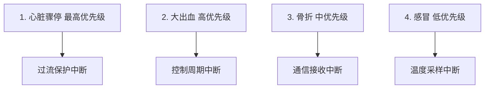
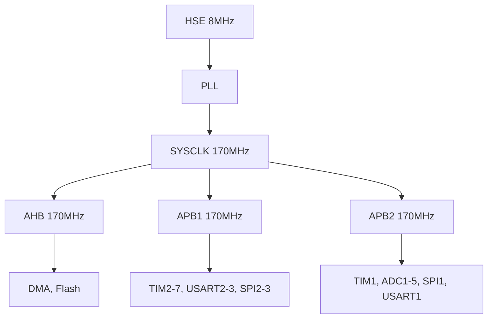
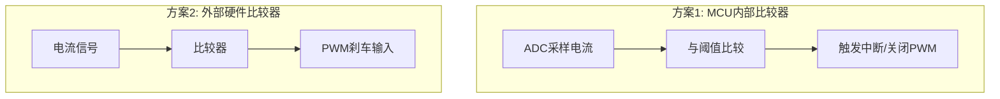

# HW-04 MCU外设与通信：电驱控制的神经中枢

**副标题：从PWM到中断，理解MCU外设的精确协同**

---

## 1.  核心摘要  

**一句话讲清楚**：MCU外设是电驱控制的"神经中枢"——PWM死区决定逆变器输出精度，ADC同步决定电流采样时序，中断优先级决定控制周期的确定性。

**认知挂钩**：很多人以为MCU编程就是"配置一下寄存器"，**这是致命误区！** 实际上，电机控制对MCU外设的**时序协同**要求极其苛刻：PWM输出→ADC触发→DMA传输→中断响应→算法计算→PWM更新，整个链路必须在微秒级精确同步。任何一个环节的时序错误，都会导致电流采样偏差、控制周期抖动、甚至系统失控。

**与算法的关联**：
-  **算法关联**：PWM死区 → 死区补偿算法 → 死区导致电压畸变 → 需要软件补偿
-  **算法关联**：ADC同步 → 电流采样时序 → 采样时刻错误 → 电流值偏差
-  **算法关联**：中断优先级 → 控制周期确定性 → 优先级配置不当 → 控制周期抖动
- PWM分辨率 → 调制精度
- DMA传输 → 减少CPU干预 → 降低延迟
- 通信接口 → 参数配置与监控

---

## 2.  问题引入  

### 工程师的真实困惑

**场景1：电流波形有尖峰**

> 工程师A:"电流波形在每个扇区切换处有尖峰,调PI参数没用..."
>
> **问题现象:**
> - 电流波形周期性尖峰
> - 尖峰位置与扇区切换对应
> - 低速低调制比时更明显

**场景2：控制周期不稳定**

> 工程师B:"我的控制周期应该是50μs,但实际测量有±5μs的抖动..."
>
> **问题现象:**
> - 控制周期抖动大
> - 电流环偶尔震荡
> - 高速时更明显

**场景3：ADC采样值跳变**

> 工程师C:"ADC采样值有时会突然跳变,导致电流尖峰..."
>
> **问题现象:**
> - ADC值偶尔异常
> - 电流波形有毛刺
> - 不是每次都出现

### 核心问题

这些问题的根本原因是什么？

**答案**：MCU外设配置与时序协同存在缺陷！

- 电流尖峰 → PWM死区未补偿
- 控制周期抖动 → 中断优先级配置不当
- ADC跳变 → ADC触发时序不正确

### 学习目标

读完本模块，你将能够：

 **理解PWM外设** - 中心对齐、边沿对齐、死区、互补输出
 **掌握ADC同步采样** - 触发时序、DMA传输、双ADC模式
 **理解中断管理** - 优先级配置、中断延迟、实时性保证
 **掌握通信接口** - UART、SPI、CAN在电机控制中的应用
 **建立软硬件关联** - MCU外设配置如何影响控制算法
 **解决实际问题** - 诊断和解决MCU外设配置中的常见问题

---

## 3.  直观理解  

### 类比1：PWM就像"快速开关灯"

**生活场景**：想象你快速开关灯，通过控制开和关的时间比例来调节亮度。

```plain
亮度控制：
  开50%关50% → 半亮
  开90%关10% → 很亮
  开10%关90% → 微亮

PWM等效：
  占空比D = 开时间/周期
  平均电压 = D × Vdc

  D=50%: ┌──┐  ┌──┐  ┌──┐
         │  │  │  │  │  │
      ───┘  └──┘  └──┘  └───

  D=90%: ┌────┐┌────┐┌────┐
         │    ││    ││    │
      ───┘    └┘    └┘    └─
```

**关键理解**：PWM通过快速开关来等效模拟电压，开关频率越高，纹波越小。

### 类比2：死区就像"红绿灯间隙"

**生活场景**：十字路口的红绿灯，一个方向变红后，另一个方向不会立即变绿，中间有几秒的"全红"时间。

```plain
红绿灯：
  南北绿灯 ──→ 全红(2秒) ──→ 东西绿灯
  (上管导通)    (死区)       (下管导通)

为什么需要全红(死区)？
  防止南北和东西同时绿灯(上下管同时导通) → 短路！

死区时间：
  上管关断 → 死区 → 下管导通
  ────────┐     ┌──────────
          │     │
          └─────┘ ← 死区
  ────────┐     ┌──────────
          │     │
  ────────┘     └──────────
           ↑下管导通
```

**关键理解**：死区防止上下管直通短路，但会导致输出电压畸变，需要补偿。

### 类比3：中断优先级就像"医院急诊"

**生活场景**：医院急诊室，不同病人有不同优先级。



> 如果优先级配置错误：
>
> - 感冒先看 → 心脏骤停等待 → 病人死亡
> - 通信中断先处理 → 控制中断延迟 → 电流失控

**关键理解**：中断优先级决定了系统对紧急事件的响应速度，电机控制中过流保护必须最高优先级。

### 关键概念速查

**PWM(Pulse Width Modulation)**：脉冲宽度调制，通过调节占空比控制输出电压

**死区(Dead Time)**：上下桥臂切换时的延迟时间，防止直通短路

**ADC(Analog-to-Digital Converter)**：模数转换器，将模拟信号转换为数字值

**DMA(Direct Memory Access)**：直接内存访问，无需CPU干预即可传输数据

**NVIC(Nested Vectored Interrupt Controller)**：嵌套向量中断控制器，管理中断优先级

---

## 4.  技术原理  

### 4.1 PWM外设

#### 4.1.1 PWM模式

```plain
模式1：边沿对齐模式(Up-counting)

  计数器：0 → ARR → 0 → ARR → ...
  CCR
   │    ┌───────┐    ┌───────┐
   │    │       │    │       │
   │ ───┘       └────┘       └────
   │
   └──────────────────────────────→ 时间

  占空比 = CCR / ARR
  优点：简单
  缺点：PWM更新只能在周期开始，延迟大

模式2：中心对齐模式(Up-down counting)

  计数器：0 → ARR → 0 → ARR → ...
              ↑     ↓
            上升  下降

  CCR
   │   ┌───┐   ┌───┐
   │   │   │   │   │
   │ ──┘   └───┘   └────
   │
   └──────────────────────→ 时间

  占空比 = CCR / ARR
  优点：对称波形、纹波小、ADC可在谷底触发(延迟小)
  缺点：开关频率 = 计数频率 / (2 × ARR)

   电机控制推荐中心对齐模式！
```

#### 4.1.2 互补PWM与死区

```plain
互补PWM输出：

  CH1 (上管):  ┌──────┐          ┌──────┐
               │      │          │      │
          ─────┘      └──────────┘      └──

  CH1N(下管):       ┌──────────┐      ┌─────
                     │          │      │
          ───────────┘          └──────┘

  死区放大：
  CH1:    ──┐              ┌──────
              │              │
  CH1N:      └──┐      ┌──┘
                  │      │
          ────────┘      └──────
              ←TD→  ←TD→
              死区   死区

死区时间计算（STM32G4高级定时器）：
  DTG[7:5]=0xx: DT = DTG[7:0] × t_dtg,         t_dtg = t_DTS
  DTG[7:5]=10x: DT = (64+DTG[5:0]) × t_dtg,     t_dtg = 2×t_DTS
  DTG[7:5]=110: DT = (32+DTG[4:0]) × t_dtg,     t_dtg = 8×t_DTS
  DTG[7:5]=111: DT = (32+DTG[4:0]) × t_dtg,     t_dtg = 16×t_DTS
  其中 t_DTS = t_CK_INT（当CKD=0即TIM_CKD_DIV1时）

  注意：DTG[7:5]=0xx范围下公式为DT=DTG[7:0]×t_dtg，无"+1"

  STM32G4示例：
    CKD = TIM_CKD_DIV1(0), Tclk = 170MHz → t_DTS = 5.88ns
    DTG = 0x40(64), DTG[7:5]=0xx → DT = 64 × 5.88ns = 376.5ns

  常用死区时间：
    小功率MOSFET：200ns ~ 500ns
    大功率IGBT：1μs ~ 4μs
    SiC MOSFET：100ns ~ 300ns
```

> 功率器件层面的死区时间分析与栅极驱动设计，参见 [HW-05-Power-Devices-Gate-Drivers](HW-05-Power-Devices-Gate-Drivers.md) §4.11

#### 4.1.3 PWM分辨率

分辨率 = $1 / ARR$ (中心对齐模式)

示例：
  时钟频率 = 170MHz
  开关频率 = 10kHz (中心对齐)
  $ARR = 170\text{MHz} / (2 \times 10\text{kHz}) = 8500$
  分辨率 = $1/8500 \approx 0.012\%$

  开关频率 = 20kHz (中心对齐)
  $ARR = 170\text{MHz} / (2 \times 20\text{kHz}) = 4250$
  分辨率 = $1/4250 \approx 0.024\%$

  开关频率越高 → ARR越小 → 分辨率越低

  分辨率不足的影响：
    电压量化台阶 → 电流纹波
    低占空比时更明显

#### 4.1.4 SVPWM实现

SVPWM(Space Vector PWM)在MCU中的实现：

步骤1：计算$V_\alpha, V_\beta$ (逆Park变换输出)
步骤2：判断扇区
步骤3：计算$T_1, T_2, T_0$
步骤4：计算$CCR_1, CCR_2, CCR_3$
步骤5：写入PWM比较寄存器

扇区判断：
  if ($V_\beta > 0$) {
      if ($V_\alpha > 0$) {
          if ($V_\beta > \sqrt{3} \times V_\alpha$) sector = 2;
          else sector = 1;
      } else {
          if ($V_\beta > -\sqrt{3} \times V_\alpha$) sector = 3;
          else sector = 2;
      }
  }

CCR计算（以扇区1为例）：
  $T_1 = \sqrt{3} \times T_s / V_{dc} \times V_\beta$
  $T_2 = \sqrt{3} \times T_s / V_{dc} \times (V_\alpha - V_\beta/\sqrt{3})$
  $T_0 = T_s - T_1 - T_2$

  $CCR_1 = (T_0/4 + T_1/2 + T_2/2) \times ARR$
  $CCR_2 = (T_0/4 + T_2/2) \times ARR$
  $CCR_3 = (T_0/4) \times ARR$

### 4.2 ADC外设

#### 4.2.1 ADC触发模式

> **模式1：软件触发**
>
> - 优点：灵活
> - 缺点：时序不精确
> - 不适合电机控制
>
> **模式2：定时器触发**
>
> - 优点：时序精确
> - 缺点：需要配置触发源
>
>  电机控制推荐定时器触发！
>
> **触发时序（中心对齐PWM）：**

```text
计数器  ──→ ARR ──→ 0 ──→ ARR ──→ 0
            ↑              ↑
         触发ADC1       触发ADC2
         (谷底采样)     (谷底采样)
```

> **配置方法(STM32)：**

```c
// 定时器4触发ADC1
ADC1->CFGR |= ADC_CFGR_EXTEN_0;  // 上升沿触发
ADC1->CFGR |= ADC_CFGR_EXTSEL_3; // TIM4_TRGO

// TRGO配置：计数器溢出事件
TIM4->CR2 |= TIM_CR2_MMS_2;  // Update事件作为TRGO
```

#### 4.2.2 双ADC同步采样

> **双ADC模式：同时采样两相电流**
>
> - ADC1 → 采样A相电流
> - ADC2 → 采样B相电流
> - (同时触发，同时转换)
>
> **时序：**

```text
触发 ──→ ADC1采样+转换 ──→ 数据就绪
      ──→ ADC2采样+转换 ──→ 数据就绪
                                    │
                              DMA传输到内存
```

> **配置方法(STM32G4)：**

```c
// ADC1为主，ADC2为从
ADC1->CR  |= ADC_CR_ADSTART;  // 启动ADC1
ADC12_COMMON->CCR |= ADC_CCR_DUAL_0; // 双ADC模式

// ADC1通道0 → A相, ADC2通道1 → B相
ADC1->SQR1 = 0x01;  // 1个转换，通道0
ADC2->SQR1 = 0x11;  // 1个转换，通道1
```

#### 4.2.3 ADC采样时序优化

> **优化目标：最小化采样延迟**
>
> **时序分析：**
>
> - $T_0$: PWM谷底(计数器=0)
> - $T_1$: ADC触发(延迟$T_0 \rightarrow T_1$ = 触发延迟)
> - $T_2$: 采样保持开始($T_1 \rightarrow T_2$ = 触发到采样 = ~0)
> - $T_3$: 采样保持结束($T_2 \rightarrow T_3$ = 采样时间)
> - $T_4$: 转换完成($T_3 \rightarrow T_4$ = 转换时间)
> - $T_5$: 数据可用($T_4 \rightarrow T_5$ = DMA传输)
>
> 总延迟 = $T_0 \rightarrow T_5$
>
> **优化策略：**
>
> 1. 提前触发：在计数器接近0时触发ADC
> 2. 缩短采样时间：在保证精度的前提下
> 3. DMA传输：避免CPU轮询
> 4. 双ADC：同时采样多通道
>
> **STM32G4优化示例：**

```c
// 在计数器=ARR-10时触发ADC(提前10个时钟周期)
TIM4->CCR4 = ARR - 10;  // 比较值
TIM4->CCER |= TIM_CCER_CC4E;  // 使能比较输出
// 用CC4事件触发ADC
ADC1->CFGR |= ADC_CFGR_EXTSEL_0 | ADC_CFGR_EXTSEL_1; // TIM4_CC4
```

### 4.3 DMA外设

#### 4.3.1 DMA在电机控制中的应用


> **优点：**
>
> 1. 无需CPU干预
> 2. 传输速度快
> 3. CPU可同时执行算法
>
> **配置方法(STM32G4)：**

```c
// DMA配置
DMA1_Channel1->CPAR = (uint32_t)&ADC1->DR;   // 源地址
DMA1_Channel1->CMAR = (uint32_t)adc_buffer;   // 目标地址
DMA1_Channel1->CNDTR = 3;                      // 传输3个数据
DMA1_Channel1->CCR = DMA_CCR_CIRC   |  // 循环模式
                      DMA_CCR_MINC   |  // 内存地址递增
                      DMA_CCR_PSIZE_0|  // 16位外设
                      DMA_CCR_MSIZE_0|  // 16位内存
                      DMA_CCR_TCIE   |  // 传输完成中断
                      DMA_CCR_EN;       // 使能DMA

// ADC使能DMA
ADC1->CFGR |= ADC_CFGR_DMAEN | ADC_CFGR_DMACFG;
```

#### 4.3.2 DMA双缓冲

> **双缓冲模式：一个缓冲区在填充，另一个在处理**
>
> - 缓冲区A: [ADC1, ADC2, ADC3] ← DMA正在填充
> - 缓冲区B: [ADC1, ADC2, ADC3] ← CPU正在处理
>
> - DMA半传输中断 → 处理前半部分
> - DMA传输完成中断 → 处理后半部分
>
> **优点：**
>
> 1. 无间隙采样
> 2. CPU处理时间充裕
> 3. 适合高速采样

### 4.4 中断管理

#### 4.4.1 中断优先级配置

```plain
电机控制中断优先级（推荐配置）：

┌──────────────────────────────────────────────────────────────────────┐
│  优先级  │ 抢占优先级 │ 子优先级 │ 中断源          │ 说明          │
│  ───────┼──────────┼────────┼────────────────┼──────────────│
│  最高    │ 0         │ 0      │ 过流比较器      │ 硬件保护      │
│  高      │ 1         │ 0      │ 控制定时器      │ FOC控制环     │
│  中高    │ 2         │ 0      │ ADC/DMA完成     │ 电流采样      │
│  中      │ 3         │ 0      │ 编码器脉冲      │ 位置更新      │
│  中低    │ 4         │ 0      │ 通信接收        │ 参数配置      │
│  低      │ 5         │ 0      │ 看门狗          │ 系统监控      │
│  最低    │ 6         │ 0      │ 温度采样        │ 非实时        │
└──────────────────────────────────────────────────────────────────────┘

配置原则：
  1. 过流保护必须最高优先级(硬件比较器优先于软件)
  2. 控制周期中断优先级高于通信
  3. 同一优先级的中断用子优先级区分
  4. 避免在控制中断中调用阻塞函数

配置方法(STM32)：
  HAL_NVIC_SetPriority(COMP_IRQn, 0, 0);     // 过流保护
  HAL_NVIC_SetPriority(TIM1_UP_IRQn, 1, 0);  // 控制周期
  HAL_NVIC_SetPriority(ADC1_2_IRQn, 2, 0);   // ADC完成
  HAL_NVIC_SetPriority(USART1_IRQn, 4, 0);   // 通信
```

#### 4.4.2 中断延迟分析

> **中断延迟构成：**
>
> 1. 硬件响应延迟：12个时钟周期(STM32)
> 2. 向量跳转：2个时钟周期
> 3. 上下文保存：10~20个时钟周期(C编译器)
> 4. 总延迟：约24~34个时钟周期
>
> **示例(170MHz STM32G4)：**
>
> - 最小延迟 = $24/170\text{MHz} \approx 141\text{ns}$
> - 典型延迟 = $34/170\text{MHz} \approx 200\text{ns}$
>
> **影响因素：**
>
> 1. 高优先级中断正在执行 → 等待
> 2. 临界区(中断禁用) → 等待
> 3. Flash等待周期 → 增加延迟
> 4. Cache miss → 增加延迟
>
> **减小延迟的方法：**
>
> 1. 关键代码放在RAM中执行
> 2. 最小化临界区
> 3. 使用尾链(Tail-chaining)优化
> 4. 合理配置优先级

#### 4.4.3 控制周期确定性

> **控制周期抖动来源：**
>
> 1. 高优先级中断抢占
> 2. 临界区阻塞
> 3. Cache miss
> 4. DMA总线竞争
>
> **抖动对控制的影响：**
>
> - 抖动$\Delta T$ → 电流环积分误差 → 电流偏移
> - 示例：$\Delta T = 5\mu\text{s}$, 控制周期$50\mu\text{s}$ → 10%周期误差
>
> **保证确定性的方法：**
>
> 1. 控制中断为最高软件优先级(仅次于过流保护)
> 2. 控制中断中不做耗时操作
> 3. 使用定时器硬件触发ADC(不依赖软件)
> 4. DMA传输ADC数据(不依赖CPU)
> 5. 算法代码优化(固定执行时间)

### 4.5 通信接口

#### 4.5.1 UART/USART

> **电机控制中的UART应用：**
>
> 1. 参数配置(上位机通信)
> 2. 调试信息输出
> 3. 固件升级(Bootloader)
>
> **配置参数：**
>
> - 波特率：115200 ~ 921600
> - 数据位：8
> - 停止位：1
> - 校验：无
> - 流控：无(RTX/CTS可选)
>
> **注意事项：**
>
> 1. 发送使用DMA，避免阻塞控制中断
> 2. 接收使用中断+环形缓冲区
> 3. 协议需要超时机制
> 4. 通信中断优先级低于控制中断

#### 4.5.2 SPI

> **电机控制中的SPI应用：**
>
> 1. 磁编码器通信(AS5047P等)
> 2. 外部ADC通信
> 3. Flash存储器
>
> **配置参数：**
>
> - 时钟频率：1~10MHz
> - 模式：CPOL=1, CPHA=1 (Mode 1, 大多数编码器)
> - 数据位：8或16
> - 片选：GPIO控制
>
> **时序优化：**
>
> 1. SPI通信在控制周期空闲时执行
> 2. 使用DMA传输
> 3. 编码器读取频率 = 控制频率

#### 4.5.3 CAN/CAN-FD

> **电机控制中的CAN应用：**
>
> 1. 多轴协调控制
> 2. 上位机监控
> 3. CANopen协议
>
> **配置参数：**
>
> - 波特率：500kbps ~ 1Mbps
> - CAN-FD：数据相可达5Mbps
> - 帧格式：标准帧(11位ID)或扩展帧(29位ID)
>
> **注意事项：**
>
> 1. CAN发送使用邮箱，非阻塞
> 2. CAN接收使用FIFO + 中断
> 3. 通信周期与控制周期解耦
> 4. CAN中断优先级低于控制中断

### 4.6 系统时钟与外设协同

#### 4.6.1 时钟树配置



> **关键定时器时钟：**
>
> - TIM1(APB2) = 170MHz → PWM生成
> - TIM4(APB1) = 170MHz → ADC触发
>
> **注意：**
>
> - APB预分频器 = 1时，定时器时钟 = APB时钟
> - APB预分频器 > 1时，定时器时钟 = APB时钟 × 2

#### 4.6.2 外设协同时序

> **FOC控制周期时序(10kHz, 100μs)：**
>
> - $T=0\mu\text{s}$: PWM更新事件 → 新的CCR值生效
> - $T=0 \sim 1\mu\text{s}$: 计数器开始上升
> - $T=50\mu\text{s}$: 计数器到达ARR(峰值)
> - $T=50 \sim 51\mu\text{s}$:计数器开始下降
> - $T=97\mu\text{s}$: ADC触发(计数器接近0)
> - $T=97 \sim 98\mu\text{s}$:ADC采样+转换
> - $T=98\mu\text{s}$: DMA传输完成中断
> - $T=98 \sim 99\mu\text{s}$:FOC算法计算
> - $T=99\mu\text{s}$: 写入新的CCR值
> - $T=100\mu\text{s}$: 下一周期开始
>
> **关键约束：**
>
> FOC算法计算时间 < 控制周期 - ADC采样时间 - 余量
>
> 示例：算法 < $100\mu\text{s} - 3\mu\text{s} - 2\mu\text{s} = 95\mu\text{s}$

### 4.7 硬件保护

#### 4.7.1 过流保护



> **方案1优点**：灵活(软件可调阈值)
> **方案1缺点**：延迟大(ADC+比较+中断 ≈ 5~10μs)
> **方案2优点**：延迟极小(< 1μs)
> **方案2缺点**：阈值固定(硬件设定)
>
>  推荐方案2(硬件保护) + 方案1(软件监控)
>
> **STM32刹车输入配置：**

```c
// 配置TIM1刹车输入
TIM1->BDTR |= TIM_BDTR_BKE;    // 使能刹车
TIM1->BDTR |= TIM_BDTR_BKP;    // 刹车极性(高有效)
TIM1->BDTR |= TIM_BDTR_AOE;    // 自动输出使能(恢复)
TIM1->BDTR |= (100 << 16);     // 死区时间
```

> 系统级分级保护策略和故障处理框架，参见 [HW-06-Power-Management-Protection](HW-06-Power-Management-Protection.md)

#### 4.7.2 看门狗

> **独立看门狗(IWDG)：**
>
> 超时时间 = $(RLR + 1) \times \text{Prescaler} / LSI\_FREQ$
>
> **示例：**
>
> - $LSI = 32\text{kHz}, \text{Prescaler} = 32, RLR = 1000$
> - 超时 = $1001 \times 32 / 32000 = 1.0\text{s}$
>
> **配置：**

```c
IWDG->KR = 0x5555;           // 允许写寄存器
IWDG->PR = 0x03;             // 预分频/32
IWDG->RLR = 1000;            // 重载值
IWDG->KR = 0xCCCC;           // 启动看门狗
```

> **喂狗：**

```c
IWDG->KR = 0xAAAA;           // 重载计数器
```

> **注意：**
>
> 1. 看门狗超时 → 系统复位
> 2. 喂狗在主循环中执行
> 3. 不要在中断中喂狗(中断可能正常运行但主循环死锁)

---

## 5.  交叉视角  

> MCU外设不是孤立的硬件配置，它们直接决定了控制算法的执行质量和实时性。本章节揭示MCU外设配置与算法之间的深层关联。

### 5.1 PWM死区 → 死区补偿算法

**硬件特性**：
死区对输出电压的影响：

  理想输出电压：$V_{out} = D \times V_{dc}$
  实际输出电压：$V_{out} = D \times V_{dc} - \Delta V_{dead}$

  死区电压损失：
    $\Delta V_{dead} = (T_d / T_{pwm}) \times V_{dc} \times sign(I)$

    当$I > 0$时：$\Delta V_{dead} > 0$ (电压减小)
    当$I < 0$时：$\Delta V_{dead} < 0$ (电压增大)
    当$I = 0$时：$\Delta V_{dead} = 0$ (过零点不连续)

  示例：
    $T_d = 500\text{ns}, T_{pwm} = 50\mu\text{s}$ (20kHz), $V_{dc} = 48\text{V}$
    $\Delta V_{dead} = (0.5/50) \times 48 = 0.48\text{V}$

    对5V调制电压 → 9.6%误差！

** 算法关联**：死区导致电压畸变，需要死区补偿算法
```c
死区补偿原理：
  根据电流方向，在PWM占空比中补偿死区损失

  补偿量：ΔD = Td / Tpwm × sign(I)

  实现方法：
  void DeadTime_Compensation(float Ia, float Ib, float Ic,
                              float *Da, float *Db, float *Dc)
  {
      float comp = T_DEAD / T_PWM;

      // A相补偿
      if (Ia > DEAD_ZONE) {
          *Da += comp;   // 电流正向，增加占空比
      } else if (Ia < -DEAD_ZONE) {
          *Da -= comp;   // 电流负向，减少占空比
      }

      // B相、C相同理
      // ...
  }

  注意事项：
    1. 电流过零点附近需要特殊处理(电流方向不确定)
    2. 死区补偿量与电流方向有关
    3. 补偿过度会导致电流波形畸变
    4. 需要设置死区(电流阈值)，避免在过零点误补偿
```

### 5.2 ADC同步 → 电流采样时序

> **ADC同步采样的时序要求：**
>
> 1. 采样点必须在下管导通期间
> 2. 采样点应在下管导通中点(电流最稳定)
> 3. 死区后等待1~2μs(电流建立时间)
> 4. 双ADC同时采样(消除时间差)

> **时序错误的影响：**
>
> 1. 采样点偏离中点 → 电流纹波被采样 → 电流环噪声
> 2. 采样点在死区期间 → 电流值错误 → 电流环偏移
> 3. 双ADC不同步 → Ia和Ib有时间差 → Clarke变换误差
>
> **时序偏差分析：**
>
> - 偏离中点$\Delta t$ → 电流误差 $\approx di/dt \times \Delta t$
> - 示例：$di/dt = 50\text{A/ms}, \Delta t = 2\mu\text{s}$ → 误差 = $0.1\text{A}$
>
> **优化策略：**
>
> 1. PWM中心对齐模式 → 谷底采样
> 2. 定时器硬件触发ADC → 精确时序
> 3. 双ADC同步模式 → 消除时间差
> 4. 提前触发 → 减少延迟
>
> **STM32G4最佳实践：**

```c
// TIM1产生PWM，TIM4触发ADC
// TIM4在计数器=0时产生TRGO
// ADC在TRGO上升沿触发
// 双ADC同时采样Ia和Ib
// DMA传输到内存
// DMA完成中断中执行FOC算法
```

### 5.3 中断优先级 → 控制周期确定性

> 中断优先级决定了事件响应的先后顺序：
>
> - 高优先级中断可以抢占低优先级中断
> - 同优先级中断按子优先级排队

> **优先级配置错误的影响：**
>
> **错误1：通信中断优先级高于控制中断**
>
> - 现象：控制周期被通信中断抢占 → 周期抖动
> - 示例：通信中断耗时$50\mu\text{s}$ → 控制周期从$100\mu\text{s}$变为$150\mu\text{s}$
> - 影响：电流环积分误差 → 电流偏移
>
> **错误2：控制中断中调用阻塞函数**
>
> - 现象：控制中断执行时间不确定
> - 示例：在控制中断中调用printf → 耗时$100\mu\text{s}$
> - 影响：控制周期严重抖动
>
> **错误3：过流保护优先级不够高**
>
> - 现象：过流时响应延迟
> - 示例：过流到关断延迟$10\mu\text{s}$ → 电流可能已超限
> - 影响：器件损坏风险
>
> **正确配置原则：**
>
> 1. 过流保护 > 控制周期 > ADC完成 > 编码器 > 通信 > 其他
> 2. 控制中断中只做必要计算
> 3. 通信使用DMA+环形缓冲区
> 4. 避免在控制中断中禁用中断
> 5. 测量控制中断执行时间(使用GPIO翻转)

### 5.4 PWM分辨率 → 调制精度

PWM分辨率不足的影响：

  电压量化台阶 = $V_{dc} / ARR$
  示例：$V_{dc} = 48\text{V}, ARR = 4250 \rightarrow 11.3\text{mV/LSB}$

  对电流的影响：
    $\Delta I = \Delta V / (L \times f_{sw})$
    示例：$L = 1\text{mH}, f_{sw} = 20\text{kHz} \rightarrow \Delta I = 11.3\text{mV} / (1\text{mH} \times 20\text{kHz}) = 0.57\text{mA}$

  通常PWM分辨率足够，不是主要误差源

  但在低占空比时：
    $D = 1/4250 = 0.024\%$ → 最小非零占空比
    对应电压 = $48\text{V} \times 0.024\% = 11.3\text{mV}$
    如果需要更小的电压 → 需要更高的ARR(更低的开关频率)

### 5.5 DMA → 降低CPU负载

> **DMA对CPU负载的影响：**
>
> **无DMA：**
>
> - ADC转换完成 → CPU读取数据 → CPU处理
> - CPU时间消耗：约$2 \sim 5\mu\text{s}$(读取+处理)
>
> **有DMA：**
>
> - ADC转换完成 → DMA自动传输 → CPU直接处理
> - CPU时间消耗：约$0.5\mu\text{s}$(仅处理)
>
> **节省的CPU时间可用于：**
>
> 1. 更复杂的控制算法
> 2. 更高的控制频率
> 3. 通信处理
> 4. 监控和诊断
>
> **典型CPU负载：**
>
> - FOC算法：$20 \sim 40\mu\text{s}$ (STM32G4 @ 170MHz)
> - DMA节省：$2 \sim 5\mu\text{s}$
> - 总控制周期：$25 \sim 45\mu\text{s}$
> - 控制频率：$10 \sim 20\text{kHz}$ → CPU负载25~90%

---

## 6.  工程案例  

### 案例1：电流尖峰——死区未补偿

**项目背景**：

> 应用:电动自行车
> 电机:PMSM,额定功率500W
> 控制器:STM32G4,FOC控制
> 问题:电流波形在扇区切换处有尖峰

**诊断过程**：

> 步骤1:示波器观察电流波形 → 周期性尖峰,6次/电周期
> 步骤2:分析尖峰位置 → 对应扇区切换点
> 步骤3:检查PWM死区 → $T_d = 500\text{ns}$
> 步骤4:计算死区电压损失 → $\Delta V = 0.48\text{V}$ (9.6%误差)

**根本原因**：PWM死区导致输出电压畸变，电流过零时电压跳变

**解决方案**：

> **方案A:死区补偿算法**
>
> - 根据电流方向补偿占空比
> - 结果:尖峰降低70% 
>
> **方案B:减小死区时间(从500ns到200ns)**
>
> - 需要确认MOSFET开关时间允许
> - 结果:尖峰降低60%  (有直通风险)
>
> **方案C:死区补偿 + 减小死区**
>
> - 结果:尖峰降低90% 

**经验总结**：
1. 死区补偿是必须的
2. 补偿量 = Td/Tpwm × sign(I)
3. 电流过零点需要特殊处理
4. 死区时间不能随意减小(有器件限制)

---

### 案例2：控制周期抖动——中断优先级错误

**项目背景**：

> 应用:工业伺服
> 电机:PMSM,额定功率1kW
> 控制器:STM32F4,FOC控制
> 问题:控制周期有±8μs抖动(100μs周期)

**诊断过程**：

> 步骤1:GPIO翻转测量控制周期 → 确认抖动±8μs
> 步骤2:分析中断优先级 → 通信中断(优先级0) > 控制中断(优先级1)
> 步骤3:测量通信中断执行时间 → 最大50μs!
> 步骤4:确认通信中断抢占了控制中断

**根本原因**：通信中断优先级高于控制中断，通信处理时控制周期被延迟

**解决方案**：

> **方案A:调整中断优先级**
>
> - 控制中断(优先级0) > 通信中断(优先级4)
> - 结果:控制周期抖动降低到±0.5μs 
>
> **方案B:通信使用DMA**
>
> - 减少通信中断执行时间
> - 结果:通信中断执行时间从50μs降到5μs 
>
> **方案C:方案A + 方案B**
>
> - 结果:控制周期抖动<±0.2μs 

**经验总结**：
1. 控制中断必须是最高软件优先级
2. 通信必须使用DMA
3. 用GPIO翻转测量实际控制周期
4. 优先级配置是电机控制的基础

---

### 案例3：ADC采样跳变——触发时序错误

**项目背景**：

> 应用:协作机器人
> 电机:PMSM,额定转矩5Nm
> 控制器:STM32G4,FOC控制
> 问题:ADC采样值偶尔跳变,导致电流尖峰

**诊断过程**：

> 步骤1:观察ADC原始值 → 偶尔出现异常值(偏差>10LSB)
> 步骤2:分析跳变规律 → 与PWM占空比变化相关
> 步骤3:检查ADC触发时序 → 发现触发点不在谷底
> 步骤4:分析原因 → ADC触发源配置错误,使用了软件触发

**解决方案**：

> **方案A:改为定时器硬件触发**
>
> - TIM4在谷底产生TRGO → 触发ADC
> - 结果:跳变消失 
>
> **方案B:双ADC同步模式**
>
> - ADC1和ADC2同时采样Ia和Ib
> - 结果:采样一致性提升 

**经验总结**：
1. ADC必须使用硬件触发
2. 触发点必须在PWM谷底
3. 双ADC同步消除时间差
4. DMA传输避免CPU干预

---

### 案例4：过流保护失效

**项目背景**：

> 应用:电动工具
> 电机:PMSM,额定功率2kW
> 控制器:STM32G4,FOC控制
> 问题:堵转时MOSFET烧毁

**诊断过程**：

> 步骤1:分析故障模式 → 堵转时过流,MOSFET烧毁
> 步骤2:检查过流保护 → 软件比较器,阈值30A
> 步骤3:测量过流响应时间 → 从过流到PWM关断约8μs
> 步骤4:计算8μs内电流上升 → $I = V/L \times t = 48\text{V}/0.5\text{mH} \times 8\mu\text{s} = 0.768\text{A}$

**解决方案**：

> **方案A:硬件比较器 + PWM刹车输入**
>
> - 过流 → 比较器翻转 → PWM刹车 → 关断
> - 响应时间 < $1\mu\text{s}$ → 电流上升 < 0.096A，有效限制故障电流 
>
> **方案B:硬件比较器 + 软件监控(双重保护)**
>
> - 硬件保护：快速响应($1\mu\text{s}$)
> - 软件保护：灵活阈值+记录
> - 结果:安全可靠 

**经验总结**：
1. 过流保护必须用硬件实现
2. 软件保护只能作为辅助
3. 响应时间必须小于电流上升时间
4. PWM刹车功能是MCU的关键安全特性

---

### 案例5：MCU外设配置流程

> 步骤1：确定控制频率和PWM频率
> 步骤2：配置系统时钟树
> 步骤3：配置PWM定时器(中心对齐、死区、互补输出)
> 步骤4：配置ADC触发源和采样时序
> 步骤5：配置双ADC同步模式
> 步骤6：配置DMA传输
> 步骤7：配置中断优先级
> 步骤8：配置过流保护(硬件比较器+刹车)
> 步骤9：配置通信接口(UART/SPI/CAN)
> 步骤10：配置看门狗
> 步骤11：验证时序(GPIO翻转测量)
> 步骤12：优化和调试

---

## 7.  实践练习  

### 练习1：计算题——死区补偿

> **已知：**
>
> - PWM频率 = 10kHz(中心对齐)
> - 死区时间 = 500ns
> - 母线电压 = 48V
> - 电机电感 = 1mH
> - 额定电流 = 10A
>
> **要求：**
> 1. 计算死区电压损失
> 2. 计算死区导致的电流误差
> 3. 设计死区补偿算法
>
> **参考答案：**
> 1. $\Delta V = T_d/T_{pwm} \times V_{dc} = 0.5\mu\text{s}/50\mu\text{s} \times 48\text{V} = 0.48\text{V}$
> 2. $\Delta I = \Delta V / (L \times f_{sw}) = 0.48\text{V} / (1\text{mH} \times 10\text{kHz}) = 48\text{mA}$ (稳态)
>    但在电流过零点，死区影响更大(电压跳变)
> 3. 补偿量 = $T_d/T_{pwm} \times sign(I) = 0.01 \times sign(I)$
>    在占空比中加减补偿量

### 练习2：计算题——中断优先级设计

> **已知：**
>
> - 控制频率 = 20kHz (50μs周期)
> - FOC算法执行时间 = 25μs
> - 通信中断执行时间 = 30μs
> - ADC采样+DMA = 3μs
>
> **要求：**
> 1. 设计中断优先级方案
> 2. 计算最坏情况下控制周期
> 3. 通信中断能否在控制周期内完成？
>
> **参考答案：**
> 1. 过流保护(0) > 控制中断(1) > ADC完成(2) > 通信(4)
> 2. 最坏情况：控制中断被过流保护抢占$1\mu\text{s}$ → $51\mu\text{s}$
> 3. 通信中断$30\mu\text{s}$ > 控制周期$50\mu\text{s} - 25\mu\text{s}$(算法) = $25\mu\text{s}$
>    通信中断不能在控制周期空闲时完成！
>    解决：通信使用DMA，减少中断时间到$5\mu\text{s}$

### 练习3：设计题——ADC采样时序

> **设计要求：**
>
> - PWM频率 = 20kHz(中心对齐)
> - ADC采样时间 = 500ns
> - ADC转换时间 = 800ns
> - 双ADC同步采样
> - DMA传输时间 = 200ns
>
> **要求：**
> 1. 画出完整的时序图
> 2. 计算总采样延迟
> 3. 设计ADC触发方案
>
> **参考答案：**
> 1. 时序：
>    - $T=0$: PWM谷底(计数器=0)
>    - $T=-2\mu\text{s}$: ADC提前触发(计数器=ARR-34)
>    - $T=0$: 采样保持开始
>    - $T=0.5\mu\text{s}$: 采样保持结束
>    - $T=1.3\mu\text{s}$: 转换完成
>    - $T=1.5\mu\text{s}$: DMA传输完成
>    - $T=1.5 \sim 50\mu\text{s}$: FOC算法计算
> 2. 总延迟 $\approx 1.5\mu\text{s}$
> 3. 使用TIM4比较事件触发ADC，比较值=ARR-34

### 练习4：诊断题——控制周期抖动

> 场景：FOC控制电机，控制周期有±5μs抖动
>
> **现象：**
>
> - GPIO翻转测量周期：95~105μs(标称100μs)
> - 电流环偶尔震荡
> - 高速时更明显
>
> **问题：**
> 1. 可能的原因有哪些？
> 2. 如何诊断？
> 3. 如何解决？
>
> **参考答案：**
> 1. 可能原因：高优先级中断抢占、临界区过长、DMA总线竞争、Cache miss
> 2. 诊断步骤：
>    - 检查中断优先级配置
>    - 测量各中断执行时间
>    - 检查是否有临界区(__disable_irq)
>    - 使用逻辑分析仪分析中断时序
> 3. 解决方案：
>    - 调整中断优先级
>    - 缩短中断执行时间
>    - 减少临界区
>    - 关键代码放RAM

### 练习5：选择题

**题目1**：电机控制推荐使用哪种PWM模式？
- A. 边沿对齐  B. 中心对齐  C. 单脉冲  D. PWM输入
> 答案：B

**题目2**：过流保护应该使用什么方式？
- A. 软件比较器  B. 硬件比较器+PWM刹车  C. ADC采样+软件判断  D. 看门狗
> 答案：B

**题目3**：ADC触发应该使用什么方式？
- A. 软件触发  B. 定时器硬件触发  C. 外部引脚触发  D. 随机触发
> 答案：B

**题目4**：死区补偿的依据是什么？
- A. 电压大小  B. 电流方向  C. 转速  D. 占空比
> 答案：B

**题目5**：控制中断中不应该做什么？
- A. FOC算法计算  B. PWM更新  C. printf调试输出  D. ADC数据读取
> 答案：C

---

## 附录：快速计算公式汇总

### A. PWM

开关频率(中心对齐) = $f_{clk} / (2 \times ARR)$
占空比 = $CCR / ARR$
分辨率 = $1 / ARR$

### B. 死区

死区时间 = $(DTG + 1) \times T_{dtg}$
死区电压损失 = $(T_d / T_{pwm}) \times V_{dc} \times sign(I)$
补偿量 = $T_d / T_{pwm} \times sign(I)$

### C. ADC

采样时间 = $(SMP + 0.5) / f_{ADC}$
转换时间 = $12.5 / f_{ADC}$ (12位)
总转换时间 = 采样时间 + 转换时间

### D. 中断延迟

最小延迟 = $(12 + 2 + 10) / f_{CPU}$
控制周期抖动 = 最大中断抢占时间

### E. DMA

传输时间 = 数据量 / DMA带宽
DMA带宽 = $f_{AHB} \times$ 数据宽度

---

**文档信息**：
- 模块编号：HW-04
- 知识体系：电驱硬件原理
- 模块名称：MCU外设与通信
- 算法关联：PWM死区→死区补偿、ADC同步→电流采样时序、中断优先级→控制周期

###  hpm_MC 代码关联

**驱动抽象层** (`hpm_mcl_v2/core/drivers/hpm_mcl_drivers.h`):
- `mcl_drivers_channel_t`: 统一 PWM 通道抽象 — BLDC(3通道) / 步进(4通道) / 非对称(6通道)
- update_duty / update_frequency / update_phase_offset 三个回调接口

**HPM 硬件加速器**:
- **VSC** (Vector Signal Controller): 硬件实现 Clarke/Park 变换
- **CLC** (Current Loop Controller): 硬件实现 PID 控制
- **QEO** (Quadrature Encoder Output): 硬件实现逆 Park/SVPWM
- **QEI** (Quadrature Encoder Interface): 硬件正交编码器计数

参考: `SDK-01-HPM-MC-Architecture.md` 第6节「硬件加速」

>  检验你的理解：[HW-04 检验题目](./HW-04-assessment.md)
