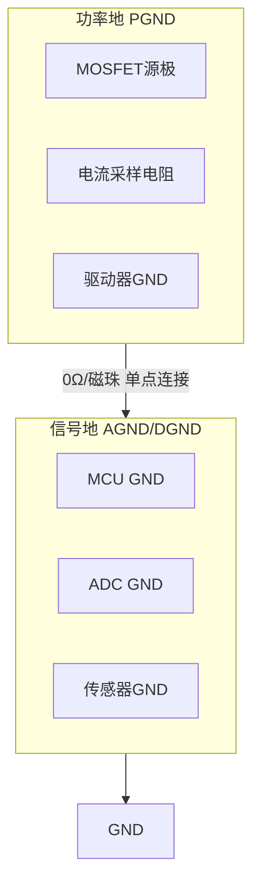
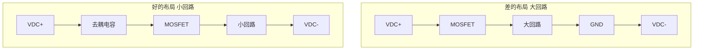
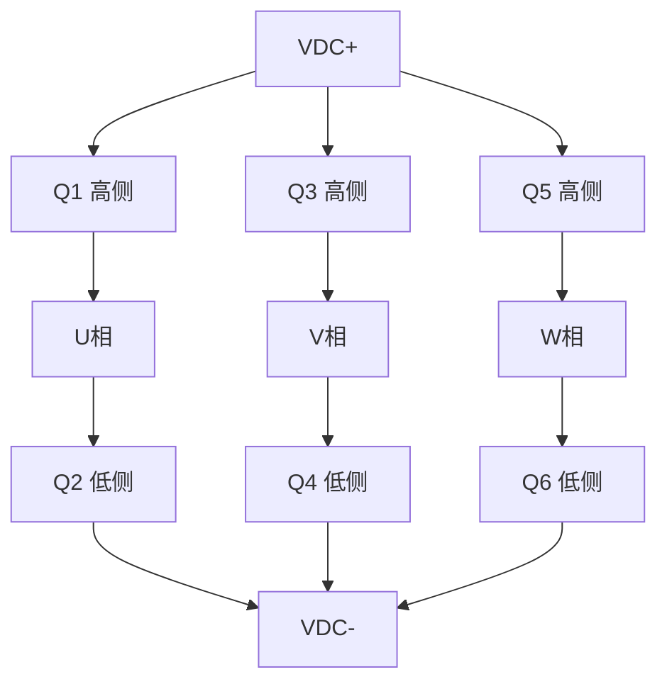
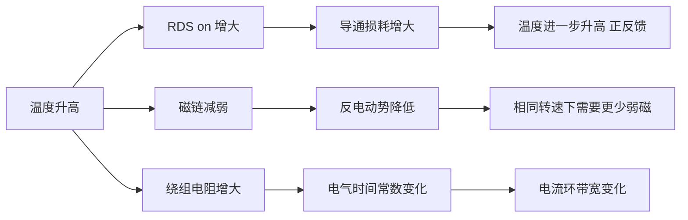

# HW-07 热设计与EMC

> 模块编号：HW-07 | 整体难度： | 类型：硬件基础+工程实践+可靠性

---

## 1.  核心摘要  

**一句话讲清楚**：热设计决定系统能否持续工作，EMC设计决定系统能否在电磁环境中正常工作——温度每升高10°C，器件寿命减半；EMI超标可能导致系统误动作甚至无法通过认证；PCB设计是硬件的最终实现，直接决定热性能、EMC性能和信号完整性。

**认知挂钩**：很多人以为热设计就是"加个散热片"，EMC就是"加个滤波器"，PCB就是"画线连点"，**这是致命误区！** 实际上，热设计需要**精确计算热阻、优化散热路径、考虑热耦合**，EMC需要**从源头抑制干扰、优化PCB布局、设计合理的滤波电路**，PCB设计涉及**电磁场理论、热力学、信号完整性、电源完整性**等多学科知识。更关键的是，**热设计、EMC设计和PCB设计必须在原理图阶段就考虑**，而不是事后补救。

**本模块核心公式**：
- 热阻：`Rth = ΔT / P`，`Tj = Ta + P × Rth_JA`
- EMI滤波器截止频率：`fc = 1 / (2π × √(L × C))`
- 功率损耗：`Ptotal = I² × RDS(on) × D + Esw × fsw`
- PCB热阻（自然对流，标准铜厚条件下适用）：`Rth ≈ 500 / (A × √A)`

---

## 2.  问题引入  

### 工程师真实困惑

**困惑1**：为什么MOSFET明明选了足够的电流裕度，还是烧了？

可能原因：只看了额定电流，没算热阻。MOSFET的额定电流是在壳温25°C时的理论值，实际应用中壳温远高于25°C，允许电流大幅下降。

**困惑2**：EMC测试总是不过，加滤波器也没用？

可能原因：滤波器只能抑制传导干扰，辐射干扰需要从源头（PCB布局、功率回路面积）解决。如果功率回路面积太大，加再多滤波器也救不回来。

**困惑3**：为什么电流采样总是有毛刺？

可能原因：功率回路和信号回路没有分离，地平面被破坏，或者采样走线离功率走线太近。

**困惑4**：散热片选多大才够？

**困惑5**：4层板和2层板对EMC影响到底有多大？

### 学习目标

| 目标 | 掌握程度 | 关键产出 |
|------|---------|---------|
| 掌握热阻计算与散热设计 | 能计算结温并选择散热器 | 散热方案 |
| 掌握功率损耗计算 | 能区分导通损耗和开关损耗 | 损耗分析报告 |
| 掌握EMI干扰源分析 | 能识别主要干扰源和传播路径 | EMI分析表 |
| 掌握EMI滤波器设计 | 能设计共模和差模滤波器 | 滤波器参数 |
| 掌握PCB层叠设计 | 能设计4层板层叠结构 | 层叠方案 |
| 掌握功率回路优化 | 能最小化功率回路面积 | 布局方案 |
| 掌握信号完整性设计 | 能处理敏感信号和地平面 | SI方案 |
| 理解热/EMC/PCB与算法的关联 | 能设计协同优化方案 | 系统优化策略 |

---

## 3.  直观理解  

### 3.1 水管类比：热阻


**水管类比：**

> 就像串联电阻分压：
> - 每一层热阻都会产生温度降
> - 总热阻 = 各层热阻之和
> - 热流（功率损耗）越大，温差越大

### 3.2 城市规划类比：PCB布局

**城市规划类比：**

> PCB布局 ≈ 城市规划
>
> - 功率区 = 工业区（大电流、高噪声，集中布置）
> - 信号区 = 住宅区（小信号、低噪声，远离工业区）
> - 地平面 = 道路网络（必须畅通，不能断路）
> - 去耦电容 = 便利店（就近服务，减少出行距离）
> - 功率回路 = 物流路线（越短越好，减少交通拥堵/EMI）

### 3.3 噪音类比：EMI

**噪音类比：**

> EMI干扰 ≈ 噪音污染
>
> - 传导干扰 = 通过管道传播的噪音（电源线、信号线）
> - 辐射干扰 = 通过空气传播的噪音（空间电磁场）
> - 共模干扰 = 所有管道同向传播的噪音（需要共模电感抑制）
> - 差模干扰 = 管道之间反向传播的噪音（需要差模电容抑制）
>
> **抑制策略：**
> 1. 源头降噪 → 降低开关速度（增大RG）
> 2. 传播阻断 → 滤波器、屏蔽
> 3. 接收端防护 → 差分走线、屏蔽

### 3.4 体温调节类比：热设计

```plain
人体体温调节              电驱热管理
─────────────────────────────────────
出汗散热            →   散热片+风扇
血管扩张（增加散热） →   热管/液冷
减少活动（降额）     →   过温降额
体温过高（发烧）     →   过温保护停机
局部发热（炎症）     →   热点/热耦合
```

---

## 4.  技术原理  

### 4.1 热设计基础 

#### 4.1.1 热阻概念


> 总热阻：$R_{th,JA} = R_{th,JC} + R_{th,CS} + R_{th,SA}$
> 结温计算：$T_j = T_a + P \times R_{th,JA}$

**典型热阻参数**：

| 器件类型 | Rth_JC (°C/W) | Rth_CS (°C/W) | Rth_SA | 说明 |
|---------|---------------|---------------|--------|------|
| TO-247封装 | 0.5-1.0 | 0.1-0.3 | 取决于散热片 | 大功率MOSFET |
| TO-220封装 | 1.0-2.0 | 0.3-0.5 | 取决于散热片 | 中小功率 |
| D2PAK封装 | 1.0-2.0 | 直接焊PCB | 取决于PCB | 表面贴装 |
| IGBT模块 | 0.1-0.3 | 0.05-0.1 | 取决于散热片 | 大功率模块 |

#### 4.1.2 功率损耗计算

**MOSFET/IGBT功率损耗**：

1. **导通损耗**：
> **导通损耗：**
>
> $P_{cond} = I^2 \times R_{DS(on)} \times D$ （MOSFET）
> $P_{cond} = V_{CE(sat)} \times I \times D$ （IGBT）
>
> 其中：
> - $I$ = 电流有效值
> - $R_{DS(on)}$ = 导通电阻
> - $D$ = 占空比

2. **开关损耗**：
> **开关损耗：**
>
> $P_{sw} = E_{sw} \times f_{sw}$
>
> 其中：
> - $E_{sw}$ = 单次开关损耗能量（数据表给出）
> - $f_{sw}$ = 开关频率

3. **续流二极管损耗**：
> **续流二极管损耗：**
>
> $P_{diode} = V_F \times I_{avg} \times (1-D)$

4. **总损耗**：

> $P_{total} = P_{cond} + P_{sw} + P_{diode}$

> 功率器件开关损耗的详细推导，参见 [HW-05-Power-Devices-Gate-Drivers](HW-05-Power-Devices-Gate-Drivers.md) §4.5

**手推计算示例**：
> **手推计算示例：**
>
> 已知：MOSFET: IPP60R099C6
> - $R_{DS(on)} = 99\text{m}\Omega$ @ 100°C
> - 电流 $I = 10\text{A}$ (有效值)
> - 占空比 $D = 0.5$
> - 开关频率 $f_{sw} = 20\text{kHz}$
> - $E_{sw(on)} = 0.5\text{mJ}$, $E_{sw(off)} = 0.3\text{mJ}$
>
> 解：
> 1. 导通损耗：$P_{cond} = 10^2 \times 0.099 \times 0.5 = 4.95\text{W}$
> 2. 开关损耗：$P_{sw} = (0.5 + 0.3) \times 10^{-3} \times 20000 = 16\text{W}$
> 3. 总损耗：$P_{total} = 4.95 + 16 = 20.95\text{W}$
>
> **结论：开关损耗是主要损耗来源！**

#### 4.1.3 散热器选型

**选型步骤**：

> **选型步骤：**
>
> 1. 计算功率损耗 $P_{loss}$
> 2. 确定最高结温 $T_{j,design} = T_{j,max} - 20°C$（留裕度）
> 3. 确定环境温度 $T_a$（工业40°C，汽车60°C）
> 4. 计算允许热阻 $R_{th,JA,max} = (T_{j,design} - T_a) / P_{loss}$
> 5. 计算散热器热阻 $R_{th,SA,max} = R_{th,JA,max} - R_{th,JC} - R_{th,CS}$

**手推计算示例**：
> **手推计算示例：**
>
> 已知：$P_{loss} = 20\text{W}$, $T_{j,design} = 130°C$, $T_a = 40°C$
> - $R_{th,JC} = 0.7°C/\text{W}$, $R_{th,CS} = 0.2°C/\text{W}$
>
> 解：
> - $R_{th,JA,max} = (130 - 40) / 20 = 4.5°C/\text{W}$
> - $R_{th,SA,max} = 4.5 - 0.7 - 0.2 = 3.6°C/\text{W}$
> - 选择散热器：$R_{th,SA} < 3.6°C/\text{W}$

**散热器类型对比**：

| 类型 | 热阻范围 | 成本 | 应用 | 特点 |
|------|---------|------|------|------|
| 铝挤压散热器 | 2-10°C/W | 低 | 中小功率 | 成本低 |
| 铝型材散热器 | 1-5°C/W | 中 | 中功率 | 可定制 |
| 铜散热器 | 0.5-2°C/W | 高 | 大功率 | 热阻小 |
| 热管散热器 | 0.2-1°C/W | 高 | 大功率紧凑空间 | 效率高 |
| 液冷板 | 0.1-0.5°C/W | 很高 | 大功率高密度 | 效率最高 |

**散热器热阻估算**：
> **散热器热阻估算：**
>
> $R_{th,SA} \approx 50 / (\sqrt{A} \times \sqrt{v})$
>
> 其中：
> - $A$ = 散热器表面积 (cm²)
> - $v$ = 空气流速 (m/s)，自然对流时 $v \approx 0.5$
>
> 示例：$A = 500\text{ cm}^2$, $v = 0.5\text{ m/s}$
> - $R_{th,SA} \approx 50 / (22.4 \times 0.707) = 3.16°C/\text{W}$

#### 4.1.4 热仿真

**一阶RC热模型**：
```plain
Ploss ───[Rth]───┬─── Tj
                   │
                  [Cth]
                   │
                  Ta

热时间常数：τ = Rth × Cth
温度响应：Tj(t) = Ta + Ploss × Rth × (1 - e^(-t/τ))
```

**手推计算示例**：
> **手推计算示例：**
>
> 已知：$R_{th,JA} = 5°C/\text{W}$, $C_{th} = 100\text{ J}/°\text{C}$, $P_{loss} = 20\text{W}$, $T_a = 40°C$
>
> 解：
> - $\tau = 5 \times 100 = 500\text{s} \approx 8.3$分钟
> - 稳态结温：$T_{j,ss} = 40 + 20 \times 5 = 140°C$
> - 达到95%稳态的时间：$t = 3\tau = 1500\text{s} = 25$分钟

**瞬态热阻抗**：
> **瞬态热阻抗：**
>
> 实际器件的热阻抗是时间的函数：
> $Z_{th}(t) = R_{th} \times (1 - e^{-t/\tau})$
>
> 对于脉冲负载：
> $T_{j,peak} = T_a + P_{pulse} \times Z_{th}(t_{pulse})$
>
> 示例：$P_{pulse} = 100\text{W}$, $t_{pulse} = 1\text{s}$, $Z_{th}(1\text{s}) = 0.5°C/\text{W}$
> - $T_{j,peak} = 40 + 100 \times 0.5 = 90°C$ (安全)

### 4.2 EMC设计基础 

#### 4.2.1 EMI干扰源分析

| 干扰源类型 | 频率范围 | 特点 | 主要影响 |
|-----------|---------|------|---------|
| PWM开关噪声 | 基频+谐波 | 能量大、周期性 | 传导+辐射 |
| 高频振荡 | 10-100MHz | 尖峰、衰减快 | 辐射干扰 |
| 反向恢复电流 | 高频 | 尖峰、能量集中 | 传导干扰 |
| 电机换相 | 低频 | 与转速相关 | 低频传导 |
| 续流二极管 | 高频 | 与开关同步 | 传导+辐射 |

**干扰传播路径**：
- 传导：通过电源线、信号线传播
- 辐射：通过空间电磁场传播
- 耦合：通过寄生电容、电感耦合

#### 4.2.2 传导EMI抑制

**1. 共模滤波器**：
```plain
共模干扰：三相电流同向流动，通过地线返回

电路：
  L ────┬────[Lcm]────┬──── L'
        │             │
       ╱╱╲           ╱╱╲
       ╲╲╱ C_Y       ╲╲╱ C_Y
        │             │
  N ────┴────[Lcm]────┴──── N'
                │
               PE

共模电感：Lcm（所有相线绕在同一磁芯上）
Y电容：C_Y（相线对地）
```

**2. 差模滤波器**：
```plain
差模干扰：相线之间的干扰

电路：
  L ────[Ldm]───┬──── L'
                 │
                ╱╱╲ C_X
                ╲╲╱
                 │
  N ────────────┴──── N'

差模电感：Ldm（独立电感）
X电容：C_X（相线之间）
```

**3. 完整EMI滤波器**：
```plain
L ──[Ldm]──┬──[Lcm]──┬──[Lcm]──┬── L'
            │         │         │
           C_X       C_Y       C_Y
            │         │         │
N ──[Ldm]──┴──[Lcm]──┴──[Lcm]──┴── N'
```

**滤波器参数计算**：
> **滤波器参数计算：**
>
> 截止频率：$f_c = 1 / (2\pi \times \sqrt{L \times C})$
> 插入损耗：$IL = 20 \times \log_{10}(1 + (f/f_c)^2)$ dB
>
> 设计示例：
> - 开关频率 $f_{sw} = 20\text{kHz}$
> - 目标衰减 @ 150kHz = 40dB
>
> - 40dB → 衰减倍数 = 100
> - $100 = (150k/f_c)^2$
> - $f_c = 15\text{kHz}$
>
> - 选择 $L = 1\text{mH}$, $C = 0.1\mu\text{F}$
> - $f_c = 1 / (2\pi \times \sqrt{1\text{m} \times 0.1\mu})) = 15.9\text{kHz}$ 

#### 4.2.3 辐射EMI抑制

**1. 屏蔽**：
> **屏蔽效能：** $SE = R + A + B$
> - $R$ = 反射损耗
> - $A$ = 吸收损耗
> - $B$ = 多次反射修正
>
> **屏蔽材料选择：**
> - 低频磁场：高导磁率材料（坡莫合金、硅钢）
> - 高频电场：高导电率材料（铜、铝）
> - 宽频带：多层复合材料

**2. PCB布局优化**：
> **关键原则：**
> - 功率回路面积最小化
> - 高频信号远离敏感电路
> - 地平面完整
> - 去耦电容靠近IC

**3. 缓冲电路（RC吸收）**：
```plain
      ┌───[R]───┬───┐
      │         │   │
D ────┴─────────┴───┴─── S
            │   │
           ╱╱╲ ╱╱╲
           ╲╲╱ ╲╲╱ C
            │   │
           GND GND

参数计算：
  C = I × tr / Vspike
  R = 2 × √(Lparasitic / C)

其中：
  I = 关断电流
  tr = 电压上升时间
  Vspike = 允许尖峰电压
  Lparasitic = 回路寄生电感
```

#### 4.2.4 接地设计

**1. 单点接地 vs 多点接地**：
> - 低频（<1MHz）：单点接地 → 避免地环路
> - 高频（>10MHz）：多点接地 → 减小地阻抗
> - 混合接地：低频单点、高频多点

**2. 功率地与信号地分离**：


**3. 地平面设计**：
> **多层PCB地平面：**
> - 顶层：信号走线
> - 第二层：完整地平面（GND）
> - 第三层：电源平面
> - 底层：信号走线
>
> **地平面开槽问题：**
> -  错误：地平面有狭缝 → 回流被迫绕行 → EMI增大
> -  正确：完整地平面 → 回流直接返回 → EMI最小
>
> **地平面过孔：**
> - 在高频信号附近增加接地过孔
> - 减小回流路径

### 4.3 PCB层叠设计 

#### 4.3.1 层叠结构选择

| 层数 | 结构 | 应用 | 成本 |
|------|------|------|------|
| 2层 | 顶层信号+电源，底层信号+地 | 简单控制板 | 低 |
| 4层 | 顶层信号，内层1地，内层2电源，底层信号 | 大多数电驱板（推荐） | 中 |
| 6层 | 顶层信号，内层1地，内层2-3信号，内层4电源，底层信号 | 高性能伺服驱动 | 高 |

#### 4.3.2 4层板层叠设计

```plain
典型4层板层叠：

  层次   │ 厚度   │ 材料   │ 用途
  ───────┼────────┼────────┼────────────────────────────────
  顶层    │ 35μm   │ 铜     │ 信号走线、功率器件、大电流走线
  PP     │ 0.1mm  │ FR4    │ 介质层
  内层1   │ 35μm   │ 铜     │ 完整地平面（GND）
  Core   │ 1.0mm  │ FR4    │ 核心层
  内层2   │ 35μm   │ 铜     │ 电源平面（VCC）
  PP     │ 0.1mm  │ FR4    │ 介质层
  底层    │ 35μm   │ 铜     │ 信号走线、敏感电路

  总厚度：约1.6mm
```

**设计要点**：
1. 地平面完整性：内层1作为完整地平面，避免开槽
2. 电源平面分割：内层2分割为多个电源区域
3. 信号层规划：顶层功率器件和大电流走线，底层敏感信号和MCU电路

#### 4.3.3 阻抗控制

```plain
微带线阻抗计算：

          ┌─────────────────┐
          │    信号线 W     │
          └────────┬────────┘
                   │ H (介质厚度)
    ┌──────────────┴──────────────┐
    │          地平面              │
    └─────────────────────────────┘

阻抗公式（近似）：
  Z0 ≈ 87 / √(εr + 1.41) × ln(5.98H / (0.8W + T))

手推计算示例：
  εr = 4.5, H = 4mil, W = 6mil, T = 1.4mil

  Z0 ≈ 87 / 2.43 × ln(23.92 / 6.2)
     ≈ 35.8 × 1.35 ≈ 48.3Ω

常用阻抗：
  • 单端信号：50Ω
  • 差分信号：100Ω
  • CAN：120Ω
```

### 4.4 功率回路设计 

#### 4.4.1 功率回路面积最小化



> **关键原则：**
> 1. 去耦电容紧靠功率器件
> 2. 电源走线短而宽
> 3. 地回路直接返回

#### 4.4.2 三相逆变器布局



```plain
布局要点：
  1. 每相上下桥臂靠近放置
  2. 去耦电容紧靠MOSFET
  3. 栅极驱动器靠近MOSFET
  4. 电流采样电阻在低侧

去耦电容布局：
  VDC+ ───┬───[C1]───┬───[C2]───┬───
          │          │          │
         ┌┴┐        ┌┴┐        ┌┴┐
         │Q1│       │Q3│       │Q5│
         └┬┘        └┬┘        └┬┘
          │          │          │
  VDC- ───┴──────────┴──────────┴───

  C1, C2: 陶瓷电容（100nF + 1μF）
  布局原则：大电容在外，小电容在内，电容紧靠MOSFET引脚
```

#### 4.4.3 栅极驱动布局

> **关键要点：**
> 1. 驱动器紧靠MOSFET（距离<10mm）
> 2. 栅极电阻紧靠驱动器输出
> 3. 自举电容紧靠驱动器
> 4. 栅极走线短而宽（>0.3mm）
> 5. 齐纳二极管保护栅极

### 4.5 信号完整性设计 

#### 4.5.1 地平面设计

```plain
差的设计（地平面开槽）：
  信号走线 ─────────────────────
                   │
                   │ 开槽
                   │
  地平面     ──────┼────── 地平面
                   │
                   ▼
             回流被迫绕行！

好的设计（完整地平面）：
  信号走线 ─────────────────────

  ┌─────────────────────────────┐
  │                             │
  │      完整地平面             │
  │                             │
  └─────────────────────────────┘
             回流直接返回！
```

#### 4.5.2 敏感信号处理

| 信号类型 | 特点 | 处理方法 |
|---------|------|---------|
| 电流采样 | 小信号、高阻抗 | 差分走线、屏蔽、滤波 |
| 位置传感器 | 高频、数字 | 远离功率器件、屏蔽 |
| ADC输入 | 高阻抗 | 短走线、RC滤波 |
| 参考电压 | 高精度 | 远离噪声源、去耦 |
| 复位信号 | 低电平有效 | 上拉电阻、滤波电容 |

**差分走线设计**：
```plain
  D+ ───────────────────────────
  D- ───────────────────────────
  │←── S ──→│  间距

  要求：等长（误差<5mil）、等距、平行走线、避免过孔
```

**ADC输入滤波**：
```plain
      信号源
        │
        ├───[Rs]───┬─── ADC输入
        │          │
       ╱╱╲        ╱╱╲
       ╲╲╱ Cs     ╲╲╱ Cf
        │          │
       GND        GND

  参数：Rs = 100Ω~1kΩ, Cs = 1nF~10nF, Cf = 100pF~1nF
  截止频率：fc = 1 / (2π × Rs × Cs)
```

#### 4.5.3 电源完整性

**去耦电容配置**：
```plain
VCC ────┬──────────── IC电源引脚
        │
       ╱╱╲ C1 (100nF)  高频去耦
       ╲╲╱
        │
       ╱╱╲ C2 (1μF)    中频去耦
       ╲╲╱
        │
       ╱╱╲ C3 (10μF)   低频去耦
       ╲╲╱
        │
       GND

布局原则：C1最靠近IC引脚，C2次之，C3可稍远
```

**PDN（电源分配网络，Power Distribution Network）分析**：
```plain
目标阻抗：Ztarget = ΔV / ΔI

示例：3.3V电源，允许波动5%，瞬态电流1A
  Ztarget = 165mV / 1A = 165mΩ

频率范围：
  DC ~ 1kHz：稳压器
  1kHz ~ 1MHz：大电容
  1MHz ~ 100MHz：小电容
  >100MHz：PCB平面电容
```

### 4.6 PCB散热设计 

#### 4.6.1 铜箔散热

```plain
功率器件的铜箔面积：

  ┌───────────────────────────┐
  │      功率器件              │
  └───────────┼───────────────┘
              │
  ┌───────────┴──────────┐
  │    散热铜箔            │
  │    (大面积铺铜)         │
  └──────────────────────┘

热阻估算：
  Rth ≈ 500 / (A × √A)
  其中 A = 铜箔面积 (cm²)

示例：A = 10 cm²
  Rth ≈ 500 / (10 × 3.16) = 15.8°C/W
```

#### 4.6.2 热过孔

```plain
热过孔设计：
  顶层铜箔 ────┬──── 底层铜箔
               │
              ╱╲ 热过孔
              ╲╱
               │
              铜填充

过孔参数：直径0.3mm，间距1mm，阵列排列

热阻计算：
  单个过孔热阻 ≈ 100°C/W (0.3mm直径)
  多个过孔并联：Rth_total = Rth_single / N

示例：N = 10个过孔
  Rth_total = 100 / 10 = 10°C/W
```

#### 4.6.3 散热焊盘

```plain
功率器件底部散热焊盘：
  ┌───────────────────────────┐
  │      功率器件              │
  │      ┌─────────┐          │
  │      │散热焊盘 │          │
  │      └────┬────┘          │
  └───────────┼───────────────┘
              │
         热过孔阵列
              │
  ┌───────────┴───────────────┐
  │      底层散热铜箔          │
  └───────────────────────────┘
```

#### 4.6.4 PCB热仿真

> 1. 一维热阻模型：
> $T_j = T_a + P \times (R_{th,JC} + R_{th,CS} + R_{th,SA})$
>
> 2. PCB热阻估算（垂直方向）：
> $R_{th,PCB} = t / (k \times A)$
> 其中 $k = 0.3\text{ W}/(\text{m}\cdot\text{K})$ (FR4)
>
> 示例：$t = 1.6\text{mm}$, $A = 1\text{cm}^2$
> $R_{th,PCB} = 0.0016 / (0.3 \times 0.0001) = 53.3°C/\text{W}$
>
> 3. 热耦合分析：
> $T_1 = T_a + P_1 \times R_{th1} + P_2 \times R_{th,coupling}$
> $R_{th,coupling} \approx R_{th1} \times R_{th2} / (R_{th1} + R_{th2}) \times \text{距离因子}$

---

## 5.  交叉视角  

### 5.1 硬件算法关联总览

```plain
热/EMC/PCB参数        影响路径                  算法侧影响
─────────────────────────────────────────────────────────
温升              →  RDS(on)增大          →  参数自整定
EMI辐射           →  采样噪声            →  控制精度
PCB布局           →  信号完整性          →  控制精度
功率回路面积       →  寄生电感            →  开关尖峰/EMI
地平面完整性       →  ADC精度             →  电流采样精度
散热能力          →  最大允许电流          →  转矩能力
热耦合            →  多器件温升互相影响    →  降额策略
```

###  算法关联1：温升 → 参数自整定

温度变化导致电机和功率器件参数漂移，控制算法需要自适应调整：

> **温度对关键参数的影响：**
> - $R_{DS(on)} \propto T^{2.3}$ （正温度系数）
> - 磁体磁通 $\propto -T$ （负温度系数，-0.1%/°C典型）
> - 电感 $L \propto -T$ （负温度系数）
> - 铜电阻 $\propto T$ （正温度系数，+0.393%/°C）

**参数自整定策略**：
```c
// 基于温度的参数自整定
void Parameter_AutoTuning(float T_junction, float T_magnet, float T_winding) {
    // 1. RDS(on)温度补偿 → 影响导通损耗估算
    float R_ds_on = RDS_on_25C * pow((T_junction + 273.15) / 298.15, 2.3);
    
    // 2. 磁链温度补偿 → 影响角度观测器和弱磁控制
    float flux = flux_25C * (1 - 0.001 * (T_magnet - 25));
    
    // 3. 绕组电阻温度补偿 → 影响电流环PI参数
    float R_s = R_s_25C * (1 + 0.00393 * (T_winding - 25));
    
    // 4. 更新电流环PI参数
    // 电阻增大 → 需要增大Kp以保持带宽
    float Kp_new = Kp_base * (R_s / R_s_base);
    float Ki_new = Ki_base * (R_s / R_s_base);
    
    // 5. 更新观测器参数
    // 磁链减小 → 需要调整反电动势补偿
    float flux_new = flux;
    
    // 6. 更新热模型损耗估算
    float P_cond = I_rms * I_rms * R_ds_on * D;
    UpdateThermalModel(P_cond + P_sw);
}
```

**温升对控制性能的影响链**：


###  算法关联2：EMI → 采样噪声

EMI直接影响电流和电压采样的信噪比，进而影响控制精度：


> **量化分析：**
> 假设EMI导致采样噪声为 $N_{emi}$ (A rms)
> 电流环带宽为 $f_{bw}$ (Hz)
>
> - 转矩纹波 = $K_t \times N_{emi}$
> - 转速波动 = $K_t \times N_{emi} / J \times (1 / s)$

**EMI-aware采样策略**：
```c
// PWM同步采样：在PWM中心采样，此时开关噪声最小
void ADC_SynchronizedSampling(void) {
    // 等待PWM中心点
    WaitPWMCenter();
    
    // 触发ADC采样
    ADC_StartConversion();
    
    // 多次采样取平均（降低随机噪声）
    float I_sample = 0;
    for (int i = 0; i < N_SAMPLES; i++) {
        I_sample += ADC_Read();
    }
    I_sample /= N_SAMPLES;
}

// 数字滤波：抑制高频EMI噪声
float EMI_Filter(float I_raw) {
    // 一阶低通滤波
    static float I_filtered = 0;
    float alpha = 0.1;  // 滤波系数
    I_filtered = alpha * I_raw + (1 - alpha) * I_filtered;
    return I_filtered;
}
```

###  算法关联3：PCB布局 → 信号完整性 → 控制精度

PCB布局质量直接决定信号完整性，影响传感器精度和控制精度：


**PCB布局优化对控制精度的量化影响**：
> - 差的布局：电流采样噪声 ≈ 200mA rms → 转矩纹波 ≈ 5%
> - 一般布局：电流采样噪声 ≈ 50mA rms  → 转矩纹波 ≈ 1.5%
> - 好的布局：电流采样噪声 ≈ 10mA rms  → 转矩纹波 ≈ 0.3%
>
> **关键优化措施：**
> 1. 功率回路面积最小化 → EMI降低20dB
> 2. 完整地平面 → 采样零漂降低90%
> 3. 差分走线 → 共模抑制提高40dB
> 4. PWM同步采样 → 开关噪声抑制30dB

### 5.2 热/EMC/PCB协同设计原则

| 设计维度 | 协同要点 | 冲突处理 |
|---------|---------|---------|
| 热设计 vs EMC | 散热片可能成为辐射天线 | 散热片接地 |
| PCB层数 vs 成本 | 更多层改善SI/EMC但增加成本 | 4层是最佳性价比 |
| 功率回路 vs 散热 | 器件靠近减小回路但影响散热 | 优先保证回路小 |
| 滤波器 vs 体积 | 更多滤波元件改善EMC但增大体积 | 源头抑制优先 |
| 采样精度 vs 速度 | 多次采样提高精度但增加延迟 | 根据带宽要求折中 |

---

## 6.  工程案例  

### 6.1 案例1：2kW电机控制器热设计

> **系统参数：** 母线电压48V，额定功率2kW，额定电流50A，$f_{sw} = 20\text{kHz}$, $T_a = 40°C$
>
> **功率器件：** MOSFET: IPP60R099C6 × 6 (三相桥)
>
> **损耗计算：**
> 1. 单个MOSFET损耗
>    - $I_{phase} = 50/\sqrt{3}/\sqrt{2} = 20.4\text{A}$ (相电流有效值)
>    - $P_{cond} = 20.4^2 \times 0.12 \times 0.5 = 25\text{W}$
>    - $P_{sw} = 0.8\text{mJ} \times 20\text{kHz} = 16\text{W}$
>    - $P_{total} = 25 + 16 = 41\text{W}$ (单个MOSFET)
>
> 2. 三相桥总损耗：$P_{total,3phase} = 41 \times 6 = 246\text{W}$
>
> **散热器设计**（6个MOSFET共用同一散热器，需考虑热耦合）：
> - 总损耗：$P_{total,3phase} = 246\text{W}$
> - $R_{th,SA,req} = ((130 - 40) / 246) - 0.7 - 0.2 = 0.37 - 0.9$ → 不足，散热器已无法满足自然冷却
> - 必须采用强制风冷方案：
> - 选择铝型材散热器 + 风扇：$R_{th,SA} \approx 0.22°C/\text{W}$（强制风冷，风速≥3m/s）
>
> **验证**（单个MOSFET结温）：
> - 散热器温度：$T_s = 40 + 246 \times 0.22 = 94.1°C$
> - 单个MOSFET结温：$T_j = 94.1 + 41 \times (0.7 + 0.2) = 131°C \approx 130°C$ → 临界，需进一步优化
> - **优化方案：** 选用更低$R_{th,JC}$的器件（如TO-247封装 $R_{th,JC}=0.4°C/\text{W}$）或并联MOSFET分摊热耗

### 6.2 案例2：EMI滤波器设计

> **系统参数：** 母线电压48V，额定功率2kW，$f_{sw} = 20\text{kHz}$，EMC标准：EN 61800-3
>
> **传导EMI限值**（EN 61800-3）：
> - 150k-500kHz：准峰值79 dBμV，平均值66 dBμV
> - 500k-30MHz：准峰值73 dBμV，平均值60 dBμV
>
> **滤波器设计：**
> 1. 差模滤波器：目标衰减@150kHz = 50dB
>    - $f_c = 150\text{k} / 10^{1.25} = 8.4\text{kHz}$
>    - 选择：$L_{dm} = 470\mu\text{H} \times 2$, $C_x = 1\mu\text{F}$
>    - $f_c = 1 / (2\pi \times \sqrt{470\mu \times 2 \times 1\mu})) = 5.2\text{kHz}$ 
>
> 2. 共模滤波器：目标衰减@150kHz = 40dB
>    - 选择：$L_{cm} = 10\text{mH}$, $C_y = 4.7\text{nF} \times 2$
>    - $f_c = 1 / (2\pi \times \sqrt{10\text{m} \times 4.7\text{n}})) = 23.2\text{kHz}$
>    - 衰减@150kHz ≈ 32dB → 需要增加一级

### 6.3 案例3：三相逆变器PCB布局优化

> **优化前后对比：**
>
> **优化前**（2层板，差布局）：
> - 功率回路面积：50cm²
> - 电流采样噪声：200mA
> - EMI@150kHz：95dBμV（超标）
> - 转矩纹波：5%
>
> **优化后**（4层板，好布局）：
> - 功率回路面积：5cm²（减小10倍）
> - 电流采样噪声：15mA（改善13倍）
> - EMI@150kHz：65dBμV（合格）
> - 转矩纹波：0.5%
>
> **关键优化措施：**
> 1. 从2层板升级到4层板
> 2. 去耦电容紧靠MOSFET
> 3. 功率地和信号地分离
> 4. 电流采样差分走线
> 5. ADC输入RC滤波

### 6.4 案例4：热管散热方案

> **需求：** 5kW伺服驱动器，6个IGBT模块，总损耗300W，环境温度50°C
>
> **传统方案：**
> - 铝型材散热器 $R_{th,SA} = 0.5°C/\text{W}$
> - 尺寸：400mm × 200mm × 100mm
> - 重量：5kg
>
> **热管方案：**
> - 热管+铝散热片 $R_{th,SA} = 0.2°C/\text{W}$
> - 尺寸：300mm × 150mm × 80mm
> - 重量：2.5kg
>
> **优势：** 体积减小40%，重量减轻50%，热阻降低60%

### 6.5 案例5：PCB热设计综合方案

> **需求：** D2PAK封装MOSFET，损耗5W，无外部散热器
>
> **方案：**
> 1. 顶层大面积铺铜（散热焊盘 + 周围铺铜）
>    - 铜箔面积 = 10cm² → $R_{th} \approx 15.8°C/\text{W}$
>
> 2. 热过孔阵列（10个0.3mm过孔）
>    - $R_{th,via} = 100/10 = 10°C/\text{W}$
>
> 3. 底层散热铜箔
>    - 通过热过孔连接到底层铺铜
>
> 4. 总热阻估算
>    $R_{th,JA} \approx R_{th,JC} + R_{th,copper} \parallel R_{th,via}$
>    $\approx 2.0 + (15.8 \times 10) / (15.8 + 10)$
>    $\approx 2.0 + 6.1 = 8.1°C/\text{W}$
>
> 5. 结温验证
>    $T_j = 50 + 5 \times 8.1 = 90.5°C < 130°C$ 

---

## 7.  实践练习  

### 7.1 计算题

**练习1（）**：已知MOSFET的RDS(on) = 80mΩ @ 100°C，电流15A有效值，占空比0.5，开关损耗能量Esw = 0.6mJ，fsw = 20kHz，计算总损耗。

**练习2（）**：已知Ploss = 25W，Tj_design = 130°C，Ta = 45°C，Rth_JC = 0.8°C/W，Rth_CS = 0.2°C/W，计算所需的散热器热阻。

**练习3（）**：设计一个EMI滤波器，要求在150kHz处衰减40dB，开关频率20kHz。给出电感和电容参数。

**练习4（）**：一个三相逆变器使用6个MOSFET，每个损耗30W，Rth_JC = 0.7°C/W，Rth_CS = 0.2°C/W，Ta = 40°C。设计散热方案（自然对流），要求Tj < 130°C。计算散热器热阻并选择合适的散热器。

**练习5（）**：一个2kW电机控制器在EMC测试中传导发射超标15dB @ 200kHz。已知开关频率20kHz，现有滤波器只有一级LC。分析可能的原因，设计改进方案，并计算改进后的衰减量。

### 7.2 设计题

**练习6（）**：为一个48V/2kW的三相电机控制器设计PCB：
- 选择层叠结构
- 画出功率区布局方案
- 设计地平面分割方案
- 标注关键走线宽度

**练习7（）**：设计一个完整的散热方案：
- 6个TO-247封装MOSFET，每个损耗20W
- 环境温度50°C，要求Tj < 125°C
- 选择散热器并计算验证
- 考虑热耦合效应

### 7.3 诊断题

**练习8（）**：MOSFET在满载运行时温度持续升高直到触发过温保护，但选型时计算的热阻应该足够。可能的原因是什么？

**练习9（）**：电流采样信号上有与PWM开关同步的尖峰，幅值约200mA。分析可能的原因，并给出从PCB布局到软件滤波的完整解决方案。

**练习10（）**：一个伺服驱动器在EMC测试中辐射发射在50-100MHz频段超标。已知使用4层板，功率回路面积已优化。请分析可能的原因（考虑缓冲电路、屏蔽、走线等），给出完整的诊断和整改方案。

---

## 附录：快速计算公式汇总

### A. 热阻计算
> $R_{th} = \Delta T / P$
> $T_j = T_a + P \times R_{th,JA}$
> $R_{th,JA} = R_{th,JC} + R_{th,CS} + R_{th,SA}$
> $R_{th,SA} \approx 50 / (\sqrt{A} \times \sqrt{v})$

### B. 功率损耗
> $P_{cond} = I^2 \times R_{DS(on)} \times D$ （MOSFET）
> $P_{cond} = V_{CE(sat)} \times I \times D$ （IGBT）
> $P_{sw} = E_{sw} \times f_{sw}$
> $P_{diode} = V_F \times I_{avg} \times (1-D)$
> $P_{total} = P_{cond} + P_{sw} + P_{diode}$

### C. 热时间常数
> $\tau = R_{th} \times C_{th}$
> $T_j(t) = T_a + P \times R_{th} \times (1 - e^{-t/\tau})$
> $Z_{th}(t) = R_{th} \times (1 - e^{-t/\tau})$

### D. EMI滤波器
> $f_c = 1 / (2\pi \times \sqrt{L \times C})$
> $IL = 20 \times \log_{10}(1 + (f/f_c)^2)$ dB

### E. 特性阻抗
> $Z_0 \approx 87 / \sqrt{\varepsilon_r + 1.41} \times \ln(5.98H / (0.8W + T))$

### F. 功率回路电感
> $L \approx \mu_0 \times l \times (\ln(2l/w) + 0.5)$

### G. PCB热阻
> $R_{th,PCB} \approx 500 / (A \times \sqrt{A})$ （铜箔散热）
> $R_{th,PCB} = t / (k \times A)$ （FR4垂直方向）
> $R_{th,via} \approx 100 / N$ （N个过孔并联）

### H. PDN目标阻抗
> $Z_{target} = \Delta V / \Delta I$

### I. 缓冲电路
> $C = I \times t_r / V_{spike}$
> $R = 2 \times \sqrt{L_{parasitic} / C}$

---

**文档信息**：
- 合并来源：热设计与EMC + PCB设计
- 重构格式：7段式知识库结构

###  hpm_MC 代码关联

**温度保护**: hpm_mcl_v2 未内置温度检测模块，建议应用层通过 ADC 额外通道实现
**EMC 相关**:
- 死区补偿减少电流谐波（`HPM_MCL_ENABLE_DEAD_AREA_COMPENSATION`）
- d/q 轴解耦减少电流谐波，间接改善 EMI（`HPM_MCL_ENABLE_DQ_AXIS_DECOUPLING`）
- theta_forecast 角度预测减少角度延迟引起的谐波畸变

>  检验你的理解：[HW-07 检验题目](./HW-07-assessment.md)
