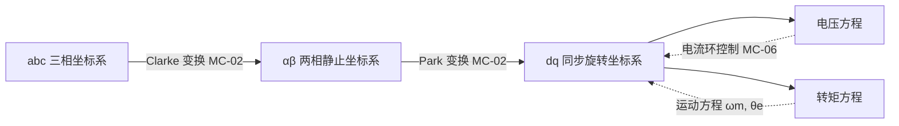

# MC-01：PMSM 永磁同步电机数学模型
## 从ABC到DQ——理解永磁同步电机的数学模型

## 难度
★★☆☆☆

## 适用对象
- 电机控制初学者——建立 PMSM 数学模型的完整直觉
- FOC 算法工程师——理解坐标变换与解耦的物理动机
- 嵌入式开发者——对照代码理解电压方程与转矩方程的实现

## 前置知识
- [MC-02](MC-02-Clarke-Park.md) — Clarke/Park 坐标变换（理解 abc→αβ→dq 的数学工具）
- [ALG-01](../algorithm/ALG-01-FOC-Theory.md) — FOC 理论基础
- [CT-01](../control-theory/CT-01-Open-Loop-Closed-Loop.md) — 开环与闭环控制基础

## 核心摘要
PMSM 数学模型是 FOC 所有推导的起点。本文从 abc 三相静止坐标系出发，经过 αβ 两相静止坐标系，最终到达 dq 同步旋转坐标系，推导出 FOC 核心的电压方程和转矩方程。掌握这三组方程及其变换关系，是理解后续电流环设计、MTPA 控制和无感观测器的基础。

---



> **定位**：FOC 所有推导的起点。不掌握 PMSM 的微分方程，就无法理解为什么需要 Clarke/Park 变换，也无法设计电流环。
>
> **目标**：能独立写出 abc/αβ/dq 三个坐标系下的电压方程、磁链方程、转矩方程，并理解它们之间的变换关系。

---

## 1. 物理直觉：PMSM 长什么样

将 PMSM 想象成一个"电磁弹簧"系统：

- **永磁体转子**：固定在转轴上，产生恒定磁场 ψpm（永磁磁链，单位 Wb），方向沿 d 轴。
- **三相定子绕组**：空间上互差 120° 排列，通入三相正弦电流时产生旋转磁场。
- **转矩产生**：转子永磁场与定子旋转磁场之间的夹角 × 两者幅值 → 转矩。类比：两块磁铁互相吸引/排斥的力，正比于两磁场幅值之积，反比于夹角。

PMSM 之所以需要 FOC，是因为三相电流的动态方程耦合极深——A 相电流的变化同时依赖于 B 相和 C 相电流、转子位置、转子速度。FOC 通过坐标变换将这种耦合"解开"，让三相 PMSM 的控制变得像他励直流电机一样简单。

---

## 2. 三坐标系的定义

### 2.1 三相静止坐标系 (abc)

- 三个轴 A、B、C 分别与三相定子绕组的轴线重合。
- 三相电流 ia、ib、ic 的合成磁场方向即为转子受到的拉拽方向。
- **KCL 约束**：ia + ib + ic = 0（Y 接，中性点不引出），意味着三个电流中只有两个是独立变量。

### 2.2 两相静止坐标系 (αβ)

- α 轴与 A 相绕组轴线重合，β 轴超前 α 轴 90°。
- 将三相电流投影到 αβ 平面上，等效为一个旋转的电流矢量 I = Iα + j·Iβ。
- **直观理解**：一个旋转矢量比三个随时间变化的交流信号更直观——你只需要跟踪它的幅值和角度即可。

### 2.3 两相同步旋转坐标系 (dq)

- d 轴对齐转子永磁体磁场方向（d 轴 = direct axis = 直轴）。
- q 轴超前 d 轴 90°（q 轴 = quadrature axis = 交轴）。
- 坐标系随转子同步旋转，转速 = 电角速度 ωe。
- 这是 FOC 的"魔法"所在：在 dq 坐标系下，稳态时 Id、Iq 都是直流量——让你用 PI 控制器就能实现无静差跟踪。

---

## 3. ABC 坐标系下的数学模型

PMSM 在 abc 坐标系下的电压方程：

$$ \begin{bmatrix} v_a \\ v_b \\ v_c \end{bmatrix} = R_s \begin{bmatrix} i_a \\ i_b \\ i_c \end{bmatrix} + \frac{d}{dt} \begin{bmatrix} \psi_a \\ \psi_b \\ \psi_c \end{bmatrix} $$

磁链方程：

$$ \begin{bmatrix} \psi_a \\ \psi_b \\ \psi_c \end{bmatrix} = \begin{bmatrix} L_{aa}(\theta_e) & L_{ab}(\theta_e) & L_{ac}(\theta_e) \\ L_{ba}(\theta_e) & L_{bb}(\theta_e) & L_{bc}(\theta_e) \\ L_{ca}(\theta_e) & L_{cb}(\theta_e) & L_{cc}(\theta_e) \end{bmatrix} \begin{bmatrix} i_a \\ i_b \\ i_c \end{bmatrix} + \psi_{pm} \begin{bmatrix} \cos(\theta_e) \\ \cos(\theta_e - 120^\circ) \\ \cos(\theta_e + 120^\circ) \end{bmatrix} $$

**关键观察**：电感矩阵的所有元素都是转子位置 θe 的函数——这就是耦合的根源。对于 IPMSM（转子表面有凸极），自感和互感还随 2θe 变化（磁阻沿 d/q 轴不同）。

---

## 4. DQ 坐标系下的数学模型（FOC 核心）

经过 Clarke + Park 变换（详见 [MC-02](MC-02-Clarke-Park.md)）后，得到 dq 坐标系下的电压方程——**FOC 真正的核心方程**：

### 4.1 电压方程

$$ \begin{aligned} v_d &= R_s i_d + L_d \frac{di_d}{dt} - \omega_e L_q i_q \\ v_q &= R_s i_q + L_q \frac{di_q}{dt} + \omega_e (L_d i_d + \psi_{pm}) \end{aligned} $$

- **逐项解释：**

| 项 | 物理含义 | 类比 |
|----|---------|------|
| Rs·id / Rs·iq | 电阻压降 | 焦耳热损耗，同直流电机 |
| Ld·did/dt / Lq·diq/dt | 电感的"惯性"，阻碍电流变化 | 弹簧的惯性力 |
| -ωe·Lq·iq | d 轴反电动势 | q 轴电流在旋转中"感应"到 d 轴的电压 |
| +ωe·Ld·id | q 轴反电动势（d 轴电流的贡献） | 只在 Ld≠0 时存在 |
| +ωe·ψpm | q 轴反电动势（永磁体的贡献） | **BEMF**，速度越高越大 |

### 4.2 转矩方程

$$ T_e = \frac{3}{2} \cdot pp \cdot \left[ \psi_{pm} \cdot i_q + (L_d - L_q) \cdot i_d \cdot i_q \right] $$

- **两项分别解释：**

- **ψpm·iq**：永磁转矩——永磁体磁场与 q 轴电流相互作用产生，正比于 iq。
- **(Ld-Lq)·id·iq**：磁阻转矩——只在 IPMSM (Ld ≠ Lq) 中存在。转子凸极导致磁阻沿 d/q 轴不同，类似一个条形磁铁会被吸引到磁阻最小的方向。
  - 对 SPMSM（表贴式永磁电机，Ld ≈ Lq），磁阻转矩 ≈ 0，最优控制策略是 id = 0。
  - 对 IPMSM（内嵌式永磁电机，Ld < Lq），给 id 通入负电流可以产生正的磁阻转矩，这就是 **MTPA 的物理基础**（详见 [MC-09](MC-09-IPMSM-vs-SPMSM.md)）。

### 4.3 运动方程

$$ J \frac{d\omega_m}{dt} = T_e - T_L - B \cdot \omega_m $$

$$ \omega_e = pp \cdot \omega_m $$

- J：转动惯量 (kg·m²)
- B：粘滞摩擦系数 (N·m·s/rad)
- pp：极对数
- ωm：机械角速度 (rad/s)
- ωe：电角速度 (rad/s) = ωm × pp

---

## 5. 与 lxfoc 代码的对应关系

### 电机参数结构体

```
lxfoc_motor_config_t  →  lxfoc_motor_config.h
    ├── rs   (定子电阻 Ω)
    ├── ld   (d轴电感 H)
    ├── lq   (q轴电感 H)
    ├── flux_pm (永磁磁链 Wb)
    ├── pole_pairs (极对数)
    ├── j    (转动惯量 kg·m²)
    └── b    (粘滞摩擦 N·m·s/rad)
```

### 电压方程在电流环中的体现

```
control/lxfoc_control_current.h:77-159  →  电流环结构体
    ├── pid_id / pid_iq  →  PI控制 Id, Iq
    ├── ld, lq, flux_pm  →  前馈解耦参数
    ├── omega_elec       →  ωe，前馈解耦使用
    ├── ff_enable        →  前馈解耦使能
    └── ud_ff / uq_ff    →  前馈电压输出（调试用）
```

前馈解耦公式（代码中 `lxfoc_control_current_run()`）：
```
Ud_ff = -ωe · Lq · Iq
Uq_ff =  ωe · (Ld · Id + ψpm)
```

### 转矩方程在模型中的体现

```
model/lxfoc_model_pmsm.c:65-70  →  PMSM 状态微分方程
    dωm/dt = (1.5·pp·(ψpm·Iq + (Ld-Lq)·Id·Iq) - B·ωm - Tload) / J
```

---

## 6. 常见调试陷阱

### 6.1 极对数搞反

**症状**：电机不转或乱转，电流很大但无转矩输出。

**原因**：`pole_pairs` 设置错误导致电角度和机械角度转换比例错误。常见错误是把"磁极数"（2×极对数）填入了 `pole_pairs` 字段。

**诊断**：用手转电机一圈，观察编码器/霍尔输出的电周期数。一圈内的电周期数 = 极对数。

### 6.2 磁链 ψpm 的数值级

**症状**：前馈补偿后 Ud 偏大/Uq 偏大，导致过早进入过调制区。

**原因**：ψpm 的典型值范围是 0.001 ~ 0.3 Wb。如果拿线反电动势常数 Ke(V·s/rad) 当 ψpm 填入，会差一个系数（ψpm = Ke / pp）。

**诊断**：在空载、固定转速下测量 Uq 稳态值，Uq ≈ ωe · ψpm。推算 ψpm 是否匹配。

### 6.3 Ld/Lq 测量条件混淆

**症状**：电流环振荡，或 PI 增益调不出来。

**原因**：Ld 和 Lq 会随磁饱和程度变化（电流越大，电感越小）。如果在小电流下测量的电感用于 PI 调参，在大电流运行时会导致截止频率偏移。

**建议**：有条件时做多电流点下的电感辨识（详见 [lxfoc_identify_inductance.c](../../../lxfoc/identify/lxfoc_identify_inductance.c)）。

### 6.4 DQ 轴搞反

**症状**：电机可以转，但 MTPA 方向反了——注入负 id 反而转矩变小。

**原因**：dq 轴定义方向搞反（有的文献 d 轴超前 q 轴，有的相反；有的定义 id > 0 去磁，有的定义 id > 0 增磁）。

**lxfoc 约定**：d 轴对齐转子 N 极（id > 0 增磁），q 轴超前 d 轴 90°。电流正向 = 流入电机。

---

## 7. 相关资料

- lxfoc: [lxfoc_model_pmsm.c](../../../lxfoc/model/lxfoc_model_pmsm.c)（PMSM RK4 仿真模型，含完整微分方程）
- lxfoc: [lxfoc_control_current.h](../../../lxfoc/control/lxfoc_control_current.h)（电流环前馈解耦实现）
- lxfoc: [lxfoc_motor_config.c](../../../lxfoc/lxfoc_motor_config.c)（电机参数结构体定义）
- 知识库: [ALG-01 FOC 理论](../algorithm/ALG-01-FOC-Theory.md)、[ALG-03 PI 电流调节器](../algorithm/ALG-03-PI-Current-Regulator.md)
- 经典参考: P. C. Krause, *Analysis of Electric Machinery and Drive Systems*

---

## 交叉引用

| 关联模块 | 方向 | 维度 |
|---------|------|------|
| [MC-02 Clarke/Park 变换](MC-02-Clarke-Park.md) | 后置 | 坐标变换数学工具 |
| [ALG-01 FOC 理论](../algorithm/ALG-01-FOC-Theory.md) | 后置 | 算法框架 |
| [CT-01 开环与闭环](../control-theory/CT-01-Open-Loop-Closed-Loop.md) | 前置 | 控制理论基础 |
| [MC-03 空间矢量](MC-03-Space-Vector.md) | 后置 | 电压矢量合成 |
| [MC-06 电流环](MC-06-Current-Loop.md) | 后置 | 基于电压方程的 PI 设计 |
| [MC-09 IPMSM vs SPMSM](MC-09-IPMSM-vs-SPMSM.md) | 后置 | 转矩方程的 MTPA 应用 |

> 📝 检验你的理解：[MC-01-assessment](MC-MC-01-assessment.md)
