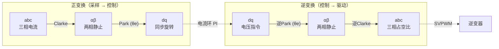

# MC-02：Clarke 与 Park 变换
## 坐标变换的核心——从三相交流到两相直流

## 难度
★★☆☆☆

## 适用对象
- FOC 初学者——从几何角度理解坐标变换的本质
- 嵌入式电机控制工程师——调试角度偏移、 Clarke/Park 实现差异
- 算法移植者——理解幅值不变 vs 功率不变的区别，避免跨平台移植出错

## 前置知识
- [MC-01](MC-01-PMSM-Model.md) — PMSM 三相坐标系与 dq 数学模型

## 核心摘要
坐标变换是 FOC 连接"现实世界"（三相交流）和"控制世界"（dq 直流）的桥梁。Clarke 变换将三相 abc 降维到两相 αβ，Park 变换将静止 αβ 旋转到与转子同步的 dq 系——使三相交流量变为直流量，从而可以用简单的 PI 控制器实现无静差电流跟踪。

---



> **定位**：不理解变换的几何含义，就不会调角度偏移、也不会诊断变换错误。
>
> **目标**：能从几何上解释 Clarke 和 Park 变换的每一行公式，并知道幅值不变 vs 功率不变的区别。

---

## 1. 物理直觉：为什么要变换

### 问题

三相 PMSM 的电压方程中，电感矩阵是转子位置 θe 的函数——它是时变的。要在时变系统上做实时控制非常困难。

### 解决思路

1. **Clarke 变换 (abc → αβ)**：把三个互差 120° 的静止绕组等效为两个互差 90° 的绕组。数学上就是把三维空间中的三个向量（abc）投影到二维平面（αβ）。信息量没有损失，因为三相电流受 KCL 约束，只有两个独立变量。

2. **Park 变换 (αβ → dq)**：让二维坐标系跟着转子一起旋转。在旋转坐标系中，原来以 ωe 频率旋转的正弦交流量变成了直流量——就像你坐在旋转木马上，周围的景物相对静止。

### 关键类比

- **Clarke** = "从三个基向量改为两个基向量"（降维）
- **Park** = "从静止照相机改为旋转照相机"（去耦）

最终效果：三相交流 PMSM 的控制 → 两个独立直流量的控制（Id 和 Iq）。

---

## 2. Clarke 变换：abc → αβ

### 2.1 幅值不变形式（lxfoc 使用）

$$ \begin{aligned} I_\alpha &= i_a \\ I_\beta &= \frac{2 i_b + i_a}{\sqrt{3}} \end{aligned} $$

**推导思路**：

- α 轴与 A 相轴线重合 → Iα = ia
- ib 和 ic 向 β 轴投影，利用 ia + ib + ic = 0 消去 ic：
  - ib 在 β 方向的投影 = ib × sin(60°) = ib × √3/2
  - ic 在 β 方向的投影 = ic × (-sin(60°)) = -ic × √3/2（C 轴在 β 轴负方向）
  - Iβ = √3/2 × (ib - ic) = √3/2 × (ib + ia + ib) = √3/2 × (ia + 2·ib)
  - 除以 √3/2 得到 (ia + 2·ib)/√3 的幅值不变结果...不对，让我重新推导。

**准确推导**：

Clarke 变换矩阵（幅值不变形式）：

$$ \begin{bmatrix} I_\alpha \\ I_\beta \end{bmatrix} = \frac{2}{3} \begin{bmatrix} 1 & -\frac{1}{2} & -\frac{1}{2} \\ 0 & \frac{\sqrt{3}}{2} & -\frac{\sqrt{3}}{2} \end{bmatrix} \begin{bmatrix} i_a \\ i_b \\ i_c \end{bmatrix} $$

展开第一行：Iα = (2/3) × (ia - ib/2 - ic/2)，利用 ia + ib + ic = 0 消去 ib 和 ic → Iα = ia。

展开第二行：Iβ = (2/3) × (√3/2 × ib - √3/2 × ic) = (1/√3) × (ib - ic)，利用 ia + ib + ic = 0 代入 ic → Iβ = (2·ib + ia) / √3。

**这样就和 lxfoc 代码中的实现完全一致了！**

### 2.2 功率不变形式（对比）

另外一个常见形式是功率不变 Clarke 变换，系数是 √(2/3) 而非 2/3：

$$ \begin{bmatrix} I_\alpha \\ I_\beta \end{bmatrix} = \sqrt{\frac{2}{3}} \begin{bmatrix} 1 & -\frac{1}{2} & -\frac{1}{2} \\ 0 & \frac{\sqrt{3}}{2} & -\frac{\sqrt{3}}{2} \end{bmatrix} \begin{bmatrix} i_a \\ i_b \\ i_c \end{bmatrix} $$

- **幅值不变**（lxfoc 选择）：相电流幅值 = √(Iα² + Iβ²) 的峰值，计算电流限幅时直观。
- **功率不变**：三相功率 = Vα·Iα + Vβ·Iβ，计算能量损耗时准确。

**实际影响**：如果混用两种形式，PI 增益会差一个系数（幅值不变 vs 功率不变差 √(2/3) ≈ 0.816），导致电流环响应偏差约 18%。

---

## 3. Park 变换：αβ → dq

### 3.1 正 Park 变换

$$ \begin{aligned} I_d &= I_\alpha \cos\theta_e + I_\beta \sin\theta_e \\ I_q &= -I_\alpha \sin\theta_e + I_\beta \cos\theta_e \end{aligned} $$

矩阵形式：
$$ \begin{bmatrix} I_d \\ I_q \end{bmatrix} = \begin{bmatrix} \cos\theta_e & \sin\theta_e \\ -\sin\theta_e & \cos\theta_e \end{bmatrix} \begin{bmatrix} I_\alpha \\ I_\beta \end{bmatrix} $$

**几何直觉**：这是标准的 2D 旋转矩阵（顺时针旋转 θe）。物理上相当于把静止的 αβ 坐标系"拉回到"与转子同步的旋转坐标系中。

### 3.2 逆 Park 变换（dq → αβ）

$$ \begin{aligned} V_\alpha &= V_d \cos\theta_e - V_q \sin\theta_e \\ V_\beta &= V_d \sin\theta_e + V_q \cos\theta_e \end{aligned} $$

即旋转矩阵的逆（逆时针旋转 θe），将 dq 电压指令还原到 αβ 静止坐标系，送给 SVPWM 模块。

### 3.3 角度约定

- θe = 0 时：d 轴与 α 轴（= A 相轴线）重合。即转子 N 极对准 A 相绕组。
- lxfoc 使用**归一化角度** [0, 1.0f) 对应 [0, 2π)。sin/cos 通过 64 段查表实现，避免 ISR 中调用浮点数学库。

---

## 4. 逆 Clarke 变换：αβ → abc

$$ \begin{aligned} v_a &= v_\alpha \\ v_b &= -\frac{1}{2} v_\alpha + \frac{\sqrt{3}}{2} v_\beta \\ v_c &= -\frac{1}{2} v_\alpha - \frac{\sqrt{3}}{2} v_\beta \end{aligned} $$

用途：从 αβ 电压恢复三相电压，用于死区补偿电流极性判断、电流重构或诊断。

---

## 5. 与 lxfoc 代码的对应关系

### Clarke 变换

```
transform/lxfoc_transform_clarke.h:9-31  →  结构体定义
    Iα = Ia
    Iβ = (2·Ib + Ia) / √3

transform/lxfoc_transform_clarke.c:38-42  →  实现
    c->ialpha = c->ia;
    c->ibeta = LXFOC_1_SQRT3 * (2.0f * c->ib + c->ia);
```

### 逆 Clarke 变换

```
transform/lxfoc_transform_clarke.h:73-82  →  结构体定义
transform/lxfoc_transform_clarke.c:81-93  →  实现
    Ua = Uα
    Ub = -0.5·Uα + (√3/2)·Uβ
    Uc = -0.5·Uα - (√3/2)·Uβ
```

### Park 变换

```
transform/lxfoc_transform_park.h    →  Park 与逆 Park
```

正 Park：
```
Id = Iα·cosθ + Iβ·sinθ
Iq = -Iα·sinθ + Iβ·cosθ
```

逆 Park：
```
Vα = Vd·cosθ - Vq·sinθ
Vβ = Vd·sinθ + Vq·cosθ
```

### 完整变换链

```
pipeline/lxfoc_pipeline_foc.h:110-114  →  FOC 管道
    input.ia/ib/ic → Clarke → Iαβ → Park → Idq → 电流环 → Udq
    → 逆Park → Uαβ → SVPWM → duty_a/b/c
```

---

## 6. 常见调试陷阱

### 6.1 幅值不变 vs 功率不变混用

**症状**：移植其他 FOC 库的 PI 增益时，电流环响应差 ~18%。

**原因**：ST MCSDK 使用功率不变形式，lxfoc/ODrive/VESC 使用幅值不变形式。移植 PI 参数时需要乘以 √(3/2) ≈ 1.225（功率不变→幅值不变）或除以该值（反之）。

### 6.2 Park 变换角度偏移

**症状**：电机带载后 Iq 不是零（对 SPMSM id=0 控制），表现为空载正常但加载后电流角度不对。

**原因**：编码器零位或霍尔安装偏差导致 θe 偏移了一个固定角。这个偏移角需要通过"角度自学习"（详见 [lxfoc_startup_offset.c](../../../lxfoc/startup/lxfoc_startup_offset.c)）来补偿。

### 6.3 Clarke 变换只用两相电流，未校验第三相

**症状**：电机能转但电流波形不对称，某相电流偏大。

**原因**：当某个电流传感器故障时，ia + ib + ic ≠ 0 的条件被破坏，但代码仍按两相电流计算。lxfoc 提供了 `lxfoc_transform_clarke_current_sum()` 函数做三相电流和的诊断。

### 6.4 角度归一化环绕处理

**症状**：角度从 359°→1° 越过 0° 时，位置环输出一个巨大的速度指令。

**原因**：Park 变换的输入角度需要处理周期性。lxfoc 使用归一化角度 [0, 1.0f)，在位置环中用 `shortest_path` 处理误差环绕。

---

## 7. 相关资料

- lxfoc: [lxfoc_transform_clarke.c](../../../lxfoc/transform/lxfoc_transform_clarke.c)（Clarke/逆Clarke 实现）
- lxfoc: [lxfoc_transform_park.h](../../../lxfoc/transform/lxfoc_transform_park.h)（Park/逆Park 实现）
- lxfoc: [lxfoc_pipeline_foc.c](../../../lxfoc/pipeline/lxfoc_pipeline_foc.c)（完整变换链路）
- 知识库: [ALG-01 FOC 理论](../algorithm/ALG-01-FOC-Theory.md)

---

## 交叉引用

| 关联模块 | 方向 | 维度 |
|---------|------|------|
| [MC-01 PMSM 模型](MC-01-PMSM-Model.md) | 前置 | 三相坐标系与 dq 方程 |
| [ALG-01 FOC 理论](../algorithm/ALG-01-FOC-Theory.md) | 后置 | 变换在 FOC 框架中的角色 |
| [MC-03 空间矢量](MC-03-Space-Vector.md) | 后置 | αβ 电压矢量的几何含义 |
| [MC-04 FOC 信号链](MC-04-FOC-Signal-Chain.md) | 后置 | 变换链的完整工程实现 |

> 📝 检验你的理解：[MC-02-assessment](MC-MC-02-assessment.md)
