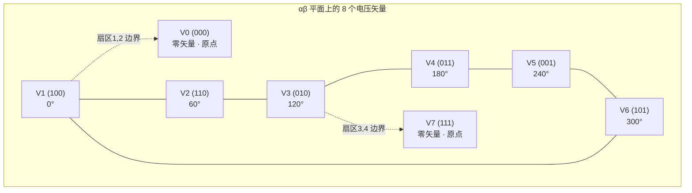

# MC-03：空间矢量概念
## 八个矢量如何合成任意电压——空间矢量调制的几何基础

## 难度
★★★☆☆

## 适用对象
- FOC 算法工程师——理解 SVPWM 的几何原理与扇区划分
- 嵌入式开发者——调试 PWM 占空比映射与过调制问题
- 电力电子工程师——理解逆变器开关状态与电压矢量的对应关系

## 前置知识
- [MC-02](MC-02-Clarke-Park.md) — Clarke 变换与 αβ 平面

## 核心摘要
空间矢量是理解 SVPWM 的钥匙。三相逆变器的 8 种开关状态在 αβ 平面上映射为 6 个非零矢量和 2 个零矢量，构成正六边形。SVPWM 通过相邻矢量的时间加权平均来合成任意方向的参考电压矢量，其本质就是"伏秒平衡"在二维平面上的应用。

---



> **定位**：只有理解了"三相交流量如何等效为一个旋转矢量"，才能理解为什么 SVPWM 控制的是电压矢量的幅值和角度。
>
> **目标**：理解空间矢量的定义、6 个基本电压矢量和 2 个零矢量的几何排列、以及为什么 SVPWM 本质上是"用相邻矢量的时间加权平均来合成任意方向矢量"。

---

## 1. 物理直觉：三相正弦波 = 一个旋转矢量

### 1.1 三相绕组的空间排列

考虑 PMSM 的定子：

- A 相绕组轴线指向 0° 方向
- B 相绕组轴线指向 120° 方向
- C 相绕组轴线指向 240°（或 -120°）方向

向这三相绕组通入：
$$ \begin{aligned} i_a(t) &= I_m \cos(\omega t) \\ i_b(t) &= I_m \cos(\omega t - 120^\circ) \\ i_c(t) &= I_m \cos(\omega t + 120^\circ) \end{aligned} $$

### 1.2 合成磁动势（MMF）

每个绕组产生的 MMF 方向沿该绕组轴线，幅值正比于电流。将三相 MMF 向量相加：

$$ \vec{F} = N_s [i_a \cdot \vec{1}_a + i_b \cdot \vec{1}_b + i_c \cdot \vec{1}_c] $$

其中 $\vec{1}_a, \vec{1}_b, \vec{1}_c$ 是三个单位方向向量（互差 120°）。

**关键结果**：合成 MMF 是一个以 ω 角速度旋转的**恒定幅值矢量**！

### 1.3 为什么叫"空间矢量"

因为这个矢量存在于电机的物理空间（αβ 平面）中：
- 矢量的**方向** = 定子磁动势的方向 = 转子被拉拽的方向
- 矢量的**幅值** = 磁场强度
- 矢量的**角速度** = 电流频率 × 2π

---

## 2. 空间矢量在 αβ 平面上的表示

经过 Clarke 变换（幅值不变形式，详见 [MC-02](MC-02-Clarke-Park.md)）后，三相电流映射为 αβ 平面上的一个点：

$$ \begin{bmatrix} I_\alpha \\ I_\beta \end{bmatrix} = \frac{2}{3} \begin{bmatrix} 1 & -\frac{1}{2} & -\frac{1}{2} \\ 0 & \frac{\sqrt{3}}{2} & -\frac{\sqrt{3}}{2} \end{bmatrix} \begin{bmatrix} i_a \\ i_b \\ i_c \end{bmatrix} $$

空间矢量：$\vec{I_s} = I_\alpha + j I_\beta$

其幅值 $|\vec{I_s}| = \sqrt{I_\alpha^2 + I_\beta^2}$，角度 $\theta_s = \text{atan2}(I_\beta, I_\alpha)$。

三相正弦电流 → 在 αβ 平面上的轨迹是一个**圆**。

---

## 3. 逆变器的 8 个基本电压矢量

### 3.1 三相两电平逆变器

逆变器有三个桥臂（A、B、C），每个桥臂有两种状态：
- 上管导通、下管关断 → 该相输出 = Vbus（记作状态 1）
- 上管关断、下管导通 → 该相输出 = 0（记作状态 0）

三个桥臂共有 2³ = 8 种组合。

### 3.2 8 个电压矢量

| 开关状态 (ABC) | 矢量名称 | Vα | Vβ | 幅值 |
|:---:|---|------|------|------|
| 000 | V0（零矢量） | 0 | 0 | 0 |
| 100 | V1 | 2/3 Vbus | 0 | 2/3 Vbus |
| 110 | V2 | 1/3 Vbus | √3/3 Vbus | 2/3 Vbus |
| 010 | V3 | -1/3 Vbus | √3/3 Vbus | 2/3 Vbus |
| 011 | V4 | -2/3 Vbus | 0 | 2/3 Vbus |
| 001 | V5 | -1/3 Vbus | -√3/3 Vbus | 2/3 Vbus |
| 101 | V6 | 1/3 Vbus | -√3/3 Vbus | 2/3 Vbus |
| 111 | V7（零矢量） | 0 | 0 | 0 |

### 3.3 六个扇区

将 αβ 平面按 60° 一格分为 6 个扇区，每个扇区边界由两个相邻的基本矢量定义：

```
      V3(010)          V2(110)
           \   扇区3   /
            \         /
   扇区4     \       /     扇区2
              \     /
               \   /
     V4(011)----●----V1(100)
               /   \
              /     \
   扇区5     /       \     扇区1
            /         \
           /   扇区6    \
      V5(001)          V6(101)
```

**中心点**是 V0(000) 和 V7(111)，六个基本矢量 V1~V6 构成一个正六边形。

### 3.4 线性调制区

线性调制区 = 六边形的内切圆。内切圆半径 = Vbus / √3。

$$ |V_{ref}|_{max} = \frac{V_{bus}}{\sqrt{3}} \approx 0.577 \times V_{bus} $$

对应线电压幅值 = Vbus（幅值不变形式下，线电压峰值 = 直流母线电压）。

---

## 4. 空间矢量合成原理

### 4.1 核心思想

任意一个参考电压矢量 $\vec{V}_{ref}$ 都可以用其所在扇区的两个相邻基本矢量（如 V1 和 V2，如果 $\vec{V}_{ref}$ 在第 1 扇区）各作用一段时间 + 零矢量填充剩余时间来合成：

$$ \vec{V}_{ref} \cdot T_s = \vec{V}_1 \cdot T_1 + \vec{V}_2 \cdot T_2 + \vec{V}_{0/7} \cdot T_0 $$

约束：$T_1 + T_2 + T_0 = T_s$（一个 PWM 周期）

### 4.2 伏秒平衡

这本质上是一个**时间加权平均**——控制 V1 和 V2 的相对作用时间，就能控制合成矢量的角度；控制零矢量的占比，就能控制合成矢量的幅值。

### 4.3 七段式 vs 五段式

- **七段式**（对称 PWM）：V0 → V1 → V2 → V7 → V2 → V1 → V0
  - 优点：开关损耗平均（中间换零矢量），谐波分布优
  - 缺点：开关次数多（每周期 6 次切换），开关损耗大
- **五段式**：V0/V7 → V1 → V2 → V1 → V0/V7
  - 优点：每周期 4 次切换，开关损耗低 1/3
  - 缺点：有一相不开关时，电流采样窗口受限

lxfoc 在高调制深度时自动从七段式切到五段式（`LXFOC_SVPWM_FIVE_SEG_THRESHOLD_DEFAULT = 0.9`）。

---

## 5. 与 lxfoc 代码的对应关系

### 扇区判断

```
transform/lxfoc_transform_svpwm.c:118-143  →  扇区计算法
    中间变量: Utmp1 = √3·Uβ/Vbus
             Utmp2 = 0.5·(3·Uα/Vbus - Utmp1)
             Utmp3 = 0.5·(-3·Uα/Vbus - Utmp1)
    扇区码 = Utmp1>0 ? 1 : 0
           + Utmp2>0 ? 2 : 0
           + Utmp3>0 ? 4 : 0
    然后查表映射到扇区1-6
```

### T1, T2, T0 计算

同一文件中的 `_svpwm_run_sector()` 函数，根据扇区码选择对应的 T1/T2 计算路径。

### 占空比映射

使用 `lxfoc_svpwm_txyz_table` 查找表将 T1/T2/T0 映射到三相占空比 duty_a/b/c。

---

## 6. 常见调试陷阱

### 6.1 零矢量选择导致电流采样不可检测

**症状**：低调制深度时电流波形噪声大，偶尔出现电流跳变。

**原因**：在某个扇区中，某相占空比接近 100% 或 0% 时，该相的电流采样窗口（下桥臂导通时间）太短，ADC 来不及完成采样。

**对策**：lxfoc 支持五段式 PWM 切换（通过 `use_five_segment` 标志），确保每相有足够的采样窗口。也可通过 [lxfoc_sampling_pwm_adapt.c](../../../lxfoc/sampling/lxfoc_sampling_pwm_adapt.c) 自适应调整。

### 6.2 过调制区矢量畸变

**症状**：加速后电机电流畸变、转矩波动大，但在低速时正常。

**原因**：调制深度超过 1.0 后，参考电压矢量超出六边形，简单缩放会导致角度畸变。lxfoc 实现了 Holtz 两段过调制（Mode1: 角度保持+幅值缩放，Mode2: 角度保持+趋近六步换相）。

### 6.3 基本矢量幅值因子搞错

**症状**：调制深度计数值看起来合理但实际输出电压偏低约 13%。

**原因**：基本矢量幅值在 Clarke 变换取幅值不变时为 2/3 Vbus，在功率不变时为 √(2/3) Vbus。如果 SVPWM 和 Clarke 变换的约定不一致，会导致调制深度计算偏差。

---

## 7. 相关资料

- lxfoc: [lxfoc_transform_svpwm.c](../../../lxfoc/transform/lxfoc_transform_svpwm.c)（SVPWM 完整实现）
- lxfoc: [lxfoc_math_svpwm_table.h](../../../lxfoc/math/lxfoc_math_svpwm_table.h)（扇区映射查找表）
- 知识库: [ALG-04 死区补偿](../algorithm/ALG-04-Deadtime-Compensation.md)、[MC-05 两电平 SVPWM 详细推导](MC-05-SVPWM-2Level.md)

---

## 交叉引用

| 关联模块 | 方向 | 维度 |
|---------|------|------|
| [MC-02 Clarke/Park 变换](MC-02-Clarke-Park.md) | 前置 | αβ 平面的数学基础 |
| [MC-05 两电平 SVPWM](MC-05-SVPWM-2Level.md) | 后置 | 详细的扇区判断与占空比推导 |
| [ALG-04 死区补偿](../algorithm/ALG-04-Deadtime-Compensation.md) | 后置 | 电压矢量误差补偿 |
| [MC-04 FOC 信号链](MC-04-FOC-Signal-Chain.md) | 后置 | SVPWM 在完整 FOC 管道中的位置 |

> 📝 检验你的理解：[MC-03-assessment](MC-MC-03-assessment.md)
