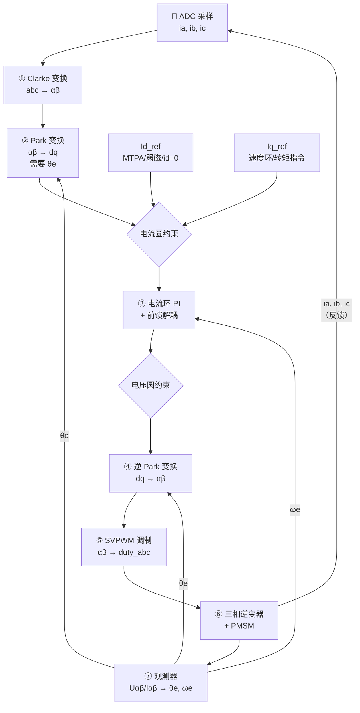

# MC-04：FOC 完整信号链路 —— 端到端走通一遍
## 从ADC采样到PWM输出——FOC全链路数据流

## 难度
★★★☆☆

## 适用对象
- 已学完 MC-01~MC-03、希望将零散知识串成完整信号链的开发者
- 需要在脑海中"过一遍"FOC 全流程的调试工程师
- 准备对接 lxfoc 代码、理解 pipeline 调用顺序的软件工程师

## 前置知识
- [MC-01](../motion-control/MC-01-PMSM-Model.md) — PMSM dq 数学模型
- [MC-02](../motion-control/MC-02-Clarke-Park.md) — Clarke/Park 坐标变换
- [MC-03](../motion-control/MC-03-Space-Vector.md) — 空间矢量基础概念

## 核心摘要
本文将 MC-01~MC-03 的知识串成一条完整的 FOC 信号链路：从 ADC 采样三相电流，经过 Clarke→Park→电流环 PI+前馈解耦→逆 Park→SVPWM，最终输出 PWM 占空比驱动逆变器。观测器提供角度反馈，形成完整闭环。读完本文后，你应该能在脑海中画出端到端的 FOC 数据流框图。

---



---

## 1. 总体框图

```
                    ┌─────────────────────────────────────────┐
                    │              电流传感器（ADC）             │
                    │         ia, ib, ic → 三相电流 (A)          │
                    └──────────────┬──────────────────────────┘
                                   │
                    ┌──────────────▼──────────────────────────┐
                    │         ① Clarke 变换 (abc → αβ)          │
                    │          Iα = ia                          │
                    │          Iβ = (2·ib + ia) / √3            │
                    └──────────────┬──────────────────────────┘
                                   │  Iα, Iβ
                    ┌──────────────▼──────────────────────────┐
                    │         ② Park 变换 (αβ → dq)             │
                    │          Id = Iα·cosθ + Iβ·sinθ           │
                    │          Iq = -Iα·sinθ + Iβ·cosθ          │
                    │          需要: θe (来自观测器/编码器)       │
                    └──────────────┬──────────────────────────┘
                                   │  Id_meas, Iq_meas
              ┌────────────────────┼────────────────────┐
              │ Id_ref (d轴参考)    │                    │ Iq_ref (q轴参考)
              │ 来自: MTPA/弱磁/id=0│                    │ 来自: 速度环/转矩指令
              └────────────────────┼────────────────────┘
                    ┌──────────────▼──────────────────────────┐
                    │        ③ 电流环 PI + 前馈解耦              │
                    │    Ud = PI(Id_err) - ωe·Lq·Iq_meas       │
                    │    Uq = PI(Iq_err) + ωe·(Ld·Id_meas + ψ) │
                    │    含: 抗积分饱和, 电流圆约束                │
                    └──────────────┬──────────────────────────┘
                                   │  Ud_out, Uq_out
                    ┌──────────────▼──────────────────────────┐
                    │        ④ 逆 Park 变换 (dq → αβ)           │
                    │    Uα = Ud·cosθ - Uq·sinθ                │
                    │    Uβ = Ud·sinθ + Uq·cosθ                │
                    └──────────────┬──────────────────────────┘
                                   │  Uα, Uβ
                    ┌──────────────▼──────────────────────────┐
                    │         ⑤ SVPWM 调制                      │
                    │    扇区判断 → T1,T2,T0 → 占空比            │
                    │    过调制Mode1/Mode2 (可选)                │
                    │    死区补偿 (可选)                         │
                    └──────────────┬──────────────────────────┘
                                   │  duty_a, duty_b, duty_c [0,1]
                    ┌──────────────▼──────────────────────────┐
                    │          ⑥ 三相逆变器 + PMSM               │
                    │    占空比 → PWM波形 → 相电压 → 相电流       │
                    └──────────────┬──────────────────────────┘
                                   │  ia, ib, ic (实际值)
                                   │  回到 ADC → 闭环
                                   │
                    ┌──────────────▼──────────────────────────┐
                    │        ⑦ 观测器 (无感 FOC 时)              │
                    │    Uαβ/Iαβ → 电流观测器 → EMF → PLL → θe  │
                    │    θe 反馈给 ② 和 ④ 使用                   │
                    └─────────────────────────────────────────┘
```

---

## 2. 逐环节展开

### 2.1 ADC 采样（起点）

输入：三相电流传感器（分流电阻 + 运放，或霍尔电流传感器）
输出：ia, ib, ic（单位 A）

**时序关键点**：采样点应选在 PWM 周期中点（下桥臂全部导通时），此时开关噪声最小。详见 [MC-11](../motion-control/MC-11-PWM-Sampling-Timing.md)。

### 2.2 Clarke 变换

将三相静止量转为两相静止量。详见 [MC-02](../motion-control/MC-02-Clarke-Park.md)。

> lxfoc 代码对应：`transform/lxfoc_transform_clarke.c:38-42`

### 2.3 Park 变换

将静止 αβ 量旋转到与转子同步的 dq 坐标系。这是 FOC "去耦" 的核心环节。详见 [MC-02](../motion-control/MC-02-Clarke-Park.md)。

> lxfoc 代码对应：`transform/lxfoc_transform_park.c`

### 2.4 电流环（控制核心）

**目标**：使 Id 和 Iq 分别跟踪各自的参考值。

**为什么需要前馈解耦**：在 dq 电压方程中，Ud 不仅受 Id 变化影响，还受 Iq×ωe 影响（耦合项 -ωe·Lq·Iq），Uq 也同样。如果只用 PI 分别控制 Id 和 Iq，在大转速下耦合项会成为大扰动，PI 追不过来。

解耦策略（前馈补偿）：在 PI 输出基础上，直接加上耦合项的估计值。

**电流圆约束**：√(Id_ref² + Iq_ref²) ≤ Imax，当 Iq_ref 超过此限时，优先保证 d 轴（弱磁策略）或等比例缩放。

**电压圆约束**：√(Ud² + Uq²) ≤ Vbus/√3（线性调制区上界），当 Uq_ref 超过此限时，优先保证 d 轴电压。

详见 [MC-06](../motion-control/MC-06-Current-Loop.md)。

> lxfoc 代码对应：`control/lxfoc_control_current.{h,c}`

### 2.5 逆 Park 变换

将 dq 电压指令还原为 αβ 电压，送给 SVPWM。

### 2.6 SVPWM 调制

将 αβ 电压映射为三相 PWM 占空比。详见 [MC-05](../motion-control/MC-05-SVPWM-2Level.md)。

算法选择：
- 扇区计算法（默认）：传统七段式/五段式，适合需要精确控制零矢量分配的场景。
- 零序注入法：代码更简洁，计算量更小，适合不需要精确控制零矢量的场景。

> lxfoc 代码对应：`transform/lxfoc_transform_svpwm.{h,c}`

### 2.7 观测器（反馈回路）

无感 FOC 中，观测器承担角度和速度的估计任务。输入 Uαβ（电压指令）和 Iαβ（测量电流），输出 θe（估算角度）和 ωe（估算速度）。详见 [MC-08](../motion-control/MC-08-Sensorless-Observers.md)。

---

## 3. 数据流中的单位约定

lxfoc 全库统一的单位约定：

| 物理量 | 单位 | 说明 |
|--------|------|------|
| 电流 (ia, ib, ic, id, iq) | A | 安培，瞬时值 |
| 电压 (ud, uq, uα, uβ) | V | 伏特 |
| 角度 (θe) | 归一化 [0, 1.0f) | 对应 [0, 2π) |
| 电速度 | Hz | 电频率（非机械频率） |
| 电角速度 (ωe) | rad/s | 电流环前馈解耦使用 |
| 机械角速度 (ωm) | rad/s | ωm = ωe / pole_pairs |
| 占空比 (duty) | [0, 1] | 0=全关，1=全开 |
| 母线电压 (Vbus) | V | 直流母线 |
| PWM周期 (ts) | s | 如 20kHz → 50μs |
| 死区时间 (dead_time) | s | 如 300ns → 3e-7 |

---

## 4. 与 lxfoc FOC 管道的对应关系

`pipeline/lxfoc_pipeline_foc.{h,c}` 封装了完整的 FOC 变换链，提供两种运行模式：

### `run_current`（完整电流闭环）

```
输入 Ia,Ib,Ic + θe + Id_ref,Iq_ref
→ Clarke → Park → 电流环PI+前馈 → 逆Park → SVPWM → 占空比输出
```

代码中的实际调用顺序：
```
lxfoc_pipeline_foc_run_current()
  ├── 输入清洗 (NaN/Inf检查, 新鲜度检测)
  ├── sin/cos计算 (基于 θe 查表)
  ├── Clarke: Iαβ = f(ia, ib, ic)
  ├── Park: Idq = f(Iαβ, sinθ, cosθ)
  ├── 电流环PI + 前馈解耦
  ├── 逆Park: Uαβ = f(Udq, sinθ, cosθ)
  └── SVPWM: duty_abc = f(Uαβ)
```

### `run_voltage`（开环电压模式）

```
输入 Uα,Uβ + Ia,Ib,Ic
→ Clarke → SVPWM → 占空比输出 (跳过Park和电流环)
```

用于 V/F 启动或调试场景。

---

## 5. 常见调试陷阱

### 5.1 数据流方向搞反

**症状**：电机电流失控，PI 输出振荡。

**原因**：逆 Park 输出的 Uα/Uβ 和正 Park 输入的 Iα/Iβ 必须使用**同一个 θe**。如果观测器输出给 Park 的角度和在逆 Park 之前更新了（两个控制周期的时间差），会导致相位误差，等效于引入了一个频率相关的相位滞后。

### 5.2 角度新鲜度问题

**症状**：高速运转时电流失真比低速时更严重。

**原因**：角度在每个控制周期只更新一次。如果电流环在 ISR 中运行，但角度在另一个中断（如编码器定时器溢出）中更新，且两者不锁步，就会产生抖动。

**lxfoc 策略**：pipeline 使用 `sample_counter` 做新鲜度检测——如果本周期 ADC 样本计数未更新，则跳过控制（`sample_stale_fault`）。

### 5.3 饱和传播

**症状**：电压指令在过调制区钳位后，耦合项 -ωe·Lq·Iq 过大导致 PI 积分器饱和。

**原因**：过调制时实际输出电压小于指令电压，但 PI 积分器仍按指令误差累积。

**lxfoc 策略**：电流环 PI 使用抗积分饱和（back-calculation），`kc` 参数控制饱和后的回算速率。

---

## 6. 相关资料

- lxfoc: `pipeline/lxfoc_pipeline_foc.{h,c}`（FOC 管道主结构体）
- lxfoc: `control/lxfoc_control_current.{h,c}`（电流环实现）
- lxfoc: `transform/lxfoc_transform_clarke.{h,c}`（Clarke 变换）
- lxfoc: `transform/lxfoc_transform_park.{h,c}`（Park 变换）
- lxfoc: `transform/lxfoc_transform_svpwm.{h,c}`（SVPWM 调制）

---

## 交叉引用

| 关联模块 | 方向 | 维度 |
|---------|------|------|
| [ALG-01](../algorithm/ALG-01-FOC-Theory.md) — Clarke 变换算法 | 下游调用 | 坐标变换 |
| [ALG-02](../algorithm/ALG-02-Current-Sampling-Timing.md) — Park 变换算法 | 下游调用 | 坐标变换 |
| [ALG-03](../algorithm/ALG-03-PI-Current-Regulator.md) — PI 电流调节器与解耦限幅 | 下游调用 | 控制算法 |
| [ALG-04](../algorithm/ALG-04-Deadtime-Compensation.md) — SVPWM 调制算法 | 下游调用 | 调制策略 |
| [MC-01](../motion-control/MC-01-PMSM-Model.md) — PMSM dq 数学模型 | 理论基础 | 电机建模 |
| [MC-02](../motion-control/MC-02-Clarke-Park.md) — Clarke/Park 坐标变换 | 理论基础 | 坐标变换 |
| [MC-03](../motion-control/MC-03-Space-Vector.md) — 空间矢量基础 | 理论基础 | 空间矢量 |
| [MC-05](../motion-control/MC-05-SVPWM-2Level.md) — 两电平 SVPWM | 下游展开 | 调制实现 |
| [MC-06](../motion-control/MC-06-Current-Loop.md) — 电流环设计 | 下游展开 | 控制环路 |

> 📝 检验你的理解：[MC-04-assessment](../motion-control/MC-04-assessment.md)
