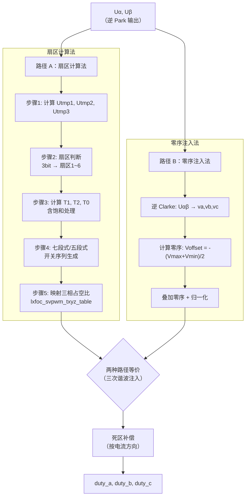

# MC-05：两电平 SVPWM —— 从电压矢量到 PWM 占空比
## 扇区计算法与零序注入法——两种SVPWM实现路径

## 难度
★★★☆☆

## 适用对象
- 理解空间矢量概念后、需要实现 SVPWM 调制的嵌入式开发者
- 需要在七段式/五段式之间做选择、理解死区补偿原理的调试工程师
- 准备实现过调制策略以提升电压利用率的研究者

## 前置知识
- [MC-03](../motion-control/MC-03-Space-Vector.md) — 空间矢量基础概念

## 核心摘要
SVPWM 是 FOC 的"最后一步"——将 dq 坐标系下的电压指令转换为 6 路 PWM 信号。SVPWM 比 SPWM 的直流母线利用率高 15.47%（Vbus/√3 vs Vbus/2），这也是为什么 SVPWM 是 FOC 的标准调制方式。本文详解扇区计算法（5 步流程）与零序注入法两条实现路径，并覆盖过调制和死区补偿。

---



---

## 1. 回顾：我们已经有了什么

从电流环出来的是 Ud 和 Uq。经过逆 Park 变换得到 Uα 和 Uβ。这相当于在 αβ 平面上有了一个参考电压矢量：

$$ \vec{V}_{ref} = U_\alpha + j U_\beta $$

$$ |\vec{V}_{ref}| = \sqrt{U_\alpha^2 + U_\beta^2}, \quad \theta = \text{atan2}(U_\beta, U_\alpha) $$

现在的问题：如何用三相逆变器产生这个矢量？

---

## 2. 扇区计算法（lxfoc 默认）

### 2.1 步骤 1：计算中间变量

$$ \begin{aligned} U_{tmp1} &= \frac{\sqrt{3} \cdot U_\beta}{V_{bus}} \\ U_{tmp2} &= \frac{1}{2}\left(\frac{3 U_\alpha}{V_{bus}} - U_{tmp1}\right) \\ U_{tmp3} &= \frac{1}{2}\left(-\frac{3 U_\alpha}{V_{bus}} - U_{tmp1}\right) \end{aligned} $$

### 2.2 步骤 2：扇区判断

```c
sector_code = 0;
if (Utmp1 > 0) sector_code += 1;
if (Utmp2 > 0) sector_code += 2;
if (Utmp3 > 0) sector_code += 4;

// 然后查表映射到实际扇区号 1-6：
sector_code: 3→扇区1, 1→扇区2, 5→扇区3, 4→扇区4, 6→扇区5, 2→扇区6
```

**几何直觉**：Utmp1、Utmp2、Utmp3 分别是 Uref 在三个特定方向上的投影符号，这三个方向恰好将平面分成 6 个 60° 区域。

> lxfoc 代码对应：`transform/lxfoc_transform_svpwm.c:118-143`

### 2.3 步骤 3：计算 T1, T2

T1 和 T2 是两个相邻基本矢量的作用时间（以 Ts 归一化，Ts = 1 个 PWM 周期）：

| 扇区 | T1 | T2 |
|------|-----|-----|
| 1 | Utmp2 | Utmp1 |
| 2 | -Utmp2 | -Utmp3 |
| 3 | Utmp1 | Utmp3 |
| 4 | -Utmp1 | -Utmp2 |
| 5 | Utmp3 | Utmp2 |
| 6 | -Utmp3 | -Utmp1 |

零矢量时间：T0 = 1 - T1 - T2

**饱和处理**：若 T1 + T2 > 1，则按比例缩小：
$$ T_1' = \frac{T_1}{T_1 + T_2}, \quad T_2' = \frac{T_2}{T_1 + T_2} $$
此时 T0 = 0，参考矢量被钳位到六边形边界。

### 2.4 步骤 4：七段式/五段式切换

**七段式**（对称 PWM，`_five_flag_real = 0`）：
```
Txyz[2] = 0.5 * (1 - T1 - T2)     ← T0前半
Txyz[1] = Txyz[2] + T2            ← T0前半 + T2
Txyz[0] = Txyz[1] + T1            ← T0前半 + T2 + T1
```
开关序列（扇区1为例）：V0(000) → V1(100) → V2(110) → V7(111) → V2 → V1 → V0

**五段式**（`_five_flag_real = 1`）：
```
Txyz[0] = T1 + T2
Txyz[1] = T2
Txyz[2] = 0
```
开关序列（扇区1）：V1(100) → V2(110) → V7(111) → V2 → V1
（有一相始终不开关，开关损耗降低约 1/3）

**切换逻辑**：
- 进入五段式：调制深度 ≥ `five_segment_threshold`（默认 0.9），且零矢量时间 T0 < 0.15
- 退出五段式：调制深度 < 阈值，自动退出（无迟滞，避免频繁切换）

> lxfoc 代码对应：`transform/lxfoc_transform_svpwm.c:150-195`

### 2.5 步骤 5：映射到三相占空比

使用 `lxfoc_svpwm_txyz_table` 查找表，将 {Txyz[0], Txyz[1], Txyz[2]} 按扇区码映射为 {duty_a, duty_b, duty_c}。

这个表实质上是一个排列矩阵，根据扇区把"T_sum, T_sum-T1, 0"这三个值分配到三相的占空比寄存器中。

---

## 3. 零序注入法（备用方案）

### 3.1 算法流程

1. **逆 Clarke**：从 Uα/Uβ 得到三相电压 va, vb, vc
2. **计算零序分量**：Voffset = -(Vmax + Vmin) / 2
3. **叠加零序**：Va' = Va + Voffset, Vb' = Vb + Voffset, Vc' = Vc + Voffset
4. **归一化为占空比**：Dx = Vx' / Vbus + 0.5

### 3.2 数学等价性

**三次谐波注入法 = 中点平移法 = 最大最小值法**，三者完全等价：

- **时域视角**（中点平移）：零序分量将三相电压的中点从 0 平移到某个值，使得最小占空比接近 0、最大占空比接近 1，充分利用母线电压。
- **频域视角**（三次谐波注入）：零序分量恰好是幅值为基波 1/6 的三次谐波，注入后使调制波的峰值降低，允许更高基波幅值。

> lxfoc 代码对应：`transform/lxfoc_transform_svpwm.c:72-117`（`_svpwm_run_zero_seq`）

### 3.3 两种方法的优劣

| | 扇区计算法 | 零序注入法 |
|---|---|---|
| 代码量 | 较大（约 200 行） | 较小（约 50 行） |
| 计算量 | 略高（分支多） | 低（几乎无分支） |
| T1/T2/T0 可见性 | 显式可控 | 隐式不可见 |
| 零矢量分配 | 可精确对称分配 | 自然对称 |
| 适用场景 | 需要诊断矢量时间 | 简洁优先 |

---

## 4. 过调制

### 4.1 为什么要过调制

线性区最大输出电压 = Vbus/√3 ≈ 0.577 Vbus（相电压峰值）。当所需电压超过这个值：
- **不使能过调制**：简单缩放幅值（最小相位误差法），角度不变但幅值不足。
- **使能过调制**：利用六边形区域（内切圆之外、六边形之内），直到趋近六步换相。

### 4.2 Mode1（角度保持 + 幅值缩放）

调制深度：1.0 < m < 1.1547（理论值，lxfoc 用 0.907~0.952）

保持参考角度不变，将幅值缩放到六边形边界。优点是角度连续无畸变，缺点是幅值不能达到理论最大值。

### 4.3 Mode2（角度保持 + 趋近六步换相）

调制深度：> 0.952（lxfoc 阈值）

在扇区边缘区域（靠近六边形顶点），将角度"锁定"到顶点方向（保持角 α_hold），模拟六步换相行为。随着调制深度增大，保持角从 0° 增大到 30°，最终达到六拍方波。

> lxfoc 代码对应：`transform/lxfoc_transform_svpwm.c:overmod_overmodulate()`

---

## 5. 死区补偿

### 5.1 物理原因

为防止上下管直通（shoot-through），上下管不能同时导通。在上下管切换时插入一段"两者都关"的时间（死区时间，典型值 200-500ns）。这导致实际输出 PWM 比理想 PWM 每边向中心缩入一个死区。

### 5.2 补偿策略

根据电流方向调整占空比：
- 电流 > 0（流出逆变器 → 上管续流有效）：实际电压偏低 → 增加占空比
- 电流 < 0（流入逆变器 → 下管续流有效）：实际电压偏高 → 减少占空比
- |电流| < 阈值（过零点附近）：不补偿，避免抖动

补偿量 = dead_time / Ts（死区时间占 PWM 周期的比例）。

> lxfoc 代码对应：`transform/lxfoc_transform_svpwm.c:29-43`（`_svpwm_deadtime_comp`）

---

## 6. 与 lxfoc 代码的完整对应

```
transform/lxfoc_transform_svpwm.h:44-123  →  结构体定义（所有配置和输出字段）
transform/lxfoc_transform_svpwm.c:
  29-43   → _svpwm_deadtime_comp()         死区补偿
  72-117  → _svpwm_run_zero_seq()          零序注入法
  118-196 → _svpwm_run_sector()            扇区计算法
  198-222 → lxfoc_transform_svpwm_init()   初始化
  224-254 → lxfoc_transform_svpwm_reset()  复位
  256-310 → lxfoc_transform_svpwm_run()    主运行（路由 + 死区 + 限幅）
  312-582 → lxfoc_transform_svpwm_overmodulate()  过调制
```

---

## 7. 常见调试陷阱

### 7.1 死区设置过大

**症状**：低速轻载时电流畸变明显（近似正弦失真），高速运行时正常。

**原因**：死区时间 300ns 在 20kHz 下占 0.6%，影响不大；但如果死区设成 2μs（如用低速光耦栅极驱动），占比 4%，在低电流（过零点附近不补偿的区域扩大）时畸变显著。

### 7.2 零序注入法在非对称负载下有问题

**症状**：三相电压中某相偏大或偏小（非对称），功率损耗不平衡。

**原因**：零序注入法假定三相完全对称。如果电机三相绕组不对称（匝间短路/老化），零序注入后的电压分配可能不均匀。此时扇区计算法更安全。

### 7.3 过调制 Mode2 角度抖动

**症状**：电机在高速过调制区运行时，转矩有周期性脉动，频率为电频率 × 6。

**原因**：Mode2 在六边形顶点附近"锁角度"的动作会产生角度不连续。lxfoc 用的插值策略（按 overmod_index 线性增加 α_hold）比硬切换更平滑，但仍有一定脉动。如果对转矩脉动敏感，建议限制调制深度在 Mode1 以内。

---

## 8. 相关资料

- lxfoc: `transform/lxfoc_transform_svpwm.{h,c}`（SVPWM 完整实现，582 行）
- lxfoc: `math/lxfoc_math_svpwm_table.h`（扇区映射查找表）
- 经典参考: D. G. Holmes & T. A. Lipo, *Pulse Width Modulation for Power Converters*

---

## 交叉引用

| 关联模块 | 方向 | 维度 |
|---------|------|------|
| [ALG-04](../algorithm/ALG-04-Deadtime-Compensation.md) — SVPWM 调制算法 | 下游展开 | 调制算法 |
| [ALG-10](../algorithm/ALG-10-Overmodulation.md) — 过调制策略 | 下游展开 | 调制策略 |
| [PP-09](../power-path/PP-09-Three-Level-SVPWM.md) — 三电平 SVPWM | 横向扩展 | 多电平调制 |
| [MC-03](../motion-control/MC-03-Space-Vector.md) — 空间矢量基础 | 理论基础 | 空间矢量 |

> 📝 检验你的理解：[MC-05-assessment](../motion-control/MC-05-assessment.md)
