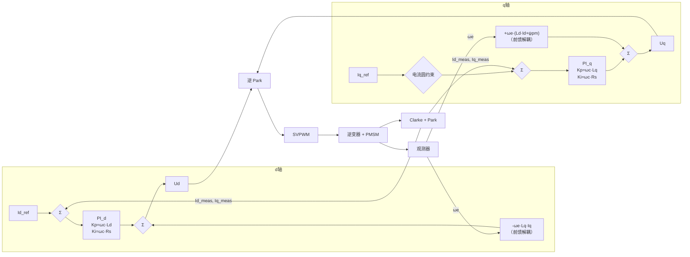

# MC-06：电流环设计与离散化
## 前馈解耦与PI参数设计——电流环的核心技术

## 难度
★★★☆☆

## 适用对象
- 需要从零设计电流环 PI 参数的控制算法工程师
- 在高速运行时遇到电流振荡、需要前馈解耦调试的嵌入式开发者
- 准备将 Simulink 仿真结果部署到 MCU、需要理解离散化陷阱的研究者

## 前置知识
- [MC-01](../motion-control/MC-01-PMSM-Model.md) — PMSM dq 数学模型（电压方程）
- [MC-04](../motion-control/MC-04-FOC-Signal-Chain.md) — FOC 完整信号链路

## 核心摘要
电流环是 FOC 的"最内环"，决定了系统对转矩指令的跟踪速度和抗扰动能力。核心技术包括：前馈解耦（消除 dq 轴耦合项对 PI 的扰动）、PI 参数设计（零极点对消法从 L/R 到 Kp/Ki）、以及离散化陷阱（Ts 遗漏导致仿真与实物偏差万倍）。电流环调不好，速度环和位置环再调也是白费。

---



---

## 1. 物理直觉：电流环在做什么

### 1.1 类比

把 PMSM 的电感想象成一个"水缸"：
- 电压 Ud/Uq 是"水龙头"的开启程度
- 电流 Id/Iq 是"水面高度"
- 电感 Ld/Lq 是"水缸横截面积"（越大越难改变高度）

电流环的作用：你告诉它"我要水面升到 X 厘米"，它自动调节水龙头，让水面尽快到达并稳定在目标高度，不溢出也不干涸。

### 1.2 dq 坐标系下的"植物"

PMSM 在 dq 坐标下的电压方程（来自 [MC-01](../motion-control/MC-01-PMSM-Model.md)）：

$$ \begin{aligned} v_d &= \underbrace{R_s i_d + L_d \frac{di_d}{dt}}_{\text{一阶惯性}} - \underbrace{\omega_e L_q i_q}_{\text{耦合扰动}} \\ v_q &= \underbrace{R_s i_q + L_q \frac{di_q}{dt}}_{\text{一阶惯性}} + \underbrace{\omega_e (L_d i_d + \psi_{pm})}_{\text{耦合扰动+反电动势}} \end{aligned} $$

去掉耦合项后，d 轴和 q 轴都被描述为**一阶 RL 惯性环节**：

$$ G_d(s) = \frac{I_d(s)}{V_d(s)} = \frac{1}{R_s + s L_d} = \frac{1/R_s}{1 + s \cdot L_d/R_s} $$

其中时间常数 τ = Ld/Rs（d 轴）和 Lq/Rs（q 轴）。

---

## 2. 前馈解耦

### 2.1 为什么需要解耦

在高速运行时，耦合项 ωe·Lq·iq 和 ωe·ψpm 的幅值可以远超 Rs·Id 的电阻压降。例如：
- ωe = 3000 rpm × 4 极对 = 200π rad/s ≈ 628 rad/s
- Lq = 0.5 mH, iq = 5A → ωe·Lq·iq ≈ 1.57V
- Rs = 0.5Ω, id = 0.5A → Rs·id = 0.25V

耦合项是电阻压降的 6 倍。只用 PI 控制器去追这种大扰动，积分器会饱和，动态响应很差。

### 2.2 前馈解耦公式

$$ \begin{aligned} v_{d\_ff} &= -\omega_e \cdot L_q \cdot i_q \\ v_{q\_ff} &= +\omega_e \cdot (L_d \cdot i_d + \psi_{pm}) \end{aligned} $$

PI 输出加上前馈电压后：
$$ \begin{aligned} v_d &= PI_d(id\_err) + v_{d\_ff} \\ v_q &= PI_q(iq\_err) + v_{q\_ff} \end{aligned} $$

> lxfoc 支持可选 Rs·I 前馈（`rs_ff_enable`），因为 Rs·Id/Iq 项通常很小，默认关闭以避免与积分器重复补偿产生 windup。

### 2.3 前馈电流滤波

前馈路径中的 iq_meas 和 id_meas 包含测量噪声，如果直接用于前馈计算，噪声会被耦合到电压指令中。lxfoc 在前馈路径中插入一阶 LPF（默认 α=0.15，对应 ~258Hz @ 10kHz 采样）。

> lxfoc 代码对应：`control/lxfoc_control_current.h:22-27`（`LXFOC_CURRENT_FF_LPF_ALPHA_DEFAULT`）

---

## 3. PI 控制器参数设计

### 3.1 从 L/R 时间常数到 PI 增益

目标：将 RL 一阶惯性环节校正为期望的二阶闭环系统。

**零极点对消法**（经典设计）：

RL 传递函数有一极点 s = -Rs/Ld。PI 控制器放置一个零点来抵消该极点：

$$ PI(s) = K_p + \frac{K_i}{s} = K_p \left(1 + \frac{1}{s \cdot \tau_i}\right) $$

其中 τi = Ld/Rs（积分时间常数 = 电机电气时间常数）。

则开环传递函数为：
$$ G_{ol}(s) = K_p \cdot \frac{1}{L_d \cdot s} $$

一阶积分型开环 → 闭环为一阶惯性 + 无超调。

**PI 增益选择**：
$$ K_p = L_d \cdot \omega_c, \quad K_i = R_s \cdot \omega_c $$

其中 ωc 是电流环期望截止频率（rad/s），通常取 PWM 频率的 1/10 ~ 1/20。

**示例**：Rs=0.5Ω, Ld=0.5mH, PWM=20kHz → Ts=50μs
- 取 ωc = 2π × 2000 = 12566 rad/s（PWM 频率的 1/10）
- Kp = 0.5e-3 × 12566 = 6.28 V/A
- Ki = 0.5 × 12566 = 6283 V/As

### 3.2 抗积分饱和 (Anti-Windup)

**问题**：当电压指令 Ud/Uq 超过 Vbus/√3（线性区上限），SVPWM 将电压钳位。但 PI 积分器仍在累积误差，造成"积分饱和"——当误差减小时，积分器需要很长时间"退饱和"，导致明显的超调和振铃。

**解法（back-calculation）**：

$$ u_i[k+1] = u_i[k] + K_i \cdot e[k] \cdot T_s + K_c \cdot (u_{sat} - u_{unlim}) $$

其中 Kc 是抗饱和回算系数（典型值 0.1~1.0）。当输出电压饱和时（u_{sat} ≠ u_{unlim}），积分器的累积速率被减缓或反向。

> lxfoc 代码对应：`math/lxfoc_math_pid.h`（`lxfoc_math_pid_aw_t`，抗积分饱和 PID）

---

## 4. 连续域到离散域

### 4.1 PI 控制器的离散化

连续域 PI：
$$ u(t) = K_p e(t) + K_i \int_0^t e(\tau) d\tau $$

离散域（前向欧拉）：
$$ u[k] = K_p e[k] + u_i[k-1] + K_i \cdot T_s \cdot e[k] $$

注意 Ki 需要在离散化时乘以采样周期 Ts：
- 连续域 Ki 单位：V/(A·s)（单位误差在单位时间内累积的输出）
- 离散域增量：Ki × Ts（每个采样周期累积的输出）
- **常见错误**：在代码中直接把连续域的 Ki 值赋值给离散域，不乘以 Ts，导致积分速率偏差 Ts 倍（如 50μs → 差 20000 倍）

### 4.2 离散化的频率响应偏差

前向欧拉离散化在低频时接近连续域，但在接近奈奎斯特频率（fs/2）时偏差增大。对于电流环（截止频率通常远低于 fs/10），前向欧拉法的误差可忽略。

对于更精确的离散化（如用到 fs/5 的带宽时），可考虑 Tustin 变换（双线性变换）：
$$ s \approx \frac{2}{T_s} \cdot \frac{z-1}{z+1} $$

lxfoc 使用前向欧拉法（简单 + 足够精确，因为电流环截止频率 << fs/2）。

---

## 5. 电流圆约束与电压圆约束

### 5.1 电流圆约束（保护电机/逆变器）

$$ I_q^{max} = \sqrt{I_{max}^2 - I_d\_ref^2} $$

- 当 id_ref 增大（弱磁），iq 可用的余量减小。
- 当 id_ref ≈ Imax 时，iq_max → 0（全部电流用于 d 轴）。

### 5.2 电压圆约束（保证 SVPWM 在线性区内）

$$ U_q^{max} = \sqrt{(V_{bus}/\sqrt{3})^2 - U_d^2} $$

这个约束作用于 PI 的 Uq 输出限幅。

### 5.3 两个约束的优先级

lxfoc 的设计：电流圆约束作用于 Iq_ref 的输入端（限制指令），电压圆约束作用于 PI 输出端（限制 Uq 输出）。两者独立，互不干扰。

> lxfoc 代码对应：`control/lxfoc_control_current.h:63-67`（原理注释）

---

## 6. 与 lxfoc 代码的对应关系

### 电流环结构体

```
control/lxfoc_control_current.h:77-159  →  lxfoc_control_current_t
    ├── pid_id, pid_iq          →  d/q PI 控制器（抗积分饱和）
    ├── id_ref, iq_ref           →  参考输入（由 FSM/上层控制写入）
    ├── *id_meas, *iq_meas      →  测量输入（指针绑定，由 Clarke+Park 更新）
    ├── ud_out, uq_out           →  PI 输出 + 前馈
    ├── ld, lq, flux_pm, omega_elec →  前馈参数
    ├── ud_ff, uq_ff             →  前馈分量（仅调试）
    ├── i_max                   →  电流圆约束
    └── ff_kff_gain             →  前馈增益系数（默认 1.0）
```

### 电流环运行流程

```
control/lxfoc_control_current.c:lxfoc_control_current_run()
    ├── 1. 读取 id_meas/iq_meas (指针解引用)
    ├── 2. LPF 滤波 → filtered_id, filtered_iq
    ├── 3. 计算前馈: Ud_ff = -ωe·Lq·Iq_filtered
    │                Uq_ff = ωe·(Ld·Id_filtered + ψpm)
    ├── 4. 电流圆约束: Iq_max = √(Imax² - Id_ref²)
    ├── 5. d轴PI: Ud_pi = PI_d(Id_ref - filtered_id)
    │              Ud = Ud_pi + kff·Ud_ff    (+ Rs·Id 可选)
    ├── 6. q轴PI: Uq_pi = PI_q(Iq_ref_limited - filtered_iq)
    │              Uq = Uq_pi + kff·Uq_ff    (+ Rs·Iq 可选)
    └── 7. 电压圆约束: Uq_max = √((Vbus/√3)² - Ud²)
```

---

## 7. 常见调试陷阱

### 7.1 PI 增益中的 Ts 遗漏

**症状**：在 Simulink 中仿真完美，部署到 MCU 后电流环发散。

**原因**：Simulink/PLECS 中 Ki 是连续域值（V/As），MCU 中每个采样周期执行时增量是 Ki × Ts。忘记乘以 Ts 导致积分速率偏差 Ts 倍（如 50μs → 差 20000 倍）。

**检查方法**：打印 ki 寄存器的值，验证其大小。一般在 20kHz 采样时，离散域 ki 在 0.1~1.0 量级。

### 7.2 d/q 轴增益不相同但用同一组参数

**症状**：d 轴响应正常，q 轴超调或振荡（或相反）。

**原因**：对 IPMSM，Ld ≠ Lq → 时间常数 τd ≠ τq。如果 Ld 和 Lq 差 2 倍以上（典型的车用 IPMSM），q 轴 PI 增益应该用 Lq 单独设计。

lxfoc 支持 d/q 轴独立的 Kp/Ki/Kc 参数。

### 7.3 前馈过强导致振荡

**症状**：使能前馈后反而比纯 PI 更安静→突然在某个转速开始振荡。

**原因**：前馈增益 `ff_kff_gain` 设为 1.0（完全前馈），但电机参数 Ld/Lq/ψpm 的在线值与实际值偏差较大，前馈"补多了"。

**对策**：从 kff=0.7 开始，逐步增加；或者通过辨识获取准确参数后设为 1.0。

### 7.4 积分器饱和后恢复慢

**症状**：大扰动后电流需要几百毫秒才回到稳态。

**原因**：Kc 设得太小（如 0.01），抗积分饱和回算太慢。

**建议**：Kc = 0.3~0.5 作为起点，如果系统有噪声可以设小一些。

---

## 8. 相关资料

- lxfoc: `control/lxfoc_control_current.{h,c}`（电流环实现）
- lxfoc: `math/lxfoc_math_pid.{h,c}`（PI 控制器，含抗积分饱和）
- lxfoc: `tune/lxfoc_tune_current_pi.{h,c}`（电流环 PI 自动整定）

---

## 交叉引用

| 关联模块 | 方向 | 维度 |
|---------|------|------|
| [ALG-03](../algorithm/ALG-03-PI-Current-Regulator.md) — PI 电流调节器与解耦限幅 | 算法实现 | 控制算法 |
| [CE-20](../controllers-evolution/CE-20-Digital-Control-Sampling.md) — 离散化方法 | 理论基础 | 数值方法 |
| [MC-01](../motion-control/MC-01-PMSM-Model.md) — PMSM dq 数学模型 | 理论基础 | 电机建模 |
| [MC-07](../motion-control/MC-07-Speed-Position-Loop.md) — 速度环设计 | 上游依赖 | 控制环路 |

> 📝 检验你的理解：[MC-06-assessment](../motion-control/MC-06-assessment.md)
