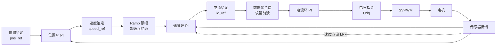

# MC-07：速度环与位置环设计
## 三环串级控制——从位置指令到电流指令

## 难度
★★★☆☆

## 适用对象
- 已实现电流环闭环、需要增加速度/位置控制的 FOC 开发者
- 正在调试三环串级结构中的带宽分离、ramp 限幅、前馈贯通等问题的嵌入式工程师
- 对伺服定位精度和轨迹跟踪有需求的应用开发者

## 前置知识
- [MC-06](MC-06-Current-Loop.md) — 电流环 PI 设计与带宽整定
- [ALG-05](../algorithm/ALG-05-Sensored-FOC.md) — 速度环控制算法
- [CT-05](../../foundations/control-theory/CT-05-PID-Tuning-Implementation.md) — 频域设计与带宽分离原理

## 核心摘要
速度环与位置环是 FOC 三环串级结构中最外两层。速度环承接位置环输出的速度给定，向电流环输出 Iq 指令；位置环面向最终被控变量（角度/位移）。两环设计的核心是**带宽分离**（每级约 10 倍间隔）和**级联抗饱和**（防止积分器在级间传播）。

---

> **定位**：FOC 的三环串级结构中最外两层。速度环承上（位置环输出）启下（电流环给定），位置环面向最终被控变量（角度/位移）。两环的设计核心是**带宽分离**和**级联抗饱和**。
>
> **前置知识**：MC-01（运动方程）、MC-06（电流环设计）。
>
> **目标**：理解速度环/位置环的PI设计、加速度限幅（ramp）、速度前馈、以及角度环绕处理。

---

## 1. 三环串级结构概览

```
位置给定(pos_ref)
  → 位置环(PI) → 速度给定(speed_ref)
    → 速度环(PI) → 电流给定(iq_ref)
      → 电流环(PI) → 电压指令(Udq)
        → SVPWM → 电机
          ↑____________ 传感器反馈 ←__________↓
```



**带宽分离原则**：
- 电流环带宽 >> 速度环带宽 >> 位置环带宽
- 典型比例：电流环 2kHz，速度环 200Hz，位置环 20Hz（每个差约 10 倍）

如果不遵循带宽分离：
- 电流环和速度环带宽接近 → 互相干扰，低频拍频振荡
- 速度环带宽 ≥ 电流环带宽 → 速度环输出快速变化的 Iq_ref，电流环跟不上

---

## 2. 速度环设计

### 2.1 被控对象（从运动方程出发）

来自 MC-01 的运动方程：
$$ J \frac{d\omega_m}{dt} = T_e - T_L - B \cdot \omega_m $$

转矩到速度的传递函数（忽略摩擦 B）：
$$ G_{speed}(s) = \frac{\Omega_m(s)}{T_e(s)} = \frac{1}{J \cdot s} $$

纯积分环节 → 一个 PI 控制器足以实现零稳态误差。

### 2.2 PI 增益设计

速度 PI 的输出是 Iq_ref：

$$ i_q(s) = \left(K_p^v + \frac{K_i^v}{s}\right) \cdot (\omega_{ref} - \omega_{meas}) $$

**对称最优法**（Symmetrical Optimum）：

对于纯积分被控对象 J·s，采用对称最优法（即对称频率法）的 PI 设计：
$$ K_p^v = \frac{J \cdot \omega_c^v}{1.5 \cdot pp \cdot \psi_{pm}}, \quad K_i^v = K_p^v \cdot \frac{\omega_c^v}{a} $$

其中 a 是对称因子（典型值 2~4），ωc 是速度环期望截止频率（rad/s）。

**注意**：上述公式中的 1.5·pp·ψpm 是从转矩到 Iq 的转换系数（来自 Te = 1.5·pp·[ψpm·iq + (Ld-Lq)·id·iq] 的简化 SPMSM 形式）。

**示例**：J=5e-4 kg·m², pp=4, ψpm=0.01 Wb, ωc=2π×200 rad/s, a=3
- Kp_v = 5e-4 × 1257 / (1.5 × 4 × 0.01) = 0.628 / 0.06 = 10.47 A/(rad/s)
- Ki_v = 10.47 × 1257/3 = 4388 A/(rad·s²)

### 2.3 加速度/减速度限幅（Ramp）

**为什么需要**：如果外部直接给速度环一个 0 → 3000rpm 的阶跃指令，PI 会输出一个巨大的 Iq_ref（可达限幅值），导致电流冲击。ramp 将速度阶跃平滑为梯形速度曲线。

**实现**：
```
speed_ref_limited[k] = speed_ref_limited[k-1] + SAT(speed_ref - speed_ref_limited[k-1],
                                                      -decel_limit·Ts, +accel_limit·Ts)
```

- accel_limit：加速斜率 (Hz/s)
- decel_limit：减速斜率 (Hz/s)，可独立设置（通常刹车比加速快）

> lxfoc 代码对应：[`control/lxfoc_control_speed.h`](../../control/lxfoc_control_speed.h:67-71)（accel_limit/decel_limit 配置）

### 2.4 速度测量滤波

速度通常从编码器差分或观测器获取，包含高频噪声。lxfoc 对速度测量做一阶 LPF：
```
speed_meas_filtered = speed_meas_filtered + alpha * (speed_meas - speed_meas_filtered)
```

**LPF 初始化的注意**：首次运行时需要将滤波值预装为首个测量值（`speed_filter_valid` 标志），避免从 0 到实际值的长时间跟踪过程。

### 2.5 前馈自动贯通

lxfoc 速度环支持绑定前馈聚合层（`ff` 指针），在 run() 中自动调用。惯量前馈 = J_hat × α_ff（加速度前馈），补偿机械惯性，让 PI 只补偿摩擦和模型误差。

```
lxfoc_control_speed_bind_feedforward(s, ff, pole_pairs);
→ run() 中自动: iq_ff = ff->calculate(ωm, α_ff)
→ iq_ref = PI_output + iq_ff
```

---

## 3. 位置环设计

### 3.1 被控对象

从位置到速度的传递函数是一个积分（位置 = 速度的积分），所以位置环也是 PI 控制纯积分对象。

### 3.2 角度环绕处理（Critical）

归一化角度下的位置误差：
$$ e_{pos} = \text{shortest\_path}(pos_{ref} - pos_{meas}) $$

```c
// 归一化角度最短路径误差 [0, 1.0f)
error = pos_ref - pos_meas;
if (error > 0.5f)  error -= 1.0f;    // 走负方向更短
if (error < -0.5f) error += 1.0f;    // 走正方向更短
```

**为什么重要**：如果不用最短路径，角度从 359°(0.997)→1°(0.003) 时，直接相减得到 +358° 的误差，位置环会命令电机转一整圈而不是 -2° 直接到位。

### 3.3 速度斜坡

PI 输出的速度参考经过斜率限幅后输出，防止位置环的阶跃响应造成速度突变。

### 3.4 速度前馈

位置环可提供速度前馈 speed_ff（直接叠加到 PI 输出），用于伺服定位中的轨迹跟踪：
```
speed_ref = PI_output + speed_ramp + speed_ff
```

---

## 4. 与 lxfoc 代码的对应关系

### 速度环

```
control/lxfoc_control_speed.h:41-80  →  lxfoc_control_speed_t 结构体
control/lxfoc_control_speed.c:
  init()       → 初始化PI + LPF + ramp参数
  run(dt)      → 4步: LPF滤波 → ramp限幅 → PI计算 → 前馈贯通 → Iq限幅
  set_iq_limit() → 电流环给速度环的动态Iq上限
  bind_feedforward() → 绑定前馈链
```

### 位置环

```
control/lxfoc_control_position.h:36-70  →  lxfoc_control_position_t 结构体
control/lxfoc_control_position.c:
  init()       → 初始化PI + ramp
  run(dt)      → 角度最短路径误差 → PI → ramp限幅 → +speed_ff → speed_ref
  configure_pi() → 运行时调整PI和限幅
```

### 三环级联调用顺序（FSM 中）

```
fsm/lxfoc_fsm.c: LXFO_FSM_STATE_RUN:
  1. pos_run(&pos, dt)        → pos.speed_ref
  2. speed_run(&speed, dt)    → speed.iq_ref
  3. current_run(&current, dt)→ current.ud/current.uq
  4. 逆Park + SVPWM           → duty_a/b/c
```

---

## 5. 常见调试陷阱

### 5.1 带宽串扰（最频繁的级联问题）

**症状**：速度环在某个频率有振荡，但调整速度环 PI 无效。

**原因**：速度环带宽太接近电流环带宽，相互作用产生低频拍频。或者电流环的截止频率本身太低（电感辨识不准），导致整个级联的"基础"不稳。

**检查方法**：先在电流模式下用方波 Iq 指令测试电流环阶跃响应，确保电流环的上升时间远小于速度环的响应时间（至少差 5 倍）。

### 5.2 积分器饱和传播

**症状**：位置环静止时很好，运动停止后有一个明显的"回拉"。

**原因**：运动过程中速度环积分器累积了很大值（克服摩擦）。停止时位置误差很小，但速度环积分器还需要时间"泄放"，导致短暂的超调。

**对策**：位置环使用 P 控制（ki=0），或使用小 ki + 大 kc（抗积分饱和），让积分只在有持续位置偏差时才参与。

### 5.3 速度测量噪声放大

**症状**：电机低速时有高频啸叫。

**原因**：编码器差分速度在低速时噪声严重（量化噪声），进入速度环后被 PI 放大为电流噪声。

**对策**：加大速度测量 LPF 的 alpha（更强的滤波），或使用观测器速度代替直接差分速度（观测器自带滤波效果）。

### 5.4 角度环绕导致位置环"滑步"

**症状**：电机在一个角度附近抖动，没有明显方向但无法定位。

**原因**：角度环绕处理中，最短路径 = 0 或 0.5 时会来回跳（一个方向走 +0.5，另一个方向走 -0.5，距离相等）。

**对策**：加入滞回——如果上次误差在 [-0.5, 0.5) 区间内，这次仍用相同的路径选择。

---

## 交叉引用

| 关联模块 | 方向 | 维度 |
|---------|------|------|
| [MC-06 电流环](MC-06-Current-Loop.md) | ← 下游：速度环输出 Iq_ref 送入电流环 | 级联控制 |
| [ALG-05 速度环控制](../algorithm/ALG-05-Sensored-FOC.md) | ↔ 算法实现：对称最优法 PI 设计 | 控制算法 |
| [CT-05 频域设计](../../foundations/control-theory/CT-05-PID-Tuning-Implementation.md) | ← 理论基础：带宽分离与 Bode 图分析 | 控制理论 |
| [MC-01 PMSM 模型](MC-01-PMSM-Model.md) | ← 被控对象：运动方程推导速度传递函数 | 电机建模 |
| [MC-08 无感观测器](MC-08-Sensorless-Observers.md) | ↔ 速度源：观测器提供速度反馈替代编码器 | 信号链路 |

> 📝 检验你的理解：[MC-07-assessment](MC-07-assessment.md)
