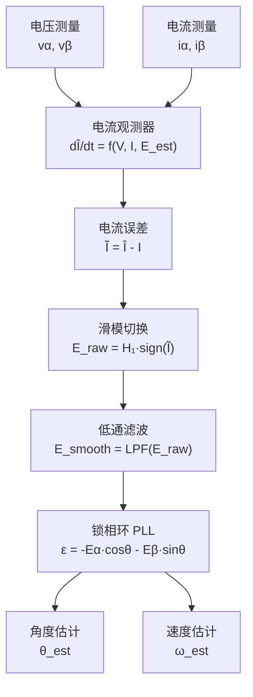

# MC-08：无感观测器理论
## 从BEMF到转子角度——滑模观测器和反电动势观测器

## 难度
★★★★☆

## 适用对象
- 正在开发无传感器 FOC 控制算法的嵌入式工程师
- 需要在中高速应用（>500 rpm）中替代编码器/霍尔的电机驱动开发者
- 对观测器理论（滑模、反电动势、磁链）有深入理解需求的研究型工程师

## 前置知识
- [MC-01](MC-01-PMSM-Model.md) — PMSM αβ 坐标系方程与反电动势模型
- [MC-06](MC-06-Current-Loop.md) — 电流环 PI 设计与带宽整定

## 核心摘要
无感 FOC 的核心是从可测量的电压和电流中"挖出"不可直接测量的反电动势（BEMF），进而提取转子角度和速度。滑模观测器（SMO）通过四段式结构（电流观测器→滑模切换→LPF→PLL）实现鲁棒的 BEMF 估计；反电动势观测器（EEMF）和磁链观测器则提供了不同的适用场景权衡。观测器性能直接决定无感 FOC 的低速能力、动态响应和参数鲁棒性。

---

> **定位**：无感 FOC 的"心脏"——不用编码器或霍尔传感器，仅通过电压和电流计算出转子角度和速度。观测器原理是 FOC 理论中最具挑战性的部分。
>
> **前置知识**：MC-01（PMSM αβ 坐标系方程）、MC-02（坐标变换）、MC-06（电流环）。
>
> **目标**：理解滑模观测器（SMO）的电流观测器+滑模切换函数+LPF+PLL 四段式结构，以及反电动势观测器、磁链观测器的不同适用场景。

---

## 1. 物理直觉：如何"看"到看不见的转子

### 1.1 反电动势——转子的"影子"

转子在旋转时，永磁体磁场扫过定子绕组，在绕组中感生出反电动势（BEMF）。BEMF 的幅值正比于转速（|E|=ωe·ψpm），BEMF 的方向携带了转子位置信息。

**核心挑战**：BEMF 不能直接测量——它被"埋在"电阻压降和电感电压之下。观测器的工作就是从可测量的电压和电流中"挖出"BEMF。



### 1.2 PMSM 在 αβ 坐标系下的方程

来自 MC-01，经过 CLARKE 变换后：

$$ \begin{aligned} v_\alpha &= R_s i_\alpha + L_s \frac{di_\alpha}{dt} + \underbrace{(-\omega_e \psi_{pm} \sin\theta_e)}_{e_\alpha} \\ v_\beta &= R_s i_\beta + L_s \frac{di_\beta}{dt} + \underbrace{(+\omega_e \psi_{pm} \cos\theta_e)}_{e_\beta} \end{aligned} $$

（为简化书写，上式假定 Ld=Lq=Ls，即 SPMSM。IPMSM 有额外交叉耦合项。）

反电动势分量 eα 和 eβ 包含了转子角度信息：

$$ \theta_e = \text{atan2}(-e_\alpha, +e_\beta) $$

---

## 2. 滑模观测器（SMO）——四段式结构

lxfoc 的实现包含四步：电流观测器 → 滑模切换 → LPF → PLL。

### 2.1 第 1 步：电流观测器

构建一个数值模型来模拟电机的电流行为：

$$ \frac{d\hat{i}_\alpha}{dt} = -\frac{R_s}{L_d}\hat{i}_\alpha - \frac{L_d-L_q}{L_d}\omega_e\hat{i}_{\beta\_cross} + \frac{1}{L_d}(u_\alpha - \hat{e}_\alpha) $$

（β 轴同理，符号不同。）

**电流误差**：$\tilde{i}_\alpha = \hat{i}_\alpha - i_\alpha^{meas}$

这个误差是所有信息的来源：如果电流模型与实际电机一致，误差→0。如果有偏差（BEMF不同），误差非零。

### 2.2 第 2 步：滑模切换函数

利用电流误差的符号（符号）来估计 BEMF 的方向：

$$ \hat{e}_\alpha = H_1 \cdot \text{sign}(\tilde{i}_\alpha) $$
$$ \hat{e}_\beta = H_1 \cdot \text{sign}(\tilde{i}_\beta) $$

- H1：滑模增益，必须大于最大 |BEMF| 幅值（H1 > ωe_max · ψpm），这是**滑模到达条件**。
- sign() 函数使得电流误差被强制向零滑动。

**边界层替代**（减抖振）：
$$ \text{sat}(x, \varepsilon) = \begin{cases} \text{sign}(x) & \text{if } |x| > \varepsilon \\ x/\varepsilon & \text{if } |x| \leq \varepsilon \end{cases} $$

当电流误差小于边界层 ε 时，用线性放大代替硬开关，减少高频抖振（chattering）。

### 2.3 第 3 步：低通滤波（LPF）

sign() 输出的 BEMF 估计包含大量的开关频率噪声。通过一阶 LPF 得到平滑的 BEMF：

$$ e_{\alpha}^{filt}[k] = e_{\alpha}^{filt}[k-1] + \alpha_{lpf} \cdot (\hat{e}_\alpha - e_{\alpha}^{filt}[k-1]) $$

**LPF 角频率的权衡**：
- α 太小（滤波太强）→ BEMF 相位滞后大，角度估计延迟
- α 太大（滤波太弱）→ BEMF 高频噪声进入 PLL，角度抖动

典型选择：α ≈ 0.1~0.3，对应 fc ≈ 160~530Hz @10kHz 采样。

### 2.4 第 4 步：锁相环（PLL）

PLL 从滤波后的 BEMF 中提取角度：

**PLL 相位误差**（归一化）：
$$ \varepsilon = -e_\alpha^{filt} \cdot \cos\hat{\theta}_e - e_\beta^{filt} \cdot \sin\hat{\theta}_e $$

**几何直觉**：这相当于计算"实际 BEMF 矢量"和"估计角度对应方向"之间的夹角。当估计角度 = 实际 BEMF 角度时，ε→0。

**PLL PI 结构**：
$$ \begin{aligned} \hat{\omega}_e[k] &= \hat{\omega}_e[k-1] + K_p^{pll} \cdot (\varepsilon_k - \varepsilon_{k-1}) + K_i^{pll} \cdot T_s \cdot \varepsilon_k \\ \hat{\theta}_e[k] &= \hat{\theta}_e[k-1] + \hat{\omega}_e[k] \cdot T_s \end{aligned} $$

这是一个标准的二阶 PLL——PI 调节相位误差产生频率估计，频率积分得角度。

> lxfoc 代码对应：[`observer/lxfoc_observer_pll.c`](../../observer/lxfoc_observer_pll.c)（PLL 实现）
> lxfoc 代码对应：[`observer/lxfoc_observer_smo.c:60-120`](../../observer/lxfoc_observer_smo.c:60-120)（SMO 实现主体）

---

## 3. 反电动势观测器（EEMF Observer）

与 SMO 不同，反电动势观测器直接从 αβ 电压方程中显式计算 BEMF：

$$ \begin{aligned} \hat{e}_\alpha &= v_\alpha - R_s i_\alpha - L_s \frac{di_\alpha}{dt} \\ \hat{e}_\beta &= v_\beta - R_s i_\beta - L_s \frac{di_\beta}{dt} \end{aligned} $$

然后通过 PLL 提取角度。

**优点**：计算简单，无滑模抖振问题。
**缺点**：对参数 Rs/Ls 的准确性敏感；纯微分 di/dt 放大噪声。
**适用场景**：中高速（BEMF 信噪比足够高时）。

> lxfoc 代码对应：[`observer/lxfoc_observer_emf.c`](../../observer/lxfoc_observer_emf.c)

---

## 4. 磁链观测器（Flux Observer）

磁链观测器直接估计定子磁链矢量：

$$ \begin{aligned} \hat{\psi}_\alpha &= \int (v_\alpha - R_s i_\alpha) dt \\ \hat{\psi}_\beta &= \int (v_\beta - R_s i_\beta) dt \end{aligned} $$

然后从磁链中减去 Ls·i 得到转子磁链，再提取角度。

**关键问题**：纯积分存在直流漂移——一个微小的测量失调会使积分器漂移到饱和。

**对策**：用 LPF 替代纯积分器（ψ = LPF(v - Rs·i)），在低频时引入相位校正。

> lxfoc 代码对应：[`observer/lxfoc_observer_flux.c`](../../observer/lxfoc_observer_flux.c)

---

## 5. 三种观测器的对比

| | SMO | EEMF Observer | Flux Observer |
|---|---|---|---|
| 原理 | 电流观测器 + 滑模切换 | 显式计算 BEMF | 积分 vi → 磁链 |
| 对 Rs 灵敏度 | 中（电流观测器反馈路径） | **高**（直接相减） | 较低 |
| 对 Ls 灵敏度 | 中 | **高**（di/dt 项） | 低 |
| 抖振/噪声 | 有（可加边界层） | 无（但噪声敏感） | 无（但漂移敏感） |
| 低速能力 | 较好（滑模闭环） | **差**（BEMF 太小） | 中（积分漂移） |
| 高速能力 | 优秀 | 优秀 | 优秀 |
| 实现复杂度 | 较高 | 低 | 中 |
| 典型起始频率 | fs/100 ~ fs/50 | fs/20 | fs/50 |

---

## 6. 与 lxfoc 代码的对应关系

### SMO 结构体

```
observer/lxfoc_observer_smo.h:27-78  →  lxfoc_observer_smo_t
    ├── rs, ld, lq, ts          →  电机参数
    ├── rs_over_ld, one_over_ld →  预计算派生参数
    ├── ualpha, ubeta           →  输入电压 (V)
    ├── ialpha, ibeta           →  输入电流 (A)
    ├── ihat_alpha, ihat_beta   →  电流观测器状态
    ├── h1                      →  滑模增益
    ├── boundary_layer          →  边界层 (0=sign, >0=sat)
    ├── lpf_alpha, lpf_beta     →  BEMF 低通滤波器
    ├── pll                     →  锁相环
    └── angle_est, freq_est     →  输出
```

### SMO 运行流程

```
observer/lxfoc_observer_smo.c:lxfoc_observer_smo_run()
    ├── 1. 发散检测: |ihat| > 100A → 强制复位
    ├── 2. 电流观测器更新:
    │     dIα/dt = -Rs/Ld·Iα - (Ld-Lq)/Ld·ω·Iβ_cross + Uα/Ld - Eα/Ld
    │     (欧拉前向离散化)
    ├── 3. 滑模切换: E_raw = H1·sat(I_hat - I, boundary_layer)
    ├── 4. LPF 平滑: E_smooth = LPF(E_raw)
    ├── 5. PLL 相位误差: err = -Eα_smooth·cosθ - Eβ_smooth·sinθ
    └── 6. PLL PI → 频率/角度输出
```

### 其他观测器

```
observer/lxfoc_observer_emf.c   →  反电动势观测器
observer/lxfoc_observer_flux.c  →  磁链观测器
observer/lxfoc_observer_pll.c   →  锁相环（复用于SMO/EMF/Flux）
observer/lxfoc_observer_speed.c →  速度估计（从角度差分/滤波）
```

---

## 7. 常见调试陷阱

### 7.1 滑模增益 H1 选小了

**症状**：低速时角度估计正常，高速时角度跳变或抖动。

**原因**：BEMF 幅值 = ωe·ψpm，H1 必须大于这个值。如果 H1 小于最大转速下的 |BEMF|，滑模不能到达滑模面，观测器失效。

**经验公式**：H1 ≥ 2.0 × ωe_max × ψpm（留 2 倍余量）。

### 7.2 LPF 带宽过低

**症状**：中高速角度估计有明显的滞后（电机实际加速时，估计角度跟不上）。

**原因**：LPF 对 BEMF 信号引入了相位滞后 α = fc_IPF / (f_elec + fc_IPF)。在 f_elec=200Hz、fc_LPF=100Hz 时，相位滞后约 arctan(200/100)=63°。

**对策**：LPF 截止频率可以随速度自适应变化（高速时提高截止频率，低速时降低）。或者直接用 PLL 的闭环带宽补偿 LPF 的相位滞后。

### 7.3 Rs 热漂移 → 低速发散

**症状**：冷机启动时 SMO 工作正常，运行几分钟后低速抖动。

**原因**：电机发热后 Rs 增大约 30-50%，但观测器中 Rs 仍是冷态值。在低速时（BEMF 幅值小），Rs·I 项占总电压的比例较大，Rs 偏差导致电流观测器模型失配。

**对策**：在线更新 Rs（温度补偿或在线辨识），见 [MC-10](../motion-control/MC-10-Parameter-Sensitivity.md)。

### 7.4 SMO 启动时的收敛问题

**症状**：电机静止时不产生 BEMF，观测器无信息可用，角度随机。

**原因**：SMO 和所有无感观测器都依赖 BEMF 来估计角度。在零速和极低速时，BEMF 太小或为零，观测器不可用。

**lxfoc 策略**：使用 V/F 启动或 IF 启动（[`startup/lxfoc_startup_if.c`](../../startup/lxfoc_startup_if.c)），在达到一定转速后再切换到 SMO 闭环。

---

## 交叉引用

| 关联模块 | 方向 | 维度 |
|---------|------|------|
| [MC-01 PMSM 模型](MC-01-PMSM-Model.md) | ← 理论基础：αβ 坐标系方程与 BEMF 模型 | 电机建模 |
| [MC-06 电流环](MC-06-Current-Loop.md) | → 下游：观测器角度/速度送入电流环做 Park 变换 | 控制链路 |
| [ALG-07 无感观测器](../algorithm/ALG-07-Sensorless-Observers.md) | ↔ 算法实现：SMO 滑模切换与 PLL 设计 | 观测器算法 |
| [CT-16 状态观测器](../../foundations/control-theory/CT-16-ADRC-Theory.md) | ← 理论基础：滑模到达条件与 Lyapunov 稳定性 | 控制理论 |
| [MC-10 参数敏感性](MC-10-Parameter-Sensitivity.md) | ↔ 参数依赖：Rs/Ls 热漂移对观测器精度的影响 | 参数鲁棒性 |

> 📝 检验你的理解：[MC-08-assessment](MC-08-assessment.md)
