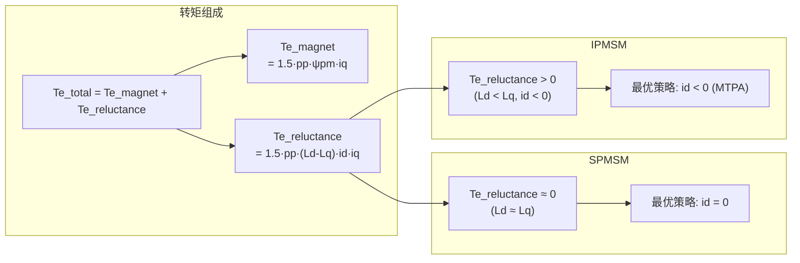

# MC-09：IPMSM vs SPMSM
## 凸极效应与磁阻转矩——IPMSM与SPMSM的本质差异

## 难度
★★★☆☆

## 适用对象
- 正在选型电机或设计 FOC 控制策略的电机驱动工程师
- 需要理解 MTPA 控制前提条件的算法开发者
- 希望深入理解 Ld≠Lq 物理来源及其对控制策略影响的嵌入式工程师

## 前置知识
- [MC-01](MC-01-PMSM-Model.md) — PMSM 模型，特别是转矩方程和 Ld/Lq 定义

## 核心摘要
SPMSM（表贴式）和 IPMSM（内嵌式）的本质区别在于转子结构导致 d 轴和 q 轴磁路不对称程度不同：SPMSM 的 Ld≈Lq，IPMSM 的 Ld<Lq（凸极率 2~5 倍）。这一差异决定了磁阻转矩是否存在、MTPA 最优 id 轨迹的形状、以及弱磁控制的策略选择。对于 IPMSM，id=0 控制会浪费 10-30% 的转矩能力。

---

> **定位**：理解 SPMSM 和 IPMSM 的本质区别是正确选择 FOC 控制策略的前提——id 该设为零还是负值？MTPA 有没有意义？弱磁怎么调？答案都在这两种电机结构的差异中。
>
> **前置知识**：MC-01（PMSM 模型，特别是转矩方程和 Ld/Lq 定义）。
>
> **目标**：理解 Ld ≠ Lq 导致的磁阻转矩的物理来源、MTPA 的最优 id 轨迹、以及两类电机在弱磁和参数敏感性上的差异。

---

## 1. 物理差异：转子结构决定 Ld 和 Lq 的关系

### 1.1 SPMSM（Surface-mounted PMSM，表贴式）

永磁体贴在转子铁心表面：
- 磁路对称：永磁体的磁导率 μr ≈ 1.05 ≈ 空气的磁导率
- d 轴磁路 = q 轴磁路 → **Ld ≈ Lq**
- 有效气隙大（永磁体厚度 + 机械气隙）→ 电感较小
- 典型特征：Ld ≈ Lq ≈ 0.5~5 mH，凸极率 = Lq/Ld ≈ 1.0

### 1.2 IPMSM（Interior PMSM，内嵌式）

永磁体嵌入转子铁心内部（V 形、一字形、U 形等）：
- 磁路不对称：
  - d 轴路径：永磁体（低磁导率）+ 铁心桥 → 大磁阻
  - q 轴路径：纯铁心 → 小磁阻
- **Ld < Lq**（d 轴磁阻大 → 电感小）
- 有效气隙 > SPMSM → 电感居中
- 典型特征：Ld ≈ 0.1~0.5 mH, Lq ≈ 0.3~1.5 mH，凸极率 = Lq/Ld ≈ 2~5

### 1.3 直观对比

| | SPMSM | IPMSM |
|---|---|---|
| 转子结构 | 磁钢贴表面 | 磁钢嵌入内部 |
| Ld vs Lq | Ld ≈ Lq | Ld < Lq（典型 2~5 倍差） |
| 凸极率 Lq/Ld | ≈ 1.0 | 2~5（或更大） |
| 磁阻转矩 | 无 | **有**（Ld≠Lq → 磁阻差 → 转矩分量） |
| 最优 id | id = 0 | id < 0（MTPA 轨迹） |
| 弱磁能力 | 有限（电感小且对称） | 强（电感大且凸极有利于阻抗匹配） |
| 典型应用 | 伺服、家电 | 电动汽车、牵引 |
| 成本 | 较低（磁钢工艺简单） | 较高（需嵌入工艺） |



---

## 2. 转矩方程的两种形式

### 2.1 SPMSM（Ld = Lq = Ls）

转矩方程退化为：
$$ T_e = \frac{3}{2} \cdot pp \cdot \psi_{pm} \cdot i_q $$

**关键点**：
- 转矩与 iq 成正比，id 不产生任何转矩
- 从效率角度，最优策略是 id = 0（所有电流都用于产生转矩）
- MTPA = id=0（两者完全等价）

### 2.2 IPMSM（Ld < Lq）

完整转矩方程：
$$ T_e = \frac{3}{2} \cdot pp \cdot [\psi_{pm} \cdot i_q + (L_d - L_q) \cdot i_d \cdot i_q] $$

**两项分别解释**：
- 永磁转矩：ψpm·iq（永磁体和 iq 的相互作用，同 SPMSM）
- 磁阻转矩：(Ld-Lq)·id·iq
  - 由于 Ld < Lq → (Ld-Lq) < 0
  - 当 id < 0（负值）且 iq > 0 时 → 两项符号相反
  - 但乘积 (Ld-Lq)·id 是正的（两个负数相乘）→ 磁阻转矩为正
  - 这是"磁阻转矩"——转子铁心不对称的磁阻对不同方向的磁场产生不同的"吸力"

**直观理解磁阻转矩**：
想象一个条形磁铁（转子）放在一个由你控制的磁场（定子电流产生的旋转磁动势）中。当定子磁场偏离 d 轴时，铁心的磁阻不对称会感知到"磁场更喜欢走 q 轴路径（磁阻更小）"，于是产生一个拉力，试图将磁场拉向 q 轴，即增加 q 轴磁场分量。

---

## 3. MTPA（最大转矩每安培）曲线

### 3.1 为什么有 MTPA

对 IPMSM，给定电流幅值 Is = √(Id²+Iq²)，磁阻转矩的贡献使得 id=0 不是产生最大转矩的策略——注入负 id 会增加磁阻转矩分量，虽然会略微减少永磁转矩（由于 iq 下降了），但总转矩可能更大。

### 3.2 MTPA 的最优 id

在电流极限圆 Is² = Id² + Iq² 的约束下，最大化 Te(Id, Iq)：

$$ i_d^{MTPA} = \frac{\psi_{pm}}{2(L_q - L_d)} - \sqrt{\frac{\psi_{pm}^2}{4(L_q - L_d)^2} + i_q^2} $$

**简化近似**（小 iq 下）：
$$ i_d \approx -\frac{(L_q - L_d)}{\psi_{pm}} \cdot i_q^2 $$

MTPA 轨迹在 Id-Iq 平面上的形状：从原点出发，沿 id < 0 方向"弯曲"。

### 3.3 MTPA 增益有多大

以典型 IPMSM：ψpm=0.1 Wb, Ld=0.2 mH (=2e-4 H), Lq=0.6 mH (=6e-4 H), 电流极限 100A：
- id=0 时：Te = 1.5×p×ψpm×iq = 1.5×4×0.1×100 = 60 Nm（纯永磁转矩）
- id=-30A, iq=95A（MTPA 点）：
  Te = 1.5×p×[ψpm×iq + (Ld-Lq)×id×iq]
     = 1.5×4×[0.1×95 + (2e-4 - 6e-4)×(-30)×95]
     = 1.5×4×[9.5 + (-4e-4)×(-2850)]
     = 1.5×4×[9.5 + 1.14]
     = 1.5×4×10.64
     = 63.8 Nm
- 磁阻转矩贡献 ΔTe = 1.5×4×1.14 = 6.84 Nm
- MTPA 增益 ≈ 11% (6.84/63.8)——显著但非巨大。高凸极率 IPMSM（Lq/Ld > 5）可到 20-30%。

---

## 4. 弱磁控制的差异

### 4.1 SPMSM 弱磁

弱磁通过注入负 id 来削减永磁体产生的磁链，从而降低 BEMF，允许在更高速度下运行。

**限制**：SPMSM 的 Ld 很小（气隙大），负 id 产生的弱磁效果很弱。要达到有效弱磁需要很大的负 id，而电感小意味着 id 的变化率受到限制。

### 4.2 IPMSM 弱磁

IPMSM 的 Ld 更大（铁心磁路），负 id 能产生更有效的弱磁效果。更重要的是，IPMSM 的凸极率使得即使在弱磁区，磁阻转矩仍有贡献。

**MTPV（Maximum Torque Per Volt，最大转矩每伏特）**：
在电压极限圆的约束下最大化转矩，是 IPMSM 弱磁区的补充策略。当电压圆约束生效时，Ip/Id 的分配不再遵循 MTPA 而是 MTPV。

---

## 5. 与 lxfoc 代码的对应关系

### MTPA 模块

```
control/lxfoc_control_mtpa.c  →  MTPA 控制
    输入: iq_ref（来自速度环）
    输出: id_ref, iq_ref（修正后）
    实现: 根据 ψpm, Ld, Lq 计算 MTPA 轨迹上的最优 (Id, Iq)
```

### 弱磁模块

```
control/lxfoc_control_field_weakening.c  →  弱磁控制
    输入: 电压余量 (Vbus/√3 - |Vdq|)
    输出: id_ref_weak（负值增量）
```

### 电感辨识

```
identify/lxfoc_identify_inductance.c  →  电感参数辨识
    输出: Ld, Lq（多电流点下的电感值）
```

---

## 6. 常见调试陷阱

### 6.1 IPMSM 用 id=0 控制

**症状**：电机能转，但相同电流下转矩偏小（比预期值小 10-30%），效率偏低。

**原因**：id=0 没有利用磁阻转矩。IPMSM 的 Lq-Ld 越大，这个差距越明显。

**对策**：使能 MTPA 模块，或者至少给一个固定的负 id 注入。

### 6.2 SPMSM 用 MTPA

**症状**：没什么区别，代码多了个计算步骤但效果和 id=0 一样。

**原因**：SPMSM 的 Ld≈Lq，磁阻转矩项 (Ld-Lq)·id·iq ≈ 0，MTPA 算法算出的 id 也 ≈ 0。没有坏处，但浪费计算量。

### 6.3 凸极率误估计

**症状**：使能 MTPA 后电机转矩反而下降或出现振荡。

**原因**：Lq/Ld 的比率是从电感辨识中获得的。如果辨识不准（例如只在额定电流的一个点做了电感辨识），MTPA 轨迹可能指向错误的方向。

**对策**：做多电流点的电感辨识，获取 Ld(id, iq) 和 Lq(id, iq) 的饱和曲线（见 [`identify/lxfoc_identify_inductance.c`](../../identify/lxfoc_identify_inductance.c)）。使用查表法代替公式法。

### 6.4 弱磁过深导致失控

**症状**：进入弱磁区后电机电流突然飙升，保护触发。

**原因**：弱磁时 id_ref 负值过大，Iq_max = √(Imax² - Id²) 接近于零，失去了转矩控制能力的同时无法恢复。

**对策**：限制负 id 的最大值（id_min ≥ -0.8·Imax），避免 Iq 余量趋近于零。

---

## 交叉引用

| 关联模块 | 方向 | 维度 |
|---------|------|------|
| [MC-01 PMSM 模型](MC-01-PMSM-Model.md) | ← 理论基础：转矩方程与 Ld/Lq 定义 | 电机建模 |
| [ALG-11 MTPA 与弱磁](../algorithm/ALG-11-MTPA-Flux-Weakening.md) | → 下游：MTPA 算法依赖凸极率进行最优 id 计算 | 控制算法 |
| [MC-06 电流环](MC-06-Current-Loop.md) | ↔ 实现：id/iq 限幅与电流圆约束 | 电流控制 |
| [MC-10 参数敏感性](MC-10-Parameter-Sensitivity.md) | ↔ 参数依赖：Ld/Lq 饱和曲线对 MTPA 精度的影响 | 参数鲁棒性 |

> 📝 检验你的理解：[MC-09-assessment](MC-09-assessment.md)
