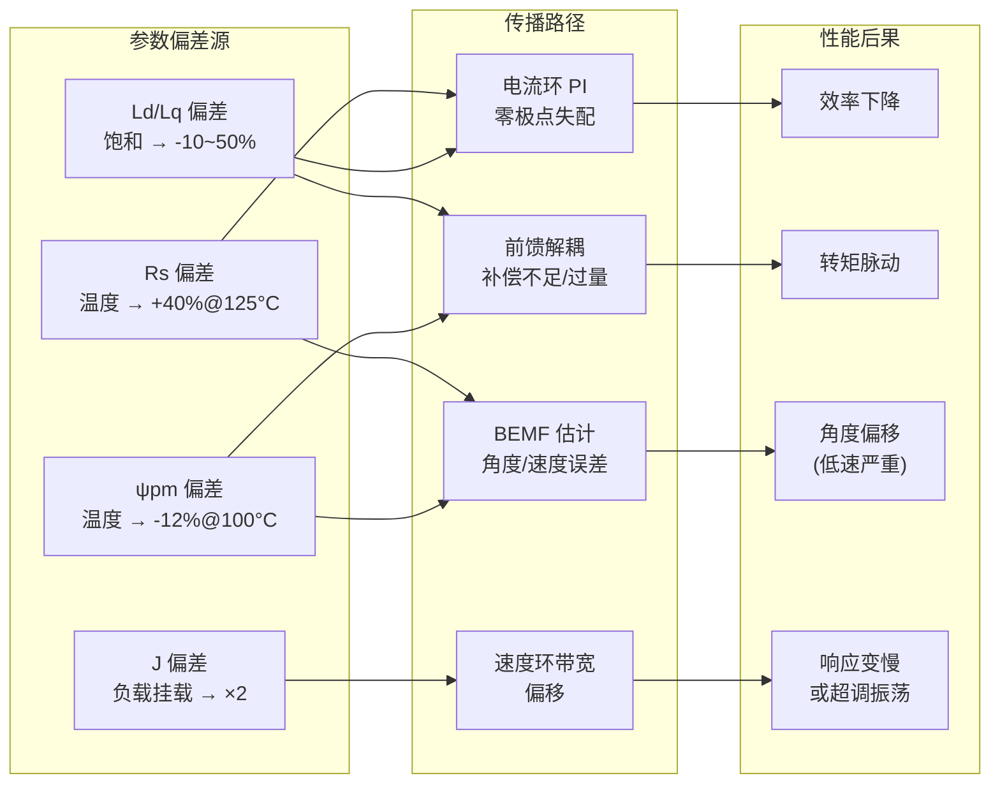

# MC-10：参数敏感性
## Rs/Ld/Lq/ψpm/J 偏差对FOC性能的影响

## 难度
★★★★☆

## 适用对象
- 正在调试 FOC 系统、遇到"跑起来还行但不够好"问题的电机驱动工程师
- 需要理解参数变化对控制性能影响的算法开发者
- 设计鲁棒控制策略、需要参数在线补偿的嵌入式工程师

## 前置知识
- [MC-01](MC-01-PMSM-Model.md) — PMSM 模型与参数定义
- [MC-06](MC-06-Current-Loop.md) — 电流环 PI 设计与前馈解耦
- [MC-08](MC-08-Sensorless-Observers.md) — 无感观测器（SMO/EEMF/Flux）

## 核心摘要
真实电机的参数会随温度、电流、速度变化而漂移。Rs 随温度变化约 0.39%/°C（铜阻），ψpm 随温度下降约 -0.12%/°C（钕铁硼），Ld/Lq 随电流饱和下降 10-50%，J 随负载挂载翻倍。不同参数对不同 FOC 组件的敏感性差异很大：Rs 对观测器影响最大（★★★★），Ld/Lq 对 MTPA 影响最大（★★★★），J 对速度环影响最大（★★★★）。应对策略包括温度补偿、离线多电流点辨识、在线电感查表、惯量辨识等。

## 参数偏差传播链路



## 交叉引用

| 相关模块 | 关系 | 说明 |
|---------|------|------|
| [MC-01](MC-01-PMSM-Model.md) | 前置 | 电机参数 Rs/Ld/Lq/ψpm/J 的定义 |
| [MC-06](MC-06-Current-Loop.md) | 前置 | 电流环 PI 设计与前馈解耦 |
| [MC-08](MC-08-Sensorless-Observers.md) | 前置 | 无感观测器对参数的依赖性 |
| [MC-09](MC-09-IPMSM-vs-SPMSM.md) | 关联 | MTPA 轨迹对 Ld/Lq 的敏感性 |

---

> **定位**：真实电机的参数会随温度、电流、速度变化而漂移。理解各参数对 FOC 各组件的敏感性，是调试"跑起来还行但不够好"和防范"运行一段时间后出问题"的关键。
>
> **前置知识**：MC-01（电机参数定义）、MC-06（电流环）、MC-08（无感观测器）。
>
> **目标**：掌握 Rs、Ld、Lq、ψpm、J、B 六个参数的变化规律、对各控制环/观测器的影响程度、以及应对策略。

---

## 1. 参数变化规律

| 参数 | 变化原因 | 变化幅度 | 变化速度 |
|------|---------|---------|---------|
| Rs | 温度（铜阻温度系数 ≈ 0.39%/°C） | 25°C→125°C 增大约 40% | 中等（热时间常数 ~分钟） |
| Ld | 磁饱和（d 轴电流增大→铁心饱和→电感下降） | id 从 0→额定：降 10~30% | 快速（电气时间常数 ~ms） |
| Lq | 磁饱和（q 轴电流增大→铁心饱和→电感下降） | iq 从 0→额定：降 10~50% | 快速（电气时间常数 ~ms） |
| ψpm | 温度（钕铁硼温度系数 ≈ -0.12%/°C） | 25°C→125°C 下降约 12% | 中等 ~分钟 |
| J | 负载惯量变化 | 单电机时不变，负载挂载时可能翻倍 | 瞬时（机械连接变化） |
| B | 温度（润滑油黏度变化）、速度（风阻 ∝ ω²） | 难以预测，通常影响小 | 中等 |

---

## 2. Rs 变化的敏感性分析

### 2.1 对电流环的影响

**影响程度**：★☆☆☆☆（低）

**原因**：电流环的前馈补偿主要补偿耦合项（-ωe·Lq·Iq 和 ωe·[Ld·Id+ψpm]），电阻压降 Rs·Id/Iq 通常是小量（除非在大电流低压电机中）。Rs 偏差 40% 对总电压指令的影响通常 < 1-2%。

**例外**：在极低速（ωe ≈ 0）、大电流的堵转工况下，Rs 压降占比大。此时 Rs 不准会导致电流环 PI 中的"剩余"量（实际消除 Rs·I 的偏差）偏移。

**lxfoc 策略**：通过 `rs_ff_enable` 可选择性使能 Rs 的前馈补偿。默认关闭，避免重复补偿。

### 2.2 对观测器的影响

**影响程度**：★★★★☆（高，特别是 SMO 和 EEMF Observer）

**原因**：SMO 的电流观测器方程中包含 Rs·I_hat/Ld 项，EMF Observer 直接用 v - Rs·i 计算反电动势。在中低速区，BEMF 幅值小，Rs·I 项成为主要分量。Rs 偏差会导致：
- 低速角度估计偏差（定常偏置）
- 低速时电流观测器收敛到错误位置

**对策**：
- 在线更新 Rs（通过温度传感器 + 铜阻温度系数 0.39%/°C）
- 低速时切换到高频注入（HFI）模式
- 在 SMO 电流观测器中加入补偿项

---

## 3. Ld/Lq 变化的敏感性分析

### 3.1 对电流环的影响

**影响程度**：★★★☆☆（中）

**影响渠道**：
1. **PI 增益失配**：如果按额定电感设计的 Kp/Ki，在大电流时电感下降 30%，电流环的闭环带宽提升约 30%。如果原始带宽已接近稳定极限，可能使电流环振荡。
2. **前馈解耦失配**：Ud_ff = -ωe·Lq·Iq，Uq_ff = ωe·Ld·Id。如果 Lq 低估 30%，d 轴前馈补偿不足 30%，剩余耦合扰动需要 PI 去消除——在高速时可能导致可观的跟踪误差。

### 3.2 对 MTPA 的影响

**影响程度**：★★★★☆（高，对 IPMSM）

MTPA 的 id 最优值依赖于 (Lq-Ld)/ψpm 这个比值。电感估计偏差会导致 MTPA 轨迹偏离最优，转矩输出下降。更严重的是，如果 Lq-Ld 的估计偏差导致 id 注入方向反了（原本该负的变成正的），转矩会显著减小。

### 3.3 对饱和度建模的依赖

理想方案：使用 `lxfoc_control_inductance_sat.{h,c}` 中的 Ld(id)/Lq(iq) 曲线查表，根据当前运行点的电流水平动态更新电感值。

---

## 4. ψpm 变化的敏感性分析

### 4.1 对电流环的影响

**影响程度**：★★★☆☆（中）

影响渠道：Uq_ff = ωe·(Ld·Id + ψpm)。前馈中的 ψpm·ωe 项低估会导致 q 轴电压指令偏小，PI 需要额外补偿。

**数值例子**：ψpm 从 0.1 Wb 降到 0.088 Wb（温度升 100°C 约 -12%）：
- 在 3000rpm、4 极对电机：ωe=1257 rad/s
- 前馈误差 = 1257 × 0.012 = 15V
- 母线电压 48V → 误差占比约 31%——**相当显著**！

### 4.2 对观测器的影响

**影响程度**：★★☆☆☆（低至中）

- SMO：通过 PLL 从 BEMF 提取角度，BEMF 幅值误差不直接影响角度准确性（PLL 锁定的是相位不是幅值）
- Flux Observer：角度直接从定子磁链矢量方向提取，ψpm 的影响受积分路径影响

ψpm 变化主要影响速度估计的幅值（从 BEMF 幅值推算速度），而不是角度。

---

## 5. J 变化的敏感性分析

### 5.1 对速度环的影响

**影响程度**：★★★★☆（高）

速度环的 PI 增益直接与 J 成正比：
$$ K_p^v = \frac{J \cdot \omega_c^v}{1.5 \cdot pp \cdot \psi_{pm}} $$

如果实际惯量是标称值的 2 倍（挂载了负载），Kp 偏小一半，速度环响应变慢一半。如果实际惯量只有标称值的 0.5 倍（空载），Kp 偏大，可能超调甚至振荡。

**经验**：速度环 PI 在设计时需要考虑应用场景的惯量变化范围，留出足够的增益裕度。

---

## 6. 参数敏感性矩阵总结

| | 电流环PI | 电流环前馈 | 速度环 | SMO | EEMF | Flux Obs | MTPA |
|---|---|---|---|---|---|---|---|
| Rs 偏差 | ★ | ★ | ★ | ★★★★ | ★★★★ | ★★★ | ★ |
| Ld/Lq 偏差 | ★★★ | ★★★ | ★ | ★★★ | ★★★ | ★★ | ★★★★ |
| ψpm 偏差 | ★★ | ★★★ | ★★★ | ★★ | ★★ | ★★ | ★★★ |
| J 偏差 | ★ | ★ | ★★★★ | ★ | ★ | ★ | ★ |

★ = 几乎无影响，★★★★ = 影响严重

---

## 7. 应对策略

| 策略 | 针对参数 | 复杂度 | lxfoc 对应 |
|------|---------|--------|------------|
| 温度补偿 Rs | Rs | 低 | 无（可外挂） |
| 离线多电流点辨识 | Ld, Lq | 中 | `identify/lxfoc_identify_inductance.c` |
| 在线电感查表 | Ld, Lq | 高 | `control/lxfoc_control_inductance_sat.c` |
| 在线 Rs/Ls 辨识 | Rs, Ld, Lq | 高 | 无（可结合 Adaline/MRAS） |
| 惯量辨识 | J | 中 | `identify/lxfoc_identify_inertia.c` |
| 鲁棒 PI（增益留余量） | J | 低 | 设计策略 |
| 高频注入（低速零盲区） | 所有 | 高 | `observer/lxfoc_observer_hfi.c` |
| 多模型自适应 | 所有 | 很高 | 无 |

---

## 8. 与 lxfoc 代码的对应关系

```
identify/lxfoc_identify_resistance.{h,c}    → Rs 辨识（离线，注直流电压）
identify/lxfoc_identify_inductance.{h,c}    → Ld/Lq 辨识（离线，多电流点）
identify/lxfoc_identify_flux.{h,c}          → ψpm 辨识（离线，反电动势法）
identify/lxfoc_identify_inertia.{h,c}       → J 辨识（离线，加减速法）
control/lxfoc_control_inductance_sat.{h,c}  → 在线电感饱和查表
control/lxfoc_control_current.h:48-49       → rs_ff_enable（可选 Rs 前馈）
observer/lxfoc_observer_smo.h:115-120       → update_params() 运行时更新 Rs/Ld/Lq
```

---

## 9. 常见调试陷阱

### 9.1 离线辨识参数没做温度归一化

**症状**：冷机辨识的参数，热机运行时电流环前馈不足，PI 输出偏大。

**原因**：辨识时的 Rs 是冷态值（如 25°C），但实际运行时电机升温到 80-100°C，Rs 增大了约 30%。

**建议**：记录辨识时的温度，在运行中按温度系数在线调整 Rs。

### 9.2 只用单电流点做电感辨识

**症状**：MTPA 在小电流段正常，大电流段偏角明显。

**原因**：Ld 和 Lq 随电流饱和而下降，单点辨识值只能代表该电流下的电感。在更大电流时，实际电感已经偏小，MTPA 公式中的 Lq-Ld 比率不准 → MTPA 轨迹偏离。

---

## 10. 相关资料

- lxfoc: `identify/` 目录（所有辨识模块）
- lxfoc: `control/lxfoc_control_inductance_sat.{h,c}`（电感饱和查表）
- lxfoc: `observer/lxfoc_observer_smo.h:115-120`（运行中更新参数接口）
- 知识库: `MC-01`（电机参数定义）、`MC-06`（电流环）、`MC-08`（观测器）、`MC-09`（MTPA）
