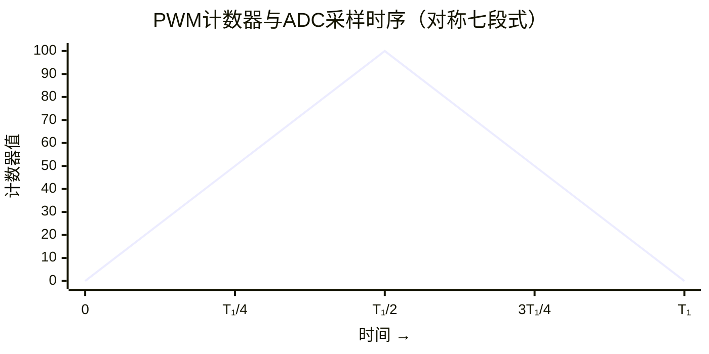
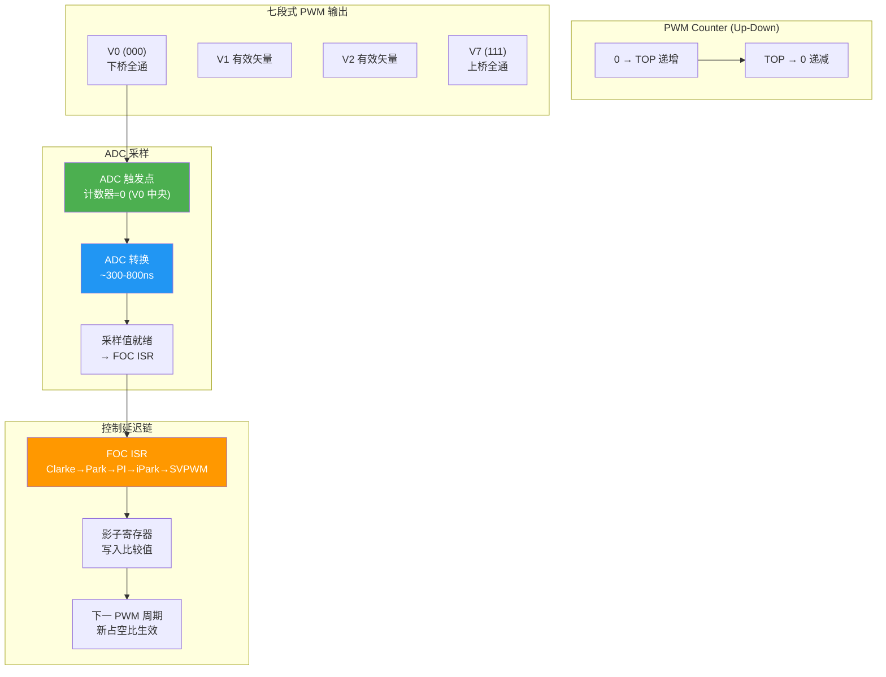

# MC-11：PWM 与采样时序
## PWM更新时序与ADC采样窗口——硬件层的FOC约束

## 难度
★★★☆☆

## 适用对象
- 正在调试 FOC 电流采样波形、遇到"尖刺"或"数据钳位"问题的嵌入式工程师
- 设计 PWM 触发时序和 ADC 采样方案的硬件/固件工程师
- 需要理解单电阻/双电阻/三电阻采样差异的电机驱动开发者

## 前置知识
- [MC-05](MC-05-SVPWM-2Level.md) — SVPWM 七段式开关序列与五段式

## 核心摘要
PWM 采样时序是 FOC 实现中最容易被忽视的硬件细节——采样点位置直接决定了电流测量的噪声水平和闭环稳定性。对称 PWM（七段式）的中点恰好是零矢量 V0(000) 区间，开关噪声已衰减，是理想的 ADC 触发时刻。三电阻方案每个周期获得完整三相电流；单电阻方案成本最低但需要精确的扇区边界处理和电流重构。最小采样脉宽受 SAR ADC 的采样保持+转换时间约束（~300-800ns）。FOC Pipeline 中的 sample_counter 新鲜度检测可防止陈旧采样值进入控制环路。

## PWM 采样时序图





## 交叉引用

| 相关模块 | 关系 | 说明 |
|---------|------|------|
| [MC-05](MC-05-SVPWM-2Level.md) | 前置 | SVPWM 七段式开关序列 |
| [MC-04](MC-04-FOC-Signal-Chain.md) | 关联 | FOC 信号链路中的采样新鲜度检测 |

---

> **定位**：这是 FOC 实现中最容易被忽视的硬件细节——采样点位置直接决定了电流测量的噪声水平和 FOC 闭环的稳定性。电流采不准，后面的 Clarke/Park/PI/SVPWM 再精确也是"垃圾进垃圾出"。
>
> **前置知识**：MC-05（SVPWM 七段式开关序列）。
>
> **目标**：理解 PWM 中点采样的原理、单电阻/双电阻/三电阻采样方案的差异、下桥臂采样窗口要求、最小采样脉宽计算。

---

## 1. 物理直觉：PWM 开关噪声从哪来

### 1.1 开关瞬间的噪声

当 MOSFET/IGBT 开关时：
- **di/dt**：电流急剧变化（开关时间 ~50ns，电流变化 ~1-10A）→ di/dt 可达 200 A/μs
- **dv/dt**：漏源电压急剧变化（从 0 到 Vbus ~50ns）→ dv/dt 可达 10^9 V/s
- **振铃**：开关管内部的寄生电感+电容形成 LC 谐振回路 → 高频振荡 ~20-100 MHz

如果在开关瞬间进行 ADC 采样，采样值会包含这些瞬变噪声，严重影响精度。

### 1.2 最佳采样时机

**下桥臂全部导通时（零矢量 V0(000)）** 是理想的采样窗口：
- 三相上桥臂全部关断，没有开关动作 → 没有 di/dt/dv/dt 噪声
- 所有相电流都经过下桥臂 → 分流电阻上的电压正比于相电流
- 采样窗口接近 PWM 周期中点 → 对称 PWM 的中心，开关噪声已衰减

**对于对称 PWM（七段式），PWM 中点恰好是 V0(000) 区域 → 完美。**

---

## 2. 三相采样方案对比

### 2.1 三电阻方案（lxfoc 默认支持）

每个桥臂的下桥臂串联一个分流电阻。三个 ADC 通道同时采样 ia、ib、ic。

- **优点**：
  - 每个 PWM 周期都能获得完整的三相电流
  - 不需要电流重构，算法简单
  - 可以用 ia+ib+ic≈0 做诊断
- **缺点**：
  - 需要三个 ADC 通道 + 三个放大器
  - 占空比接近 100% 或 0% 时，某些相的下桥臂导通时间太短，采样窗口不足

### 2.2 单电阻方案

直流母线负极串联一个电阻，通过在不同时刻采样来重建三相电流。

- **优点**：电路最简单，成本最低
- **缺点**：
  - 需要精确的采样时刻控制（在特定扇区、特定矢量区间采样）
  - 在某些工作点（扇区边界/低调制深度）采样窗口不足，需要"电流重构"
  - 通常需要有经验的定时器编程

lxfoc 中有 `sampling/lxfoc_sampling_oneshunt.c` 处理单电阻采样的特殊情况。

### 2.3 双电阻方案

A 相和 B 相有分流电阻，C 相由 ia+ib+ic=0 算出。

- **优点**：两个 ADC 通道，电路复杂度居中
- **缺点**：C 相电流由 KCL 推算，无法做 ia+ib+ic 诊断（因为总是 0）

---

## 3. 最小采样脉宽问题

### 3.1 为什么有最小脉宽限制

ADC 采样不是瞬时的。典型的 SAR ADC 需要：
- 采样保持时间（acquisition time）：~100-300ns
- 转换时间（conversion time）：~200-500ns
- 总计：~300-800ns

对应所需的最小下桥臂导通时间：需要 > ADC 总采样时间 + 安全余量。

### 3.2 高占空比/低占空比的边界问题

**高占空比（Duty > 0.9）**：下桥臂导通时间 = (1-Duty) × Ts < 0.1 × 50μs = 5μs，对 20kHz PWM 仍有足够余量。

**接近 100% (Duty > 0.95)**：下桥臂导通时间可能 < 2.5μs，对于几十 ns 级 ADC 仍可用，但需确认 MCU 的具体 ADC 时序。

**接近 0% (Duty < 0.05)**：同理，上桥臂导通时间短，对于用上桥臂导通往采样电流的电路可能有问题。

### 3.3 五段式 PWM 的采样考量

五段式有一相在整个周期内完全不开关（占空比保持 100% 或 0%）。该相的下桥臂在整个周期都导通（或关断），因此总能采到该相电流——这就是 lxfoc 在高调制深度时自动切换到五段式的一个好处。

> lxfoc 代码对应：`sampling/lxfoc_sampling_pwm_adapt.c`（自适应 PWM 切换，确保采样窗口）

---

## 4. PWM 更新与 ADC 采样的时序关系

### 4.1 标准时序（对称 PWM）

```
T0  T1    T2     T7     T2    T1  T0
____---------------_________---------------____   PWM上升沿
    |--- 第一半周期 ---|   |--- 第二半周期 ---|

↑                        ↑                        ↑
PWM计数器=0          PWM计数器=TOP           PWM计数器=0
(采样点)              (PWM中点，V7)           (下一周期)

ADC触发点：
  ← PWM计数器=0 中断 (下溢中断) →
  ← 触发ADC采样，读取上一周期的电流测量值 →
```

**关键时序**：
1. PWM 计数器从 0 向上计数到 TOP（递增），再从 TOP 向下计数到 0（递减）
2. 在计数器=0（PWM 周期的起点 = 中点）触发 ADC 采样
3. ADC 转换完成后产生 ADC 中断 → 进入 FOC ISR
4. ISR 中运行：读取 ADC 值 → Clarke → Park → PI → iPark → SVPWM → 更新 PWM 比较寄存器
5. PWM 比较寄存器的更新在下一次 PWM 计数器=TOP（或=0）时生效

**延迟分析**：
- ADC 转换延迟（从触发到结果可用）：~1-2μs
- ISR 执行时间（FOC 完整算法）：~5-30μs（取决于 MCU 速度和算法复杂度）
- PWM 更新延迟（从写入寄存器到生效）：取决于更新策略
  - 立即更新：可能导致当前周期的 PWM 部分错误（不对称）
  - 影子寄存器（预装）：在下一周期开始时生效 → 固定 1 个 Ts 的延迟

### 4.2 一周期延迟的控制含义

1 个 Ts（如 20kHz → 50μs）的控制延迟，在频率域中等效于一个一阶 Padé 近似：
$$ e^{-sT_s} \approx \frac{1 - sT_s/2}{1 + sT_s/2} $$

这引入了高频相位滞后。在截止频率 ωc ≈ 1/(2Ts) 时，滞后约 14°。对于电流环，这个延迟通常可以忽略（ωc << 1/Ts）。

---

## 5. 与 lxfoc 代码的对应关系

### 采样重构模块

```
sampling/lxfoc_sampling_reconstruct.c    →  电流重构（从多时刻采样恢复三相电流）
sampling/lxfoc_sampling_oneshunt.c       →  单电阻采样的扇区边界处理
sampling/lxfoc_sampling_pwm_adapt.c      →  自适应 PWM 调整，确保采样窗口
sampling/lxfoc_sampling_downsample.{h,c} →  下采样/滤波
```

### FOC Pipeline 中的新鲜度检测

```
pipeline/lxfoc_pipeline_foc.h:49-54  →  sample_counter 字段
pipeline/lxfoc_pipeline_foc.c:
  run_current()  →  检查 sample_counter 是否更新
                  →  若未更新，设置 sample_stale_fault=1，跳过本周期
```

### SVPWM 中的死区补偿

```
transform/lxfoc_transform_svpwm.h:106-112  →  死区补偿配置
  deadtime_comp_enable:  使能死区补偿
  deadzone_current_threshold_pct:  电流过零区不补偿的阈值
  rated_current:  额定电流
```

---

## 6. 常见调试陷阱

### 6.1 ADC 采样的位置不对（采在开关边沿）

**症状**：电流波形有明显的"尖刺"，且尖刺定期出现（每个扇区一次或每个 PWM 周期一次）。

**原因**：ADC 触发时机不对——可能触发在 PWM 比较匹配点（上下管切换点）而非 PWM 中点（V0 零矢量期间）。

**排查方法**：
1. 在 PWM 周期中用一个 GPIO 翻转（置高在 ADC 触发时刻，置低在 ADC 转换完成时刻）来指示 ADC 采样窗口
2. 用示波器同时观测该 GPIO 和 PWM 波形
3. 确认 GPIO 高电平区域落在 PWM 低电平区域的中央

### 6.2 五段式 PWM 采样窗口丢失

**症状**：高调制深度时偶尔出现电流跳变或 ADC 转换错误。

**原因**：切换到五段式后，有相的下桥臂在整个周期导通。如果用单一触发时刻做 ADC 采样（三电阻方案），可能会丢失某些相的采样窗口。

**lxfoc 对策**：`sampling/lxfoc_sampling_pwm_adapt.c` 管理五段式下的采样窗口调整。

### 6.3 ADC 转换时间不够

**症状**：ADC 读数偏低且变化很少，看起来像"被钳位了"。

**原因**：采样保持时间不足——容性负载（分流电阻+运放输出阻抗）未完全充电。

**检查方法**：查阅 MCU 数据手册中 ADC 的输入阻抗要求，计算所需的最小信号源输出阻抗是否满足 RC 时间常数 ≤ T_acq / (N_bit × 0.693)。

### 6.4 电流零点附近的死区影响

**症状**：在 i≈0 附近电流波形不连续（非正弦扭曲）。

**原因**：死区补偿在电流过零区域失效（电流极性判断抖动），加上不补偿的电流范围设置过大。

**lxfoc 的策略**：死区补偿有一个可配置的电流阈值 `deadzone_current_threshold_pct`（默认 5% 额定电流），低于此电流时不补偿。需要根据实际电流噪声水平调整这个阈值。

---

## 7. 相关资料

- lxfoc: `sampling/` 目录（采样重构、单电阻、PWM 自适应）
- lxfoc: `pipeline/lxfoc_pipeline_foc.{h,c}`（新鲜度检测）
- lxfoc: `transform/lxfoc_transform_svpwm.{h,c}`（死区补偿部分）
- 知识库: `MC-05`（SVPWM 调制）、`MC-04`（FOC 信号链路）
- 知识库: `ALG-02`（电流采样与 PWM 时序）
