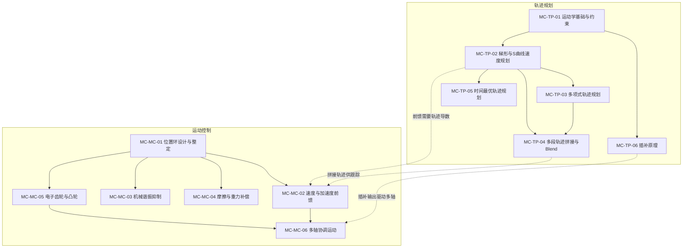

# 🎯 轨迹规划与运动控制路径

> **核心理念**：FOC 把电流管好了，速度环把转速管稳了，但电机最终要完成的是"按预定轨迹运动到目标位置"——轨迹规划决定"怎么走"，运动控制决定"走得多准"。这条路径补齐从底层驱动到上层应用的最后一公里。

---

## 学习路径总览

---

## 轨迹规划路径（MC-TP）

> 从"电机能跑多快"的物理约束出发，到"怎么规划一条平滑轨迹"的工程方法

| 编号 | 模块 | 核心问题 | 难度 | 前置知识 |
|------|------|---------|------|---------|
| MC-TP-01 | [运动学基础与约束](./MC-TP-01-Kinematics-Constraints.md) | 位置、速度、加速度、加加速度（jerk）的物理约束从哪来？ | ★★☆☆☆ | CT-01, CT-02 |
| MC-TP-02 | [梯形与S曲线速度规划](./MC-TP-02-Trapezoidal-S-Curve.md) | 为什么伺服系统几乎都用S曲线而非梯形曲线？ | ★★★☆☆ | MC-TP-01 |
| MC-TP-03 | [多项式轨迹规划](./MC-TP-03-Polynomial-Trajectory.md) | 如何用多项式保证轨迹的任意阶连续性？ | ★★★★☆ | MC-TP-01, CT-10 |
| MC-TP-04 | [多段轨迹拼接与Blend](./MC-TP-04-Multi-Segment-Blend.md) | 多个运动段之间如何平滑过渡？ | ★★★★☆ | MC-TP-02, MC-TP-03 |
| MC-TP-05 | [时间最优轨迹规划](./MC-TP-05-Time-Optimal.md) | 在约束边界上跑——如何用最短时间完成运动？ | ★★★★★ | MC-TP-02, CT-13 |
| MC-TP-06 | [插补原理](./MC-TP-06-Interpolation.md) | CNC和机器人如何从离散点生成连续轨迹？ | ★★★★☆ | MC-TP-01 |

---

## 运动控制路径（MC-MC）

> 从"位置环怎么调"到"多轴怎么协调"，解决轨迹跟踪的精度问题

| 编号 | 模块 | 核心问题 | 难度 | 前置知识 |
|------|------|---------|------|---------|
| MC-MC-01 | [位置环设计与整定](./MC-MC-01-Position-Loop.md) | 位置环Kp怎么调？为什么位置环几乎只用P？ | ★★★☆☆ | CT-14, ALG-12 |
| MC-MC-02 | [速度与加速度前馈](./MC-MC-02-Feedforward.md) | 前馈如何让跟踪误差趋近于零？ | ★★★★☆ | CT-06, MC-TP-02 |
| MC-MC-03 | [机械谐振抑制](./MC-MC-03-Resonance-Suppression.md) | 电机和负载之间的弹性如何引发谐振？怎么治？ | ★★★★★ | CT-03, CT-14 |
| MC-MC-04 | [摩擦与重力补偿](./MC-MC-04-Friction-Gravity.md) | 非线性摩擦和重力如何破坏跟踪精度？ | ★★★★☆ | CT-06, MC-MC-01 |
| MC-MC-05 | [电子齿轮与凸轮](./MC-MC-05-Electronic-Gearing.md) | 如何实现主从轴的精确同步运动？ | ★★★☆☆ | MC-MC-01 |
| MC-MC-06 | [多轴协调运动](./MC-MC-06-Multi-Axis.md) | 多个电机如何协调完成空间轨迹？ | ★★★★★ | MC-TP-06, MC-MC-05 |

---

## 与其他路径的关系

| 已有路径 | 与本路径的关联 |
|---------|-------------|
| 🔧 电控硬件（HW） | 位置传感器精度决定轨迹跟踪精度上限；编码器分辨率→最小位置分辨率 |
| 🧮 算法（ALG） | FOC电流环是运动控制的内环基础；速度环（ALG-12）是位置环的直接内环 |
| 📐 控制理论（CT） | CT-14三环级联是运动控制的标准架构；CT-06前馈是MC-MC-02的理论基础 |
| 🎯 控制器演化（CE） | CE-16轨迹跟踪从LQR/MPC理论视角讨论"怎么跟"，本路径从工程视角讨论"轨迹怎么生"和"位置环怎么调" |
| ⚡ 高级算法（ADV） | ADV-ALG-01带宽设计直接影响位置环带宽上限；ADV-ALG-07前馈解耦与MC-MC-02互补 |

---

## 学习建议

### 伺服驱动工程师路线
1. MC-TP-01（运动学约束）→ MC-TP-02（S曲线规划）→ MC-MC-01（位置环整定）→ MC-MC-02（前馈）
2. 遇到谐振问题 → MC-MC-03
3. 遇到摩擦/重力问题 → MC-MC-04
4. 需要主从同步 → MC-MC-05

### 机器人/CNC 工程师路线
1. MC-TP-01 → MC-TP-06（插补）→ MC-TP-04（多段拼接）→ MC-MC-06（多轴协调）
2. MC-MC-01 → MC-MC-02（前馈）→ MC-MC-05（电子凸轮）
3. MC-TP-05（时间最优）按需学习

### 电机控制工程师扩展路线
1. 已掌握 FOC + 速度环 → MC-MC-01（位置环）→ MC-MC-02（前馈）→ MC-TP-02（S曲线）
2. 从"让电机转稳"升级到"让电机走到位"

---

## 文档信息
- 知识体系：电控知识库 / 轨迹规划与运动控制路径
- 模块总数：12（MC-TP-01~06 + MC-MC-01~06）
- 覆盖范围：轨迹生成 + 位置控制 + 前馈补偿 + 谐振抑制 + 多轴协调
- 更新日期：2026-06-13
