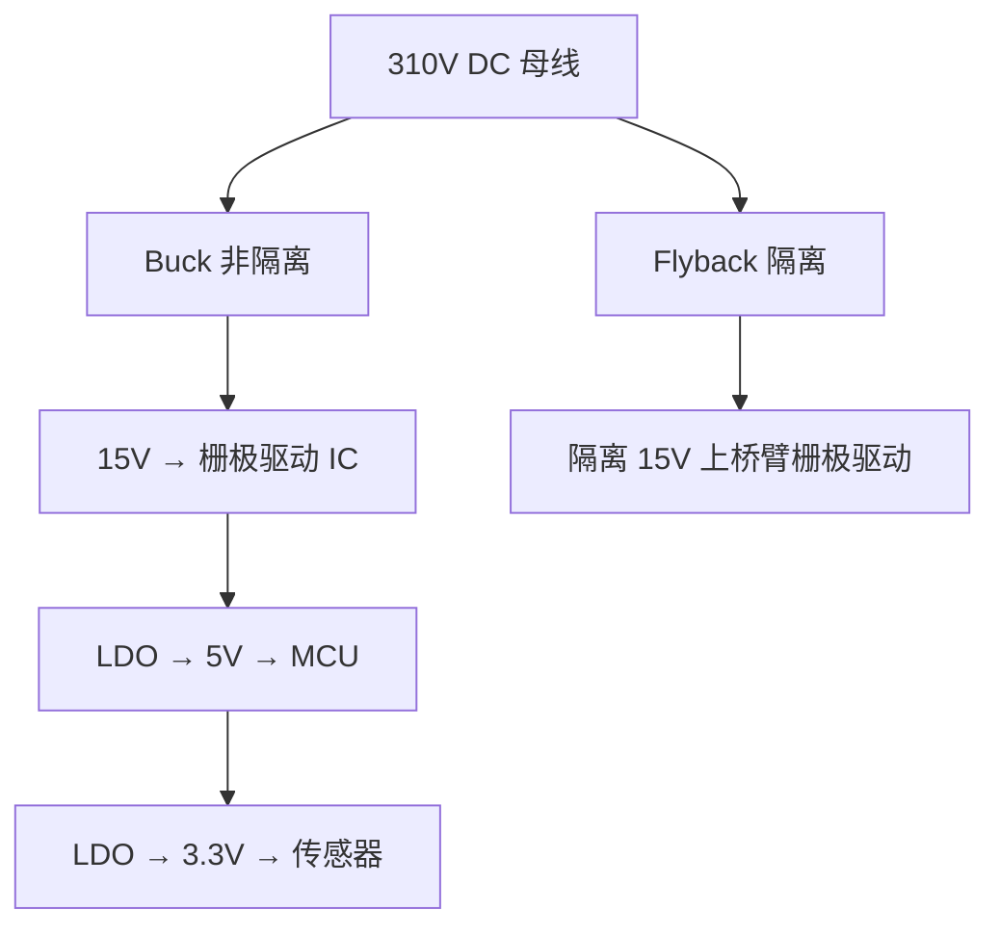

# PP-01: DC-DC 基础拓扑（Buck/Boost/Buck-Boost）

**副标题：从占空比到能量传输——开关电源的三大基石拓扑**

**难度：** ★★★★☆

---

## 1. 📌 核心摘要 ★★★★☆ 🔰📚

**一句话讲清楚**：Buck（降压）、Boost（升压）、Buck-Boost（升降压）是开关电源的三大基本非隔离拓扑。Buck 通过 PWM 斩波将高压转为低压（$$V_{out}=D\cdot V_{in}$$），Boost 通过电感储能将低压泵升为高压（$$V_{out}=V_{in}/(1-D)$$），Buck-Boost 则能输出反极性电压（$$V_{out}=-D\cdot V_{in}/(1-D)$$）。在电机驱动系统中，Buck 用于从高压母线产生栅极驱动电源和 MCU 供电，Boost 用于 PFC 前级和制动能量回收升压。

**认知挂钩**：很多硬件工程师认为"DC-DC 就是选个芯片照抄 datasheet 原理图就能用"，**这是致命的工程误解！** 实际上，开关电源的电感选型、MOSFET 开关损耗、输出电容 ESR、环路稳定性——任何一个环节出错都会导致电源振荡、烧毁或 EMI 超标。电机驱动中的辅助电源更是如此：高压母线（310V）直接给栅极驱动供电是不现实的，必须通过 Buck 或 Flyback 降压到 12~15V。

**与电机控制的关联**：
- 🔗 **栅极驱动供电 Buck**：从 310V/48V 母线降压到 12~15V，驱动 MOSFET/IGBT 栅极
- 🔗 **MCU/传感器供电**：Buck 再降压到 5V → LDO 到 3.3V，为 MCU 和传感器提供干净电源
- 🔗 **Boost PFC 前级**：功率因数校正的核心拓扑就是 Boost，在电机驱动输入级广泛应用
- 🔗 **制动能量管理**：制动时 Boost 将低压升压回馈到母线

---

## 2. 🤔 问题引入 ★★★★☆ 🔰

### 工程师的真实困惑

> **场景1：Buck 输出振荡，MCU 频繁复位**
>
> ```
> 工程师A:"我用 LM2596 从 48V 降到 5V 给 MCU 供电，
> 但电机一启动，5V 就出现大幅振荡，MCU 频繁复位..."
> 问题现象:
> - 空载时 5V 电压稳定
> - 电机启动后 5V 出现 200mV 低频振荡（1~2kHz）
> - 输出电容发烫
> ```

> **场景2：栅极驱动电源功率不足**
>
> ```
> 工程师B:"自制栅极驱动电源 Buck，空载 15V 正常，
> 一带载（驱动 IGBT）电压就掉到 10V..."
> 问题现象:
> - 电感发出啸叫声
> - MOSFET 温度急剧升高
> - 占空比已经最大但电压仍上不去
> ```

> **场景3：多路电源启动时序混乱**
>
> ```
> 工程师C:"电机驱动板上电时，3.3V 先于 1.8V 建立，
> 导致 DSP 上电时序不满足要求，偶尔无法启动..."
> 问题现象:
> - 概率性启动失败（约 30% 概率）
> - 手动复位后正常
> ```

### 核心问题

这些问题的根本原因是什么？

**答案**：不理解 DC-DC 变换器的工作模态、电感的能量传输本质和闭环控制的稳定性！

- Buck 输出振荡 → 环路不稳定，输出电容 ESR 过大或补偿网络设计错误
- 栅极电源功率不足 → 电感饱和，MOSFET 选型不当（Rdson 过大）
- 上电时序混乱 → 缺乏对软启动和 Power Good 级联的理解

### 学习目标

读完本模块，你将能够：

✅ **推导 Buck/Boost/Buck-Boost 的稳态电压增益** - 从电感伏秒平衡出发
✅ **计算电感电流纹波和临界模式边界** - $$\Delta I_L$$ 与 CCM/DCM 判断
✅ **理解右半平面零点（RHPZ）** - Boost/Buck-Boost 特有的动态限制
✅ **选择关键元件（MOSFET、二极管、电感、电容）** - 电压/电流应力、损耗计算
✅ **设计基本闭环控制** - 电压模式/电流模式控制的区别
✅ **将 DC-DC 应用于电机驱动系统** - 栅极驱动电源、辅助电源架构

---

## 3. 💡 直观理解 ★★★★☆ 🔰💡

> **类比1：Buck 就像"水龙头 + 水桶"**
>
> ```
> 水龙头断续打开，水桶接水：
>   水龙头全开 → 水桶水位上升（开关管导通，电感充电）
>   水龙头关闭 → 水桶水位下降（开关管关断，电感放电）
>
>   水龙头开的时间比例 → 占空比 D
>   水桶平均水位      → 输出电压 Vout
>   进水管水压        → 输入电压 Vin
>
>   Vout = D × Vin （水桶水位 = 开阀比例 × 进水压力）
> ```

**关键洞察**：Buck 是一个"斩波平均"的过程——通过 LC 滤波将 PWM 方波平均化，得到更低的直流电压。电感的作用是平滑电流，电容的作用是平滑电压。

> **类比2：Boost 就像"水泵蓄能"**
>
> ```
> 水锤泵原理：
>   水流突然截止 → 动能转化为压力 → 水被泵到更高处
>
> Boost 类似：
>   开关管导通 → 电感电流建立（储存磁能 ½LI²）
>   开关管关断 → 电感电流不能突变 → 电压反冲
>   → 电感电压叠加输入电压 → 输出高于输入！
>
>   Vout = Vin / (1-D) （D 越大，升压比越大）
> ```

> **类比3：Buck-Boost 就像"跷跷板"**
>
> ```
> 跷跷板一端输入，另一端输出反相：
>   开关导通 → 电感从输入取能（跷跷板输入侧下压）
>   开关关断 → 电感向输出释放（跷跷板输出侧弹起）
>
>   输出极性与输入相反！
>   Vout = -Vin × D/(1-D)
> ```

### 关键概念速查

| 拓扑 | 电压增益 | 开关管电压应力 | 二极管电压应力 | 输入电流 | 输出电流 |
|------|---------|---------------|---------------|---------|---------|
| Buck | $$V_{out}=D\cdot V_{in}$$ | $$V_{in}$$ | $$V_{in}$$ | 断续 | 连续 |
| Boost | $$V_{out}=V_{in}/(1-D)$$ | $$V_{out}$$ | $$V_{out}$$ | 连续 | 断续 |
| Buck-Boost | $$V_{out}=-D\cdot V_{in}/(1-D)$$ | $$V_{in}+V_{out}$$ | $$V_{in}+V_{out}$$ | 断续 | 断续 |

---

## 4. 🔬 技术原理 ★★★★☆ 📚

### 4.1 Buck 变换器深入分析

#### 4.1.1 工作模态

**模态1：开关管导通（0 ~ D×T）**


电感电压：VL = Vin - Vout
电感电流上升斜率：diL/dt = (Vin - Vout) / L

**模态2：开关管关断（D×T ~ T）**


电感电压：VL = -Vout（忽略二极管压降）
电感电流下降斜率：diL/dt = -Vout / L

#### 4.1.2 伏秒平衡推导电压增益

稳态下，电感电流在一个周期内的净变化为零（伏秒平衡）：

$$
(V_{in} - V_{out}) \cdot D \cdot T + (-V_{out}) \cdot (1-D) \cdot T = 0
$$

整理得：

$$
V_{out} = D \cdot V_{in}
$$

#### 4.1.3 电感电流纹波

电感电流纹波峰峰值：

$$
\Delta I_L = \frac{(V_{in} - V_{out}) \cdot D \cdot T}{L} = \frac{V_{out} \cdot (1-D) \cdot T}{L}
$$

用输入电压表达：

$$
\Delta I_L = \frac{V_{in} \cdot D \cdot (1-D)}{f_s \cdot L}
$$

**纹波最大时的占空比**：对 D 求导可知，$$D=0.5$$ 时纹波最大：

$$
\Delta I_{L,max} = \frac{V_{in}}{4 \cdot f_s \cdot L}
$$

```text
手推示例（电机驱动栅极电源 Buck）：
  Vin = 48V, Vout = 15V, fs = 200kHz, L = 47μH
  D = 15/48 = 0.3125
  ΔIL = 48 × 0.3125 × (1-0.3125) / (200000 × 47e-6)
      = 48 × 0.3125 × 0.6875 / 9.4
      = 10.31 / 9.4 = 1.097A
  
  若 Iout = 2A，则 Ipeak = 2 + 1.097/2 = 2.55A
  → 电感饱和电流需 > 2.55A（取 1.5 倍余量 → 3.8A）
```

#### 4.1.4 CCM/DCM 边界

临界导通模式（BCM）发生在电感电流最小值刚好为零时：

$$
I_{out,crit} = \frac{\Delta I_L}{2} = \frac{V_{in} \cdot D \cdot (1-D)}{2 \cdot f_s \cdot L}
$$

- 当 $$I_{out} > I_{out,crit}$$：CCM（连续导通模式）
- 当 $$I_{out} < I_{out,crit}$$：DCM（断续导通模式）

> ⚠️ **工程警告**：DCM 下 Buck 的电压增益不再是简单的 $$V_{out}=D \cdot V_{in}$$！DCM 增益为 $$V_{out} = \frac{2V_{in}}{1+\sqrt{1+4K/D^2}}$$，其中 $$K=2Lf_s/R_{load}$$。这会导致轻载时输出电压偏高，若不考虑可能触发过压保护！

#### 4.1.5 输出电容与纹波

输出电容上的电压纹波由两部分组成：

**容性纹波**（电荷充放）：
$$
\Delta V_{C} = \frac{\Delta I_L}{8 \cdot f_s \cdot C_{out}}
$$

**ESR 纹波**（电阻压降）：
$$
\Delta V_{ESR} = \Delta I_L \cdot ESR
$$

总纹波（最坏估计）：
$$
\Delta V_{out} = \Delta V_C + \Delta V_{ESR}
$$

```text
手推示例（续）：
  Cout = 220μF 电解（ESR = 0.2Ω）
  ΔVC = 1.097 / (8 × 200000 × 220e-6) = 3.12mV
  ΔVESR = 1.097 × 0.2 = 219mV
  → ESR 纹波占主导！总纹波 ≈ 222mV
  
  若改用 MLCC：Cout = 22μF × 3（ESR = 3mΩ）
  ΔVC = 1.097 / (8 × 200000 × 66e-6) = 10.4mV
  ΔVESR = 1.097 × 0.003 = 3.3mV
  → 总纹波 ≈ 14mV ✅
```

#### 4.1.6 MOSFET 和二极管选型

**MOSFET 电压应力**：$$V_{DS,max} = V_{in}$$（需考虑漏感尖峰，取 1.5 倍余量）

**MOSFET 导通损耗**：
$$
P_{cond} = I_{rms}^2 \cdot R_{dson}
$$

其中 $$I_{rms} = I_{out} \cdot \sqrt{D}$$

**MOSFET 开关损耗**：
$$
P_{sw} = \frac{1}{2} \cdot V_{in} \cdot I_{out} \cdot (t_r + t_f) \cdot f_s
$$

**二极管导通损耗**：
$$
P_D = V_F \cdot I_{out} \cdot (1-D)
$$

**二极管反向恢复损耗**（不可忽略！）：
$$
P_{rr} = \frac{1}{2} \cdot V_{in} \cdot I_{rr} \cdot t_{rr} \cdot f_s
$$

---

### 4.2 Boost 变换器深入分析

#### 4.2.1 工作模态与电压增益

**模态1：开关管导通**


电感充电，输出电容向负载供电
VL = Vin
diL/dt = Vin/L（电流上升）

**模态2：开关管关断**


电感放电，输入+电感能量共同向输出供电
VL = Vin - Vout（为负值，电流下降）
diL/dt = (Vin - Vout)/L（电流下降）

伏秒平衡：

$$
V_{in} \cdot D \cdot T + (V_{in} - V_{out}) \cdot (1-D) \cdot T = 0
$$

$$
V_{out} = \frac{V_{in}}{1-D}
$$

#### 4.2.2 电感电流纹波

$$
\Delta I_L = \frac{V_{in} \cdot D}{f_s \cdot L}
$$

CCM/DCM 边界：
$$
I_{out,crit} = \frac{V_{in} \cdot D \cdot (1-D)}{2 \cdot f_s \cdot L}
$$

> ⚠️ 注意：Boost 的输入电流等于电感平均电流，而输出电流是二极管平均电流。$$I_{in} = I_{out}/(1-D)$$

#### 4.2.3 右半平面零点（RHPZ）——Boost 的阿喀琉斯之踵

Boost 和 Buck-Boost 存在**右半平面零点**（Right Half-Plane Zero），这是小信号模型中最棘手的动态特性：

$$
\omega_{RHPZ} = \frac{R_{load} \cdot (1-D)^2}{L}
$$

或写为：
$$
f_{RHPZ} = \frac{R_{load} \cdot (1-D)^2}{2\pi \cdot L}
$$

**RHPZ 的物理含义**：

> 当占空比增大（试图提升输出电压），电感需要更多时间充电。但充电期间二极管反偏，输出电容单独向负载供电 → 输出电压先跌落后上升！这种"先跌后升"的非最小相位行为，在频域中表现为 RHPZ。

**RHPZ 对环路设计的限制**：
- 穿越频率必须远低于 RHPZ 频率：$$f_c \leq f_{RHPZ}/3 \sim f_{RHPZ}/5$$
- RHPZ 随负载变化——重载时 RHPZ 频率最低（最恶劣情况）

```text
手推示例：
  Boost: Vin=48V, Vout=72V, L=100μH, Rload=10Ω
  D = 1-48/72 = 0.333
  f_RHPZ = 10×(1-0.333)²/(2π×100e-6) = 10×0.444/(6.28e-4)
         = 4.44/6.28e-4 = 7070 Hz
  
  → 穿越频率 fc 应 < 7070/3 ≈ 2.4kHz！
  这意味着 Boost 的动态响应天生就慢！
```

---

### 4.3 Buck-Boost 变换器

#### 4.3.1 工作模态与电压增益

Buck-Boost 是 Buck 和 Boost 的级联变体：

**模态1：开关管导通**


电感充电，输出电容向负载供电
VL = Vin

**模态2：开关管关断**


电感向输出释放能量（电流方向与输入相反！）
VL = Vout（Vout 为负值）

伏秒平衡：

$$
V_{in} \cdot D \cdot T + V_{out} \cdot (1-D) \cdot T = 0
$$

$$
V_{out} = -V_{in} \cdot \frac{D}{1-D}
$$

#### 4.3.2 关键特性

- **反极性输出**：输出电压与输入电压极性相反
- **升降压灵活**：D < 0.5 降压，D > 0.5 升压
- **MOSFET 电压应力**：$$V_{DS} = V_{in} + |V_{out}|$$
- **同样存在 RHPZ**：$$\omega_{RHPZ} = \frac{R_{load} \cdot (1-D)^2}{D \cdot L}$$

#### 4.3.3 Buck-Boost 的变体

| 变体 | 特点 | 适用场景 |
|------|------|---------|
| 传统 Buck-Boost | 反极性，单开关 | 负压产生 |
| SEPIC | 正极性输出，双电感 | 升降压但需正输出 |
| Ćuk | 输入输出电流都连续 | 低 EMI 应用 |
| 4-Switch Buck-Boost | 正极性，高效率 | 电池供电（锂电 3~4.2V → 3.3V） |

---

### 4.4 闭环控制基础

#### 4.4.1 电压模式控制（VMC）


- **优点**：简单，单环路
- **缺点**：LC 双极点使补偿复杂，输入电压扰动响应慢

Buck 的 LC 滤波引入双极点：
$$
f_{LC} = \frac{1}{2\pi\sqrt{LC}}
$$

#### 4.4.2 电流模式控制（CMC / Peak Current Mode）


- **优点**：电感电流内环将 LC 双极点降为单极点（补偿简化），逐周期限流，输入电压前馈
- **缺点**：D > 0.5 时需要斜率补偿防次谐波振荡

> 🔗 **与电机控制 FOC 的关联**：电流模式控制 DC-DC 本质上就是 FOC 电流内环的单变量版本！都是电流环 + 外环的级联结构。理解了 DC-DC 电流模式控制，FOC 的电流环就很容易理解。

---

## 5. 🔗 交叉视角 ★★★★☆ 💡

### 5.1 Buck → 电机驱动辅助供电

电机驱动器需要多路隔离/非隔离电源：



**选型要点**：
- 高压 Buck IC（如 VIPer、NCP107x 系列）可直接从 310V 母线取电
- 15V 输出需要低纹波（<50mV）以防止栅极误触发
- 电机启动瞬间母线跌落，Buck 输入范围需覆盖最低母线电压

### 5.2 Boost → PFC + 制动能量回收

**PFC Boost**：电机驱动输入级，将整流后的脉动直流升压到稳定 400V，实现功率因数校正。

**制动能量回收**：电机减速时动能转化为电能回馈到母线。若母线电压过高，可用 Boost 将能量泵回电网（有源前端 AFE）或通过制动电阻泄放。

### 5.3 Buck-Boost → 宽输入范围辅助电源

当母线电压变化范围很大时（如 24V~72V 电池供电的 AGV 电机驱动），Buck-Boost 或 SEPIC 能从宽范围输入产生稳定输出。

### 5.4 电流模式控制 → FOC 电流环

| DC-DC 电流模式控制 | FOC 电流环 |
|-------------------|-----------|
| 采样电感电流 | 采样相电流 |
| 与误差放大器输出比较 | 与 PI 控制器输出比较 |
| 逐周期限流 | 逐周期 PWM 占空比更新 |
| 斜率补偿（D>0.5） | 解耦补偿（dq 轴交叉耦合） |

---

## 6. 🎯 工程案例 ★★★★☆ 🎯

### 案例1：Buck 栅极驱动电源——电感饱和导致 MOSFET 烧毁

**项目背景**：
```text
应用: 48V/1kW 伺服驱动器栅极驱动电源
Buck 参数: Vin=48V, Vout=15V, Iout=2A, fs=200kHz
电感: 47μH, 饱和电流 3A（标称）
MOSFET: IRF540N (100V/33A, Rdson=44mΩ)
```

**故障现象**：
```text
正常运行 10 分钟后 Buck MOSFET 烧毁短路，
栅极驱动 IC 全部损坏，造成整块驱动板报废。
```

**诊断过程**：
```text
步骤1: 实测 15V 输出 → 稳定，纹波 80mV（正常）
步骤2: 测量电感电流波形 → 异常！峰值达 5.2A！
步骤3: 计算理论 ΔIL：
  D = 15/48 = 0.3125
  ΔIL = (48-15) × 0.3125 / (200000 × 47e-6) = 1.1A
  理论峰值 = 2 + 1.1/2 = 2.55A < 3A（理论过关）

步骤4: 拆下电感，LCR 电桥实测 → 47μH@0A, 22μH@3A, 8μH@5A！
  → 电感在 3A 时已开始饱和，5A 时电感量暴跌至 8μH
  → 实际纹波电流远超计算值！
```

**根本原因**：电感磁芯选型不当——标称"饱和电流 3A"是电感量下降 30% 的电流（软饱和定义），实际在 3A 时电感量已大幅下降，导致纹波电流雪崩式增长 → MOSFET 峰值电流远超设计值 → 过温烧毁。

**解决方案**：
```text
方案A: 换用电感 47μH, Isat>6A（2倍余量） ✅
  铁硅铝磁环电感，直流偏置特性好

方案B: 增加逐周期过流保护 ✅✅
  采样 MOSFET 源极电流，超过阈值立即关断
  多数现代 Buck IC 已内置此功能

方案C: 选择带过流保护的 Buck 控制器 ✅✅✅
  如 LM5116、LT3845 等，硬件逐周期限流
```

### 案例2：Boost PFC 母线电压振荡——RHPZ 作祟

**项目背景**：
```text
应用: 3kW 电机驱动 PFC 前级
Boost 参数: Vin=220VAC→310VDC, Vout=400V, fs=65kHz
L=500μH, Cout=1000μF
电压环穿越频率: 设计 20Hz（PFC 电压环很慢）
```

**故障现象**：
```text
轻载时 400V 输出稳定，满载（3kW）后 400V 出现 10Hz 振荡，
幅值±20V，触发过压保护（420V 门限）。
```

**诊断过程**：
```text
步骤1: 计算重载 RHPZ 频率
  Pout = 3000W, Vout = 400V
  Rload = 400²/3000 = 53.3Ω
  D = 1-310/400 = 0.225
  
  f_RHPZ = Rload×(1-D)²/(2π×L)
         = 53.3×(1-0.225)²/(2π×500e-6)
         = 53.3×0.601/(3.14e-3)
         = 32.0/3.14e-3 = 10191 Hz
  
  看起来还行... 

步骤2: 但 PFC 的 Rload 是脉动的！
  输入交流整流后是 100Hz 脉动（全波整流）
  电感电流跟随输入电压波形（PFC 特性）
  
  等效 Rload 在交流过零点附近非常大（轻载）→ f_RHPZ 极低！
  → 电压环在过零点附近不稳定
```

**根本原因**：PFC Boost 的 RHPZ 随瞬时负载剧烈变化，在交流过零点附近 RHPZ 频率极低，导致电压环路条件性不稳定。

**解决方案**：
```text
方案A: 大幅降低电压环穿越频率到 10Hz 以下 ✅
  牺牲动态响应换取稳定性（PFC 电压环慢是可接受的）

方案B: 采用平均电流模式控制 + 输入电压前馈 ✅✅
  消除输入电压变化对环路的影响
```

---

## 7. 📝 实践练习

### 练习1：计算题——Buck 电感纹波

设计一个 Buck 变换器：Vin = 48V，Vout = 12V，fs = 300kHz，L = 33μH。计算：(1) 占空比 D；(2) 电感电流纹波 ΔIL；(3) 若输出电流 3A，判断工作于 CCM 还是 DCM。

*参考答案：D = 12/48 = 0.25；ΔIL = 48×0.25×(1-0.25)/(300000×33e-6) = 9/9.9 = 0.909A；Iout_crit = 0.909/2 = 0.455A < 3A → CCM*

### 练习2：计算题——Boost RHPZ 与环路限制

Boost：Vin = 24V，Vout = 48V，L = 68μH，满载 Rload = 10Ω。计算：(1) 占空比 D；(2) 满载时 RHPZ 频率；(3) 电压环穿越频率的建议上限。

*参考答案：D = 1-24/48 = 0.5；f_RHPZ = 10×(1-0.5)²/(2π×68e-6) = 10×0.25/(4.27e-4) = 5855Hz；fc_max ≤ f_RHPZ/3 ≈ 1952Hz → 建议 fc ≤ 1kHz*

### 练习3：设计题——Buck 输出电容选型

Buck：Vin = 24V，Vout = 5V，fs = 500kHz，L = 10μH，要求输出纹波 < 30mV。现有两种电容可选：电解 470μF/ESR=0.15Ω 和 MLCC 10μF×5/ESR=2mΩ，请选择并说明理由。

*参考答案：D=5/24=0.208；ΔIL=24×0.208×(1-0.208)/(500000×10e-6)=3.96/5=0.792A。电解方案：ΔVESR=0.792×0.15=118.8mV > 30mV ❌。MLCC方案：ΔVESR=0.792×0.002=1.58mV；ΔVC=0.792/(8×500000×50e-6)=3.96mV；总纹波≈5.5mV < 30mV ✅。选 MLCC 方案*

### 练习4：诊断题——Buck 效率异常

某 Buck：Vin=48V，Vout=12V，Iout=5A，测得效率仅 78%。已知 MOSFET Rdson=30mΩ，二极管 VF=0.5V，fs=100kHz，tr+tf=20ns。请计算各部分损耗，找出效率低下的主因。

*参考答案：D=12/48=0.25。输出功率：12×5=60W。MOSFET 导通损耗：5²×0.030×0.25=0.188W。二极管损耗：0.5×5×0.75=1.875W。开关损耗：0.5×48×5×20e-9×100000=0.24W。电感铜损（假设 DCR=50mΩ）：5²×0.05=1.25W。总损耗≈3.55W，效率≈60/63.55≈94.4%？不匹配！→ 实测效率 78% 意味着额外损耗 ~10W → 可能是 MOSFET 开关速度过慢（检查栅极驱动能力）、电感磁芯损耗过大、或 PCB 铜损过大*

### 练习5：选择题

**题目1**：Buck 变换器中，电感电流纹波在哪个占空比下最大？
- A. D=0.1  B. D=0.5  C. D=0.9  D. 与 D 无关

> 答案：B（ΔIL ∝ D×(1-D)，在 D=0.5 时取最大值）

**题目2**：Boost 变换器的右半平面零点频率在什么条件下最低？
- A. 轻载  B. 重载  C. D=0.5  D. 与负载无关

> 答案：B（f_RHPZ ∝ Rload）

**题目3**：Buck-Boost 中开关管承受的最大电压应力为？
- A. Vin  B. Vout  C. Vin+Vout  D. Vin-Vout

> 答案：C（关断时 Vin 加在 MOSFET 一端，Vout 反向加在另一端）

**题目4**：关于电流模式控制的优点，以下哪项错误？
- A. 简化补偿网络  B. 逐周期限流  C. D>0.5 时无需斜率补偿  D. 输入电压前馈

> 答案：C（D>0.5 时必须加斜率补偿防止次谐波振荡）

**题目5**：DCM 模式下 Buck 的电压增益相对于 CCM？
- A. 更高  B. 更低  C. 相同  D. 不确定

> 答案：A（DCM 下增益增大，轻载时输出电压偏高）

---

**文档信息**：
- 模块编号：PP-01
- 知识体系：功率变换
- 模块名称：DC-DC 基础拓扑（Buck/Boost/Buck-Boost）
- 电机关联：栅极驱动 Buck 供电、PFC Boost 前级、辅助电源架构

> 📝 检验你的理解：[PP-01 检验题目](./PP-01-assessment.md)
