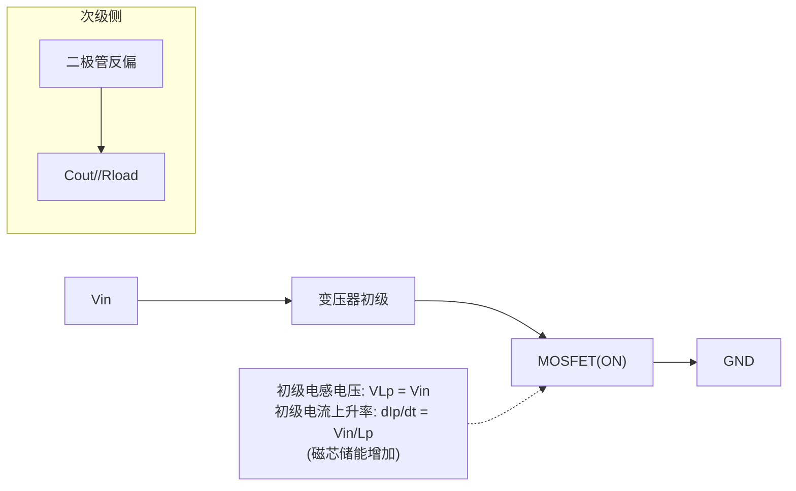
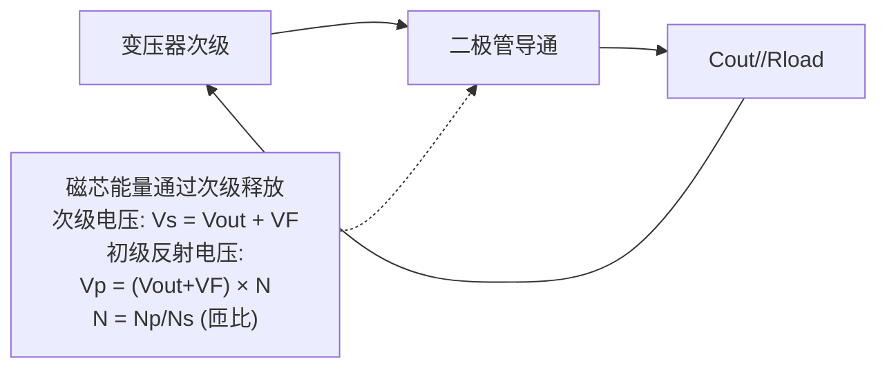
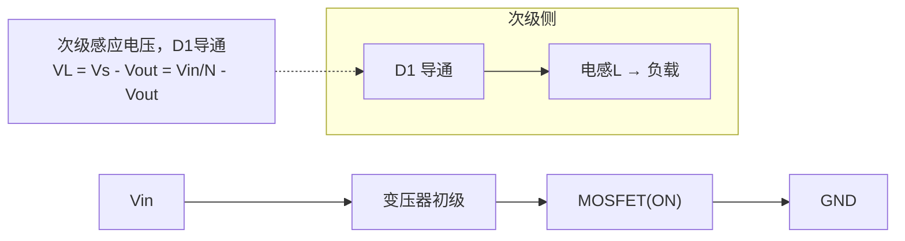
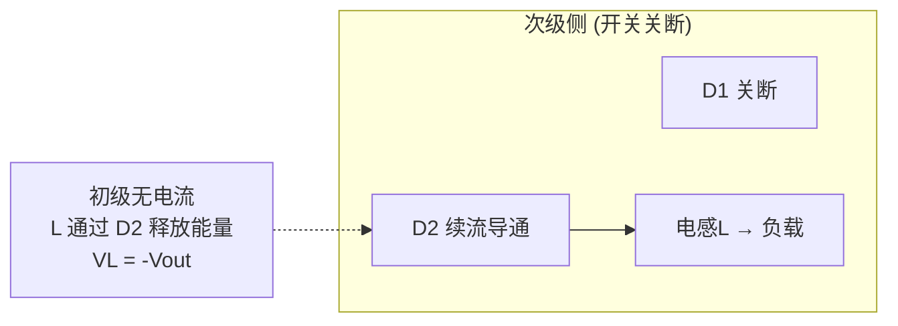
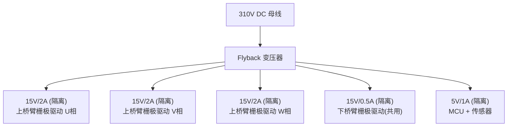

# PP-02: 隔离型 DC-DC（Flyback/Forward/Push-Pull）

**副标题：从耦合电感到底边驱动——跨越隔离屏障的功率传输**

- **难度：** 

---

## 1.  核心摘要  

**一句话讲清楚**：Flyback（反激）、Forward（正激）、Push-Pull（推挽）是三种最常用的隔离型 DC-DC 拓扑。Flyback 本质是带变压器的 Buck-Boost——开关管导通时变压器储能，关断时向次级释放；Forward 是带变压器的 Buck——开关导通时能量直接传输到次级；Push-Pull 利用中心抽头变压器双向励磁，磁芯利用率高。在电机驱动中，隔离型 DC-DC 用于为上桥臂栅极驱动提供浮动电源（15V 隔离），以及为控制系统提供与功率级隔离的供电。

**认知挂钩**：很多硬件工程师认为"Flyback 就是照着 PI Expert 或变压器厂商推荐绕个变压器就行"，**这是对磁元件设计的严重低估！** 实际上，Flyback 变压器的漏感控制、RCD 钳位设计、磁芯气隙计算、多路输出的交叉调整率——每一个都是工程陷阱。更不用说 Forward 的磁芯复位和 Push-Pull 的偏磁问题。

**与电机控制的关联**：
-  **上桥臂栅极驱动隔离供电**：三相逆变器三个上桥臂 IGBT/MOSFET 的源极/发射极电位各不相同（浮动在 0~310V），需要隔离的 15V 电源
-  **高压隔离**：310V 母线侧与 MCU 控制侧需要电气隔离（安规要求）
-  **多路输出**：一个 Flyback 变压器可提供 +15V（栅极驱动）、+5V（MCU）、±15V（运放）等多路隔离输出
-  **辅助电源**：从高压母线直接取电的隔离辅助电源

---

## 2.  问题引入  

### 工程师的真实困惑

**场景1：Flyback 多路输出交叉调整率问题**
```text
工程师A:"用一个 Flyback 产生 15V/0.5A 和 5V/1A 两路输出，
15V 满载时 5V 飙升到 6.5V，5V 满载时 15V 跌到 12V..."
问题现象:
- 各路输出电压随负载变化严重不同
- 轻载一路电压偏高，重载一路电压偏低
- 加假负载改善但效率大幅下降
```

**场景2：Forward 变压器磁芯复位失败**
```text
工程师B:"Forward 变换器工作几分钟后 MOSFET 烧毁，
换上新的又烧..."
问题现象:
- MOSFET 关断时 DS 电压尖峰超过 800V（设计应为 400V）
- 变压器发出异响
- 占空比 > 0.5 时必然烧毁
```

**场景3：Push-Pull 偏磁导致变压器饱和**
```text
工程师C:"Push-Pull 用两个 MOSFET 交替导通驱动变压器，
空载正常，加载后变压器发热严重，效率骤降..."
问题现象:
- 两个 MOSFET 温度不一致
- 变压器初级电流正负半周不对称
- 磁芯温度超过 100°C
```

### 核心问题

这些问题的根本原因是什么？

**答案**：不理解隔离型 DC-DC 的磁元件工作机理和能量传输方式！

- Flyback 交叉调整率差 → 变压器漏感不一致，耦合系数 < 1
- Forward 磁芯复位失败 → 每个周期磁通必须回到起点，D > 0.5 时复位绕组复位时间不足
- Push-Pull 偏磁 → 两个 MOSFET 导通压降/Rdson 不对称，正负半周伏秒积不等

### 学习目标

读完本模块，你将能够：

 **理解 Flyback 的工作模态** - CCM/DCM 下的能量传输，RCD 钳位设计
 **掌握 Forward 的磁芯复位** - 第三绕组复位、双管正激
 **理解 Push-Pull 的推挽工作** - 双向励磁、偏磁抑制
 **设计变压器基本参数** - 匝比、气隙、磁芯选择
 **分析多路输出交叉调整率** - 堆叠绕组、加权反馈
 **将隔离电源应用于电机驱动** - 上桥臂浮动供电方案

---

## 3.  直观理解  

### 类比1：Flyback 就像"弹弓"

```text
弹弓工作原理：
  拉开皮筋储能 → 释放 → 弹丸飞出
  （储能阶段与释放阶段分离！）

Flyback 工作方式：
  开关导通 → 变压器初级电流上升 → 磁芯储能（拉开弹弓）
  开关关断 → 磁芯能量通过次级释放（释放弹丸）
  
  能量传输分两步：先储能，后释放
  → 变压器实际上是一个"耦合电感"而非传统变压器！
```

**核心区别**：
- 传统变压器：初级和次级同时有电流（能量实时传输）
- Flyback "变压器"：初级导通时次级无电流（能量存入磁芯）；初级关断时次级有电流（能量从磁芯释放）
- 所以 Flyback 的"变压器"本质是**耦合电感**——磁芯需要储存能量，必须开气隙！

### 类比2：Forward 就像"水管接力"

```text
水管接力（直接能量传输）：
  上游水阀打开 → 水直接流向下游
  （开阀即传输，关阀即停止）

Forward 工作方式：
  开关导通 → 变压器初级有电流 → 次级感应出电流
  → 能量直接"穿过"变压器传输（不储存在磁芯中）
  
  变压器仅起隔离和变压作用，磁芯不储存净能量！
```

### 类比3：Push-Pull 就像"双人拉锯"

```text
双人拉锯：
  甲推 → 锯条向前（MOSFET A 导通，磁芯正向励磁）
  乙推 → 锯条向后（MOSFET B 导通，磁芯反向励磁）
  
  锯条在正反两个方向都被利用 → 效率更高！
  
Push-Pull：
  两个 MOSFET 交替导通，磁芯双向励磁
  → BH 曲线第一象限和第三象限都被利用
  → 磁芯利用率是 Forward 的两倍！
```

### 关键概念速查

| 拓扑 | 变压器作用 | 能量传输 | 磁芯储能 | 需要气隙 | 最大占空比 |
|------|-----------|---------|---------|---------|-----------|
| Flyback | 耦合电感（储能+变压） | 先储后放 | 需要 |  必须 | < 0.5（CCM） |
| Forward | 纯变压器（仅变压） | 实时传输 | 不需要 |  不需 | < 0.5（复位约束） |
| Push-Pull | 变压器（双向励磁） | 实时传输 | 不需要 |  不需 | 各 < 0.5 |

---

## 4.  技术原理  

### 4.1 Flyback 变换器

#### 4.1.1 工作模态与电压增益

Flyback 本质上是一个用耦合电感代替普通电感的 Buck-Boost：

**模态1：开关管导通（储能阶段）**


**模态2：开关管关断（释能阶段）**


伏秒平衡（CCM）：

初级导通伏秒：$$V_{in} \cdot D \cdot T$$
初级关断伏秒：$$V_{p} \cdot (1-D) \cdot T = (V_{out}+V_F) \cdot N \cdot (1-D) \cdot T$$

$$
V_{in} \cdot D = (V_{out}+V_F) \cdot N \cdot (1-D)
$$

$$
V_{out} = \frac{V_{in} \cdot D}{N \cdot (1-D)} - V_F
$$

这与 Buck-Boost 的 $$V_{out} = V_{in}\cdot D/(1-D)$$ 仅差匝比 N！

#### 4.1.2 RCD 钳位电路设计

Flyback 最棘手的问题：**变压器漏感！**

漏感储存的能量无法通过次级释放，会在 MOSFET 关断时产生电压尖峰：
$$
V_{spike} = I_{pk} \cdot \sqrt{\frac{L_{leak}}{C_{oss}}}
$$

RCD 钳位吸收漏感能量：

```text
钳位电容电压设计：
  Vclamp = V_{clamp_ripple} / 2 时漏感能量刚好被吸收

经验公式：
  V_{clamp} = 1.5 × V_{OR}（反射电压）
  其中 V_{OR} = (Vout+VF) × N
```

**钳位电阻功率**：
$$
P_{RCD} = \frac{1}{2} \cdot L_{leak} \cdot I_{pk}^2 \cdot f_s
$$

**钳位电容**：
$$
C_{clamp} = \frac{V_{clamp}}{\Delta V_{clamp} \cdot R_{clamp} \cdot f_s}
$$

通常取 ΔV_clamp = 5%~10% × V_clamp。

```text
手推示例：
  Flyback: Vin=310V, Vout=15V, N=10, fs=100kHz
  Ipk=1.5A, Lleak=5μH (初级漏感, 通常为 Lp 的 1~3%)
  
  VOR = (15+0.7)×10 = 157V
  Vclamp = 1.5 × 157 = 235V
  MOSFET 关断电压: Vin + Vclamp = 310 + 235 = 545V
  → 需选 650V 或 700V MOSFET！
  
  P_RCD ≈ ½ × 5e-6 × 1.5² × 100000 = 0.563W
  Rclamp = Vclamp²/P_RCD = 235²/0.563 = 98kΩ → 100kΩ/2W
```

#### 4.1.3 CCM vs DCM Flyback

| 特性 | CCM Flyback | DCM Flyback |
|------|-----------|-----------|
| 变压器利用率 | 高（电流连续） | 低（电流断续） |
| 次级二极管反向恢复 | 严重（硬关断） | 无（零电流关断） |
| RHPZ | 存在（f_RHPZ 随负载变化） | 不存在 |
| 环路补偿 | 复杂（Type II/III） | 简单（Type II） |
| 变压器尺寸 | 较大（Lp 大） | 较小 |
| 适合功率 | > 50W | < 50W |

#### 4.1.4 多路输出与交叉调整率

Flyback 多路输出的核心矛盾：

> 反馈只控制其中一路（通常是负载最重或精度要求最高的一路），其他路开环工作。各路输出电压差异来自漏感和绕组电阻的不一致。

**交叉调整率定义**：
$$
\text{Cross Regulation} = \frac{V_{out\_unreg,max} - V_{out\_unreg,min}}{V_{out\_unreg,nom}} \times 100\%
$$

**改善措施**：
1. **堆叠绕组**（Stacked Windings）：次级各路串联绕制，耦合最佳
2. **加权反馈**：同时采样多路电压加权求和反馈
3. **后级 LDO**：对精度要求高的支路用 LDO 二次稳压
4. **减少漏感**：三明治绕法（初级-次级-初级），交错绕制

---

### 4.2 Forward 变换器

#### 4.2.1 工作模态

Forward 是 Buck 的隔离版本——开关导通时能量直接传输：

**模态1：开关管导通**


**模态2：开关管关断**


**电压增益（CCM）**：
$$
V_{out} = \frac{V_{in} \cdot D}{N}
$$

其中 N = Np/Ns，这与 Buck 的 $$V_{out} = D \cdot V_{in}$$ 仅差匝比 N。

#### 4.2.2 磁芯复位——Forward 的灵魂

**为什么需要磁芯复位？**

开关导通期间，磁芯正向励磁（B 从 Br 升到 Bmax）。如果关断后不做任何事情，磁芯剩磁停留在高 B 处，下一个周期 B 从高起点继续上升 → 逐周期累积 → 磁芯饱和 → MOSFET 烧毁！

**复位方式1：第三绕组复位（Traditional Reset）**

增加一个复位绕组 Nr，与初级 Np 双线并绕（紧耦合），匝比 1:1：

```text
开关关断 → 复位绕组电压反向 → 二极管导通
→ 磁化能量回馈到 Vin
→ 磁芯复位
```

**复位条件**：
$$
D_{max} \leq \frac{N_p}{N_p + N_r}
$$

当 Np = Nr 时：$$D_{max} \leq 0.5$$

**这解释了为什么传统 Forward 的占空比不能超过 50%！**

MOSFET 关断电压应力：
$$
V_{DS} = V_{in} \cdot \left(1 + \frac{N_p}{N_r}\right) = 2V_{in} \quad (\text{当 }N_p=N_r)
$$

**复位方式2：双管正激（Two-Switch Forward）**

用两个 MOSFET 串联在初级，两个二极管钳位到 Vin：

```text
关断时，初级电流通过两个二极管回馈到 Vin
→ 初级电压被钳位到 -Vin
→ MOSFET 电压应力 = Vin（而非 2Vin！）
→ D_max 仍然 ≤ 0.5
```

**优点**：MOSFET 电压应力低，无需复位绕组，变压器利用率高
**缺点**：需要两个 MOSFET 和高压侧栅极驱动

**复位方式3：谐振复位（Resonant Reset）**

利用 MOSFET 的 Coss 与变压器磁化电感谐振，无额外元件。但需要精确控制死区时间，适用于有源钳位 Forward（Active Clamp Forward）。

---

### 4.3 Push-Pull 变换器

#### 4.3.1 拓扑结构

Push-Pull 使用中心抽头变压器，两个 MOSFET 交替将初级两端接地：

```text
         Vin
          │
     ┌────┴────┐
     │    │    │
     │   Np/2 Np/2
     │    │    │
     A ───┤    ├─── B
     │    │    │    │
   MOSFETA MOSFETB  │
     │         │    │
     └────┬────┘    │
         GND      次级 → 全波整流 → LC → Vout
```

#### 4.3.2 双向励磁与磁芯利用率

Push-Pull 的最大优势：磁芯双向励磁！

- MOSFET A 导通 → 磁芯正向励磁（BH 第一象限）
- MOSFET B 导通 → 磁芯反向励磁（BH 第三象限）
- B 的变化量 ΔB = Bmax - (-Bmax) = 2×Bmax

相比之下，Forward 的 ΔB = Bmax - Br（Br = 剩磁），Push-Pull 的磁芯利用率是 Forward 的 **2 倍以上**！

#### 4.3.3 电压增益

每个 MOSFET 导通时，初级半边绕组电压为 Vin：

$$
V_{out} = \frac{2 \cdot V_{in} \cdot D}{N} = \frac{V_{in} \cdot (2D)}{N}
$$

其中 N = Np_half/Ns（半边初级与次级匝比），2D 是两个 MOSFET 的总等效占空比。

每个 MOSFET 的最大 D = 0.5（否则直通！），总有效 D_max = 1。

#### 4.3.4 偏磁问题——Push-Pull 的阿喀琉斯之踵

**偏磁（Flux Walking）**：

两个 MOSFET 的 Rdson 不可能完全相同 → 导通压降不同 → A 导通时初级电压 = Vin - I×Rdson_A，B 导通时 = Vin - I×Rdson_B → 正负半周伏秒积不相等 → 磁芯单向偏磁 → 累积 → 饱和！

**解决方案**：
1. **峰值电流模式控制**：逐周期检测并平衡初级电流
2. **隔直电容**：在初级串联电容，阻断直流分量
3. **对称 PCB 布局**：两个 MOSFET 回路对称，寄生参数一致
4. **MOSFET 筛选配对**：同批次 Rdson 尽量接近

---

### 4.4 变压器设计基础

#### 4.4.1 Flyback 变压器设计流程

**Step 1: 确定匝比 N**
$$
N = \frac{V_{in\_min} \cdot D_{max}}{(V_{out}+V_F) \cdot (1-D_{max})}
$$

通常取 D_max = 0.45（留余量）。

**Step 2: 初级电感 Lp**

DCM 设计（确保满载 DCM 或 BCM）：
$$
L_p = \frac{V_{in\_min}^2 \cdot D_{max}^2}{2 \cdot P_{out} \cdot f_s \cdot \eta}
$$

CCM 设计（取纹波率 r = 0.3~0.5）：
$$
L_p = \frac{V_{in\_min} \cdot D_{max}}{r \cdot I_{pk} \cdot f_s}
$$

**Step 3: 磁芯选择**

AP 法（Area Product）：
$$
AP = A_w \cdot A_e = \frac{L_p \cdot I_{pk}^2}{B_{max} \cdot J \cdot K_u}
$$

其中 Aw = 窗口面积，Ae = 磁芯截面积，J = 电流密度（3~5A/mm²），Ku = 窗口利用系数（0.2~0.4）。

**Step 4: 匝数**

初级匝数：
$$
N_p = \frac{L_p \cdot I_{pk}}{B_{max} \cdot A_e}
$$

次级匝数：
$$
N_s = \frac{N_p}{N}
$$

**Step 5: 气隙**

$$
l_g = \frac{\mu_0 \cdot N_p^2 \cdot A_e}{L_p}
$$

#### 4.4.2 关键工程要点

1. **三明治绕法减少漏感**：Np/2 → 绝缘 → Ns → 绝缘 → Np/2
2. **变压器屏蔽**：初级和次级之间加铜箔屏蔽层（单端接地），降低共模噪声
3. **安规距离**：初级-次级需满足加强绝缘爬电距离（如 6~8mm for 250VAC）
4. **VDE/UL 认证线材**：三层绝缘线（Triple Insulated Wire/TIW）可直接满足安规要求

---

## 5.  交叉视角  

### 5.1 Flyback → 电机驱动辅助电源

电机驱动系统中 Flyback 是辅助电源的主力拓扑：



三相逆变器的三个上桥臂的源极/发射极电位各不相同：
- U 相上管 Vs ≈ U 相输出电压（0~310V 摆动）
- V 相上管 Vs ≈ V 相输出电压（0~310V 摆动）
- W 相上管 Vs ≈ W 相输出电压（0~310V 摆动）

所以每个上桥臂需要**独立的隔离电源**！

### 5.2 隔离栅极驱动供电方案对比

| 方案 | 拓扑 | 成本 | 复杂度 | 效率 | 适用场景 |
|------|------|------|--------|------|---------|
| 分立 Flyback 多路 | Flyback | 低 | 中 | 75~85% | 小功率（< 500W） |
| 专用栅极驱动 DC-DC | 模块 | 高 | 低 | 80~90% | 中功率 |
| Bootstrap + 电荷泵 | Bootstrap | 极低 | 极低 | N/A | 低压（< 100V） |
| 集成隔离 DC-DC | 全集成 | 中 | 极低 | 70~80% | 紧凑型设计 |

### 5.3 Forward → 大功率辅助电源

当辅助电源功率 > 100W 时（如大功率驱动器的多路隔离供电），Forward 比 Flyback 更适合——变压器利用率更高，输出纹波更小，EMI 更易控制。

### 5.4 Push-Pull → 低压大电流隔离

48V 电池供电系统，需要隔离 12V/10A 大电流辅助电源时，Push-Pull 的低压侧 MOSFET Rdson 小、磁芯利用率高，是理想选择。

---

## 6.  工程案例  

### 案例1：Flyback 上桥臂供电——漏感导致 MOSFET 过压击穿

**项目背景**：
```text
应用: 3kW 伺服驱动器上桥臂栅极驱动供电
Flyback: Vin=310VDC, Vout=15V/1A, N=15, fs=65kHz
变压器: EE25 磁芯, Np=150T, Ns=10T, Lp=2mH
MOSFET: STP6N120K3 (1200V/6A)
```

**故障现象**：
```text
上电工作数小时后，Flyback MOSFET 击穿短路，
310V 直接进入 15V 侧，烧毁全部栅极驱动 IC。
```

**诊断过程**：
```text
步骤1: 示波器测量 MOSFET Vds 波形
  → 关断尖峰 680V！（设计应 < 500V）
  Vin(310) + VOR(15×15=225) = 535V 理论值
  实际 680V 说明有额外的 145V 尖峰

步骤2: 测量变压器漏感
  → Lleak = 45μH（而 Lp = 2mH，漏感占 2.25%！）
  → 漏感过大是主要原因

步骤3: 检查绕制工艺
  → 当初是"初级全部 → 绝缘 → 次级全部"的简单绕法
  → 没有三明治绕法，漏感自然大

步骤4: RCD 钳位检查
  → Rclamp = 200kΩ, Cclamp = 2.2nF
  → Vclamp = 1.5 × 225 = 338V 设计值
  → 但漏感过大导致钳位能力不足！
```

**根本原因**：变压器绕制工艺差 → 漏感过大 → RCD 钳位无法完全吸收 → MOSFET 过压击穿。

**解决方案**：
```text
方案A: 三明治绕法重绕变压器 
  Np(75T) → 绝缘 → Ns(10T) → 绝缘 → Np(75T)
  实测漏感从 45μH 降至 8μH（降低 5.6 倍！）
  尖峰从 680V 降至 480V < 535V 

方案B: 改用 650V GaN FET（如 NV6117） 
  GaN 没有雪崩击穿机制，需要至少 1.5 倍电压余量
  但开关速度极快，漏感尖峰反而更大 

方案C: RCD + TVS 组合钳位 
  RCD 吸收大部分漏感能量，TVS 钳位峰值
  选 440V TVS（SMBJ440A），峰值钳位电压 ~600V
```

### 案例2：Forward 磁芯过热——忘记 DC 偏置

**项目背景**：
```text
应用: 10kW 电机驱动隔离辅助电源
Forward: Vin=310V, Vout=24V/5A, fs=100kHz, N=8
变压器: ETD39 磁芯, Np=64T, Ns=8T, Nr=64T
```

**故障现象**：
```text
满载运行时变压器温度 105°C（环境 40°C），
远高于预期 70°C。效率仅 82%。
```

**诊断过程**：
```text
步骤1: 初级电流波形 → 有直流分量！
  正半周峰值 > 负半周峰值（复位电流）
  → 磁芯有 DC 偏磁

步骤2: 原因分析
  输出电感 L 很大 → 输出电流纹波小
  → 但变压器磁化电流 = Vin×D×T/Lmag 逐周期变化
  → 如果复位不完全，剩磁累积

步骤3: 占空比检查
  D_actual = 24×8/310 = 0.619！
  但传统 Forward D_max = 0.5！
  他们用了 > 0.5 的占空比！
```

**根本原因**：D > 0.5 → 第三绕组复位时间不足 → 磁芯不能完全复位 → 偏磁累积 → 磁芯饱和 → 损耗飙升。

**解决方案**：
```text
方案A: 降低匝比使 D < 0.5
  N = 8 → D=0.619, 改 N=6 → D=24×6/310=0.465 
  但 MOSFET 电压应力增大

方案B: 改用双管正激 
  D_max 仍为 0.5，但 MOSFET 应力 = Vin 而非 2Vin
  
方案C: 改用有源钳位 Forward 
  用辅助 MOSFET + 电容代替复位绕组
  D_max 可超过 0.5，变压器利用率最高
```

---

## 7.  实践练习

### 练习1：计算题——Flyback 匝比与 MOSFET 电压应力

Flyback：Vin = 310V（220VAC 整流），Vout = 12V，D_max = 0.45，fs = 65kHz。计算：(1) 匝比 N；(2) 反射电压 VOR；(3) MOSFET 关断时理论电压应力。

*参考答案：N = 310×0.45/(12.7×(1-0.45)) = 139.5/6.99 = 19.96 → 取 20。VOR = (12+0.7)×20 = 254V。VDS_max = 310+254 = 564V → 需加漏感尖峰余量 30% → 选 800V MOSFET*

### 练习2：计算题——Flyback 初级电感与气隙

DCM Flyback：Vin_min = 250V，Vout = 5V，Pout = 10W，fs = 100kHz，η = 0.8，D_max = 0.45。计算：(1) 匝比 N；(2) 初级电感 Lp；(3) 若用 EE16 磁芯（Ae = 19.2mm²），取 Bmax = 0.25T，计算 Np 和所需气隙。

*参考答案：N = 250×0.45/(5.7×(1-0.45)) = 112.5/3.14 = 36。Lp = 250²×0.45²/(2×10×100e3×0.8) = 12656/1600 = 7.91mH → 取 8mH。Ipk = Vin×D/(Lp×fs) = 250×0.45/(8e-3×100e3) = 0.141A。Np = 8e-3×0.141/(0.25×19.2e-6) = 1.13e-3/4.8e-6 = 235T。lg = μ₀×Np²×Ae/Lp = 4π×1e-7×235²×19.2e-6/8e-3 = 0.332mm*

### 练习3：设计题——Forward 磁芯复位参数

Forward：Vin = 48V，Vout = 12V，fs = 200kHz，N = 4。使用第三绕组复位（Nr = Np）。求：(1) D_max 限值；(2) D 工作值；(3) MOSFET 电压应力。

*参考答案：D_max ≤ Np/(Np+Nr) = 1/(1+1) = 0.5。D_work = Vout×N/Vin = 12×4/48 = 1 → 超过 D_max ！需调整 N = 3 → D_work = 12×3/48 = 0.75 → 仍超！N = 2 → D_work = 12×2/48 = 0.5 → 刚好。VDS = Vin×(1+Np/Nr) = 48×2 = 96V → 选 150V MOSFET*

### 练习4：诊断题——Flyback 多路输出交叉调整率

某 Flyback 产生 15V/1A（反馈控制路）和 5V/2A（非控路）。15V 满载时 5V 为 4.5V，5V 满载时 15V 为 16.8V。请分析原因并给出至少三种改善方案。

*参考答案：核心原因是变压器漏感导致非控路的等效输出电压随负载变化。15V 满载 → 15V 绕组电流大 → 15V 绕组漏感压降大 → 反馈迫使初级电流增大 → 导致 5V 绕组感应电压偏高。改善：(1) 三明治绕法降低所有绕组的漏感；(2) 5V 绕组堆叠在 15V 绕组之上（增加耦合）；(3) 5V 后级加 LDO（如 5.5V 输入→5V 输出，牺牲效率换精度）；(4) 加权反馈：同时采样 15V 和 5V，15V 权重 0.7、5V 权重 0.3*

### 练习5：选择题

**题目1**：Flyback 变换器的"变压器"本质是什么？
- A. 传统电压变换变压器  B. 耦合电感  C. 自耦变压器  D. 脉冲变压器

> 答案：B（Flyback 变压器在开关导通时储能、关断时释放，本质是耦合电感，必须开气隙）

**题目2**：传统第三绕组复位 Forward 的最大占空比限制为？
- A. 0.3  B. 0.5  C. 0.7  D. 1.0

> 答案：B（复位绕组匝比 1:1 时 D_max ≤ 0.5，否则复位时间不足）

**题目3**：Push-Pull 相对于 Forward 的主要优势是？
- A. 不需要变压器  B. MOSFET 数量更少  C. 磁芯双向励磁，利用率更高  D. 无 EMI 问题

> 答案：C（Push-Pull 利用 BH 曲线完整回线，ΔB = 2Bmax）

**题目4**：Flyback RCD 钳位电路中的电阻功率取决于？
- A. 输入电压  B. 变压器漏感能量  C. 开关频率  D. 以上全部

> 答案：D（PRCD = ½×Lleak×Ipk²×fs + Vclamp²/Rclamp）

**题目5**：Push-Pull 偏磁问题的最有效解决方案是？
- A. 增大开关频率  B. 峰值电流模式控制  C. 使用更大的 MOSFET  D. 增加输出电容

> 答案：B（电流模式控制逐周期平衡初级电流，从根本上防止偏磁累积）

---

**文档信息**：
- 模块编号：PP-02
- 知识体系：功率变换
- 模块名称：隔离型 DC-DC（Flyback/Forward/Push-Pull）
- 电机关联：上桥臂隔离栅极驱动供电、多路隔离辅助电源、高压隔离

>  检验你的理解：[PP-02 检验题目](./PP-02-assessment.md)
