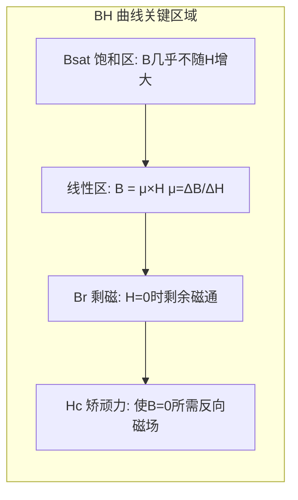

# PP-05: 磁元件设计（电感/变压器）

**副标题：从安培环路到斯坦梅兹方程——磁路设计的物理学与工程学**

**难度：** 

---

## 1.  核心摘要  

**一句话讲清楚**：磁元件（电感、变压器）是开关电源中最核心也最容易被"黑盒化"的元件。电感遵循 $$L = N^2 \cdot A_L$$ 和 $$V = L \cdot di/dt$$，将电能以磁场形式暂存（电感）或传输（变压器）。磁芯选型涉及磁导率、饱和磁通密度、磁芯损耗（Steinmetz 方程：$$P_v = k \cdot f^\alpha \cdot B^\beta$$）。在电机驱动中，PFC 电感、EMI 共模扼流圈、电机相电感都依赖磁元件设计。

**认知挂钩**：90% 的硬件工程师对磁元件的理解停留在"找个现成的电感焊上去"——**这是导致电源效率低下、EMI 超标、甚至烧毁的根本原因！** 磁元件不是即插即用的"零件"，而是一个需要根据频率、电流、纹波、温升、EMI 等多重约束进行物理设计的核心功能单元。一个设计不当的电感，可能在标称电流下就已经饱和 50%，导致系统在不知不觉中崩溃。

**与电机控制的关联**：
-  **PFC 电感**：决定 PFC 的纹波电流、效率、EMI
-  **电机相电感（Ld/Lq）**：磁路设计的原理完全一致，电机绕组的饱和特性与电感磁芯饱和是一回事
-  **EMI 共模扼流圈**：磁芯频率特性直接决定 EMI 滤波效果
-  **LLC 谐振电感/变压器**：磁集成设计是高功率密度的关键

---

## 2.  问题引入  

### 工程师的真实困惑

**场景1：电感"标称 5A"却在 3A 时饱和**
```text
工程师A:"选了一个 47μH / 5A 的电感做 Buck，
满载 3A 时电感就发烫，效率只有 70%..."
问题:
- 为什么标称 5A 却在 3A 就出问题？
- 供应商的"饱和电流"定义是什么？
```

**场景2：高频变压器温度失控**
```text
工程师B:"100kHz Flyback 变压器满载时磁芯温度 120°C，
但绕组温度只有 80°C，明显是磁芯损耗过大..."
问题:
- 如何计算任意频率和磁通密度下的磁芯损耗？
- 铁氧体和铁硅铝的损耗特性有什么不同？
```

**场景3：EMI 扼流圈"加了比不加更差"**
```text
工程师C:"在 DC 母线上串了共模扼流圈抑制 EMI，
结果 2MHz 附近噪声反而增大了 10dB..."
问题:
- 磁芯的阻抗-频率特性不是单调的吗？
- 磁芯在什么频率下会失效？
```

### 核心问题

**答案**：不理解磁材料的非线性特性——BH 曲线、频率响应、直流偏置效应！

### 学习目标

读完本模块，你将能够：

 **掌握磁路基本定律** - 安培环路、法拉第电磁感应、磁阻模型
 **理解 BH 曲线与磁滞回线** - 剩磁 Br、矫顽力 Hc、饱和磁通 Bsat
 **计算电感** - $$L = N^2/R_{mag}$$，气隙效应
 **计算磁芯损耗** - Steinmetz 方程，不同材质的系数
 **掌握集肤效应与邻近效应** - 高频绕组损耗计算
 **设计 PFC 电感和 Flyback 变压器** - 完整设计流程

---

## 3.  直观理解  

### 类比1：磁芯就像"海绵"

```text
海绵吸水 → 磁芯储能（B-H 关系）

海绵干时吸水快（磁芯未饱和时导磁率高）
海绵饱和后不再吸水（磁芯饱和后电感量骤降）

气隙 = 在海绵中插入塑料片
→ 降低吸水速度（降低磁导率）
→ 但可吸更多水（提高储能能力！）
```

**关键洞察**：气隙存储了磁芯中绝大部分能量。没有气隙的电感储能极小（约 $$B^2/(2\mu)$$ 其中 $$\mu$$ 很大）→ 储能密度 ≈ 0。有气隙后，能量主要存储于气隙中（$$B^2/(2\mu_0)$$）→ 储能密度大增！

### 类比2：BH 曲线就像"弹簧的力-形变曲线"

```text
弹簧：F = k × x（线性区）→ 超过弹性极限 → 永久变形
BH 曲线：B = μ × H（线性区）→ 超过 Bsat → 饱和（H 增大 B 几乎不变）

磁滞回线 = 弹簧的加力-去力循环损耗
  回线面积 = 每个周期的能量损耗（磁滞损耗！）
```

### 关键概念速查

| 参数 | 符号 | 公式/含义 | 典型值(铁氧体) |
|------|------|----------|--------------|
| 磁导率 | μ | $$\mu = \mu_r \cdot \mu_0$$ | μr = 2000~3000 |
| 饱和磁通 | Bsat | 磁性材料的上限 | 0.3~0.5T@100°C |
| 剩磁 | Br | H=0 时的剩余磁通 | 0.1~0.2T |
| 矫顽力 | Hc | 使 B=0 所需的反向磁场 | 10~30 A/m |
| 磁芯损耗 | Pv | $$k \cdot f^\alpha \cdot B^\beta$$ | 取决于材质 |

---

## 4.  技术原理  

### 4.1 磁路基本定律

#### 4.1.1 安培环路定律

沿闭合磁路的磁场强度 H 的线积分等于穿过该闭合路径的总电流：

$$
\oint \vec{H} \cdot d\vec{l} = \sum I = N \cdot I
$$

对于均匀磁路（长度 l，匝数 N）：
$$
H = \frac{N \cdot I}{l}
$$

#### 4.1.2 法拉第电磁感应定律

$$
V = N \cdot \frac{d\Phi}{dt} = N \cdot A_e \cdot \frac{dB}{dt}
$$

这是变压器和电感设计的核心方程！在一个开关周期内积分：
$$
\int V \cdot dt = N \cdot A_e \cdot \Delta B
$$

其中 $$\int V \cdot dt$$ = 伏秒积（V·s），ΔB = 磁通密度变化量。

#### 4.1.3 磁路欧姆定律

磁动势（MMF）= 磁通 × 磁阻：
$$
\mathcal{F} = N \cdot I = \Phi \cdot \mathcal{R}_m
$$

磁阻：
$$
\mathcal{R}_m = \frac{l}{\mu \cdot A_e}
$$

气隙磁阻（μ0 << μcore）主导总磁阻：
$$
\mathcal{R}_g = \frac{l_g}{\mu_0 \cdot A_e}
$$

#### 4.1.4 电感公式

$$
L = \frac{N^2}{\mathcal{R}_m}
$$

有气隙时（气隙主导）：
$$
L \approx \frac{\mu_0 \cdot N^2 \cdot A_e}{l_g}
$$

AL 值（每匝²的电感量）：
$$
A_L = \frac{L}{N^2} = \frac{\mu_0 \cdot A_e}{l_g} \quad [H/T^2]
$$

---

### 4.2 BH 曲线与磁滞回线



**工作点选择**：
- Buck/Boost 电感：直流偏置 + 交流纹波 → Bdc + ΔB/2 < Bsat
- Forward 变压器：纯交流励磁 → ΔB = Bmax - Br（单向励磁）
- Push-Pull 变压器：双向励磁 → ΔB = 2 × Bmax

**温度对 Bsat 的影响**：铁氧体 Bsat 随温度升高而降低！室温 0.4T → 100°C 可能只剩 0.3T。**必须在最高工作温度下校核 Bsat！**

---

### 4.3 磁芯损耗——Steinmetz 方程

磁芯损耗包括三部分：磁滞损耗 + 涡流损耗 + 剩余损耗。

**Steinmetz 经验公式**（适用于正弦波励磁）：

$$
P_v = k \cdot f^\alpha \cdot B_{pk}^\beta \quad [mW/cm^3 或 W/m^3]
$$

| 材质 | k | α | β | 适用频率 |
|------|---|---|---|---------|
| 铁氧体 PC40 | 16.9 | 1.25 | 2.6 | 25~300kHz |
| 铁氧体 3C90 | 8.8 | 1.36 | 2.67 | 25~200kHz |
| 铁硅铝 (Kool Mμ 60μ) | 12.4 | 1.46 | 2.00 | 50~500kHz |
| 非晶 (Amorphous) | 0.38 | 1.51 | 1.74 | 10~100kHz |

**总磁芯损耗**：
$$
P_{core} = P_v \cdot V_e
$$

其中 Ve = 磁芯有效体积（从 datasheet 获取）。

#### 对于非正弦波——改进 Steinmetz 方程（iGSE）

PWM 波形下的磁芯损耗不同于正弦波。改进通用 Steinmetz 方程（iGSE）：

$$
P_v = \frac{1}{T} \int_0^T k_i \cdot \left|\frac{dB}{dt}\right|^\alpha \cdot (\Delta B)^{\beta-\alpha} dt
$$

其中 $$k_i = \frac{k}{(2\pi)^{\alpha-1} \cdot \int_0^{2\pi} |\cos\theta|^\alpha \cdot 2^{\beta-\alpha} d\theta}$$

>  **工程注**：直接用 Steinmetz 公式算 PWM 波形损耗会低估 20~50%！尽量用 iGSE 或直接查厂商提供的损耗曲线。

---

### 4.4 气隙效应

#### 4.4.1 气隙的必要性

1. **储能**：能量主要存储在气隙中（μ0 << μcore）
2. **防止饱和**：气隙降低有效磁导率 → 相同 NI 下 B 更低
3. **线性化 BH 曲线**：气隙使等效 BH 曲线更线性

#### 4.4.2 扩散磁通（Fringing Flux）

气隙附近的磁通会扩散（不在磁芯截面积内），导致：
- 气隙边缘的绕组中产生涡流 → 局部过热
- 有效气隙面积 > 磁芯截面积 → 实际电感略大于理论值

**经验修正**（矩形截面磁芯）：
$$
A_{g,eff} = (a + l_g) \cdot (b + l_g)
$$

其中 a, b = 磁芯截面尺寸。

#### 4.4.3 气隙位置的影响

- 中柱气隙：磁通扩散集中在绕组下方 → 涡流损耗大
- 分布式气隙（铁粉芯/铁硅铝）：气隙均匀分布 → 扩散磁通最小

---

### 4.5 高频绕组损耗

#### 4.5.1 集肤效应（Skin Effect）

高频电流趋向于导体表面，有效导电面积减小。

**集肤深度**：
$$
\delta = \sqrt{\frac{\rho}{\pi \cdot f \cdot \mu_0 \cdot \mu_r}}
$$

铜导线（μr=1, ρ=1.72×10⁻⁸ Ω·m）：
$$
\delta_{Cu} = \frac{66}{\sqrt{f}} \quad [mm, f 单位 Hz]
$$

| 频率 | δ_Cu | 推荐线径 |
|------|------|---------|
| 50Hz | 9.3mm | 任意 |
| 20kHz | 0.47mm | < AWG25 (0.455mm) |
| 100kHz | 0.21mm | < AWG31 (0.227mm) |
| 500kHz | 0.093mm | 利兹线必须 |

#### 4.5.2 邻近效应（Proximity Effect）

相邻导体中的高频电流产生的交变磁场在目标导体中感应涡流，进一步增加交流电阻。

**对策**：
- 利兹线（Litz Wire）：多股细线绝缘绞合
- 多层 PCB 绕组：铜厚 < 集肤深度
- 变压器交错绕制（三明治）：减少邻近效应

---

### 4.6 电感设计流程

**Step 1: 确定需求**
- 电感量 L
- 最大直流电流 Idc_max
- 纹波电流 ΔI（峰峰值）
- 开关频率 fs

**Step 2: 计算峰值电流和储能**
$$
I_{pk} = I_{dc\_max} + \frac{\Delta I}{2}
$$

$$
E = \frac{1}{2} \cdot L \cdot I_{pk}^2
$$

**Step 3: 磁芯选型（AP 法）**
$$
AP = A_w \cdot A_e = \frac{L \cdot I_{pk}^2}{B_{max} \cdot J \cdot K_u}
$$

- Aw = 绕组窗口面积
- Ae = 磁芯截面积
- Bmax = 最大工作磁通密度（含 DC 偏置）
- J = 电流密度（3~5 A/mm² 自然冷却）
- Ku = 窗口利用系数（0.3~0.5）

**Step 4: 匝数计算**
$$
N = \frac{L \cdot I_{pk}}{B_{max} \cdot A_e}
$$

**Step 5: 气隙计算**
$$
l_g = \frac{\mu_0 \cdot N^2 \cdot A_e}{L}
$$

**Step 6: 线径选择与损耗校核**

**Step 7: 温升验证**

---

### 4.7 变压器设计流程

**Step 1: 匝比**
$$
n = \frac{N_p}{N_s} = \frac{V_{in\_min} \cdot D_{max}}{V_{out} + V_F}
$$

**Step 2: 初级匝数（防止饱和）**
$$
N_p = \frac{V_{in\_min} \cdot D_{max}}{B_{max} \cdot A_e \cdot f_s}
$$

（适用于 Forward/Push-Pull，Flyback 中 Bmax 由气隙决定）

**Step 3: 次级匝数**
$$
N_s = \frac{N_p}{n}
$$

**Step 4: 线径选择**（考虑集肤效应）

**Step 5: 窗口面积校验**

---

## 5.  交叉视角  

### 5.1 磁路设计  电机设计

| 磁元件 | 电机 | 共通原理 |
|--------|------|---------|
| 磁芯截面积 Ae | 定子齿宽 | 磁通路径截面积决定 Bmax |
| 气隙 lg | 气隙长度 | 储能和磁导率调节 |
| 安匝数 NI | 安匝数 | 产生磁动势 |
| 铁损（Steinmetz） | 定子铁损 | Pv = k × f^α × B^β |
| 铜损 I²R | 定子铜损 | 绕组发热 |
| Bmax 限制 | Bsat 限制 | 磁饱和是硬天花板 |
| 集肤效应 | PWM 谐波损耗 | 高频电流的趋肤 |

**重要关联**：PMSM 的电感 Ld/Lq 本质就是磁路中的电感量！电机设计中 Ld 的计算公式与磁元件电感公式完全一致：$$L = N^2/\mathcal{R}_m$$。电机的气隙决定了 Ld/Lq 的基本值；永磁体的工作点决定了饱和特性。

>  **交叉引用**：电机电感参数（Ld/Lq）如何影响 FOC 的电流环 PI 设计（$$K_p = L_s \cdot \omega_{bw}$$）→ [ALG-01 FOC 理论基础](../algorithm/ALG-01-FOC-Theory.md) | [ALG-05 有感 FOC](../algorithm/ALG-05-Sensored-FOC.md#5-参数整定)

### 5.2 PFC 电感的特殊性

PFC 电感需要承受大的 DC 偏置 + 大的 AC 纹波。DC 偏置会使磁芯的有效磁导率降低（DC Bias 效应），导致实际电感量远小于零偏置值。铁硅铝磁环因其分布式气隙，DC Bias 特性远优于铁氧体（铁氧体需要大的集中气隙）。

### 5.3 EMI 共模扼流圈

共模扼流圈利用高磁导率磁芯（μr > 5000，如纳米晶）在共模电流下呈现高阻抗。但需注意：
- 磁芯的 |Z| 频率特性——在自谐振频率以上阻抗反而降低
- 差模电流引起的直流偏置饱和（用分布式气隙或低磁导率材质缓解）

---

## 6.  工程案例  

### 案例1：PFC 电感在 60% 负载就饱和

**项目背景**：
```text
2kW CCM PFC, L=500μH, fs=65kHz
磁芯: 铁氧体 ETD49 + 2mm 气隙
满载电流: 12A peak
```

**故障现象**：70% 负载时 PFC 效率骤降，MOSFET 温度飙升，电感发热。

**诊断**：
```text
室温 Bmax 计算: Bmax = L×Ipk/(N×Ae) = 500e-6×12/(35×2.11e-4)=0.81T
铁氧体 Bsat(25°C)=0.39T → 远超饱和！
即使 Bsat(100°C)=0.32T 更差。

为什么选 500μH? → 用了 L = AL×N², AL=408nH/T² → N=35T
但没有校核 Bmax！
```

**根本原因**：仅根据电感量选择匝数和磁芯，**忽略了磁通密度的校核**。这是磁元件设计中最常见的错误。

**解决方案**：
```text
修正: 选 N=55T, L实测 = 408e-9×55² = 1.23mH（过大）
→ 需要更大磁芯或换材质
→ 改用铁硅铝磁环 77439-A7, AL=89nH/T², Ae=1.99cm²
  N = √(500e-6/89e-9) = 75T
  Bmax = 500e-6×12/(75×1.99e-4) = 0.402T
  → DC Bias 下铁硅铝有效磁导率降至 ~70%
  → 实际 Bmax ≈ 0.402/0.7 = 0.574T（铁硅铝 Bsat≈1.0T）
```

### 案例2：Flyback 变压器磁芯损耗——PWM 波形不能用 Steinmetz 直接算

**项目背景**：
```text
65W Flyback, fs=65kHz, D=0.35
铁氧体 EF25 磁芯, Bmax=0.2T
```

**故障现象**：磁芯温度 105°C（预期 70°C）。

**诊断**：
```text
直接用 Steinmetz 正弦:
Pv_sine = 16.9 × 65000^1.25 × 0.2^2.6
       = 16.9 × 1.045e6 × 0.0156
       = 275 mW/cm³

磁芯 Ve = 3.49 cm³
P_core_sine = 275 × 3.49 = 0.96W ← 看起来不大

但用 iGSE 修正（PWM波形）:
应考虑 dB/dt 的波形（梯形波而非正弦波）
→ 实际 P_core ≈ 1.8~2.2W！

温度: 2W × Rth_core(30°C/W) + 40°C = 100°C!
```

**解决**：改用铁硅铝或增大磁芯（EFD30），降低 Bmax 到 0.15T，损耗降 40%。

---

## 7.  实践练习

### 练习1：计算题——电感匝数与气隙

设计 L=100μH 电感，Ipk=5A，选用铁氧体 EE25（Ae=40mm², le=48mm, μr=2000）。要求 Bmax<0.3T。计算：(1) 最少匝数 N；(2) 所需气隙 lg（忽略磁芯磁阻）；(3) 气隙储能占比。

*参考答案：(1) N = L×Ipk/(Bmax×Ae) = 100e-6×5/(0.3×40e-6) = 5e-4/12e-6 = 41.7T → 42T。(2) lg = μ₀×N²×Ae/L = 4π×1e-7×42²×40e-6/100e-6 = 4π×1e-7×1764×40e-6/1e-4 = 0.886mm。(3) 气隙储能/总储能 ≈ 1（磁芯 μr 很大时气隙储能接近 100%）*

### 练习2：计算题——集肤效应与线径

100kHz Buck 电感，电流有效值 8A。计算：(1) 铜导体在 100kHz 的集肤深度；(2) 单根圆导线最大推荐直径；(3) 若用利兹线，0.1mm 线径需要多少股？

*参考答案：(1) δ = 66/√100000 = 66/316.2 = 0.209mm。(2) 直径 < 2δ = 0.418mm → 选 AWG26(0.405mm)。(3) 8A 用 J=4A/mm² → 需 2mm²。单股 0.1mm 面积 = 0.00785mm² → 需 2/0.00785 ≈ 255 股（常用 0.1×250 股利兹线）*

### 练习3：设计题——Steinmetz 损耗计算

铁氧体 PC40, Ve=5cm³, fs=100kHz, 正弦波 Bpk=0.15T。计算磁芯损耗。若改为方波励磁（Bpk=0.15T），估算损耗变化。

*参考答案：Pv_sine = 16.9×100000^1.25×0.15^2.6 = 16.9×1.78e6×0.00649 = 195.2 mW/cm³。P_core = 195.2×5 = 976mW。方波励磁时 dB/dt 在开关瞬态远大于正弦波 → 用 iGSE 修正 → 损耗约为正弦的 1.5~2 倍 → 1.5~2W*

### 练习4：诊断题——变压器偏磁

推挽变压器：Np=10T×2, Ns=5T, ETD44, fs=100kHz, Vin=48V。运行后变压器发热严重（> 100°C）。发现两个 MOSFET 电流波形不对称（15A vs 11A）。分析原因。

*参考答案：MOSFET 电流不对称 → 正负半周伏秒积不等 → 直流偏磁。偏磁叠加在交流励磁上 → 磁芯工作点偏离原点 → Bmax 超过设计值 → 磁芯饱和部分 → 激磁电流尖峰 → 磁芯损耗骤增。解决方案：初级串联隔直电容（如 22μF 薄膜电容）阻断直流偏磁 → 正负半周自动平衡 *

### 练习5：选择题

**题目1**：磁元件开气隙的主要目的是？
- A. 降低磁芯损耗  B. 提高 Bsat  C. 储能并防止饱和  D. 增大电感

> 答案：C

**题目2**：集肤深度与频率的关系是？
- A. 正比于 √f  B. 反比于 √f  C. 正比于 f  D. 与 f 无关

> 答案：B（δ ∝ 1/√f）

**题目3**：Steinmetz 方程 Pv=k·f^α·B^β 中，β 通常在什么范围？
- A. 0.5~1  B. 1~2  C. 2~3  D. 3~5

> 答案：C（铁氧体 β≈2.6，铁粉芯 β≈2.0）

**题目4**：铁氧体 Bsat 随温度升高而？
- A. 升高  B. 降低  C. 不变  D. 先升后降

> 答案：B（高温下热扰动破坏磁畴排列，Bsat 下降。这是铁氧体的致命弱点）

**题目5**：邻近效应的根本原因是？
- A. 导体自身的电流分布不均  B. 相邻导体产生的交变磁场在目标导体中感应涡流  C. 磁芯漏磁  D. 导线绝缘层电容

> 答案：B

---

**文档信息**：
- 模块编号：PP-05
- 知识体系：功率变换
- 模块名称：磁元件设计（电感/变压器）
- 电机关联：PFC 电感、电机绕组电感原理、EMI 滤波电感

>  检验你的理解：[PP-05 检验题目](./PP-05-assessment.md)
