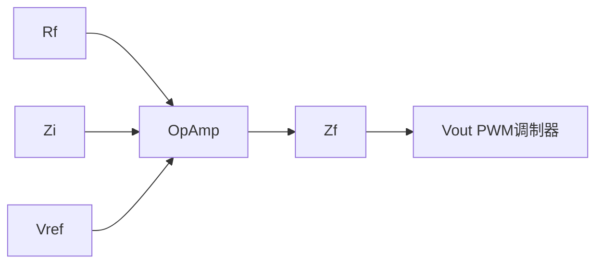

# PP-06: 开关电源环路补偿

**副标题：从零极点到穿越频率——让电源既快又稳的反馈设计**

**难度：** 

---

## 1.  核心摘要  

**一句话讲清楚**：开关电源的闭环稳定性由环路增益 $$T(s) = G_{vd}(s) \cdot G_c(s) \cdot H(s)$$ 决定。功率级（Gvd）包含 LC 双极点/右半平面零点等动力学特征；补偿器（Gc）采用 Type I/II/III 结构提供所需的零极点，使环路在穿越频率 fc 处以 -20dB/dec 穿越 0dB，并确保相位裕度 > 45°、增益裕度 > 10dB。K-factor 法是最实用的补偿器设计工具。数字控制引入的延迟 $$e^{-sT_d}$$ 会恶化相位裕度，必须在设计时补偿。

**认知挂钩**：很多工程师调电源环路的方式是"换几个电阻电容试试看"——**这是用运气替代工程！** 环路补偿是精确的频域设计，需要测量/计算功率级传递函数、设计补偿器零极点、验证穿越频率和相位裕度。一个不稳定或欠阻尼的电源会导致输出振荡、瞬态响应差，甚至烧毁负载。

**与电机控制的关联**：
-  **电流环 PI 参数设计**：FOC 电流环 = dc-dc 电流模式控制，相同的零极点对消思想
-  **速度环/位置环级联**：内环带宽 > 外环带宽 × (3~5)，与 DC-DC 的电流环-电压环级联相同
-  **数字控制延迟**：DC-DC 数字控制的延迟分析与 FOC 数字控制完全一致
-  **反电动势解耦**：与 DC-DC 输入电压前馈是同一思想——消除可测量的扰动

---

## 2.  问题引入  

### 工程师的真实困惑

**场景1：环路振荡——加电容"调"出来的**
```text
工程师A:"Buck 输出 5V 正常但瞬态响应很差，
于是我把补偿电容加大一倍，结果直接振荡了..."
问题:
- 电容加大怎么会导致振荡？（相位滞后更多！）
- 如何知道补偿器的零极点在什么位置？
```

**场景2：数字控制延迟导致的相位损失**
```text
工程师B:"模拟控制的 Buck 板子换成数字控制，
同样的 PI 参数，数字版的瞬态有超调和振荡..."
问题:
- 为什么同样的参数在数字版表现不同？
- 数字延迟到底有多少？如何补偿？
```

**场景3：Boost 满载振荡但轻载稳定**
```text
工程师C:"Boost 满载时输出有 2kHz 振荡，
但轻载 20% 时波形稳定..."
问题:
- 为什么负载变化会影响稳定性？
- RHPZ 和负载是什么关系？
```

### 学习目标

读完本模块，你将能够：

 **推导 Buck/Boost 功率级传递函数** - Gvd(s) 的零极点分布
 **设计 Type I/II/III 补偿器** - 用 OpAmp 或跨导放大器实现
 **应用 K-factor 设计法** - 给定 fc 和 PM，直接算出补偿参数
 **计算数字控制延迟** - 采样延迟 + 计算延迟 + PWM 更新延迟
 **离散化补偿器** - 从 s 域到 z 域的 Tustin/Bilinear 变换
 **将环路理论与电机控制关联** - PI 参数设计的频域依据

---

## 3.  直观理解  

### 类比1：环路增益就像"恒温空调"


增益太高：温度稍微偏差就全力制冷/制热 → 过冲 → 来回振荡
增益太低：温度变化反应迟钝 → 达到目标太慢
相位滞后太多：空调反应比温度变化还慢 → 正反馈 → 振荡！

开关电源同理：
环路增益 T = Gvd × Gc × H
|T| = 1(0dB)处的相位值 = 相位裕度
→ 相位裕度 > 45°: 稳定，瞬态好
→ 相位裕度 < 30°: 欠阻尼，超调和振荡
→ 相位裕度 < 0°: 不稳定，持续振荡！

### 类比2：零极点就像"弹簧-阻尼系统"

```text
质量-弹簧-阻尼：
  m·d²x/dt² + c·dx/dt + k·x = F(t)

传递函数有两极点（由 m, c, k 决定）：
  LC 滤波的 Buck = 质量-弹簧系统
  L = 质量 m（惯性）
  C = 弹簧 k（储能）
  R = 阻尼 c（耗能）

Q 值（品质因数）决定超调：
  Q 大 → 欠阻尼 → 振荡
  Q 小 → 过阻尼 → 响应慢
```

---

## 4.  技术原理  

### 4.1 环路增益与稳定性判据

#### 4.1.1 奈奎斯特稳定性判据

闭环传递函数：
$$
H_{cl}(s) = \frac{G_{vd}(s) \cdot G_c(s)}{1 + T(s)}
$$

其中 $$T(s) = G_{vd}(s) \cdot G_c(s) \cdot H(s)$$ 是环路增益。

**奈奎斯特判据**：T(s) 的 Nyquist 曲线不能包围 -1 点。工程上转化为：

1. **相位裕度 PM**：在 |T|=1(0dB) 的频率 fc 处，$$PM = 180° + \angle T(f_c)$$
2. **增益裕度 GM**：在 T 相位 = -180° 的频率处，$$GM = -20 \cdot \log_{10}|T|$$

**设计目标**：PM = 45°~60°, GM > 10dB。

---

### 4.2 Buck 功率级传递函数

#### 4.2.1 控制到输出传递函数 Gvd(s)

Buck CCM：
$$
G_{vd}(s) = V_{in} \cdot \frac{1 + s \cdot ESR \cdot C}{1 + s \cdot \frac{L}{R} + s^2 \cdot LC}
$$

**特征**：
- 一对 LC 双极点：$$f_{LC} = \frac{1}{2\pi\sqrt{LC}}$$
- ESR 零点：$$f_{ESR} = \frac{1}{2\pi \cdot ESR \cdot C}$$
- DC 增益：$$V_{in}$$

**Bode 图特征**：
```text
|Gvd|:
  VindB ───────────────____
                          -──  -40dB/dec (-2 slope)
                               │
                               ├── f_ESR (零点, +20dB/dec, 回到 -20dB/dec)
                          -──/
  
∠Gvd:
  0° ───────________──────────→
             -90°    -180° (LC 双极点)
                  
  f_LC           f_ESR
```

#### 4.2.2 电流模式 Buck 的简化

电流模式控制将电感电流反馈形成内环，功率级从二阶（双极点）降为一阶（单极点）：

$$
G_{vc}(s) \approx \frac{R_{load}}{R_{sense}} \cdot \frac{1}{1 + s \cdot R_{load} \cdot C}
$$

这就是为什么电流模式控制的补偿比电压模式简单得多！

---

### 4.3 Boost 功率级传递函数

Boost CCM 的控制到输出包含 **RHPZ**：

$$
G_{vd}(s) = \frac{V_{in}}{(1-D)^2} \cdot \frac{(1 - s/\omega_{RHPZ}) \cdot (1 + s/\omega_{ESR})}{1 + s/(Q \cdot \omega_0) + s^2/\omega_0^2}
$$

其中：
$$
\omega_{RHPZ} = \frac{R_{load} \cdot (1-D)^2}{L}
$$

**RHPZ 的频域特征**：
- 幅值：+20dB/dec（像普通零点一样上升）
- 相位：**-90°**（像极点一样下降！）→ 这就是 RHPZ 的可怕之处——增加增益的同时消耗相位！

**这意味着**：穿越频率必须远低于 f_RHPZ，否则 RHPZ 会消耗宝贵的相位裕度。

---

### 4.4 Type I/II/III 补偿器

补偿器通常用 OpAmp + RC 网络实现：



传递函数：
$$
G_c(s) = -\frac{Z_f(s)}{Z_i(s)}
$$

#### 4.4.1 Type I（积分器）

```text
Zf = 1/(s·C1), Zi = R1
Gc(s) = -1/(s·R1·C1) = -ω_I / s
```

单极点@0Hz（-90°相位）。仅用于非常简单的一阶系统。

#### 4.4.2 Type II（积分 + 一零一极）

```text
Zf = R2 + 1/(s·C1), Zi = R1 // 1/(s·C2)

         (1 + s·R2·C1)
Gc(s) = ─────────────────────────
         s·R1·(C1+C2)·(1 + s·R2·C1||C2)
```

**特点**：
- 原点极点（积分）：-20dB/dec，-90°
- 一个零点 fz：+20dB/dec，+90° → 相位提升
- 一个极点 fp：-20dB/dec，-90° → 高频衰减
- 最大相位提升 < 90°（实际 60~80°）

**适用**：电流模式控制、DCM 变换器。

#### 4.4.3 Type III（积分 + 二零二极）

```text
            (1 + s·R2·C1) × (1 + s·(R1+R3)·C3)
Gc(s) = ────────────────────────────────────────────
         s·R1·(C1+C2)·(1 + s·R2·(C1||C2))×(1 + s·R3·C3)
```

**特点**：
- 原点极点
- 两个零点 fz1, fz2
- 两个极点 fp1, fp2
- 最大相位提升 < 180°（实际 120~150°）

**适用**：电压模式 Buck/Forward（需要补偿 LC 双极点的 -180° 相位损失）。

---

### 4.5 K-Factor 设计法

K-factor 是 Type II/III 补偿器最直观的设计方法。

#### 4.5.1 Type II K-Factor

1. 在 fc 处，测量功率级增益 |Gvd(fc)| 和相位 ∠Gvd(fc)
2. 计算需要的相位提升：$$\theta_{boost} = PM - 90° - \angle G_{vd}(f_c)$$
3. 计算 K 值：$$K = \tan\left(\frac{\theta_{boost}}{2} + 45°\right)$$
4. 零点：$$f_z = \frac{f_c}{K}$$
5. 极点：$$f_p = f_c \cdot K$$
6. 补偿器在 fc 处的增益：$$|G_c(f_c)| = \frac{1}{|G_{vd}(f_c)|}$$

#### 4.5.2 Type III K-Factor

1. $$\theta_{boost} = PM - 90° - \angle G_{vd}(f_c)$$
2. $$K = \left[\tan\left(\frac{\theta_{boost}}{4} + 45°\right)\right]^2$$
3. $$f_{z1} = f_{z2} = \frac{f_c}{\sqrt{K}}$$
4. $$f_{p1} = f_{p2} = f_c \cdot \sqrt{K}$$

```text
手推示例——Buck Type III 补偿：

Buck: Vin=12V, L=10μH, C=100μF, ESR=10mΩ, Rload=2Ω
fc 设计 = 20kHz (fs/10)

Step 1: 功率级分析
  f_LC = 1/(2π√(10e-6×100e-6)) = 5033 Hz
  f_ESR = 1/(2π×0.01×100e-6) = 159 kHz

Step 2: Gvd 在 fc=20kHz 处的特性
  |Gvd(fc)| = Vin / |1 - (fc/f_LC)² + j(fc/f_LC)/Q|
  近似（Q 中等）：|Gvd(fc)| ≈ 12 / ((20k/5k)²) = 12/16 = 0.75 → -2.5dB
  ∠Gvd(fc) ≈ -175° (LC 双极点接近 -180°)

Step 3: 需要 PM=60° → θ_boost = 60° - 90° - (-175°) = 145°
  K = [tan(145°/4 + 45°)]² = [tan(81.25°)]² = (6.55)² ≈ 42.9
  fz1=fz2 = 20000/√42.9 = 3055 Hz
  fp1=fp2 = 20000×√42.9 = 131 kHz
  |Gc(20k)| = 1/|Gvd(20k)| = 1/0.75 = 1.33 (+2.5dB)
```

---

### 4.6 数字控制延迟

数字控制引入的延迟来自：

1. **ADC 采样 + 转换时间**（T_sample）
2. **控制算法计算时间**（T_calc）
3. **PWM 更新延迟**（零阶保持 ZOH = T/2）

总延迟：
$$
T_d = T_{sample} + T_{calc} + \frac{T_s}{2}
$$

传递函数中的延迟项：
$$
G_{delay}(s) = e^{-s \cdot T_d}
$$

**延迟对相位的消耗**（纯延迟不改变增益，但消耗相位）：
$$
\angle G_{delay}(f) = -360° \cdot f \cdot T_d
$$

```text
示例：
  fs = 20kHz, Ts = 50μs
  Td = 50μs (单周期控制)
  
  在 fc = 2kHz 处：
  Δ∠ = -360° × 2000 × 50e-6 = -36°
  
  → 本来的 PM=60° 变成 24°！→ 欠阻尼！
  
这就是为什么同样的 PI 参数在数字控制中表现不同
→ 必须在计算 PI 时额外预留 36° 的相位裕度！
```

---

## 5.  交叉视角  

### 5.1 DC-DC 环路补偿 ↔ FOC 电流环 PI

| DC-DC 环路 | FOC 电流环 | 对应关系 |
|-----------|-----------|---------|
| Gvd(s) | 电机 RL 传递函数 1/(R+sL) | 受控对象 |
| Type II/III 补偿器 | PI 控制器 Kp+Ki/s | 控制器 |
| fc（穿越频率） | ωc（电流环带宽） | 性能指标 |
| PM（相位裕度） | 相位裕度 | 稳定性指标 |
| 零极点对消 | PI 零点对消 RL 极点 | 设计方法 |
| 数字延迟 | 数字延迟 | 相同问题 |

**零极点对消设计**（内模原理）：
- DC-DC: 补偿器零点对消功率级最低极点
- FOC: PI 的零点（Ki/Kp）对消 RL 极点（R/L）→ Kp = L × ωc, Ki = R × ωc

### 5.2 环路带宽 ↔ 动态响应

内外环带宽比值原则（二者共通）：
- 电流内环带宽 = (3~5) × 电压外环带宽
- FOC 电流环带宽 = (5~10) × 速度环带宽
- 速度环带宽 = (5~10) × 位置环带宽

>  **交叉引用**：
> - FOC 电流环 PI 的零极点对消设计方法 → [ALG-05 有感 FOC](../algorithm/ALG-05-Sensored-FOC.md#5-参数整定)
> - 电流环/速度环带宽的系统性设计（Bode 图 + 频域分析）→ [ADV-ALG-01 带宽设计与滤波器](../advanced/algorithm/ADV-ALG-01-Bandwidth-Filter.md)
> - 数字控制延迟对 FOC 相位裕度的影响 → [ADV-ALG-01 带宽设计](../advanced/algorithm/ADV-ALG-01-Bandwidth-Filter.md#电流环带宽)

---

## 6.  工程案例  

### 案例1："换电容调环路"导致的隐形振荡

**项目背景**：
```text
Buck: Vin=24V, Vout=5V, Iout=3A, fs=200kHz
Type III 补偿器: R1=10k, R2=47k, C1=10nF, C2=1nF, R3=2.2k, C3=4.7nF
实测: 输出稳定，瞬态响应好，PM≈55°
```

**操作**：工程师觉得"高频噪声有点大"，把 C2 从 1nF 换成了 10nF。

**后果**：输出出现 200mV / 15kHz 的微弱振荡，轻载时更明显。

**分析**：
- C2 增大 → fp1（Type III 的高频极点之一）从 159kHz 降到 15.9kHz
- fp1 现在接近 fc(20kHz)，在 fc 处消耗额外相位 → PM 从 55° 降到 ~25°
- 差 PM → 欠阻尼 → 微弱的 15kHz 限环振荡（limit cycle）

**教训**：**不要凭感觉换补偿元件！** 每个 RC 元件对应特定的零极点频率，改动前必须计算对 PM 的影响。

### 案例2：数字控制 Boost 的 RHPZ + 延迟双重打击

**项目背景**：
```text
Boost: Vin=12V, Vout=24V, L=47μH, Cout=220μF, fs=100kHz, Rload=2Ω
数字控制: Td = 15μs（采样+计算+PWM更新）
```

**设计**：fc=2kHz，PM目标=60°，用 Type II 补偿器。

**实际**：输出有低频振荡（~500Hz）。

**诊断**：
```text
f_RHPZ = 2×(1-0.5)²/(2π×47e-6) = 0.5/(2.95e-4) = 1695 Hz

fc=2000Hz > f_RHPZ=1695Hz → RHPZ 已经在 fc 处消耗相位！
∠RHPZ@fc ≈ -90°（RHPZ 相位贡献）
延迟@fc = -360°×2000×15e-6 = -10.8°
功率级极点@fc ≈ -10°

总相位@fc = -90(RHPZ) + (-10.8) + (-10) = -110.8°（仅考虑主要贡献）

需要的 PM=60° → θ_boost = 60-90-(-110.8) = 80.8°
Type II 只能提供 < 90° → 80.8° 可能不够（考虑裕量）
实际 PM ≈ 25° → 不稳定！
```

**解决方案**：
1. 降低 fc 到 500Hz（< f_RHPZ/3 = 565Hz）
2. 或用更快的 ADC + 中断结构减少 Td
3. 或用电流模式控制（消除 RHPZ 对电压环的影响）

---

## 7.  实践练习

### 练习1：计算题——Buck Type III K-Factor 设计

Buck: Vin=48V, L=33μH, C=220μF(ESR=50mΩ), fs=300kHz, Rload=4Ω。设计 fc=30kHz, PM=55°。用 K-factor 计算 Type III 的零极点频率。

*参考答案：f_LC=1/(2π√(33e-6×220e-6))=1868Hz。f_ESR=1/(2π×0.05×220e-6)=14.5kHz。@30kHz: |Gvd|≈48×(1868/30000)²=48×0.00388=0.186(-14.6dB)。∠Gvd≈-180°（略低于）。θ_boost=55-90-(-178)=143°。K=[tan(143/4+45)]²=[tan(80.75)]²=6.14²=37.7。fz=30000/√37.7=4888Hz。fp=30000×√37.7=184kHz。|Gc_fc|=1/0.186=5.38(+14.6dB)*

### 练习2：计算题——数字延迟相位损耗

fs=20kHz, Td=60μs。若 fc=2kHz，计算纯延迟消耗的相位。若 fc=1kHz 呢？

*参考答案：Δ∠_2k = -360°×2000×60e-6 = -43.2°。Δ∠_1k = -360°×1000×60e-6 = -21.6°。将 fc 从 2kHz 降到 1kHz，延迟相位损失减半 → 坚持数字控制中 fc ≤ fs/20 的规则！*

### 练习3：设计题——从 s 域到 z 域的离散化

PI 控制器：Gc(s)=Kp+Ki/s=3.0+800/s。fs=20kHz。用 Tustin 变换 s=(2/Ts)×(z-1)/(z+1) 离散化。

*参考答案：Ts=50μs, 2/Ts=40000。Gc(z)=3.0+800/(40000×(z-1)/(z+1)) = 3.0+0.02×(z+1)/(z-1) = (3(z-1)+0.02(z+1))/(z-1) = (3.02z-2.98)/(z-1)。数字实现：u(k)=u(k-1)+3.02×e(k)-2.98×e(k-1)*

### 练习4：诊断题——电解电容老化导致环路不稳

某产品出厂测试稳定，但用户使用 2 年后出现输出振荡。分析原因。

*参考答案：电解电容 ESR 随老化增大（电解液干涸）→ f_ESR 零点向低频移动 → 可能进入 fc 附近 → 增加了 fc 处的相位（零点提供 +90°）→ 这实际上是好处... 但另一方面 ESR 增大 → 输出纹波增大 → 反馈信号噪声增大 → 可能触发限环振荡。更可能的根因：电容容量下降 → f_LC 增大 → LC 双极点向高频移动 → 靠近 fc → 消耗更多相位 → PM 不足 → 振荡。这是电解电容老化导致环路基至不稳定的经典案例*

### 练习5：选择题

**题目1**：环路增益 T(s) 在穿越频率处的相位为 -120°，相位裕度为？
- A. 30°  B. 60°  C. 120°  D. 240°

> 答案：B（PM = 180° + (-120°) = 60°）

**题目2**：RHPZ 在 Bode 图上对相位的影响是？
- A. +90°  B. -90°  C. 0°  D. +180°

> 答案：B（幅频特性像零点但相频特性像极点，消耗相位）

**题目3**：Type III 补偿器比 Type II 多提供多少最大相位提升？
- A. 30°  B. 60°  C. 90°  D. 180°

> 答案：C（Type II 最大 < 90°, Type III 最大 < 180°，即多约 90°）

**题目4**：数字控制延迟 1 个 PWM 周期，在 fc=fs/10 处的相位损耗约？
- A. 9°  B. 18°  C. 36°  D. 72°

> 答案：C（Δ∠ = -360°×(fs/10)×(1/fs) = -36°）

**题目5**：电压模式控制需要 Type III 补偿器的原因是？
- A. LC 双极点消耗 -180°  B. ESR 零点消耗相位  C. RHPZ 消耗相位  D. 开关噪声大

> 答案：A（LC 双极点在 f_LC 处产生 -180° 相位突变，需要 Type III 的两个零点来补偿）

---

**文档信息**：
- 模块编号：PP-06
- 知识体系：功率变换
- 模块名称：开关电源环路补偿
- 电机关联：FOC 电流环 PI 设计、数字控制延迟、内外环级联设计

>  检验你的理解：[PP-06 检验题目](./PP-06-assessment.md)
