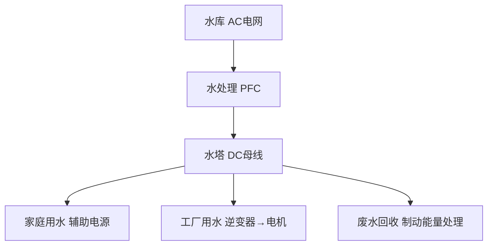
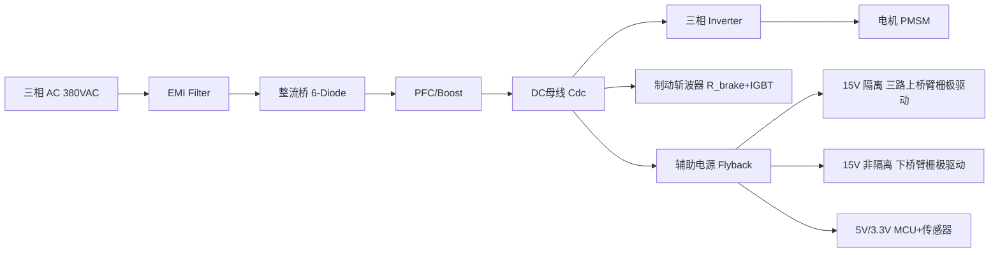
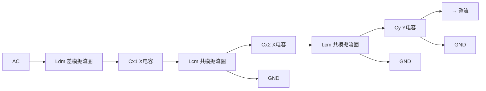
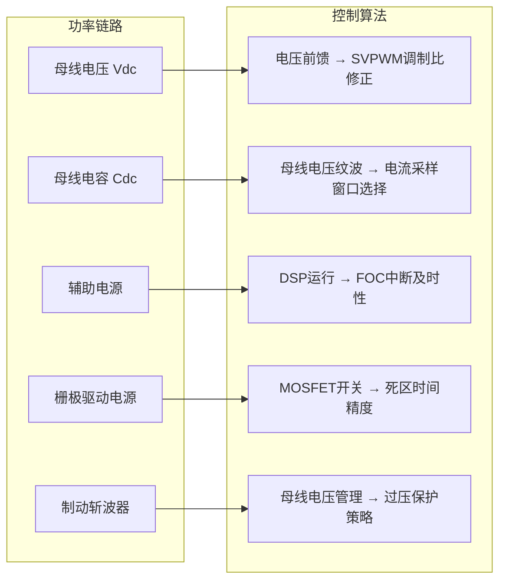

# PP-07: 功率变换在电机驱动中的应用

**副标题：从系统级视角看电源——电机驱动的完整功率链路**

**难度：** 

---

## 1.  核心摘要  

**一句话讲清楚**：电机驱动系统的功率链路为 AC → EMI 滤波 → 整流 → PFC → DC 母线 → 辅助电源 → 三相逆变器 → 电机，每一级都涉及不同的功率变换拓扑和设计考量。辅助电源需要多路隔离输出（15V 栅极驱动、5V MCU、3.3V 传感器），制动能量通过制动斩波器或回馈方式处理。直流母线电容的选型（纹波电流额定值而非仅容量！）、软启动预充电电路、EMI 滤波（共模/差模分离设计）是系统集成的关键工程挑战。

**认知挂钩**：很多电机控制工程师只关注 FOC 算法和 PWM 调制，把功率部分当作"现成的模块"——**这是系统设计中最大的盲区！** 没有正确的功率链路设计，再好的控制算法也无法正常工作。母线电容的纹波电流超标会导致电容寿命从 10 年降到 6 个月；辅助电源的上电时序错误会导致 DSP 概率性死机；EMI 滤波器设计不当会导致产品无法通过认证。

**与电机控制的关联**：
-  **本模块是 PP-01 到 PP-06 的系统级总成**——将所有功率变换知识整合到电机驱动应用
-  **母线电容选型** → 直接决定逆变器纹波和瞬态响应
-  **辅助电源架构** → 决定栅极驱动的可靠性
-  **制动斩波器** → 处理再生能量，与电机四象限运行直接相关
-  **EMI 滤波** → 产品合规性的最后一道关卡

---

## 2.  问题引入  

### 工程师的真实困惑

**场景1：整机 EMC 测试失败**
```text
工程师A:"电机驱动板功能正常，但 CISPR 11 传导发射
在 5MHz 附近超标 12dB。加了滤波电容反而更差..."
问题:
- EMI 从哪里来？
- 为什么加滤波反而恶化？
- 共模和差模噪声分别怎么处理？
```

**场景2：制动时母线过压**
```text
工程师B:"电机急停时，母线电压从 310V 飙升到 450V，
触发过压保护 → 逆变器关闭 → 电机惯性滑行..."
问题:
- 为什么制动时电压升高？
- 制动电阻怎么选？
- 如果不用制动电阻，还有什么办法？
```

**场景3：辅助电源导致 DSP 死机**
```text
工程师C:"上电时 DSP 有 30% 概率启动失败；
运行时偶尔死机。3.3V 电源看起来没问题..."
问题:
- 上电时序是什么？
- 运行时死机可能是什么干扰？
```

### 学习目标

读完本模块，你将能够：

 **掌握电机驱动完整功率链路** - 从 AC 输入到电机端子的每一级
 **设计母线电容组** - 基于纹波电流额定值的正确选型
 **设计辅助电源架构** - 多路隔离输出的完整方案
 **计算制动斩波器** - 制动电阻和斩波管选型
 **设计软启动/预充电电路** - 避免上电浪涌
 **设计 EMI 滤波器** - 共模/差模分离设计
 **系统级整合** - 将所有功率变换模块连接到电机驱动

---

## 3.  直观理解  

### 类比：电机驱动功率链路就像"城市供水系统"



---

## 4.  技术原理  

### 4.1 电机驱动完整功率链路



**各级功能**：
1. **EMI 滤波器**：抑制传导发射（150kHz~30MHz），满足 CISPR 11/EN 55011
2. **整流桥**：AC → 脉动 DC
3. **PFC**：功率因数校正 + 升压到稳定母线（400V/650V/800V）
4. **DC 母线电容**：滤波 + 储能 + 去耦
5. **辅助电源**：从母线产生多路隔离/非隔离低压供电
6. **三相逆变器**：DC → 三相 PWM AC 驱动电机
7. **制动斩波器**：消耗再生能量以保护母线

---

### 4.2 直流母线电容选型——电机驱动中最关键的设计之一

#### 4.2.1 母线电容的三重角色

1. **滤波**：吸收 PWM 开关引起的高频纹波电流
2. **储能**：支撑瞬态负载（加速、突加负载）
3. **去耦**：为逆变器提供低阻抗直流源，减小母线电感引起的电压尖峰

#### 4.2.2 基于纹波电流的电容选型（远比容量重要！）

逆变器从母线抽取的电流是 PWM 斩波后的脉冲电流，其有效值：

**逆变器输入纹波电流有效值**（三相 SVPWM 调制）：
$$
I_{rms\_cap} \approx I_{phase\_rms} \cdot \sqrt{2M \cdot \left(\frac{\sqrt{3}}{4\pi} + \cos^2\phi \cdot \left(\frac{\sqrt{3}}{\pi} - \frac{9}{8}M\right)\right)}
$$

其中 M = 调制比，cosφ = 负载功率因数。

简化估算（M≈1, cosφ≈0.85）：
$$
I_{rms\_cap} \approx 0.5 \sim 0.65 \times I_{phase\_rms}
$$

**关键在于**：电解电容的纹波电流额定值通常只有 1~3A！如果逆变器相电流 20A，母线纹波电流 ≈ 10~13A → 需要 5~10 个电解电容并联！

**电容寿命与纹波电流**：
$$
L = L_0 \times 2^{\frac{T_0 - T_{core}}{10}} \times \left(\frac{I_{rated}}{I_{actual}}\right)^n
$$

- 温度每降低 10°C，寿命翻倍
- 纹波电流超过额定 → 内部发热 → 温升 → 寿命指数缩短
- n ≈ 2~5（取决于 ESR 主导还是发热主导）

```text
工程案例：
  电解电容 470μF/450V，纹波额定 2A@120Hz，ESR=0.3Ω
  实际纹波 5A → P_ESR = 5² × 0.3 = 7.5W → 温升 ≈ 50°C
  → 寿命从 10000h@105°C 降到 10000 × 2^(-50/10) ≈ 300h！
  → 不到 2 周就失效！
```

#### 4.2.3 薄膜电容 vs 电解电容

| 参数 | 电解电容 | 薄膜电容 |
|------|---------|---------|
| 容量/体积 | 高 | 低 (约 1/10) |
| ESR | 0.1~2Ω | 1~10mΩ |
| 纹波电流 | 1~3A/个 | 10~50A/个 |
| 寿命 | 2000~10000h | > 100000h |
| 温度范围 | -40~105°C | -55~125°C |
| 成本 | 低 | 高 |

**现代趋势**：大功率电机驱动（> 10kW）越来越多使用薄膜电容替代或混合电解电容。薄膜电容的 ESR 极低 + 无电解液干燥问题 → 寿命是电解的 10~50 倍。

---

### 4.3 辅助电源架构设计

#### 4.3.1 多路输出需求

| 电压 | 功率 | 隔离要求 | 用途 |
|------|------|---------|------|
| +15V | 0.3A×3 | 互相隔离，隔离于母线地 | U/V/W 上桥臂栅极驱动 |
| +15V | 0.5A | 可与下桥臂地共地 | 下桥臂栅极驱动 |
| -15V | 0.1A | 可与 15V 共地 | 运放负电源 |
| +5V | 1A | 一般不需要隔离 | MCU 内核 |
| +3.3V | 0.5A | 不需要隔离 | MCU IO/传感器 |
| +1.8V | 0.3A | 不需要隔离 | DSP 内核 |

#### 4.3.2 上桥臂栅极驱动的隔离供电方案

**方案 A：Bootstrap（自举）**

适用于低压（< 100V）和低频（< 20kHz）PWM：

```text
下管导通 → 15V 通过二极管给自举电容充电
下管关断 → 自举电容为上管栅极驱动供电
```

优点：简单、便宜、不需要隔离电源。
缺点：不能 100% 占空比，需要定期刷新；高压时二极管反向恢复损耗大。

**方案 B：独立隔离 DC-DC（Flyback 多路）**

每个上桥臂一个隔离绕组：

```text
一个 Flyback 变压器 → 3 个独立次级绕组（各隔离）
                    → 15V_U, 15V_V, 15V_W
```

优点：可靠，可 100% 占空比，适合高压和任意频率。
缺点：变压器设计复杂，成本较高。

**方案 C：隔离 DC-DC 模块 + 自举混合**

下桥臂用自举，上桥臂用隔离模块——折中方案。

#### 4.3.3 上电时序

DSP/FPGA 对多路电源的上电顺序有严格要求：

```text
典型时序：1.8V → 3.3V → 5V（内核先于 IO）

违反时序的后果：
- 先上 3.3V 后上 1.8V → IO 口电平高于内核
  → 内部 ESD 二极管导通 → 闩锁效应（Latch-up）
  → DSP 永久损坏或概率性不启动
```

**解决方法**：
- 用带 Power Good（PG）输出的 LDO/DC-DC，级联使能（EN）
- 前一极 PG 拉高后，后一级才启动
- 或使用电源管理 IC（PMIC）统一管理时序

---

### 4.4 制动斩波器（Braking Chopper）

#### 4.4.1 制动能量处理

电机减速时，动能转化为电能回馈到母线：

**无制动措施**：母线电压飙升 → 触发过压保护 → 逆变器关断 → 电机惯性滑行 → 不安全！

**制动方式**：
1. **制动电阻 + 斩波器**：最常用，能量以热的形式消耗
2. **有源前端（AFE）**：能量回馈电网，效率最高但成本最高
3. **母线电容吸收**：仅适用于小惯量、间歇制动

#### 4.4.2 制动电阻计算

**制动功率**：
$$
P_{brake} = \frac{E_{kinetic}}{t_{brake}} = \frac{\frac{1}{2}J\omega^2}{t_{brake}}
$$

**制动电阻**：
$$
R_{brake} = \frac{V_{dc\_max}^2}{P_{brake}}
$$

**制动电流**：
$$
I_{brake} = \frac{V_{dc\_max}}{R_{brake}}
$$

```text
示例：
  电机 + 负载转动惯量 J = 0.05 kg·m²
  额定转速 ω = 3000 rpm = 314 rad/s
  制动时间 t = 2s
  母线最高允许电压 Vdc_max = 400V
  
  E = ½ × 0.05 × 314² = 2465 J
  P_brake = 2465 / 2 = 1233 W
  
  R_brake = 400²/1233 = 129.8 Ω → 选 120Ω
  I_brake = 400/120 = 3.33A
  → IGBT 选 600V/10A
  → 电阻功率：1233W 瞬时，平均取决于制动周期
    如果制动周期 10%，平均功率 = 123W
    → 选 150W 铝壳电阻
```

#### 4.4.3 制动斩波器 IGBT 选型

- 电压：1.5 × Vdc_max（如 Vdc_max = 400V → 选 600V）
- 电流：I_brake_peak × 1.5
- 关键参数：短路耐受时间（制动电阻可能短路），建议选带 desat 保护的智能 IGBT 模块
- 续流二极管：若使用无感电阻（厚膜/金属膜）则不需要；若使用绕线电阻，需在制动电阻两端并联续流二极管（寄生电感导致 IGBT 关断过压，详见案例2）

---

### 4.5 软启动与预充电

#### 4.5.1 上电浪涌电流

空母线电容直接接通整流后的电压 → 浪涌电流极大：

$$
I_{inrush\_pk} = \frac{V_{pk}}{ESR_{cap} + R_{wiring} + R_{NTC}}
$$

若 Vpk = 311V，ESR + R_wiring ≈ 0.1Ω → I_inrush = 3110A！→ 烧毁整流桥和 PCB 走线。

#### 4.5.2 预充电方案

**方案 A：NTC 热敏电阻**

串联在充电回路中，冷态电阻大（限制浪涌），热态电阻小（减少正常运行损耗）。

缺点：热态时仍有数 Ω 残余电阻 → 持续发热；热态重启（电容未放电完）→ NTC 已热 → 失去浪涌限制。

**方案 B：预充电电阻 + 继电器**


R_precharge 选型：
$$
R_{precharge} = \frac{V_{pk}}{I_{inrush\_allow}} = \frac{311}{10A} = 31Ω → 33Ω/10W
$$

充电时间（5τ = 95% 充电）：
$$
t = 5 \times R_{precharge} \times C_{dc} = 5 \times 33 \times 1000e-6 = 0.165s
$$

**方案 C：相控软启动（晶闸管整流）**

用晶闸管整流桥代替二极管整流桥，上电时逐渐增大导通角 → 平滑充电。成本高但效果最好。

---

### 4.6 EMI 滤波器设计

#### 4.6.1 共模与差模噪声

- **差模噪声（DM）**：PWM 开关电流在线路之间产生的高频纹波。频率范围：150kHz~5MHz。
- **共模噪声（CM）**：开关节点（SW）的高 dv/dt 通过寄生电容耦合到地。频率范围：1~30MHz。

**电机驱动的 EMI 来源**：
- 逆变器 6 个 MOSFET 的开关瞬态 → 极强的高 dv/dt（10~50kV/μs）
- 母线的大脉动电流 → 差模噪声
- 电机电缆的天线效应 → 辐射发射

#### 4.6.2 EMI 滤波器结构



- **Cx（X 电容）**：差模滤波，跨接 L-N
- **Cy（Y 电容）**：共模滤波，L/N 到地
- **Ldm（差模扼流圈）**：差模电感
- **Lcm（共模扼流圈）**：共模电感（双线并绕，差模抵消）

**设计要点**：
- Y 电容受漏电流限制（安规要求 < 3.5mA for 永久连接, < 0.75mA for 可插拔）
- 共模扼流圈的磁芯在高频自谐振频率以上阻抗降低 → 需要多级滤波
- 电机驱动需要 **输出 EMI 滤波器**（逆变器到电机之间）— 长电缆的反射波效应

---

## 5.  交叉视角  

### 5.1 功率链路到控制算法的闭环



控制工程师必须理解功率链路的约束：
- 母线电压跌落 → 输出电压饱和 → 电流环失控
- 辅助电源噪声 → ADC 读数跳动 → 控制精度下降
- 栅极驱动电压不足 → MOSFET 线性区工作 → 过热

### 5.2 电机电缆的反射波效应——功率链路延伸到电机

长电缆（> 10m）连接逆变器和电机时，PWM 脉冲在电缆末端（电机端）反射，导致电压加倍：

$$
V_{motor\_peak} \approx 2 \times V_{dc} \quad (\text{无终端匹配时})
$$

解决方案：
- 电机端加 LC 正弦波滤波器
- 或逆变器输出加 dV/dt 滤波器（限制电压上升率）
- 或使用多电平逆变器（du/dt 天然更低）

### 5.3 与硬件模块的关联

>  **交叉引用**：
> - 逆变器拓扑、栅极驱动设计、制动斩波器 IGBT 选型 → [HW-05 功率器件与栅极驱动](../hardware/HW-05-Power-Devices-Gate-Drivers.md)
> - 辅助电源多路输出（栅极驱动 15V + MCU 5V + 传感器 3.3V）、母线预充电、过流保护 → [HW-06 电源管理与保护](../hardware/HW-06-Power-Management-Protection.md)
> - 共模/差模 EMI 滤波、电缆反射波的终端匹配 → [HW-07 热设计与 EMC](../hardware/HW-07-Thermal-EMC-Design.md)

---

## 6.  工程案例  

### 案例1：母线电容爆炸——纹波电流被忽视

**项目背景**：
```text
3kW 伺服驱动器，Vdc=310V
选用 4×470μF/450V 电解电容并联
纹波额定值：每个 1.5A@120Hz
PWM 频率：10kHz
```

**故障现象**：运行 3 个月后电容鼓包、顶部防爆纹开裂。

**诊断**：
```text
逆变器相电流 Irms = 12A
母线纹波电流 Ic_rms ≈ 0.6 × 12 = 7.2A

4 个电容并联，每个分担 7.2/4 = 1.8A
但额定纹波 1.5A → 超过 20%！

过纹波 → ESR 发热 → 温升 30°C → 寿命降为 1/8
→ 3 个月 × 8 = 24 个月 = 额定寿命的 1/2...
仍不足以在 3 个月内失效？继续分析：

高频纹波（10kHz 及其谐波）在电解电容中
等效 ESR 高于 120Hz 下的 ESR（约 1.5~2 倍）
→ 实际发热更大 → 温升 > 50°C → 寿命降到约 1/32
→ 3 个月 × 32 ≈ 100 个月？不对...

根因：电容厂商的纹波额定是在 120Hz 正弦波、Ta=105°C 条件下的。
10kHz PWM 纹波是复杂的多频成分 → 需对频率做降额。
10kHz 的纹波电流修正因子 ≈ 0.6 → 等效允许纹波 = 1.5 × 0.6 = 0.9A
实际 1.8A > 0.9A → 超标 100%！→ 几个月内必失效！
```

**解决方案**：
```text
方案A: 并联 8 个电解 → 每个 7.2/8 = 0.9A 
方案B: 电解 + MLCC 组合 → 4 个电解(分担低频)
  + 20×10μF MLCC(分担高频) → 电解只负担 4A，MLCC 负担 3.2A
  电解每个 1A < 1.5A → OK 
方案C: 改用 500μF/500V 薄膜电容 × 2
  薄膜 ESR≈2mΩ, 纹波额定 30A → 轻松应对
  成本高但寿命 > 10 年 
```

### 案例2：制动斩波器 IGBT 烧毁——忘记反并联二极管

**项目背景**：自制制动斩波器，IGBT + 120Ω/200W 电阻。

**故障现象**：第一次制动时 IGBT 就炸了。

**诊断**：
```text
制动回路：Vdc → IGBT → R_brake → GND

R_brake = 120Ω 是绕线电阻 → 有寄生电感！
寄生电感约 50μH（绕线电阻的典型值）

IGBT 关断时：
  L_para × dI/dt = 50e-6 × 3.33A/100ns = 1665V！
  
  IGBT VCE = 400V + 1665V = 2065V
  → 远超 600V 额定 → 雪崩击穿 → 炸管
```

**根本原因**：制动电阻的寄生电感导致 IGBT 关断过压（本质上是一个 Boost 行为——电感电流不能突变 → 电压反冲）。

**解决方案**：
```text
方案A: 在制动电阻两端并联续流二极管 
  IGBT 关断 → R_brake 的寄生电感电流通过二极管续流
  → 消除关断尖峰
  
  二极管选型：Vdc 级别（600V），I_brake 级别（5A）
  推荐：STTH5R06 (600V/5A 超快恢复)

方案B: 使用无感电阻（厚膜/金属膜）替代绕线电阻 
  寄生电感 < 50nH，关断尖峰极小
```

---

## 7.  实践练习

### 练习1：计算题——母线电容纹波电流与寿命

3kW 逆变器，Vdc=650V，Iphase_rms=18A。用 3×680μF/450V 电解两串两并（等效 680μF/900V），每个额定纹波 2.5A@120Hz。估算每个电容承受的纹波电流，判断是否合理。

*参考答案：Ic_rms≈0.6×18=10.8A。3×2 配置 → 每组 2 并 × 3 → 每电容 10.8/(3×2)=1.8A<2.5A （120Hz 等效）。但 fs=16kHz 需频率修正因子 ≈0.7 → 允许 2.5×0.7=1.75A<1.8A → 在边界。建议增加并联电容数或加 MLCC 处理高频部分*

### 练习2：计算题——制动电阻与斩波器

PMSM 驱动：J=0.1 kg·m², ω_max=4000rpm(419rad/s), 制动时间 1.5s, Vdc_nom=540V, Vdc_max=600V。计算 R_brake 和 IGBT 规格。

*参考答案：E=½×0.1×419²=8778J。P_brake=8778/1.5=5852W。R_brake=600²/5852=61.5Ω→56Ω。I=600/56=10.7A。IGBT: Vce>600×1.5=900V→1200V, Ic>10.7×1.5=16A→选 1200V/25A(如 IKW25N120H3)。电阻: 5852W 瞬时, 平均取决于周期。若制动周期 10%→585W, 选 56Ω/600W 铝壳电阻(自然冷却)*

### 练习3：设计题——预充电电路

Cdc=2000μF, Vdc_nom=310V(220VAC整流)。要求浪涌电流 < 20A。设计预充电电阻和继电器控制逻辑。

*参考答案：R_pre=311/20=15.6Ω→15Ω。充电时间 5τ=5×15×2000e-6=0.15s。电阻功率: 充电能量=½×2000e-6×311²=96.7J→平均功率 96.7/0.15=645W(脉冲)→选 15Ω/50W 铝壳(能承受脉冲)。继电器: Vdc>250V 时闭合, 带 100ms 消抖。继电器额定 310VDC/5A。需在 R_pre 两端并联快速放电电阻 100kΩ/2W(断电后放电)*

### 练习4：诊断题——EMI 超标

电机驱动在 10~15MHz 频段传导发射超标 15dB。已有的滤波器：Lcm=5mH, Cx=0.47μF, Cy=2.2nF×2。分析可能原因和解决措施。

*参考答案：10~15MHz 是典型共模噪声频段（逆变器 SW 节点 dv/dt 耦合到地的寄生电容形成共模电流）。Lcm=5mH 的纳米晶磁环在此频段阻抗已下降（自谐振频率通常 < 5MHz），滤波效果差。解决：(a) 增加一级 Lcm(较小,如 500μH, 高频磁芯如 NiZn 铁氧体)+Cy(1nF×2) → 专门针对 > 5MHz；(b) 在 SW 节点加 RC snubber(如 10Ω+1nF)减缓 dv/dt → 降低共模噪声源；(c) 逆变器散热器接地方式改为"通过 Y 电容接地"（而非直接接地）→ 控制共模电流路径*

### 练习5：选择题

**题目1**：母线电容选型的首要考虑因素是？
- A. 容量  B. 耐压  C. 纹波电流额定值  D. ESR

> 答案：C（容量通常容易满足，但纹波电流额定值才是限制电容寿命的关键）

**题目2**：上桥臂栅极驱动隔离电源不能通过 Bootstrap 供电的场景是？
- A. 高频 PWM  B. 100% 占空比持续导通  C. 高压母线  D. 感性负载

> 答案：B（Bootstrap 电容需要下管导通来充电，持续上管导通 → 电容电压逐渐下降 → 栅极驱动不足）

**题目3**：制动斩波器的制动电阻最关键的寄生参数是？
- A. 寄生电容  B. 寄生电感  C. 温度系数  D. 对地电容

> 答案：B（寄生电感导致 IGBT 关断过压 — Boost 效应）

**题目4**：共模扼流圈在自谐振频率以上的行为是？
- A. 阻抗继续增大  B. 阻抗开始降低  C. 呈纯阻性  D. 短路

> 答案：B（磁芯磁导率下降 + 寄生电容主导 → 阻抗随频率升高而降低）

**题目5**：电机驱动系统输出 EMI 滤波器的主要目的是？
- A. 抑制传导发射  B. 保护电机绝缘（反射波）  C. 降低开关损耗  D. 提高效率

> 答案：B（长电缆的 PWM 反射波导致电机端电压加倍，威胁绕组绝缘。输出 dV/dt 滤波器或正弦波滤波器保护电机）

---

**文档信息**：
- 模块编号：PP-07
- 知识体系：功率变换
- 模块名称：功率变换在电机驱动中的应用
- 电机关联：完整功率链路系统集成、母线电容选型、辅助电源多路设计、制动斩波、EMI 滤波

>  检验你的理解：[PP-07 检验题目](./PP-07-assessment.md)
