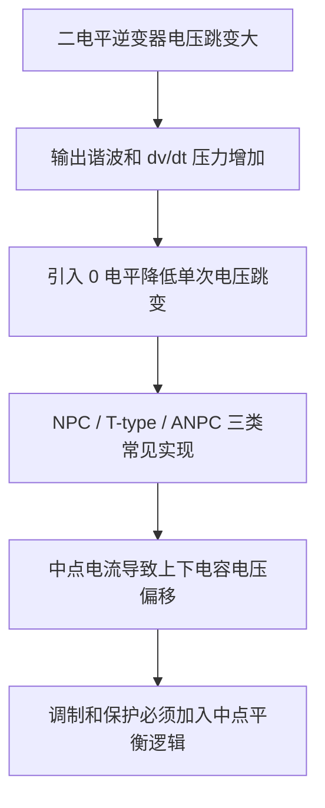

# PP-08 三电平 NPC/T-type/ANPC 拓扑基础

> **状态**: reviewed  
> **生命线**: 本模块只给出已经可由经典 PWM/电力电子教材推导和仿真复核的结论；未完成实物高压验证的内容均标注为工程风险点。

**模块编号：** PP-08  
**模块名称：** 三电平 NPC/T-type/ANPC 拓扑基础  
**文档版本：** v1.1  
**前置知识：** PP-07 功率变换与电机驱动、EE-08 整流与逆变拓扑、ALG-01 FOC 理论基础  
**难度等级：** ★★★★☆

---

## 1. 📌 核心摘要 ★★★★☆ 🔰📚

**一句话：** 三电平逆变器把每相桥臂输出从二电平的 `+Vdc/2, -Vdc/2` 扩展为 `+Vdc/2, 0, -Vdc/2`，用更多开关状态换取更低器件电压应力、更低输出谐波和更细的电压矢量分辨率，但必须额外处理中点电位平衡、器件损耗分配和保护复杂度。

**认知挂钩：** 二电平逆变器像只有“上楼”和“下楼”的电梯，三电平逆变器增加了“中间层”。中间层让每次电压跳变更小，电机绕组看到的电压更平滑，器件承受的单次电压也更低。但中间层不是免费的：上下母线电容会因为不同相电流路径而被不均匀充放电，控制器必须主动维持中点电压。

**核心问题链：**

---

## 2. 🤔 问题引入 ★★★★☆ 🔰

### 工程师的真实困惑

> **场景 1：二电平 400 V 母线下电流纹波过大**  
> 某伺服驱动在 400 V 母线上使用二电平逆变器。电流环参数没有明显问题，但相电流纹波和电机噪声明显偏高，EMI 测试也接近限值。提高 PWM 频率可以改善波形，却让功率器件温升快速上升。

> **场景 2：想把 650 V 器件换成更低损耗器件**  
> 工程师希望在高压母线下使用导通损耗更低的器件，但二电平桥臂要求每个主开关承受接近全母线电压。三电平拓扑看起来可以让单个器件只承受半母线电压，但器件数量、驱动隔离和保护逻辑都变复杂。

> **场景 3：中点电压在仿真中慢慢漂移**  
> 三电平 NPC 仿真刚开始波形正常，运行几百毫秒后 `Vdc_upper` 和 `Vdc_lower` 不再相等，输出电压畸变增加。问题不是 FOC 电流环，而是 O 状态的电流路径长期偏向某一侧电容。

### 核心问题

三电平拓扑到底解决了什么，又额外制造了什么问题？

**答案：** 它用更多开关状态降低了电压应力和输出谐波，但把“直流母线是否均衡”变成了控制系统的一部分。只会画拓扑图还不够，必须理解每个相状态对应的电流路径、器件应力和中点电容充放电方向。

### 学习目标

读完本模块，你将能够：

✅ 解释 NPC、T-type、ANPC 的基本结构差异  
✅ 判断 P/O/N 三种相状态对应的输出电压  
✅ 分析 O 状态下中点电容的充放电方向  
✅ 说明三电平拓扑为什么降低器件电压应力和输出谐波  
✅ 识别三电平逆变器在驱动、保护、采样和热设计上的新增约束  

---

## 3. 💡 直观理解 ★★★★☆ 🔰💡

### 3.1 从二电平到三电平

二电平相桥臂只有两种输出：

| 相状态 | 输出电压 | 物理含义 |
|---|---:|---|
| P | `+Vdc/2` | 相点接正母线 |
| N | `-Vdc/2` | 相点接负母线 |

三电平桥臂增加 O 状态：

| 相状态 | 输出电压 | 典型器件状态 | 说明 |
|---|---:|---|---|
| P | `+Vdc/2` | 上侧导通路径有效 | 相点接正母线 |
| O | `0` | 中间钳位路径导通 | 相点接直流母线中点 |
| N | `-Vdc/2` | 下侧导通路径有效 | 相点接负母线 |

这意味着相电压从 `+Vdc/2` 切到 `-Vdc/2` 不必一次跨越全母线，可以经过 `0` 电平。单次电压跳变减半，电机绕组电流纹波、共模电压变化率和器件电压应力都会下降。

### 3.2 三种常见拓扑

| 拓扑 | 核心特征 | 优点 | 主要代价 |
|---|---|---|---|
| NPC | 通过钳位二极管把相点钳到中点 | 结构经典，便于教材推导 | 钳位二极管损耗和反恢复压力 |
| T-type | 用双向开关形成中点连接 | 中低压场景导通损耗有优势 | 中点开关驱动和保护更复杂 |
| ANPC | 有源钳位，多种冗余导通路径 | 可主动分配损耗和热 | 调制、保护和驱动策略最复杂 |

三者都能输出 P/O/N 三种相状态，但 O 状态的实现路径不同。工程选型时不能只看“都是三电平”，还要比较器件电压等级、反并联二极管恢复、驱动隔离、短路保护和散热路径。

---

## 4. 🔬 技术原理 ★★★★☆ 📚🔧

### 4.1 电压应力

在理想分裂母线中，上下电容电压分别为 `Vdc/2`。三电平桥臂通过中点钳位，让主开关在关断时通常只承受半母线电压，而二电平桥臂主开关需要承受接近全母线电压。

这带来两个直接后果：

- 可以使用较低耐压、较低导通损耗的器件。
- 相同母线电压下，器件开关瞬态压力下降。

但这依赖中点电压均衡。如果 `Vdc_upper != Vdc_lower`，部分器件承受的电压会偏离设计值，保护裕量必须按最坏情况计算。

### 4.2 中点电位平衡

三电平拓扑的关键约束是中点电容电压平衡。相电流经过 O 状态时，可能向上电容或下电容充放电。方向取决于相电流方向和具体 O 状态导通路径。

验收判断：

- 仿真中记录 `Vdc_upper - Vdc_lower`。
- 额定负载下中点电压偏差应有界，不允许随时间单调漂移。
- 阶跃负载下允许暂态偏差，但必须在控制策略规定时间内回到阈值内。

### 4.3 损耗分配

三电平拓扑增加器件数量，也增加了“同一输出电压由不同器件路径实现”的可能性。ANPC 尤其依赖冗余路径来分配热负荷。如果调制策略长期偏向某些器件，单个开关可能成为热瓶颈，即使总损耗看起来不高。

### 4.4 保护与采样窗口

三电平桥臂的保护比二电平更难：

- 需要防止 P/O/N 状态切换过程中的非法直通。
- O 状态可能涉及双向电流路径，驱动互锁要覆盖更多组合。
- 电流采样窗口与二电平 SVPWM 不同，低端采样或相电流采样的可观测区间需要重新分析。
- 死区补偿不再只是上下管互补关系，还要考虑中点钳位路径。

---

## 5. 🔗 交叉视角 ★★★★☆ 💡🔧

### 5.1 与 FOC 的关系

三电平逆变器仍然服务于 FOC 的 `u_alpha/u_beta` 电压指令。区别在于：

- 二电平 SVPWM 输出 3 路占空比。
- 三电平 SVPWM 输出每相 P/O/N 状态序列，或输出可被 PWM 外设解释的 P/O/N 时间。
- 电流采样窗口、死区补偿和过调制边界都需要重新定义。

lxfoc 当前保持二电平硬件无关算法库定位。本模块只要求知识库完成三电平拓扑与仿真闭环。后续若扩展 lxfoc，应新增独立调制接口，而不是破坏现有 `lxfoc_transform_svpwm`。

### 5.2 与电源路径的关系

三电平拓扑要求分裂直流母线或等效中点。母线电容设计不再只是“总容量够不够”，还要考虑上下电容的电压均衡、纹波电流、预充电一致性和采样精度。

### 5.3 与硬件保护的关系

二电平桥臂通常只关注上下管互锁；三电平桥臂要关注更多非法状态。工程实现中应把 P/O/N 状态编码、驱动互锁、故障关断路径和硬件比较器保护一起设计，而不是只在软件调制里避免错误。

---

## 6. 🎯 工程案例 ★★★★☆ 🔧🎯

### 案例：400 V 母线伺服驱动从二电平升级到三电平

**背景：**

- 直流母线：400 V
- 电机：PMSM，额定电流 10 A
- 原方案：二电平 SVPWM，PWM 频率 16 kHz
- 问题：电流纹波和共模噪声偏高，提高频率后器件温升超限

**三电平改造目标：**

1. 单次相电压跳变从约 `400 V` 降为约 `200 V`。
2. 在相同 PWM 频率下降低线电压低阶谐波。
3. 验证中点电压偏差不随时间漂移。

**仿真任务：**

| 任务 | 输入 | 输出 | 通过标准 |
|---|---|---|---|
| 相桥臂状态验证 | P/O/N 状态序列 | 相电压波形 | 三电平输出只出现 `+Vdc/2, 0, -Vdc/2` |
| 中点电流路径 | 正/负相电流与 O 状态 | 上下电容电流 | 电流方向与充放电方向一致 |
| 二电平对比 | 同调制比、同载波频率 | 相电压 THD | 三电平主要低阶谐波低于二电平 |
| 故障关断 | 任意状态注入过流 | 栅极关断序列 | 不产生非法直通状态 |

**工程风险点：**

- 不能因为单器件电压应力下降就忽略母线中点偏移。
- 不能沿用二电平死区补偿和采样窗口。
- 未完成高压实物验证前，只能标为 `reviewed`，不能标为 `verified`。

---

## 7. 📝 实践练习 ★★★★☆ 🎯📝

### 练习 1：状态判断

对于理想 600 V 分裂母线，列出 P/O/N 三种状态的相电压。

**参考答案：**

- P: `+300 V`
- O: `0 V`
- N: `-300 V`

### 练习 2：中点偏移判断

如果某相处于 O 状态，且相电流持续通过中点流向相端，中点电容会被持续充放电。这个现象会造成什么风险？

**参考答案：**

上下母线电容电压会偏离 `Vdc/2`。如果调制器没有使用冗余状态修正偏差，器件电压应力、输出电压合成和保护阈值都会偏离设计值。

### 练习 3：接口设计

为什么三电平调制不应强行复用二电平 `duty_a/duty_b/duty_c` 接口？

**参考答案：**

二电平 duty 只能表达每相在 P/N 两种状态之间的平均占空比，无法显式表达 P/O/N 三状态时间，也无法表达冗余状态选择对中点平衡的影响。三电平调制应输出每相 P/O/N 时间或等效状态序列。

### 练习 4：工程选型

NPC、T-type、ANPC 都能产生三电平输出。为什么实际选型不能只比较输出电平数？

**参考答案：**

因为导通损耗、开关损耗、钳位器件恢复、驱动隔离、短路保护、热路径和控制复杂度都不同。输出电平数相同，不代表效率、可靠性和保护难度相同。

---

## 8. 📚 正确性证据

主要对标：

- Holmes and Lipo, *Pulse Width Modulation for Power Converters*, multilevel inverter chapters.
- Mohan, *Power Electronics*, inverter and power converter topology chapters.
- Infineon/TI/ST multilevel inverter application notes for device-level protection practices.

本模块的 proof 文件位于 `_proofs/power-path/PP-08-Three-Level-Topology.module-proof.yaml`。
