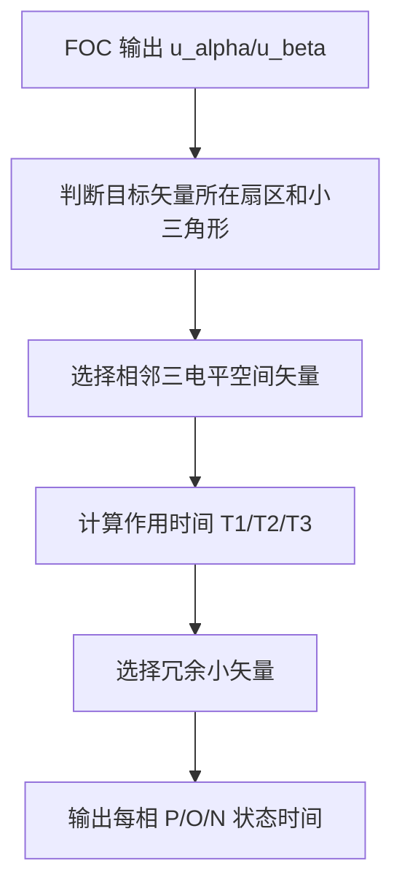

# PP-09 三电平 SVPWM

> **状态**: reviewed  
> **范围**: 本模块建立三电平 SVPWM 的理论和仿真闭环，不要求 lxfoc 在 70% 阶段输出三电平硬件 PWM。

**模块编号：** PP-09  
**模块名称：** 三电平 SVPWM  
**文档版本：** v1.1  
**前置知识：** PP-08 三电平拓扑基础、ALG-01 FOC 理论基础、EE-08 整流与逆变拓扑  
**难度等级：** 

---

## 1.  核心摘要  

**一句话：** 三电平 SVPWM 是把 FOC 输出的 `u_alpha/u_beta` 电压矢量映射为 P/O/N 三状态桥臂序列的调制方法；它不仅要合成目标电压，还要利用冗余小矢量维持中点电位平衡。

**认知挂钩：** 二电平 SVPWM 像在一个大六边形里用 6 个方向的箭头拼目标矢量；三电平 SVPWM 把这个大六边形切成更多小三角形。小三角形让电压合成更细腻，但目标点落在哪个小三角形、选哪组冗余矢量、怎样修正中点电压，都必须由调制器决定。

**核心问题链：**



---

## 2.  问题引入  

### 工程师的真实困惑

> **场景 1：二电平 SVPWM 代码不能直接套到三电平硬件**  
> 原二电平代码输出 `duty_a/duty_b/duty_c`，硬件升级为三电平 NPC 后，工程师尝试把 duty 解释为上管占空比，结果 O 状态不可控，中点电压快速漂移。

> **场景 2：相同目标电压有多组开关状态**  
> 在某些小矢量位置，正小矢量和负小矢量产生同样的空间电压，却对中点电容充放电方向相反。只按“合成电压正确”选矢量，会让母线中点逐渐失衡。

> **场景 3：过调制边界不再清楚**  
> 二电平 SVPWM 中调制比接近极限时，只需处理作用时间溢出。三电平中还要保证小三角形判断、冗余矢量选择和 P/O/N 状态时间都合法。

### 核心问题

三电平 SVPWM 为什么不能只是“更多矢量的二电平 SVPWM”？

**答案：** 因为三电平调制同时承担两个目标：合成目标电压和管理中点电位。二电平调制只需要输出平均占空比，三电平调制必须显式表达状态序列和冗余矢量选择。

### 学习目标

读完本模块，你将能够：

 说明三电平空间矢量比二电平多在哪里  
 区分大矢量、中矢量、小矢量和零矢量  
 理解小三角形分区与作用时间计算的关系  
 解释冗余小矢量如何参与中点平衡  
 设计面向 lxfoc 扩展的三电平调制接口草案  

---

## 3.  直观理解  

### 3.1 从二电平 SVPWM 到三电平 SVPWM

二电平 SVPWM 在 alpha-beta 平面中用 6 个有效矢量和 2 个零矢量合成目标电压。每相只有 P/N 两种状态，因此三相组合共有 `2^3 = 8` 种开关状态。

三电平 SVPWM 将每相状态扩展为 P/O/N，三相组合变为 `3^3 = 27` 种。不同组合可能映射到同一个空间矢量，因此出现冗余矢量。

### 3.2 四类空间矢量

| 类型 | 典型特征 | 调制作用 |
|---|---|---|
| 大矢量 | 靠近外六边形顶点 | 决定高调制比下的边界 |
| 中矢量 | 位于外六边形边附近 | 参与扇区内目标矢量合成 |
| 小矢量 | 靠近中心，通常有冗余状态 | 合成电压并调节中点电位 |
| 零矢量 | 输出空间电压为 0 | 分配零电压时间、影响共模行为 |

### 3.3 小三角形

三电平 SVPWM 的一个扇区通常继续划分为多个小三角形。目标矢量落在哪个小三角形，就选择该小三角形的三个顶点矢量进行时间合成。

合成原则仍然是伏秒平衡：

```text
Vref * Ts = V1 * T1 + V2 * T2 + V3 * T3
T1 + T2 + T3 = Ts
T1 >= 0, T2 >= 0, T3 >= 0
```

如果计算出负作用时间，通常说明小三角形判断错误、坐标变换错误或目标矢量已经越界。

---

## 4.  技术原理  

### 4.1 矢量分区

三电平 SVPWM 的第一步不是计算 duty，而是定位目标矢量：

1. 根据 `atan2(u_beta, u_alpha)` 判断大扇区。
2. 在扇区内用归一化坐标判断小三角形。
3. 查表得到该小三角形的三个相邻矢量。
4. 根据伏秒平衡计算作用时间。

内容验收：

| 小节 | 必须讲清楚的问题 | 验收标准 |
|---|---|---|
| 矢量分区 | 大矢量、中矢量、小矢量、零矢量的位置 | 能画出扇区与小三角形划分 |
| 矢量合成 | 目标矢量落在哪个小三角形，如何计算作用时间 | 任意测试点作用时间非负且总和等于采样周期 |
| 冗余小矢量 | 正/负小矢量对中点电压的影响 | 中点偏差为正/负时选择方向正确 |
| 过调制边界 | 线性区、过调制区、六步边界 | 不出现占空比或作用时间溢出 |

### 4.2 冗余小矢量与中点平衡

同一个空间小矢量可能由两组不同 P/O/N 状态产生。这两组状态对输出线电压等效，但对中点电流不同。调制器可以根据 `neutral_error = Vdc_upper - Vdc_lower` 选择冗余状态：

- 当上电容电压偏高时，优先选择能降低上电容电压或提高下电容电压的状态。
- 当下电容电压偏高时，选择相反方向的状态。
- 当中点偏差接近 0 时，可以按损耗、开关次数或共模电压优化。

### 4.3 状态序列

状态序列需要满足：

- 相邻状态切换尽量少，降低开关损耗。
- 不产生非法直通路径。
- 保持三相输出对称，降低低频谐波。
- 给电流采样留出稳定窗口。

三电平调制的状态序列设计是算法、PWM 外设和驱动保护共同决定的，不应只在数学层面完成。

### 4.4 三电平调制接口草案

未来如果 lxfoc 扩展三电平调制，建议保持与二电平 SVPWM 分离：

```c
typedef struct {
    float ualpha;
    float ubeta;
    float vbus;
    float neutral_error;
    float ta_p, ta_o, ta_n;
    float tb_p, tb_o, tb_n;
    float tc_p, tc_o, tc_n;
} lxfoc_transform_svpwm_3level_t;
```

接口验收：

- 输入仍为 `u_alpha/u_beta/vbus`，保证可接 FOC 输出。
- 输出显式表达每相 P/O/N 时间，避免把三电平调制压扁成二电平 duty。
- `neutral_error` 只影响冗余状态选择，不改变目标电压矢量。

---

## 5.  交叉视角  

### 5.1 与 PP-08 的关系

PP-08 解释“硬件为什么能输出 P/O/N”，本模块解释“软件如何安排 P/O/N 的时间”。没有 PP-08 的中点电流路径理解，三电平 SVPWM 很容易被误解为单纯的空间矢量查表。

### 5.2 与 FOC 的关系

FOC 不关心最终桥臂是二电平还是三电平，它只输出电压矢量。但调制层必须把 `u_alpha/u_beta` 转成硬件可执行的桥臂状态。三电平调制层应作为 FOC 和 PWM 外设之间的独立边界。

### 5.3 与采样和保护的关系

电流采样窗口、死区补偿、过流保护、故障关断都依赖实际开关状态。三电平 SVPWM 的输出如果只保留平均 duty，会丢失保护系统需要的状态信息。

---

## 6.  工程案例  

### 案例：三电平 NPC 调制仿真

**目标：** 对同一 `u_alpha/u_beta` 轨迹，比较二电平 SVPWM 和三电平 SVPWM 的相电压、线电压和中点电压偏差。

推荐仿真参数：

| 参数 | 值 |
|---|---:|
| `Vdc` | 400 V |
| `fsw` | 20 kHz |
| `m` | 0.2, 0.6, 0.9, 1.05 |
| 负载 | 三相 RL 或 PMSM 等效电感 |

输出波形必须包含：

- 三相相电压。
- 线电压。
- 中点电压偏差。
- 三相电流。
- 与二电平 SVPWM 的 THD 对比。

**验收标准：**

| 场景 | 通过标准 |
|---|---|
| 低调制比 `m = 0.2` | P/O/N 时间非负，波形无低频畸变 |
| 中调制比 `m = 0.6` | 中点偏差不单调漂移 |
| 高调制比 `m = 0.9` | 作用时间不溢出，线电压 THD 低于二电平基线 |
| 过调制探索 `m = 1.05` | 明确标注越界或进入过调制逻辑，不静默输出非法状态 |

---

## 7.  实践练习  

### 练习 1：组合数量

二电平三相桥臂有多少种开关状态？三电平三相桥臂有多少种？

**参考答案：**

二电平为 `2^3 = 8` 种，三电平为 `3^3 = 27` 种。

### 练习 2：冗余矢量意义

为什么两个开关状态可能产生同一个空间矢量，却不能随意二选一？

**参考答案：**

它们对线电压等效，但对中点电容充放电方向、器件损耗和开关次数可能不同。选择冗余状态时必须考虑中点电位平衡和工程约束。

### 练习 3：作用时间检查

如果某个目标矢量计算出 `T1 < 0`，最可能说明什么？

**参考答案：**

可能是目标矢量所在小三角形判断错误、坐标归一化错误，或者目标矢量超出当前线性调制区域。不能简单把负值截断为 0 后继续输出。

### 练习 4：接口边界

为什么建议新增三电平调制接口，而不是修改现有二电平 `lxfoc_transform_svpwm` 输出？

**参考答案：**

二电平接口表达的是三相平均 duty；三电平接口需要表达每相 P/O/N 时间、中点误差和冗余状态选择。强行复用会让调用者误以为两者语义相同，增加硬件适配风险。

---

## 8.  正确性证据

主要对标：

- Holmes and Lipo, *Pulse Width Modulation for Power Converters*.
- Bose, *Modern Power Electronics and AC Drives*.
- 厂商三电平逆变器应用笔记中的中点平衡策略。

本模块的 proof 文件位于 `_proofs/power-path/PP-09-Three-Level-SVPWM.module-proof.yaml`。
