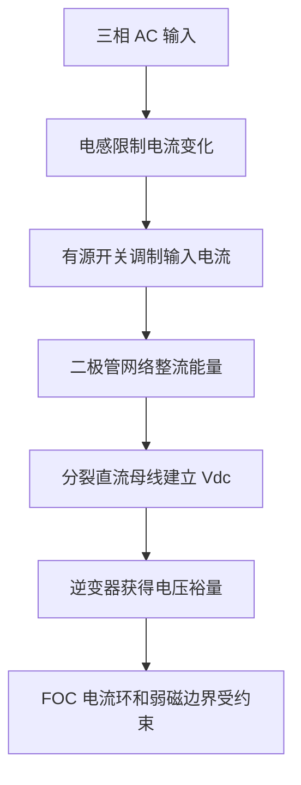

# PP-10 维也纳整流器

> **状态**: reviewed  
> **定位**: 维也纳整流器是三相三电平 PFC 前端，本模块服务于“电源前级如何影响电机控制母线”的系统理解。

**模块编号：** PP-10  
**模块名称：** 维也纳整流器  
**文档版本：** v1.1  
**前置知识：** PP-04 PFC 功率因数校正、PP-08 三电平拓扑基础、CT-04 PID 控制原理  
**难度等级：** ★★★★★

---

## 1. 📌 核心摘要 ★★★★★ 🔰📚

**一句话：** 维也纳整流器是一种三相三电平单向 PFC 前端，用较少有源开关实现高功率因数、低输入电流 THD 和稳定高压直流母线；它不直接驱动电机，却决定逆变器和 FOC 能拿到怎样的母线电压。

**认知挂钩：** 如果逆变器是电机的“功率手臂”，维也纳整流器就是前端的“呼吸系统”。它从三相电网吸取尽量正弦、同相的电流，把能量送到直流母线。呼吸不稳，后面的 FOC 再精细也会遇到母线跌落、弱磁提前、过调制和保护误触发。

**核心问题链：**



---

## 2. 🤔 问题引入 ★★★★★ 🔰

### 工程师的真实困惑

> **场景 1：电机控制正常，但输入电流 THD 超标**  
> 逆变器侧 FOC 波形很好，电机运行平稳，但整机接入三相电网后输入电流畸变严重，功率因数低，无法通过电源质量测试。问题不在电机控制，而在前端整流/PFC。

> **场景 2：母线电压稳定值够高，负载阶跃时却掉得很深**  
> 空载时 `Vdc = 700 V`，电机加速时母线瞬间跌落，FOC 电压限幅触发，电流跟踪误差增大。工程师只看稳态母线值，没有评估前端电压外环带宽和母线电容能量。

> **场景 3：上下母线电容不平衡**  
> Vienna 输出是分裂直流母线。如果中点平衡策略不足，上下电容电压偏差会扩大，导致器件电压应力不均、输入电流畸变和后级逆变器电压参考偏移。

### 核心问题

维也纳整流器和电机控制有什么关系？

**答案：** 维也纳整流器不参与 dq 电流闭环，但它决定 `vbus` 的大小、纹波、跌落速度和保护边界。FOC 的电压限幅、弱磁启动点、过调制判断和故障策略都依赖母线质量。

### 学习目标

读完本模块，你将能够：

✅ 说明维也纳整流器的基本功率路径  
✅ 区分输入电流内环、电压外环和中点平衡环  
✅ 解释三相 PFC 如何获得高功率因数  
✅ 分析 Vienna 输出母线对 FOC 电压裕量的影响  
✅ 给出 Vienna 前端仿真和整机联调的关键指标  

---

## 3. 💡 直观理解 ★★★★★ 🔰💡

### 3.1 Vienna 的定位

维也纳整流器由三相电感、三相有源开关、二极管网络和分裂直流母线组成。其目标不是驱动电机，而是在三相输入侧获得接近正弦且同相的电流，同时在输出侧建立稳定直流母线。

与普通二极管整流桥相比：

| 项目 | 二极管整流桥 | 维也纳整流器 |
|---|---|---|
| 输入电流 | 脉冲形，THD 高 | 可控近似正弦 |
| 功率因数 | 受电容充电影响 | 可接近 1 |
| 输出母线 | 由电网峰值和负载决定 | 闭环调节 |
| 控制复杂度 | 低 | 高 |
| 能量方向 | 通常单向 | 单向 |

### 3.2 三个控制目标

维也纳整流器同时追求：

- 输入电流跟踪三相电网电压相位，实现高功率因数。
- 输出母线电压稳定。
- 上下母线电容电压平衡。

这三个目标相互耦合。电压外环想提高输出功率时，会增大输入电流幅值；电流内环要把该幅值投影到三相正弦参考；中点平衡又会改变某些开关状态的选择。

---

## 4. 🔬 技术原理 ★★★★★ 📚🔧

### 4.1 功率路径

三相输入电压经过输入电感后，由有源开关和二极管网络控制每相电流流向上母线、下母线或中点。由于输出是分裂母线，控制器必须同时关注总母线电压：

```text
Vdc = Vdc_upper + Vdc_lower
```

以及中点偏差：

```text
Vneutral_error = Vdc_upper - Vdc_lower
```

### 4.2 控制结构

| 环节 | 输入 | 输出 | 验收标准 |
|---|---|---|---|
| PLL/相位提取 | 三相电压 | 电网角度 | 相位误差有界 |
| 电压外环 | `Vdc_ref - Vdc` | 有功电流幅值 | 负载阶跃后无持续振荡 |
| 电流内环 | 三相电流参考/实测 | 调制量 | 输入电流正弦且与电压同相 |
| 中点平衡 | `Vdc_upper - Vdc_lower` | 冗余状态/零序调节 | 中点偏差不单调漂移 |

### 4.3 外环带宽约束

PFC 电压外环不能无限做快。外环太慢，负载阶跃时母线跌落明显；外环太快，可能把两倍工频功率脉动传递到输入电流参考，导致输入电流畸变。工程上需要在母线动态响应和输入电流质量之间折中。

### 4.4 中点平衡

维也纳整流器也是三电平结构，上下电容电压平衡不是自然保证的。中点平衡策略通常通过冗余开关状态、零序注入或电流方向相关的调制修正实现。仿真中必须记录 `Vdc_upper` 和 `Vdc_lower`，只看总 `Vdc` 不足以判断系统正确。

---

## 5. 🔗 交叉视角 ★★★★★ 💡🔧

### 5.1 与电机控制的连接

维也纳整流器的输出母线直接约束逆变器最大电压。对 lxfoc 来说，最关键的连接不是把 Vienna 控制并入 lxfoc，而是把实时 `vbus` 和母线质量传递给电机控制侧：

- `vbus` 影响 `lxfoc_control_current` 的电压限幅。
- 母线跌落会触发弱磁、降额或保护。
- 母线纹波会调制 SVPWM 输出，需要在实测 trace 中记录。

### 5.2 与弱磁控制的连接

弱磁边界取决于可用电压。当 Vienna 外环响应较慢或母线跌落较深时，FOC 可能提前进入弱磁或发生 `uq` 限幅。弱磁控制不能只按额定母线设计，必须使用实时 `vbus`。

### 5.3 与整机保护的连接

前端故障和后级故障会互相影响。输入缺相、PFC 限流、母线过压、母线欠压、逆变器过流都需要在统一故障流中记录，否则问题会被误判为“电机控制参数没调好”。

---

## 6. 🎯 工程案例 ★★★★★ 🔧🎯

### 案例：Vienna 前端给伺服逆变器供电

**系统目标：**

- 三相 AC 输入
- Vienna PFC 输出 700 V 直流母线
- 后级逆变器驱动 PMSM
- lxfoc 记录 `vbus_V`、dq 电压和故障标志

推荐输出指标：

| 指标 | 70% 阶段目标 |
|---|---:|
| 功率因数 PF | > 0.98 |
| 输入电流 THD | < 5% 或明确说明未达标原因 |
| 母线稳态误差 | < 2% |
| 中点电压偏差 | < 5% Vdc |

必须保存输入电压、输入电流、母线电压、上下电容电压和调制量。

**联调步骤：**

1. Vienna 空载建立母线，检查 `Vdc_upper` 和 `Vdc_lower`。
2. 接假负载阶跃，验证输入电流 THD 和母线恢复时间。
3. 接逆变器但不开电机，验证母线采样和保护阈值。
4. 低功率运行 FOC，记录 `vbus_V` 与 `ud_V/uq_V`。
5. 做加速阶跃，检查母线跌落是否导致电压限幅或弱磁动作。

---

## 7. 📝 实践练习 ★★★★★ 🎯📝

### 练习 1：控制环识别

Vienna PFC 中电压外环的输出通常是什么？

**参考答案：**

通常输出有功电流幅值或等效功率指令，再由电流内环生成三相输入电流参考。

### 练习 2：母线记录

为什么实测只记录总 `Vdc` 不够，还要记录 `Vdc_upper` 和 `Vdc_lower`？

**参考答案：**

总 `Vdc` 可能正常，但上下电容已经不平衡。中点偏差会改变器件电压应力、调制裕量和后级逆变器参考点。

### 练习 3：FOC 影响

Vienna 前端负载阶跃时母线短暂跌落，会怎样影响 FOC？

**参考答案：**

可用电压降低，`ud/uq` 更容易触发限幅，电流跟踪误差可能增大，高速时弱磁可能提前介入，严重时触发欠压保护。

### 练习 4：外环带宽

为什么 PFC 电压外环不能为了母线更稳而无限提高带宽？

**参考答案：**

外环过快可能把母线低频功率脉动传递到输入电流参考，导致输入电流畸变和功率因数下降。需要在母线动态和输入电流质量之间折中。

---

## 8. 📚 正确性证据

主要对标：

- Mohan, *Power Electronics*.
- Erickson and Maksimovic, *Fundamentals of Power Electronics*.
- TI/Infineon Vienna rectifier reference design notes.

本模块的 proof 文件位于 `_proofs/power-path/PP-10-Vienna-Rectifier.module-proof.yaml`。
