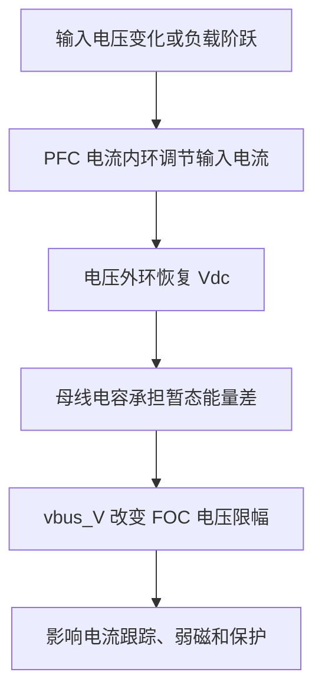

# PP-11 Boost PFC 与母线动态

> **状态**: reviewed  
> **定位**: 本模块解释 PFC 母线不是理想电压源，母线动态会直接改变 FOC 电压裕量、弱磁边界和保护行为。

**模块编号：** PP-11  
**模块名称：** Boost PFC 与母线动态  
**文档版本：** v1.1  
**前置知识：** PP-01 DC-DC 基础拓扑、PP-04 PFC 功率因数校正、ALG-03 PI 电流调节器  
**难度等级：** ★★★★☆

---

## 1. 📌 核心摘要 ★★★★☆ 🔰📚

**一句话：** Boost PFC 的母线不是理想电压源，而是由输入电压、电流内环、电压外环、母线电容和负载功率共同决定的动态节点；它的跌落、纹波和保护阈值会直接改变 FOC 的电压限幅、弱磁边界和故障行为。

**认知挂钩：** 很多电机控制调试把 `Vdc` 当常数，但真实母线更像一个带弹性的水箱。PFC 往水箱补能，逆变器从水箱取能，母线电容只是缓冲。电机突然加速时取能增加，如果 PFC 来不及补，水位就会下跌，FOC 可用电压马上变小。

**核心问题链：**



---

## 2. 🤔 问题引入 ★★★★☆ 🔰

### 工程师的真实困惑

> **场景 1：电流环突然失真，但 PI 参数没变**  
> 电机加速时 `iq_ref` 阶跃，电流环一开始跟踪正常，随后 `uq` 顶到限幅，`iq` 误差增大。检查后发现不是 PI 参数问题，而是母线从 380 V 跌到 320 V，电压裕量不够。

> **场景 2：弱磁动作点和理论不一致**  
> 按额定母线计算，电机应在某转速后进入弱磁。但实际运行中，母线纹波和负载阶跃让 `vbus` 低于额定值，弱磁提前动作。

> **场景 3：欠压保护反复触发**  
> PFC 还在恢复母线，逆变器侧已经触发欠压停机。阈值没有迟滞或恢复条件过严，导致系统在启动和负载阶跃时反复进出故障。

### 核心问题

为什么学习 Boost PFC 不能只看功率因数和输出电压稳态值？

**答案：** 因为电机驱动关注的是动态可用电压。Boost PFC 的外环带宽、母线电容能量、输入跌落和负载阶跃都会反映到 `vbus_V`，进而影响 FOC 电压限幅和保护。

### 学习目标

读完本模块，你将能够：

✅ 说明 Boost PFC 电流内环、电压外环和母线电容的分工  
✅ 解释负载阶跃为什么会造成母线跌落  
✅ 判断母线动态如何影响 dq 电压限幅和弱磁边界  
✅ 设计包含 `vbus_V` 的 lxfoc trace 数据要求  
✅ 制定 PFC-逆变器联调中的欠压/过压验证任务  

---

## 3. 💡 直观理解 ★★★★☆ 🔰💡

### 3.1 Boost PFC 的基本闭环

典型单相或三相 Boost PFC 包含：

- 电流内环：让输入电流跟踪整流电压形状。
- 电压外环：维持直流母线平均值。
- 输入电压前馈：降低输入电压变化对电流环的扰动。
- 母线电容：承担两倍工频功率脉动和负载阶跃能量。

### 3.2 母线电容的能量缓冲

母线电容储能为：

```text
E = 1/2 * Cbus * Vdc^2
```

当负载功率瞬间大于 PFC 输入功率时，能量差由母线电容提供，`Vdc` 下降。电容越大，同样能量缺口造成的电压跌落越小；但电容越大，体积、成本、预充电和浪涌管理越困难。

### 3.3 FOC 看到的是实时母线

FOC 的调制电压不是由额定母线决定，而是由实时 `vbus` 决定。即使算法参数不变，`vbus` 下降也会让同一个 `ud/uq` 指令更接近限幅。

---

## 4. 🔬 技术原理 ★★★★☆ 📚🔧

### 4.1 母线对 lxfoc 的影响

lxfoc 中与母线相关的关键点：

| lxfoc 模块 | 受影响行为 |
|---|---|
| `control_current` | `vbus / sqrt(3)` 决定 dq 电压限幅 |
| `transform_svpwm` | duty 计算和过调制边界依赖母线 |
| `field_weakening` | 弱磁提前或滞后取决于可用电压 |
| `protect` | 欠压/过压迟滞决定是否停机 |
| `motor_config` | `vbus` 应作为运行时参数同步 |

### 4.2 电压外环与负载阶跃

Boost PFC 电压外环通过调节输入电流幅值恢复母线。负载阶跃发生时：

1. 逆变器从母线取走更多功率。
2. 母线电容先承担能量缺口，`Vdc` 下跌。
3. 电压外环检测到误差，增加输入电流幅值。
4. 电流内环提高输入功率，母线恢复。

恢复过程的速度取决于外环带宽、输入电压、限流策略和电容容量。

### 4.3 欠压/过压保护

保护阈值必须带迟滞和时间条件：

- 欠压触发阈值防止低母线下强行输出导致过调制或电流失控。
- 欠压恢复阈值应高于触发阈值，避免反复抖动。
- 过压保护要考虑制动能量、PFC 控制饱和和母线电容耐压。
- 故障记录必须包含 `vbus_V` 和 `fault_flags`。

### 4.4 Trace 数据要求

实物 trace 必须至少包含：

```text
time_s, id_A, iq_A, id_ref_A, iq_ref_A, ud_V, uq_V,
duty_a, duty_b, duty_c, vbus_V, fault_flags
```

如果缺少 `vbus_V`，该实验不得用于验证母线动态，只能作为普通电流环实验。

---

## 5. 🔗 交叉视角 ★★★★☆ 💡🔧

### 5.1 与 PI 电流环的关系

电流环输出的是电压指令。PI 参数再合理，如果母线不足，控制器也无法生成足够电压。母线动态问题常被误判为 PI 参数过小、前馈不足或电机参数错误。

### 5.2 与弱磁的关系

弱磁控制的本质是用负 `id` 换取高速区电压裕量。当 `vbus` 下跌时，可用电压降低，弱磁应提前介入；当 `vbus` 恢复时，弱磁可以退出或减弱。弱磁边界必须使用实时母线，而不是固定额定值。

### 5.3 与系统验证的关系

PFC 和 FOC 不能只各自验证稳态。整机必须验证输入跌落、负载阶跃、再生制动和故障恢复等跨域场景，否则知识库中“电源章节”和“算法章节”无法闭环。

---

## 6. 🎯 工程案例 ★★★★☆ 🔧🎯

### 案例：负载阶跃导致 FOC 电压限幅

**条件：**

- Boost PFC 目标母线：380 V
- PMSM 在中高速运行
- `iq_ref` 从 2 A 阶跃到 8 A
- 母线在 30 ms 内跌落到 330 V 后恢复

**观察量：**

| 场景 | 观察量 | 通过标准 |
|---|---|---|
| 负载阶跃 | `Vdc, id, iq, duty` | 电流环不发生 duty 溢出 |
| 输入跌落 | `Vdc, fault_flags` | 欠压保护阈值和迟滞符合配置 |
| 弱磁边界 | `uq, ud, speed` | 弱磁动作后电压矢量不超过限幅 |

**分析步骤：**

1. 对齐 `iq_ref` 阶跃时间和 `vbus_V` 跌落时间。
2. 检查 `sqrt(ud_V^2 + uq_V^2)` 是否接近实时电压限幅。
3. 检查 `duty_a/b/c` 是否接近 0 或 1。
4. 检查 `fault_flags` 是否出现欠压或过调制。
5. 如果限幅先于电流误差出现，优先分析母线动态，而不是先改 PI 参数。

---

## 7. 📝 实践练习 ★★★★☆ 🎯📝

### 练习 1：能量判断

为什么负载阶跃时母线会先跌落，再恢复？

**参考答案：**

负载功率瞬间增加时，PFC 输入功率不能立即跟上，能量缺口先由母线电容提供，因此 `Vdc` 下跌。电压外环随后提高输入电流幅值，输入功率增加后母线恢复。

### 练习 2：Trace 必要性

某次电流环实验没有记录 `vbus_V`，能否用于验证母线动态？

**参考答案：**

不能。没有 `vbus_V` 就无法判断电压限幅、弱磁动作和欠压保护是否由母线变化触发，只能作为普通电流环实验。

### 练习 3：保护迟滞

欠压保护为什么需要恢复阈值高于触发阈值？

**参考答案：**

如果触发和恢复阈值相同，母线在阈值附近纹波或缓慢恢复时会反复进出故障。迟滞可以避免保护抖动。

### 练习 4：误判排查

电机高速加速时 `iq` 跟踪误差增大。为什么不能第一步就调大 PI 增益？

**参考答案：**

高速加速时可能已经受母线电压限幅约束。若 `ud/uq` 接近实时限幅，调大 PI 只会更快饱和，不能增加物理可用电压。应先检查 `vbus_V`、duty 和限幅状态。

---

## 8. 📚 正确性证据

主要对标：

- Erickson and Maksimovic, *Fundamentals of Power Electronics*, averaged switch modeling and control.
- Mohan, *Power Electronics*, PFC rectifier chapters.
- lxfoc `lxfoc_motor_config_update()` 与电压限幅实现。

本模块的 proof 文件位于 `_proofs/power-path/PP-11-Boost-PFC-Bus-Dynamics.module-proof.yaml`。
