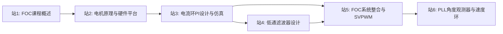

# 路径11: FOC从仿真到固件

> 来源：foc_controller-master | 前置：路径4(算法)站0-3 | 难度：★★★~★★★★

## 1. 路径概述

从Matlab仿真参数设计到STM32固件实现的FOC完整闭环。适合已掌握FOC理论基础（ALG-01/ALG-03）的学习者，通过"理论→仿真→代码"三步走，建立从公式到工程的完整认知。

**前置知识：** 路径4(算法)站0-3（FOC理论、PI调节器、有感FOC）
**学习目标：** 独立完成从Matlab仿真参数设计到STM32固件实现的完整FOC开发流程

## 2. 学习路径图

## 3. 站点详情表

| 站号 | 主题 | 资源引用 | 交叉引用KB模块 | 难度 | 预计学习时间 |
|------|------|---------|--------------|------|------------|
| 站1 | FOC课程概述 | 📂 `FOC_CourseDescription.pptx`FOC_CourseDescription.pptx) | ALG-01(FOC理论) | ★★★☆☆ | 1-2小时 |
| 站2 | 电机原理与硬件平台 | 📂 `FOC_Motor&Hw.pptx`FOC_Motor%26Hw.pptx) + 📂 `HW补充.pptx`HW补充.pptx) | HW-01(电机本体), HW-03(位置传感器), HW-05(功率器件) | ★★★☆☆ | 2-3小时 |
| 站3 | 电流环PI设计与仿真 | 📂 `FOC_ClassicControl.pptx`FOC_ClassicControl.pptx) + 📂 `current_pi.m` + 📂 `pi_current.slx` + 📂 `current_pi_with_delay.m` | ALG-03(PI调节器), ALG-01(FOC理论) | ★★★☆☆ | 4-5小时 |
| 站4 | 低通滤波器设计 | 📂 `FOC_LowPassFilter.pptx`FOC_LowPassFilter.pptx) + 📂 `lpf2.m` + 📂 `lpf.slx` | ADV-ALG-01(带宽与滤波器) | ★★★☆☆ | 2-3小时 |
| 站5 | FOC系统整合与SVPWM | 📂 `FOC_Description.pptx`FOC_Description.pptx) + 📂 `FOC_SVPWM.pptx`FOC_SVPWM.pptx) + 📂 `motor_foc.slx` + 📂 `svpwm.slx` | ALG-05(有感FOC) | ★★★★☆ | 4-5小时 |
| 站6 | PLL角度观测器与速度环 | 📂 `pll.m` + 📂 `pll_angle.slx` + 📂 `speed_TI.m` + 📂 `mc_speed_TI.slx` + 📂 `pll.h` + 📂 `foc.c` | ALG-06(位置速度观测器), ALG-12(速度环) | ★★★★☆ | 4-5小时 |

## 4. 各站详细说明

### 站1: FOC课程概述
- **核心要点：** 了解FOC课程整体框架、学习路线和最终目标
- **资源使用方法：** 直接阅读PPT，了解后续各站的内容安排
- **学习建议：** 快速浏览即可，建立全局认知后进入站2

### 站2: 电机原理与硬件平台
- **核心要点：** PMSM数学模型(dq轴电压方程)、ODrive v3.6硬件平台(STM32F404 + DRV8301 + AS5047P)
- **资源使用方法：** 先看电机原理PPT，再看HW补充PPT了解硬件细节
- **学习建议：** 对照KB模块HW-01(电机本体)和HW-05(功率器件)加深理解

### 站3: 电流环PI设计与仿真（核心站）
- **核心要点：** PI参数计算公式(Kp = W*Ls, Ki = W*Rs)、考虑延迟的电流环分析、Anti-windup设计
- **资源使用方法：** 先看PPT理解原理 → 运行current_pi.m计算参数 → 打开pi_current.slx验证 → 运行current_pi_with_delay.m分析延迟影响
- **学习建议：** 这是本路径最核心的一站，务必理解Kp/Ki与电感/电阻的物理关系。对照KB模块ALG-03(PI调节器)的带宽设计方法

### 站4: 低通滤波器设计
- **核心要点：** 一阶LPF参数设计(alpha = W*Ts/(1+W*Ts))，用于电流/速度信号滤波
- **资源使用方法：** 先看PPT → 运行lpf2.m → 打开lpf.slx验证
- **学习建议：** LPF是FOC系统中无处不在的模块，理解截止频率选择与信号延迟的权衡

### 站5: FOC系统整合与SVPWM
- **核心要点：** Clarke/Park变换→PI控制→反Park→SVPWM完整链路、6扇区判断、占空比计算
- **资源使用方法：** 先看FOC_Description.pptx理解整体框架 → 看FOC_SVPWM.pptx深入SVPWM → 打开motor_foc.slx运行完整FOC仿真 → 打开svpwm.slx单独验证SVPWM
- **学习建议：** 这是系统整合的关键站，建议对照固件controller/foc.c中的foc_update_svpwm函数理解代码实现

### 站6: PLL角度观测器与速度环
- **核心要点：** 二阶PLL带宽设计(Kp = 0.707*Wn, Ki = Wn^2/4.427)、TI风格速度环整定(阻尼因子Theta)
- **资源使用方法：** 运行pll.m设计PLL参数 → 打开pll_angle.slx验证 → 运行speed_TI.m设计速度环 → 打开mc_speed_TI.slx验证
- **学习建议：** PLL是编码器角度处理的关键模块，对照固件controller/pll.h理解C代码实现

## 5. 路径间关联

| 关联路径 | 关系 | 说明 |
|---------|------|------|
| 路径4(算法)站0-3 | 前置 | 需先掌握FOC理论和PI调节器基础 |
| 路径12(PMSM仿真) | 并行/后续 | 学完站5后可开始路径12 |
| 路径14(工程实现) | 后续 | 站4的固件架构可作为路径14的铺垫 |
| 路径9(C仿真) | 替代 | 无MATLAB许可证时可用C仿真验证 |

## 6. 补充资源

- 📂 `固件controller目录` — foc.c / pi.h / svpwm.c / pll.h 完整FOC算法实现
- 📂 `Papers目录` — 4篇参考论文（TI InstaSPIN、Microchip AN1078、霍尔安装误差、电流环延迟分析）
- 📂 `config.h` — 硬件参数配置（PWM频率、死区时间、引脚映射）
- 📂 `Keil工程` — odrive_mks.uvprojx

## 7. 常见问题

**Q: Simulink模型打开报错？**
A: 先运行对应目录下的.m脚本初始化参数，再打开.slx模型。例如站3需先运行current_pi.m再打开pi_current.slx。

**Q: 没有MATLAB许可证？**
A: 可使用知识库[路径9: C仿真验证](../simulation/SIM-00-C-Simulation-Overview.md)的C仿真平台替代，支持FOC/速度环/无感等算法验证。

**Q: 固件如何编译？**
A: 使用Keil uVision打开Projects目录下的odrive_mks.uvprojx工程文件，需要STM32F4 HAL库和ARM CMSIS支持。

**Q: 硬件平台与知识库HW模块的对应关系？**
A: ODrive v3.6使用STM32F404(HW-04 MCU外设) + DRV8301(HW-05 功率器件) + AS5047P(HW-03 位置传感器) + 下桥电流采样(HW-02 电流采样)。

⚠️ **注意事项：** 资源位置可能变化，请以实际路径为准。所有PPT和代码资源为中文。
