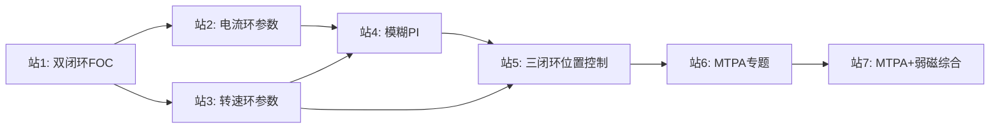

# 路径12: PMSM控制策略仿真

> 来源：手把手电机控制仿真 Part 1-6 + DTC | 前置：路径11站1-5 | 难度：~

## 1. 路径概述

从基础双闭环到高级MTPA+弱磁的PMSM控制策略系统性仿真验证。适合已完成路径11(FOC仿真到固件)的学习者，通过递进式专题深化对PMSM控制策略的理解。

- **前置知识：** 路径11站1-5（FOC仿真基础）
- **学习目标：** 系统性掌握PMSM从基础双闭环到高级MTPA+弱磁的控制策略，理解各策略的适用场景

## 2. 学习路径图

## 3. 站点详情表

| 站号 | 主题 | 资源引用 | 交叉引用KB模块 | 难度 | 预计学习时间 |
|------|------|---------|--------------|------|------------|
| 站1 | 双闭环FOC控制系统 |  `第1部分.zip`.zip) 解压密码:chenshamotor | ALG-05(有感FOC) |  | 4-5小时 |
| 站2 | 电流环参数设计 |  `B站电流环.zip` chenshamotor | ALG-03(PI调节器) |  | 3-4小时 |
| 站3 | 转速环参数设计 |  `B站转速环.zip` chenshamotor | ALG-12(速度环) |  | 3-4小时 |
| 站4 | 模糊PI双闭环控制 |  `第2部分.zip` chenshamotor | CT-15(PID优化策略) |  | 4-5小时 |
| 站5 | 三闭环位置控制 |  `第3部分.zip`.zip) chenshamotor | CT-14(三环级联PID), ALG-12(速度环) |  | 4-5小时 |
| 站6 | MTPA专题 |  `第4部分.zip`.zip) chenshamotor | ALG-11(MTPA), ADV-ALG-05(弱磁MTPA深度) |  | 5-6小时 |
| 站7 | MTPA+弱磁综合策略 |  `第5部分.zip`.zip) +  `第6部分.zip` chenshamotor | ALG-11(MTPA与弱磁) |  | 6-8小时 |

## 4. 各站详细说明

### 站1: 双闭环FOC控制系统
- **核心要点：** PMSM电流环+速度环FOC仿真搭建，id=0控制策略
- **资源使用方法：** 解压zip后按README顺序操作，先运行参数脚本再打开Simulink模型
- **学习建议：** 如果已完成路径11站3和站5，本站可快速浏览，重点对比两种仿真实现的差异

### 站2: 电流环参数设计
- **核心要点：** 电流环PI参数理论计算与仿真验证，带宽设计方法
- **资源使用方法：** 解压后运行MATLAB脚本，对照B站视频教程理解参数设计过程
- **学习建议：** 与路径11站3形成互补——路径11侧重公式推导，本站侧重整定实操

### 站3: 转速环参数设计
- **核心要点：** 速度环PI参数设计，带宽分配原则（电流环:速度环 ≈ 10:1）
- **资源使用方法：** 解压后运行脚本，观察不同参数下的速度响应
- **学习建议：** 对照KB模块ALG-12(速度环与转矩观测器)的理论分析

### 站4: 模糊PI双闭环控制
- **核心要点：** 模糊推理替代传统PI整定，隶属度函数设计，规则库建立
- **资源使用方法：** 解压后对比传统PI与模糊PI的仿真波形
- **学习建议：** 模糊PI是传统PI的智能优化版本，理解其与站2/3传统PI的差异和适用场景

### 站5: 三闭环位置控制
- **核心要点：** 电流环+速度环+位置环三环级联，位置环P控制，带宽分配10:3:1
- **资源使用方法：** 解压后搭建三环仿真，观察位置跟踪性能
- **学习建议：** 对照KB模块CT-14(三环级联PID)的带宽分配法则

### 站6: MTPA专题
- **核心要点：** 最大转矩电流比原理，id/is最优轨迹推导，内置式PMSM的凸极效应利用
- **资源使用方法：** 解压后对照理论推导运行仿真
- **学习建议：** MTPA仅对内置式PMSM(Ld≠Lq)有效，表贴式PMSM退化为id=0控制

### 站7: MTPA+弱磁综合策略
- **核心要点：** MTPA+弱磁多方法实现、模糊PI在MTPA+弱磁中的综合应用、全速域控制策略
- **资源使用方法：** 先解压第5部分理解多种弱磁方法，再解压第6部分看模糊PI综合应用
- **学习建议：** 站7的模糊PI是站4模糊PI的进阶应用——站4是模糊PI替代传统PI，站7是模糊PI在MTPA+弱磁综合策略中的角色

## 5. 路径间关联

| 关联路径 | 关系 | 说明 |
|---------|------|------|
| 路径11(FOC仿真到固件) | 前置 | 学完站11-5后可开始本路径 |
| 路径13(无位置传感器控制) | 后续 | 学完站3后可开始路径13 |
| 路径14(工程实现) | 后续 | 本路径的仿真策略可在路径14中落地 |
| 路径9(C仿真) | 替代 | 无MATLAB许可证时可用C仿真验证 |

## 6. 补充资源

-  `PMSM_DTC.slx` — DTC直接转矩控制（与站1的FOC控制形成对比）
-  `Parameters_DTC.m` — DTC参数配置脚本
-  `教材1: 袁雷《现代永磁同步电机控制原理》`
-  `教材2: 袁登科《永磁同步电动机变频调速系统及其控制》`

## 7. 常见问题

**Q: zip解压密码是什么？**
A: 所有zip压缩包的解压密码统一为 `chenshamotor`。

**Q: 站4和站7都涉及模糊PI，有什么区别？**
A: 站4是模糊PI在双闭环中的应用（用模糊推理替代传统PI整定），站7是模糊PI在MTPA+弱磁综合策略中的应用（PI仅是其中一环，模糊推理用于协调MTPA和弱磁的切换）。站7是站4的进阶。

**Q: 没有MATLAB许可证怎么办？**
A: 可使用知识库[路径9: C仿真验证](../simulation/SIM-00-C-Simulation-Overview.md)的C仿真平台替代。

**Q: 教材如何使用？**
A: 袁雷的书偏重控制原理推导，袁登科的书偏重系统实现，建议根据需要选读对应章节，不必通读。

 **注意事项：** 所有zip压缩包解压密码为 `chenshamotor`。资源为中文。资源位置可能变化，请以实际路径为准。
