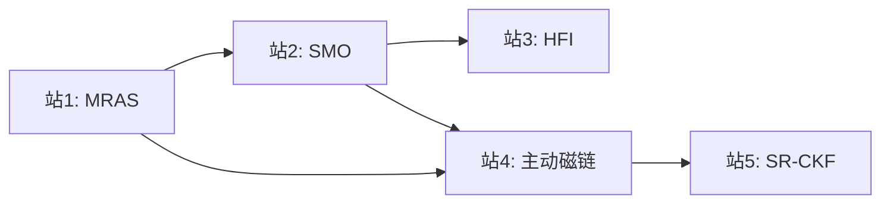

# 路径13: 无位置传感器控制

> 来源：手把手 Part 8-10 + 主动磁链 + SR-CKF | 前置：路径12站1-3 | 难度：~

## 1. 路径概述

5种无位置传感器控制方法的原理与仿真验证，从中高速到零低速全覆盖。适合已掌握有感FOC和基础仿真的学习者，系统理解无感控制的方法论和工程实现要点。

**前置知识：** 路径12站1-3（双闭环FOC、电流环/速度环参数设计）
**学习目标：** 理解5种无位置传感器控制方法的原理差异、适用转速范围和工程实现要点

## 2. 学习路径图

## 3. 站点详情表

| 站号 | 主题 | 资源引用 | 交叉引用KB模块 | 难度 | 预计学习时间 |
|------|------|---------|--------------|------|------------|
| 站1 | MRAS模型参考自适应 |  `第8部分.zip`.zip) chenshamotor | ALG-07(无感观测器) |  | 4-5小时 |
| 站2 | SMO滑模观测器 |  `第9部分(已解压)`/) — 含完整PDF/仿真/12篇论文 | ALG-07(无感观测器) |  | 6-8小时 |
| 站3 | HFI高频注入 |  `第10部分.zip` chenshamotor | ALG-09(高频注入) |  | 5-6小时 |
| 站4 | 主动磁链观测器 |  `active_flux.slx` +  `active_flux.c` +  `active_flux.h`  不完善 | ALG-07(无感观测器) |  | 4-5小时 |
| 站5 | SR-CKF无位置传感器 |  `SR_CKF.m` — 680行完整MATLAB脚本  不完善 | ALG-07(无感观测器), CT-13(LQR/LQG) |  | 5-6小时 |

## 4. 各站详细说明

### 站1: MRAS模型参考自适应
- **核心要点：** MRAS基本原理（参考模型vs可调模型）、自适应律设计、Lyapunov稳定性证明
- **资源使用方法：** 解压zip后按教程顺序操作
- **学习建议：** MRAS是最经典的无感方法之一，适合作为无感控制的入门方法。对照KB模块ALG-07(无感观测器)中的MRAS章节

### 站2: SMO滑模观测器（核心站，内容最完整）
- **核心要点：** 反EMF滑模观测器原理、锁相环(PLL)角度提取、抖振抑制、PI参数整定
- **资源使用方法：** 本站已解压，可直接访问：
  -  `滑模观测器无位置控制资料介绍.pdf`/滑模观测器无位置控制资料介绍.pdf)
  -  `SMO仿真`/SMO仿真/) — Pmsm_smo_actan2.mdl
  -  `仿真搭建过程`/仿真搭建过程介绍/) — SVPWM和滑模部分搭建教程PDF
  -  `原理推导`/原理推导和笔算解释/) — 反正切函数和角度校正公式推导
  -  `参数调试`/滑模观测器和Pi调节器参数调试过程/) — PI整定理论和实际计算参数
  -  `波形分析`/波形记录及其简要分析/) — 三相电流/位置/转速/转矩波形
  -  `参考论文`/参考论文/) — 12篇中文学术论文
- **学习建议：** 这是5种无感方法中资料最完整的一站，建议作为重点深入学习。先读资料介绍PDF建立框架，再看仿真搭建教程，最后运行仿真验证

### 站3: HFI高频注入
- **核心要点：** 凸极效应利用、脉振注入vs方波注入、N/S极极性判断、零低速区域角度估计
- **资源使用方法：** 解压zip后按教程操作
- **学习建议：** HFI是唯一能在零低速区域工作的无感方法，通常与SMO/MRAS配合实现全速域无感控制。对照KB模块ALG-09(高频注入)

### 站4: 主动磁链观测器  不完善
- **核心要点：** 主动磁链概念、IPMSM凸极信息利用、从仿真到C代码的完整实现
- **资源使用方法：** 打开active_flux.slx运行仿真，对照active_flux.c/h理解嵌入式实现
- **学习建议：** 这是唯一同时提供Simulink模型和嵌入式C代码的无感方法，是理解"仿真→代码"落地的绝佳案例。C代码使用ARM CMSIS-DSP库(arm_cos_f32/arm_sin_f32)。 资源不完善，建议对照ALG-07(无感观测器)和ALG-16(非线性磁链观测器)补充学习

### 站5: SR-CKF无位置传感器  不完善
- **核心要点：** 平方根容积卡尔曼滤波(SR-CKF)原理、状态方程建模、噪声协方差矩阵设计、数值稳定性
- **资源使用方法：** 直接运行SR_CKF.m（680行完整脚本，注释详尽，无需额外文件）
- **学习建议：** SR-CKF是最高端的无感方法，计算量大但精度最高。 资源不完善——仿真中未考虑逆变器非线性、参数耦合等工程难点，实际硬件效果与仿真差距较大，建议对照ALG-21(参数辨识)理解在线辨识的工程局限

## 5. 路径间关联

| 关联路径 | 关系 | 说明 |
|---------|------|------|
| 路径12(PMSM仿真) | 前置 | 学完站12-3后可开始本路径 |
| 路径14(工程实现) | 后续 | 站4的C代码和站2的参数调试可直接用于路径14 |
| 路径9(C仿真) | 替代 | 无MATLAB许可证时可用C仿真验证SMO/MRAS |
| 路径11(FOC仿真) | 基础 | 站11-6的PLL是本路径多种方法的角度提取基础 |

### 5种无感方法对比

| 方法 | 适用转速范围 | 计算复杂度 | 精度 | 工程难度 | 典型应用 |
|------|------------|-----------|------|---------|---------|
| MRAS | 中高速 | 低 | 中 | 低 | 家电变频器 |
| SMO | 中高速 | 中 | 中高 | 中 | 工业伺服 |
| HFI | 零低速 | 中 | 高 | 高 | 电动汽车 |
| 主动磁链 | 中高速(IPMSM) | 中 | 高 | 中 | 内置式PMSM驱动 |
| SR-CKF | 全速域 | 高 | 最高 | 高 | 高精度伺服 |

## 6. 补充资源

-  `foc_smo_luenberger_2020.slx` — FOC+SMO+龙伯格观测器对比模型
-  `motor_smo.slx` — 电机+滑模观测器模型
-  [C仿真替代方案](../simulation/SIM-00-C-Simulation-Overview.md) — 无MATLAB许可证时使用路径9的C仿真平台
-  `教材3: 阮毅/陈伯时《电力拖动自动控制系统》` chenshamotor

## 7. 常见问题

**Q: 5种方法如何选择？**
A: 取决于应用场景——MRAS适合低成本家电、SMO适合工业通用、HFI适合需要零低速启动的场景、主动磁链适合IPMSM、SR-CKF适合高精度需求。实际工程中常采用HFI+SMO的混合方案实现全速域无感。

**Q: 站2的解压目录结构是什么？**
A: 解压后首层目录包含：SMO仿真/、仿真搭建过程介绍/、原理推导和笔算解释/、基本参数说明/、波形记录及其简要分析/、滑模观测器和Pi调节器参数调试过程/、参考论文/。建议先读"滑模观测器无位置控制资料介绍.pdf"建立全局认知。

**Q: 站5的SR_CKF.m如何运行？**
A: 直接在MATLAB中打开运行即可，脚本包含完整的电机模型和可视化，无需额外文件。脚本约680行，注释详尽，建议逐段阅读理解。

 **注意事项：** zip压缩包解压密码统一为 `chenshamotor`。资源为中文。资源位置可能变化，请以实际路径为准。
