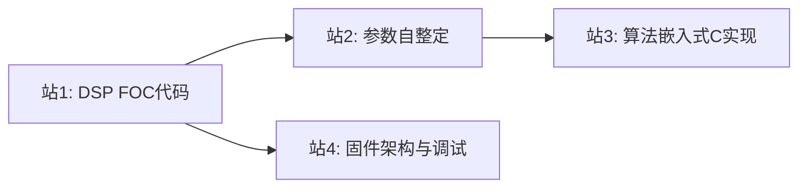

# 路径14: 工程实现与调试

> 来源：手把手 Part 7 + 参数自整定 + 主动磁链C代码 + foc_controller固件 | 前置：路径11或12（站14-3建议先完成路径13） | 难度：~

## 1. 路径概述

从仿真到DSP/STM32的算法落地与系统调试，完成理论到产品的最后一公里。适合已掌握仿真验证的学习者，聚焦"代码怎么写、参数怎么调、系统怎么调试"的工程实践问题。

- **前置知识：** 路径11或12（站14-3建议先完成路径13）
- **学习目标：** 将仿真中验证的算法移植到实际MCU平台，完成参数自整定和系统调试

## 2. 学习路径图

## 3. 站点详情表

| 站号 | 主题 | 资源引用 | 交叉引用KB模块 | 难度 | 预计学习时间 |
|------|------|---------|--------------|------|------------|
| 站1 | DSP FOC代码实现 |  `第7部分.zip` chenshamotor — TMS320F28335 | MC-LIB路径, HPM-MC路径 |  | 6-8小时 |
| 站2 | 参数自整定方法 |  `commissioning_simulation.m` — 855行，电阻/电感/磁链/惯量四步辨识  不完善 | ALG-03(PI整定), ALG-12(速度环整定), ALG-21(参数辨识) |  | 4-5小时 |
| 站3 | 算法嵌入式C实现 |  `active_flux.c` +  `active_flux.h` — ARM CMSIS-DSP  不完善 | ALG-07(无感观测器) |  | 4-5小时 |
| 站4 | 固件架构与调试 |  `Firmware目录` — 分层架构：app/bsp/controller/drivers/math/utils | SYS-01(设计模式), ADV-ALG-15(调试方法论), ODrive路径 |  | 6-8小时 |

## 4. 各站详细说明

### 站1: DSP FOC代码实现
- **核心要点：** TMS320F28335的FOC代码实现，PWM配置、ADC采样、中断处理、Clarke/Park/SVPWM算法C代码
- **资源使用方法：** 解压zip后用CCS v6.0打开工程，对照代码理解FOC各环节的C语言实现
- **学习建议：** 与KB中MC-LIB(STM32/Z20K平台)和HPM-MC(RISC-V平台)形成三平台对比，理解不同MCU的FOC实现差异

### 站2: 参数自整定方法（核心站） 不完善
- **核心要点：** 四步参数辨识流程：
  1. 定子电阻辨识（DC注入法）
  2. 电感辨识（电压阶跃法）
  3. 磁链辨识（稳态电压方程法）
  4. 转动惯量辨识（加速度法）
- **资源使用方法：** 直接运行commissioning_simulation.m（855行，注释详尽，包含完整仿真模型和可视化）
- **学习建议：** 参数自整定是工程调试的第一步，理解每步辨识的物理原理和适用条件。 仿真脚本仅覆盖离线辨识，未涉及在线辨识的工程难点（激励不足、逆变器非线性、参数耦合），对照KB模块ALG-21(参数辨识)补充在线辨识的局限性理解

### 站3: 算法嵌入式C实现  不完善
- **核心要点：** 主动磁链观测器的C语言实现，ARM CMSIS-DSP库使用(arm_cos_f32/arm_sin_f32)，定点数与浮点数选择
- **资源使用方法：** 对照active_flux.slx仿真模型理解算法原理，再阅读active_flux.c/h理解C代码实现
- **学习建议：** 建议先完成路径13站4(主动磁链仿真)再学本站，理解"仿真→代码"的映射关系。 C代码不完善，缺少完整的初始化流程和边界条件处理，建议对照ALG-07(无感观测器)和ALG-16(非线性磁链观测器)补充

### 站4: 固件架构与调试
- **核心要点：** 分层架构设计(app/bsp/controller/drivers/math/utils)、任务调度、通信协议栈、调试方法论
- **资源使用方法：** 浏览Firmware目录结构，重点阅读controller/下的FOC算法代码和bsp/下的硬件驱动代码
- **学习建议：** 对照KB模块SYS-01(设计模式)和ADV-ALG-15(调试方法论)，以及ODrive路径的FreeRTOS架构对比

## 5. 路径间关联

| 关联路径 | 关系 | 说明 |
|---------|------|------|
| 路径11(FOC仿真到固件) | 前置 | 站11-6的固件代码是本路径站4的简化版 |
| 路径12(PMSM仿真) | 前置 | 仿真策略的工程落地 |
| 路径13(无感控制) | 前置(站3) | 站14-3建议先完成路径13站4 |
| ODrive路径(路径6) | 对比 | FreeRTOS vs 裸机调度架构对比 |
| MC-LIB/HPM-MC(路径5) | 对比 | 不同MCU平台的FOC实现对比 |

### 多平台FOC代码对比

| 平台 | MCU | 架构 | 数学库 | 调度方式 | 来源 |
|------|-----|------|--------|---------|------|
| TMS320F28335 | C28x DSP | 裸机+中断 | IQmath | PWM中断 | 站14-1 |
| STM32F404 | Cortex-M4F | 裸机+协作调度 | ARM CMSIS-DSP | 任务链表 | 站14-4 |
| STM32/Z20K (MC-LIB) | Cortex-M4 | 裸机+中断 | 自研定点/浮点 | PWM中断 | KB路径5 |
| HPM6750 (HPM-MC) | RISC-V | 裸机+中断 | hpm_math | PWM中断 | KB路径5 |

## 6. 补充资源

-  `巴特沃斯滤波器.zip` chenshamotor — 信号处理基础
-  `电流预测.zip` chenshamotor — 预测控制算法
-  `BodePlot.slx` — 波特图绘制模型
-  `fft_demo.slx` — FFT频谱分析模型

## 7. 常见问题

**Q: 站14-1的DSP代码与KB中MC-LIB/HPM-MC的关系？**
A: DSP代码(TI C2000)提供了另一种MCU平台的FOC实现参考，与MC-LIB(STM32/Z20K)和HPM-MC(RISC-V)形成多平台对比。核心算法(Clarke/Park/PI/SVPWM)相同，差异在于外设配置和数学库。

**Q: 站14-3的C代码使用了什么数学库？**
A: 使用ARM CMSIS-DSP库(arm_cos_f32/arm_sin_f32)，面向STM32等ARM Cortex-M平台。如果使用其他平台，需替换为对应的数学库。

**Q: commissioning_simulation.m如何运行？**
A: 直接在MATLAB中打开运行即可，脚本约855行，包含完整的PMSM参数自整定仿真（电阻→电感→磁链→惯量四步辨识），注释详尽。

 **注意事项：** zip压缩包解压密码统一为 `chenshamotor`。资源为中文。资源位置可能变化，请以实际路径为准。
