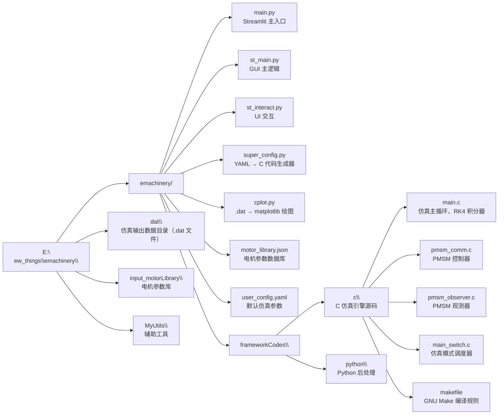
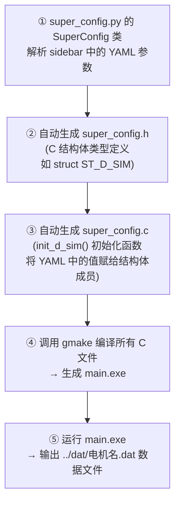

#  C 语言仿真 — 快速上手指南

**版本：** v1.0
**日期：** 2026-05
**适用对象：** 电机控制学习者、嵌入式开发者、首次使用 emachinery 仿真框架的用户

> **目标：** 15 分钟内跑通第一个仿真，看到电机转速/电流/转矩波形。

---

## 1. 环境准备

仿真运行需要以下环境组件，均在 `E:\new_things\` 目录下预装完毕。如果你是首次使用本机，请逐项确认每个组件都能正常工作。

### 1.1 TDM-GCC-64 编译器

| 属性 | 值 |
|------|-----|
| **路径** | `C:\TDM-GCC-64\bin` |
| **用途** | 编译 C 仿真代码（`gcc` / `gmake`） |

**验证方法：** 打开命令行，输入 `gcc --version`，应能看到版本信息。

```text
gcc (tdm64-1) 10.3.0
```

如果提示 "不是内部或外部命令"，说明 `C:\TDM-GCC-64\bin` 未被添加到系统 PATH 中。启动脚本已自动处理此问题，无需手动添加。

### 1.2 Python 虚拟环境

| 属性 | 值 |
|------|-----|
| **路径** | `E:\new_things\emy-env` |
| **Python 版本** | 3.12 |
| **已安装的关键包** | `streamlit`（GUI）、`numpy`（数值计算）、`pandas`（数据处理）、`matplotlib`（绘图）、`control`（控制系统分析）、`sympy`（符号计算）、`numba`（JIT 加速） |

**验证方法：**

```bash
E:\new_things\emy-env\Scripts\activate.bat
python --version
```

应显示 `Python 3.12.x`。如果虚拟环境目录不存在，说明需要重新部署环境（参见第 8 节环境清理与重建）。

### 1.3 make.exe

| 属性 | 值 |
|------|-----|
| **路径** | `E:\new_things\make.exe` |
| **来源** | TI CCS（Code Composer Studio）的 gmake 工具 |
| **用途** | 执行 Makefile，编译 C 仿真工程 |

如果遇到 `process_begin: CreateProcess(NULL, gcc ...) failed. make (e=2)` 错误，说明 gmake 无法找到 gcc。这是 Windows 下 gmake 与 MinGW 配合的常见问题，参见第 7 节解决方案。

### 1.4 MiKTeX

| 属性 | 值 |
|------|-----|
| **路径** | `E:\new_things\miktex\miktex\bin\x64` |
| **用途** | LaTeX 渲染引擎，用于绘图中的数学公式标注（如 `$i_d$`、`$\omega_m$`） |

如果 MiKTeX 未安装或路径不正确，数学公式将以纯文本形式显示，不影响仿真运行。

### 1.5 源代码

| 属性 | 值 |
|------|-----|
| **路径** | `E:\new_things\emachinery` |
| **包含内容** | `emachinery/main.py`（Streamlit GUI 入口）、`emachinery/frameworkCodes/c/`（C 仿真源代码）、`emachinery/frameworkCodes/python/`（Python 桥梁层与后处理层） |

完整目录结构：



---

## 2. 三种启动方式

### 方式一（推荐）：Streamlit 图形界面

**操作：** 双击 `E:\new_things\emy-start.bat`

**脚本内容：**

```batch
@echo off
chcp 65001 >nul
title emy-c Motor Simulation (Source)
set PATH=E:\new_things\miktex\miktex\bin\x64;E:\new_things\emachinery\emachinery\frameworkCodes\c;C:\TDM-GCC-64\bin;%PATH%
call E:\new_things\emy-env\Scripts\activate.bat
cd /d E:\new_things\emachinery
python -m emachinery.main
```

**脚本做的事：**

1. 设置控制台编码为 UTF-8（`chcp 65001`），防止中文乱码
2. 将 MiKTeX、C 仿真目录、TDM-GCC 添加到 PATH 最前面，确保优先使用正确版本
3. 激活 Python 虚拟环境 `emy-env`
4. 切换到源码根目录
5. 启动 Streamlit GUI（`python -m emachinery.main`）

**运行成功后：** 浏览器会自动打开 Streamlit 页面（通常为 `http://localhost:8501`）。如果未自动打开，手动访问该地址。

**适合：** 日常使用、参数扫调、查看仿真曲线

### 方式二：命令行直接编译

**操作：** 双击 `E:\new_things\emy-c-build.bat`

**脚本内容：**

```batch
@echo off
chcp 65001 >nul
title emy-c C Simulation Build
set PATH=E:\new_things\miktex\miktex\bin\x64;C:\TDM-GCC-64\bin;E:\new_things\emachinery\emachinery\frameworkCodes\c;%PATH%
cd /d E:\new_things\emachinery\emachinery\frameworkCodes\c
gmake.exe
```

**脚本做的事：**

1. 设置 UTF-8 编码
2. 设置 PATH，包含 MiKTeX、TDM-GCC、C 仿真目录
3. 切换到 C 源码目录
4. 执行 `gmake.exe`，编译所有 C 文件

编译成功后，`frameworkCodes\c` 目录下会生成 `main.exe`。可手动运行：

```bash
cd E:\new_things\emachinery\emachinery\frameworkCodes\c
main.exe
```

运行后，仿真数据会输出到 `E:\new_things\emachinery\dat\电机名.dat` 文件。

**适合：** 只改了 C 代码需要快速编译验证、不想启动 Streamlit 的情况下快速确认编译是否通过

### 方式三：手动命令

```bash
conda activate emy
cd E:\new_things\emachinery
python -m emachinery.main
```

或者在已激活虚拟环境的终端中：

```bash
cd /d E:\new_things\emachinery
python -m emachinery.main
```

**适合：** 理解底层执行流程、调试启动问题、在已有终端环境中快速启动

---

## 3. Streamlit UI 操作流程（6 步）

启动 Streamlit 后，你会在浏览器中看到一个左侧 sidebar + 右侧主区域的经典 Streamlit 布局。以下按操作顺序逐步说明。

### Step 1: 选择电机

**位置：** 左侧 sidebar 顶部的下拉菜单

**操作：** 在下拉列表中选择电机型号（如 `SEW100W`、`SEW200W` 等）

**底层机制：**
- 电机列表从 `E:\new_things\emachinery\input_motorLibrary\motor_library.json` 读取
- 选中电机后，其额定参数（额定转矩、额定转速、额定电流、极对数、Rs、Ld、Lq、KE、Js 等）自动加载到仿真引擎
- 不同电机的参数差异会影响 PI 参数的适用范围——换电机后可能需要重新调整控制参数

**提示：** 如果你是第一次使用，保持默认的 `SEW100W` 即可。这是一个 100W 的表贴式 PMSM，参数经过了辨识验证。

### Step 2: 选择仿真模式

**位置：** 电机选择下方的运行模式选择区域

**操作：** 选择运行模式

**可选项：**

| 类型 | 说明 | 适合 |
|------|------|------|
| **C 仿真**（推荐） | 编译运行 C 语言数值积分仿真，查看时域波形 | 日常学习、参数调优、波形观察 |
| **Plugin 扫频** | 执行扫频分析，自动生成 Bode 图 | 频域分析、带宽测量、稳定裕度评估 |
| **Plugin 多目标优化** | 多目标优化（如带宽 vs 稳定裕度权衡） | 参数寻优 |
| **Plugin 性能计算** | 自动计算上升时间、超调量、带宽等性能指标 | 定量评估控制性能 |

**首次使用建议：** 选择 **「C 仿真」**，仿真模式编号保持默认的 `4`（速度闭环控制）。这是最经典的用例——速度阶跃响应验证。

### Step 3: 查看当前配置

**位置：** 左侧 sidebar 中的「仿真参数」折叠面板

**操作：** 展开该面板，查看当前 YAML 配置

你会看到类似下面的配置摘要：

```yaml
sim:
  CLTS: 0.0001                  # 电流环采样周期 100μs
  NUMBER_OF_STEPS: 50000        # 仿真总步数
  MACHINE_SIMULATIONs_PER_SAMPLING_PERIOD: 1
FOC:
  CLBW_HZ: 200.0                # 电流环带宽 200Hz
  delta: 20.0                   # 速度/电流带宽比
  VL_EXE_PER_CL_EXE: 1          # 速度环每 1 次电流环执行
  bool_apply_decoupling_voltages_to_current_regulation: false
CL:
  LIMIT_DC_BUS_UTILIZATION: 0.96
VL:
  LIMIT_OVERLOAD_FACTOR: 1.0
```

**这些参数的含义** 参见第 4 节速查表。对于第一次仿真，**不需要修改任何参数**，直接进入下一步。

### Step 4: 修改关键参数（可选）

**位置：** 左侧 sidebar 中的「可调参数」面板

**操作：** 直接修改文本框中的数值

**常用可调参数** 参见第 4 节速查表。**首次运行建议不改**，使用默认参数即可看到正常的仿真结果。等你跑通第一个仿真、能看到波形后，再回来改参数观察变化。

### Step 5: 编译并运行

**位置：** 页面上的 **「Save to C and compile」** 按钮

**操作：** 点击该按钮

**内部执行流程（自动化，你只需点击按钮）：**



**编译过程控制台输出示例：**

```text
gcc -c main.c -o main.o
gcc -c pmsm_comm.c -o pmsm_comm.o
gcc -c pmsm_observer.c -o pmsm_observer.o
...
gcc main.o pmsm_comm.o ... -o main.exe
```

最后一行显示 `_=50000`（表示仿真完成 50000 步），说明运行成功。

**如果编译报错：** 错误信息会直接在 Streamlit 页面上显示（红色文本框），不要慌张。常见的错误及解决方案参见第 7 节。

### Step 6: 查看仿真结果

编译运行成功后，Streamlit 页面会自动切换到绘图视图。

**底层机制：** 页面调用 `cplot.py` 读取 `E:\new_things\emachinery\dat\电机名.dat` 文件，解析为 pandas DataFrame，然后用 matplotlib 绘制 7 个默认子图。

**7 个默认子图的含义** 参见第 5 节详细解读。

**交互操作：**
- **缩放：** 鼠标框选或滚轮缩放
- **平移：** 按住鼠标左键拖动
- **保存：** 点击工具栏的保存图标导出图片
- **重置：** 点击 Home 图标恢复初始视图

---

## 4. YAML 关键参数速查

以下参数均在 `user_config.yaml` 或 Streamlit sidebar 的「可调参数」面板中修改。修改后需重新点击「Save to C and compile」才能生效。

| 参数 | 含义 | 典型值 | 修改影响 |
|------|------|--------|---------|
| `sim.CLTS` | 电流环采样周期 [s]，即控制器执行周期 | 1e-4（100μs，对应 10kHz） | **改大** → 更离散化 → 电流环性能下降、可能不稳定；**改小** → 更接近连续系统 → 计算量增加。仿真中默认值与实际 DSP 的 PWM 周期一致 |
| `sim.NUMBER_OF_STEPS` | 仿真总步数 | 50000 | 总仿真时间 = `NUMBER_OF_STEPS × CLTS × MACHINE_SIMULATIONs_PER_SAMPLING_PERIOD`。50000×100μs=5s。**改大** → 仿真时间更长（能看到更多瞬态过程）；**改小** → 运行更快 |
| `sim.MACHINE_SIMULATIONs_PER_SAMPLING_PERIOD` | 电机模型积分次数 / 每次控制器执行 | 1 | **改大** → 电机仿真更精细（如仿真 PWM 载波效应），但计算量线性增加。通常保持 1 即可 |
| `FOC.CLBW_HZ` | 电流环目标带宽 [Hz] | 100~500 | **改大** → 电流响应更快 → 噪声放大、可能超调；实际带宽受采样周期的限制，理论极限 ≤ `1/CLTS / 20`（100μs 对应 ≤500Hz） |
| `FOC.delta` | 速度环带宽 / 电流环带宽的比值 | 5~25 | **改大** → 速度环相对更慢（更保守、更稳定）；**改小** → 速度环更快 → 可能震荡。实际速度环带宽 ≈ `CLBW_HZ / delta` |
| `FOC.VL_EXE_PER_CL_EXE` | 速度环降频比（每 N 次电流环执行才执行一次速度环） | 1~20 | **改大** → 速度环更新更慢 → 控制性能下降；**改小** → CPU 负荷增加。仿真默认 1（全速执行） |
| `CL.LIMIT_DC_BUS_UTILIZATION` | 母线电压利用率上限（0~1） | 0.96 | **改小** → 更早进入电压限幅 → 高速性能受限（留出更多电压裕量）；**改到 1.0** → 可进入过调制区（方波操作），电流谐波增大 |
| `VL.LIMIT_OVERLOAD_FACTOR` | 速度环输出限幅倍数（× 额定电流） | 1.0 | **改大** → 允许更大的转矩电流给定 → 加减速更快，但可能超过电机/驱动器额定能力 |
| `user.mode_select_synchronous_motor` | PMSM 默认仿真模式编号 | 4（速度环） | 对应 `main_switch.c` 中的 `MODE_SELECT_*` 枚举值。`4` = 速度闭环、`3` = 电流闭环（FOC）、`5` = 位置闭环 |
| `FOC.bool_apply_decoupling_voltages_to_current_regulation` | dq 轴解耦前馈开关 | `false` | **true** → 启用电感耦合项前馈补偿 → 高速时 dq 轴解耦效果更好；低速时效果不明显 |

**参数间的约束关系：**

```text
电流环实际带宽 ≤ 1/CLTS / 20     （采样定理约束）
速度环实际带宽 ≈ CLBW_HZ / delta  （级联控制设计约束）
总仿真时间   =  NUMBER_OF_STEPS × CLTS × MACHINE_SIMULATIONs_PER_SAMPLING_PERIOD
```

---

## 5. 绘图通道解读（7 个默认子图）

仿真完成后，页面会自动显示 7 个子图。每个子图的含义和解读方法如下：

### 子图 1：Speed（转速）

| 属性 | 值 |
|------|-----|
| **标题** | Speed |
| **Y 轴** | 转速 [r/min] |
| **信号** | `cmd_varOmega*MECH_RAD_PER_SEC_2_RPM`（给定转速，虚线）、`ACM.varOmega*MECH_RAD_PER_SEC_2_RPM`（实际转速，实线）、`OFSR.esoaf.xOmg*ELEC_RAD_PER_SEC_2_RPM`（ESO 观测转速，点线） |
| **怎么看** | 看给定量和实际量的跟踪关系：阶跃指令时看**超调量**（峰值超出稳态值的百分比）和**调节时间**（进入 ±2% 误差带的时间），稳态时看**静差**（实际值与给定值的偏差） |

**正常波形特征：**
- 实际转速在阶跃指令后有短暂延迟然后上升
- 可能有 5~15% 的超调（取决于速度环 PI 参数）
- 稳态时实际转速应与给定转速基本重合

**异常波形：**
- 振幅不断增大的振荡 → 速度环 PI 增益过大，增大 `FOC.delta`
- 上升极慢、无超调 → 速度环 PI 增益过小，减小 `FOC.delta`
- 稳态有固定偏差 → 积分项被限幅或 Ki=0

### 子图 2：iQ（Q 轴电流）

| 属性 | 值 |
|------|-----|
| **标题** | iQ |
| **Y 轴** | Q 轴电流 [A] |
| **信号** | `cmd_iDQ[1]`（Q 轴电流指令，虚线）、`iDQ[1]`（Q 轴电流反馈，实线） |
| **怎么看** | Q 轴电流 ≈ 转矩电流。速度环的输出就是 iQ 给定。加速时 iQ 为正（电动），减速时 iQ 为负（发电）。看 iQ 响应速度和电流环跟踪精度 |

**正常波形特征：**
- 加速阶段 iQ 出现正脉冲（幅值受 `LIMIT_OVERLOAD_FACTOR` 限幅）
- 匀速阶段 iQ 回到负载转矩对应的电流值
- 电流反馈紧密跟踪电流指令（二者几乎重合）

**异常波形：**
- 反馈明显滞后于指令 → 电流环带宽不足，增大 `FOC.CLBW_HZ`
- 反馈振荡 → 电流环 PI 增益过大，减小 `FOC.CLBW_HZ`

### 子图 3：Torque（转矩）

| 属性 | 值 |
|------|-----|
| **标题** | Torque |
| **Y 轴** | 转矩 [Nm] |
| **信号** | `TLoad`（负载转矩）、`Tem`（电磁转矩） |
| **怎么看** | Tem 应跟踪 TLoad（有加减速时会有差异——惯性转矩 = J×dω/dt 也需要电磁转矩来提供）。给阶跃负载时看转矩响应速度 |

**正常波形特征：**
- 加速时 Tem > TLoad（差值用于产生角加速度）
- 匀速时 Tem ≈ TLoad
- 减速时 Tem < TLoad（甚至为负，即发电制动）

**异常波形：**
- Tem 剧烈振荡 → 电流环不稳定，检查 PI 参数
- Tem 被削顶 → 进入电流限幅，增大 `LIMIT_OVERLOAD_FACTOR`

### 子图 4：iD（D 轴电流）

| 属性 | 值 |
|------|-----|
| **标题** | iD |
| **Y 轴** | D 轴电流 [A] |
| **信号** | `cmd_iDQ[0]`（D 轴电流指令，虚线）、`iDQ[0]`（D 轴电流反馈，实线） |
| **怎么看** | 表贴式 PMSM 采用 iD=0 控制策略，看 iD 是否被维持在零附近。受 dq 轴交叉耦合影响，高速时 iD 可能会有波动 |

**正常波形特征：**
- iD 指令恒为 0
- iD 反馈在零附近有小幅波动（通常 < 0.1A）
- 高速时波动略增大（耦合效应）

**异常波形：**
- iD 有固定偏移 → dq 轴解耦不充分，尝试启用 `bool_apply_decoupling_voltages_to_current_regulation`
- iD 振荡 → 电流环 PI 参数不当

### 子图 5：Vdc Util（母线电压利用率）

| 属性 | 值 |
|------|-----|
| **标题** | Vdc Util |
| **Y 轴** | 直流母线电压利用率（0~1） |
| **信号** | `dc_bus_utilization_ratio` |
| **怎么看** | 稳态运行时通常 < 0.9。高速重载时接近 0.96（限幅点）。超过 0.96 意味着进入了过调制区 |

**正常波形特征：**
- 低速时利用率较低（0.2~0.4）
- 随转速升高，利用率逐渐增大
- 最高不应持续超过 0.96（否则说明电压裕量不足）

**异常波形：**
- 稳态就接近 1.0 → 母线电压不够或反电动势太大，电机已达到速度极限
- 剧烈波动 → 控制不稳定

### 子图 6：uAB（电压）

| 属性 | 值 |
|------|-----|
| **标题** | uAB |
| **Y 轴** | 电压 [V] |
| **信号** | `cmd_uDQ[0]`（D 轴电压指令）、`cmd_uDQ[1]`（Q 轴电压指令）、`cmd_uAB[0]`（α 轴电压指令）、`cmd_uAB[1]`（β 轴电压指令） |
| **怎么看** | dq 轴电压在稳态时接近直流（恒定值）；αβ 轴电压为正弦波。看电压幅值是否进入限幅 |

**正常波形特征：**
- cmd_uDQ[0] 在零附近（iD=0 控制）
- cmd_uDQ[1] 随转速升高而增大（反电动势补偿）
- cmd_uAB[0/1] 为正交正弦波，幅值随转速升高

**异常波形：**
- αβ 轴正弦波被削顶 → 进入电压限幅（过调制）
- dq 轴电压振荡 → PI 输出不稳定

### 子图 7：Timebase（时间基准）

| 属性 | 值 |
|------|-----|
| **标题** | Timebase |
| **Y 轴** | 仿真时间 [s] |
| **信号** | `timebase` |
| **怎么看** | 横轴参考——所有其他子图共享这个时间轴。确认仿真总时长（≈ NUMBER_OF_STEPS × CLTS）和关键事件时间点 |

**正常波形特征：**
- 一条单调递增的直线
- 结束时间 = `NUMBER_OF_STEPS × CLTS × MACHINE_SIMULATIONs_PER_SAMPLING_PERIOD`

**提示：** 这个子图主要用于你框选其他子图的时间范围时参考对应的时间值。

---

## 6. 主要仿真模式预期效果

> 以下描述每种仿真模式正常运行时的波形特征，以及常见异常的表现和排查方向。将你的仿真结果与下述描述对比，快速判断是否正常。

### 6.1 MODE_SELECT_FOC (3) — 电流环 FOC

**设置**：在 sidebar 可调参数中设定 `id = 0`, `iq = 额定值`（如 3A），mode_select = 3。

**正常现象**：
- **iD 子图**：给定（虚线）为 0，反馈（实线）也为 0，仅有微小波动。说明 d 轴电流被稳定控制在零
- **iQ 子图**：给定阶跃后，反馈在 2~5 个 CL_TS 内跟踪上，无超调或轻微超调（<5%）。稳态完全重合
- **uAB 子图**：αβ 轴电压呈幅值恒定的正弦波，相位差 90°，表示空间电压矢量在匀速旋转
- **Vdc Util 子图**：远小于 0.96（轻载时通常 <0.3），表示离电压限幅还很远

**异常现象与排查**：
| 现象 | 可能原因 | 排查 |
|------|---------|------|
| iQ 跟踪很慢 | CLBW_HZ 太小 | 增大 FOC.CLBW_HZ |
| iQ 严重超调或振荡 | CLBW_HZ 太大 | 减小 FOC.CLBW_HZ |
| iD 明显偏离零 | dq 轴耦合未解耦 | 将 YAML 中 `bool_apply_decoupling_voltages_to_current_regulation` 设为 true |
| uAB 不是正弦波 | PWM 限幅 | 减小 iq 给定值或提高 Vdc |

### 6.2 MODE_SELECT_VELOCITY_LOOP (4) — 速度闭环

**设置**：修改 `pmsm_comm.c` 的 `_user_commands()` 中转速指令序列，mode_select = 4。

**正常现象**：
- **Speed 子图**：转速反馈跟踪给定，阶跃时略有过冲（<10%）然后收敛，稳态无静差（反馈与给定完全重合）
- **iQ 子图**：加速时 iQ 冲到限幅值（由 `VL.LIMIT_OVERLOAD_FACTOR` 决定），稳速后下降回到负载对应的电流值
- **Torque 子图**：加速时 Tem > TLoad（差额用于克服惯量），稳速时 Tem ≈ TLoad
- **Vdc Util 子图**：高速运行时接近但不超过 0.96

**异常现象与排查**：
| 现象 | 可能原因 | 排查 |
|------|---------|------|
| 转速持续振荡 | delta 太小（速度环太快） | 增大 FOC.delta（如从 5 改为 20） |
| 稳态有静差 | Ki_CODE 为零或太小 | 检查 `FOC.VL_EXE_PER_CL_EXE` 和 Ki 计算 |
| 加速时 iQ 未到限幅就减小 | 电流限幅太小 | 增大 `VL.LIMIT_OVERLOAD_FACTOR` |
| 突加负载后转速掉很多 | 速度环太慢 | 减小 FOC.delta |

### 6.3 MODE_SELECT_COMMISSIONING (9) — 参数自整定

**设置**：mode_select = 9，NUMBER_OF_STEPS 建议设为 100000（辨识需要较长时间）。

**正常现象**（按顺序在控制台输出）：

| 阶段 | 辨识参数 | 正常输出示例 | 耗时参考 |
|------|---------|-------------|---------|
| 1 | 定子电阻 R | `R=0.475 Ohm, inverter_voltage_drop=0.0` | ~0.5s 仿真 |
| 2 | 电感 L（阶跃） | `L=0.00205` | ~0.5s |
| 3 | 电感 L（正弦） | `L3=0.00205` | ~0.5s |
| 4 | 永磁体磁链 KE | `COMM.KE=0.01072 \| ACM.KE=0.01072` | ~2s |
| 5 | 转动惯量 Js | `Js=3.5e-6` | ~2s |

**异常现象与排查**：
| 现象 | 可能原因 | 排查 |
|------|---------|------|
| R 辨识值偏差大 | 逆变器压降未补偿 | 检查 `__INVERTER_NONLINEARITY` 是否为零 |
| L 辨识不收敛 | 电流环 PI 太弱 | 增大 CLBW_HZ |
| KE 辨识波动大 | 转速不稳定 | 检查速度环 PI 参数 |
| Js 辨识值异常 | 测试信号频率不合适 | 调整 TEST_SIGNAL_FREQUENCY |

### 6.4 MODE_SELECT_VELOCITY_LOOP_USING_ESO (47) — ESO 转速观测

**设置**：mode_select = 47，确保 YAML 中 `bool_ESO_SPEED_ON = TRUE`，`bool_apply_ESO_SPEED_for_SPEED_FBK = TRUE`。

**正常现象**：
- **Speed 子图**：三条线（cmd_varOmega / ACM.varOmega / OFSR.esoaf.xOmg）完全重合。ESO 估计转速与真实转速几乎无差
- 突加负载时，ESO 估计有一点短暂滞后（<50ms），但很快跟踪上
- 稳态时转速无抖动

**异常现象与排查**：
| 现象 | 可能原因 | 排查 |
|------|---------|------|
| ESO 估计发散（越来越偏离） | CAREFUL_ESOAF_OMEGA_OBSERVER 太小 | 增大观测器带宽（如从 1000 到 5000） |
| ESO 估计噪声大 | 观测器带宽太大 | 减小 CAREFUL_ESOAF_OMEGA_OBSERVER |
| 使用 ESO 转速后速度环振荡 | ESO 估计有相位滞后 | 先用真实转速调试好速度环，再切换到 ESO |

### 6.5 MODE_SELECT_ID_SWEEPING (33) / MODE_SELECT_IQ_SWEEPING (34) — 电流环扫频

**设置**：mode_select = 33（D 轴扫频）或 34（Q 轴扫频），启用扫频参数（`bool_apply_sweeping_frequency_excitation: True`）。

**正常现象**：
- 在 Streamlit 中切换到 `plugin_Sweeping` 插件
- 自动生成 Bode 图（幅频 + 相频曲线）
- **-3dB 带宽点**接近设定的 `CLBW_HZ`（如设定 100Hz，实际约 90~100Hz）
- 相位裕度通常 >45°

**异常现象与排查**：
| 现象 | 可能原因 | 排查 |
|------|---------|------|
| -3dB 带宽远低于设定 | CL_TS 过大导致离散化限制 | 带宽上限 ≈ CL_TS_INVERSE/20（10kHz采样≈500Hz上限） |
| 相位裕度不足 | 延迟项未补偿 | 检查采样延迟补偿 |
| Bode 图有毛刺 | 扫频步长太大 | 减小 `CMD_SPEED_SINE_STEP_SIZE` |

### 6.6 MODE_SELECT_INVERTER_NONLINEARITY_SENSORLESS (49) — 逆变器非线性+无感

**设置**：mode_select = 49，在 `ACMSim.h` 中改 `__INVERTER_NONLINEARITY` 为非零值。

**正常现象**：
- 非零值（1~4）时：
  - iD/iQ 子图中电流波形在过零点出现**钳位效应**——波形顶部/底部变平
  - 配合无感观测器时，低速段的**角度误差**比理想模式大
  - 电流 THD 明显升高
- 模式 0（理想）时：电流波形光滑正弦，角度误差最小

**异常现象与排查**：
| 现象 | 可能原因 | 排查 |
|------|---------|------|
| 模式 2/3 结果不合理 | 拟合曲线/查找表与实际逆变器不匹配 | 需要对应逆变器的实测 V-I 数据 |
| 模式 1 死区补偿效果差 | `_Tdead` 参数设置不准确 | 与实际逆变器死区时间对齐 |

---

>  **如何使用本页**：跑了某个模式的仿真后，对照本页的描述检查波形。如果不符预期，根据「异常现象与排查」表格逐条排查。

---

## 7. 常见问题排查

| 问题 | 现象 | 解决方案 |
|------|------|---------|
| **GNU Make 启动失败** | `process_begin: CreateProcess(NULL, gcc ...) failed. make (e=2)` | **方法一：** 重启电脑使 PATH 生效。**方法二：** 确认 TDM-GCC-64 的 `gcc.exe` 在 `C:\TDM-GCC-64\bin` 目录下存在。**方法三：** 先安装 MinGW，再安装 TI CCS 的 gmake，确保 gmake 能调用 gcc。启动脚本已经将 `C:\TDM-GCC-64\bin` 放在了 PATH 最前面，如果仍然失败，尝试在命令行手动执行 `set PATH=C:\TDM-GCC-64\bin;%PATH%` 后直接运行 `gmake` |
| **YAML 编码错误** | `UnicodeDecodeError: 'utf-8' codec can't decode byte 0xd3` | 用记事本打开 `user_config.yaml`，**另存为 UTF-8 编码（不带 BOM）**。Windows 记事本默认保存的是 UTF-8 with BOM，会导致 YAML 解析器在文件头读到非法字符 `\ufeff`。更推荐使用 VS Code 打开并点击右下角编码区域，选择「Save with Encoding → UTF-8」 |
| **.dat 文件不存在** | `[cplot.py] Data file ... does not exist` | 先点击「Save to C and compile」按钮，确保编译和运行均成功。检查 `E:\new_things\emachinery\dat\` 目录是否存在且有写入权限。如果编译成功但运行失败（如程序崩溃），控制台会打印错误信息 |
| **仿真崩溃（NaN）** | 曲线出现空白或断点，控制台显示 `ACM.varOmega is nan` | PI 参数过大导致数值发散。**操作：** ① 减小 `FOC.CLBW_HZ`（如从 500 降到 100）；② 增大 `FOC.delta`（如从 5 改为 20）；③ 如果是在极高速下崩溃，检查 `LIMIT_DC_BUS_UTILIZATION` 是否设置过高 |
| **电流环不跟踪** | iD/iQ 子图中反馈不跟随给定指令，二者有明显差距 | ① 检查电机参数是否正确（特别是 Ld、Lq、Rs——这些参数会影响 PI 增益计算）；② 检查 PI 限幅值是否太小（被限幅后电流无法达到指令值）；③ 确认当前运行模式是否包含电流闭环（Mode 1 和 11 是开环模式） |
| **转速不响应** | Speed 子图中实际转速一直为 0，不发生变化 | ① 检查 `user.mode_select_synchronous_motor` 是否为 4（速度闭环模式）；② 检查 `VL_EXE_PER_CL_EXE` 是否被设得过大（如 >100），导致速度环几乎不执行；③ 确认负载转矩 `TLoad` 是否设置得过大导致堵转 |
| **Streamlit 页面空白** | 浏览器显示空白页面或一直转圈加载 | ① 检查虚拟环境是否正确激活（确认终端提示符前面有 `(emy-env)` 字样）；② 检查 Streamlit 版本是否为 1.32.2（`pip show streamlit` 查看）；③ 查看终端中的错误输出（Streamlit 的错误会在命令行中打印）；④ 尝试 `streamlit run E:\new_things\emachinery\emachinery\main.py` 直接启动 |
| **编译报"undefined reference"** | `undefined reference to 'xxx'` | ① 检查是否缺少某个 C 源文件（`.c` 文件被误删）；② 检查 makefile 是否包含了所有必要的 `.c` 文件；③ 如果是自己新增了函数调用，确保对应的 `.c` 文件已加入 makefile 的编译列表 |
| **gmake 找不到** | `'gmake' is not recognized as an internal or external command` | `E:\new_things\make.exe` 可能被误删或移动。启动脚本中已添加 `E:\new_things\emachinery\emachinery\frameworkCodes\c` 到 PATH（该目录下应有 `gmake.exe`）。如果没有，需要从 TI CCS 安装目录复制一份 gmake 到该位置 |

---

## 8. 环境清理

如需完全清理当前环境（例如：更换电脑、重新部署、解决顽固的环境问题），可使用清理脚本。

**操作：** 双击 `E:\new_things\emy-cleanup.bat`

**清理内容：**

| 删除项 | 路径 | 说明 |
|--------|------|------|
| Python 虚拟环境 | `E:\new_things\emy-env\` | 包含 Python 3.12 及所有 pip 包 |
| 源代码 | `E:\new_things\emachinery\` | 整个仿真工程 |
| MiKTeX | `E:\new_things\miktex\` | LaTeX 引擎 |
| gmake | `E:\new_things\make.exe` | TI CCS 的编译工具 |
| 启动脚本自身 | `E:\new_things\emy-start.bat` | 自毁 |

** 重要警告：**

1. 脚本执行前会要求**手动输入 Y 确认**，不会静默删除
2. 清理是不可逆的——所有仿真结果（`dat\` 目录下的 `.dat` 文件）也会被删除
3. 清理后需重新按照部署文档的步骤安装所有组件
4. 如果你只是想解决问题，**先尝试第 7 节中的排查步骤**，不要急着清理环境

**清理后重新安装的步骤概览：**

1. 安装 TDM-GCC-64 → `C:\TDM-GCC-64\`
2. 创建 Python 虚拟环境 → `E:\new_things\emy-env\`
3. 
`pip install streamlit numpy pandas matplotlib control sympy numba`
4. 安装 MiKTeX → `E:\new_things\miktex\`
5. 复制 `make.exe` → `E:\new_things\make.exe`
6. 克隆/解压 emachinery 源代码 → `E:\new_things\emachinery\`
7. 将 `make.exe` 重命名为 `gmake.exe` 并放入 `frameworkCodes\c\` 目录
8. 创建 `dat\` 目录

---

## 9. 第一次仿真检查清单

如果你是第一次使用 emachinery 仿真框架，按以下清单逐项确认，确保万无一失：

- [ ] **环境确认：** `C:\TDM-GCC-64\bin\gcc.exe` 存在
- [ ] **环境确认：** `E:\new_things\emy-env\Scripts\python.exe` 存在
- [ ] **环境确认：** `E:\new_things\make.exe` 存在
- [ ] **环境确认：** `E:\new_things\emachinery\emachinery\main.py` 存在
- [ ] **启动：** 双击 `E:\new_things\emy-start.bat`，浏览器打开 Streamlit 页面
- [ ] **选电机：** 保持默认 `SEW100W`
- [ ] **选模式：** 选择「C 仿真」，模式编号保持 4
- [ ] **不改参数：** 跳过参数修改，直接点击「Save to C and compile」
- [ ] **看结果：** 等待编译完成，查看 7 个子图
- [ ] **验证：** Speed 子图中实际转速跟随给定转速变化，仿真成功！
- [ ] **进阶：** 尝试修改 `FOC.CLBW_HZ` 从 200 改为 100，再次运行，观察电流响应速度的变化

---

**下一步：** 跑通第一个仿真后，建议阅读：
- [SIM-02 代码概念映射](./SIM-02-C-Simulation-Code-Map.md) — 深入理解 C 代码中每个函数与电机控制理论的对应关系
- [SIM-00 C 语言仿真总索引](./SIM-00-C-Simulation-Overview.md) — 按理论模块查找对应的仿真验证方案
