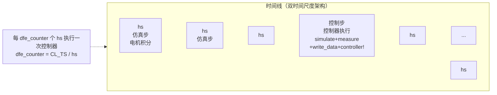

#  仿真代码  知识库概念映射

**版本：** v1.0
**日期：** 2026-05
**适用对象：** 电机控制学习者、嵌入式开发者、需要深入理解 C 仿真源码与理论知识对应关系的研究者

> **目标：** 在读源码时，能随时查阅每段 C 代码背后对应的理论知识；在看知识库时，能立即定位到 C 代码中的具体实现位置。

---

## 1. 整体架构映射

### 1.1 仿真主循环数据流

下图展示了 `main()` 函数中每个步骤的执行顺序，以及每个步骤对应知识库的哪个模块。理解这个流程是读懂整个仿真工程的第一步：

```mermaid
flowchart TD
    MAIN["main() 主循环"]

    MAIN --> S1["① _user_time_varying_parameters()<br/>功能：用户自定义时变参数注入<br/>（如动态修改电机电阻模拟温升）<br/>对应 KB：ALG-13 参数自整定、CT-02 时域分析<br/>调用频率：每个仿真步都调用"]

    MAIN --> S2["② machine_simulation() ── 仿真核心<br/>每步推进一个仿真步长 hs"]

    S2 --> S2A["inverter_model()<br/>逆变器建模<br/>对应 KB：ALG-04 死区补偿、HW-05 功率器件<br/>5 种模型：理想/Sul1996/Sigmoid/LUT/LUT_Indexed"]

    S2 --> S2B["Clarke 逆变换<br/>ControllerCmd.uAB → uαβ 电压<br/>对应 KB：ALG-01 FOC 理论"]

    S2 --> S2C["Park 变换<br/>uαβ → udq 电压（用于状态方程）<br/>对应 KB：ALG-01 FOC 理论"]

    S2 --> S2D["RK4 + DYNAMICS_MACHINE()<br/>四阶龙格库塔法求解电机非线性状态方程<br/>对应 KB：HW-01 电机数学模型、SYS-04 数值仿真<br/>对 5 个状态变量 x[0..4] 各计算 k1~k4"]

    S2D --> OUT1["ACM.varOmega → 机械转速 (rad/s)"]
    S2D --> OUT2["ACM.iAB[0..1] → αβ 轴电流 (A)"]
    S2D --> OUT3["ACM.theta_d → 电角度 (rad)"]
    S2D --> OUT4["ACM.Tem → 电磁转矩 (N·m)"]
    S2D --> OUT5["ACM.KA → 磁链幅值 (Wb)"]

    MAIN --> S3["③ measurement()<br/>传感器建模（模拟 ADC 采样：<br/>加噪声、加偏移误差）<br/>对应 KB：ALG-02 电流采样时序、HW-02/03"]

    MAIN --> S4["④ write_data_to_file()<br/>数据记录（写入 .dat 文件）"]

    MAIN --> S5["⑤ main_switch(mode_select)<br/>控制算法调度器（降频执行）<br/>每 dfe_counter 个仿真步执行一次<br/>对应 KB：CT-01 开闭环结构"]

    S5 --> M3["MODE_SELECT_FOC(3)<br/>_onlyFOC()<br/>→ ALG-01 FOC理论、ALG-05 有感FOC、ALG-03 PI电流环"]
    S5 --> M4["MODE_SELECT_VELOCITY_LOOP(4)<br/>FOC_with_velocity_control()<br/>→ CT-14 级联PID、ALG-12 速度环"]
    S5 --> M9["MODE_SELECT_COMMISSIONING(9)<br/>StepByStepCommissioning()<br/>→ ALG-13 参数自整定"]
    S5 --> M31["MODE_SELECT_FOC_SENSORLESS(31)<br/>无感 FOC<br/>→ ALG-07 无感观测器、CT-11 观测器设计"]
    S5 --> M41["MODE_SELECT_VELOCITY_LOOP_SENSORLESS(41)<br/>无感速度环<br/>→ ALG-06 位置速度观测器"]
    S5 --> M47["MODE_SELECT_VELOCITY_LOOP_USING_ESO(47)<br/>ESO 速度估计<br/>→ CT-16 ADRC、CT-17 LADRC"]
    S5 --> M91["MODE_SELECT_NYQUIST_PLOTTING(91)<br/>Nyquist 图<br/>→ CT-07 Nyquist 稳定判据"]
    S5 --> OTHER["... 其他 16 种模式"]
```



### 1.2 降频执行架构说明

仿真使用**双时间尺度**架构——这是理解仿真代码的关键：

| 概念 | 步长 | 含义 |
|------|------|------|
| **仿真步长 hs** | 很小（通常 ~10⁻⁶ s） | 电机模型的数值积分步长，需满足 RK4 稳定条件 |
| **控制周期 CL_TS** | 较大（通常 ~10⁻⁴ s） | 控制器（FOC + 速度环）的执行周期，对应实际 DSP PWM 周期 |
| **降频比 dfe_counter** | = CL_TS / hs | 控制器每 dfe_counter 个仿真步才执行一次 |



这意味着：
- **电机模型**：每个 hs 都做 RK4 积分（高频精密计算）
- **控制器**：在 dfe_counter 达到阈值时才执行一次（模拟真实 DSP 的 PWM ISR 周期）
- **传感器采样**：与控制器的执行频率同步

---

## 2. 逐文件映射

### 2.1 main.c — 仿真主循环与电机模型

`main.c` 是仿真引擎的心脏，包含仿真主循环、电机状态方程定义、RK4 积分器、逆变器模型和传感器模型。**这是你理解电机物理模型实现的第一站。**

#### 2.1.1 全局变量与数据结构

| C 代码段 | 所在行区域 | 对应 KB 概念 | 详细说明 |
|----------|----------|-------------|---------|
| `struct MachineSimulated ACM;` | 文件顶部，全局声明 | [HW-01](../hardware/HW-01-Motor-Basics.md) 电机数学模型 | **全局电机仿真对象**。`ACM`（AC Machine）是整个仿真中最重要的全局变量。它包含 5 阶状态变量 `x[0..4]`（机械角度 θm、机械转速 ωm、有功磁链 KA、d 轴电流 id、q 轴电流 iq）、状态导数 `x_dot[0..4]`、输入（uAB、TLoad）、输出（varOmega、theta_d、iAB、iDQ、Tem、KA）等 30+ 个成员变量。所有仿真代码都通过这个结构体与电机模型交互 |
| `struct ControllerForExperiment *CTRL;` | 文件顶部 | [ALG-05](../algorithm/ALG-05-Sensored-FOC.md) 有感 FOC | **控制器输入/输出全局指针**。指向控制器结构体，包含电机参数（motor）、传感器输入（i: iAB/theta_d/varOmega/Vdc）、状态（s: cosT/sinT/PID 指针/观测器状态）、输出（o: cmd_uAB/cmd_uDQ/cmd_iAB）、逆变器（inv）、捕获外设（cap）和全局标志（g） |
| `#if PC_SIMULATION` 条件编译块 | 散布在文件中 | 仿真与实验共用 | **条件编译标识**。仿真专用代码放在 `#if PC_SIMULATION ... #endif` 块内，DSP 实验代码放在 `#else ... #endif` 块内。通过 `ACMConfig.h` 中的 `PC_SIMULATION` 宏（模拟为 1，实验为 0）控制编译路径 |

#### 2.1.2 仿真主循环

| C 函数/代码段 | 所在行区域 | 对应 KB 概念 | 详细说明 |
|--------------|----------|-------------|---------|
| `main()` | 大致第 5-43 行 | [CT-01](../control-theory/CT-01-Open-Loop-Closed-Loop.md) 开闭环结构、[SYS-04](../advanced/system-methodology/SYS-04-Simulation-to-Discrete.md) 数值仿真基本原理 | **仿真主循环入口**。结构：① 初始化（`init_Machine()`, `init_debug()`, `init_CTRL()`, `init_experiment()`）→ ② 写文件头（`write_header_to_file()`）→ ③ 主循环 `for k=0..NUMBER_OF_STEPS-1`：调用 `_user_time_varying_parameters()` → `machine_simulation()` → `measurement()` → `write_data_to_file(k)` → `main_switch(mode_select)` → ④ 写文件尾。每个 `k` 代表一个 hs 步长。控制器通过 `dfe_counter` 计数器降频执行 |
| `dfe_counter` 变量 | main() 循环内 | 离散控制理论 | **降频计数器**。每步 `dfe_counter++`，当 `dfe_counter % (CL_TS/hs) == 0` 时执行控制器代码。模拟 DSP 的 PWM ISR 周期中断：电机模型用小步长积分，控制器用大步长执行 |
| `static int k` 仿真步计数器 | main() 第一行 | 仿真基础设施 | **仿真步索引**。从 0 到 `NUMBER_OF_STEPS-1`。`k` 的值用于 `write_data_to_file(k)` 写入数据行索引，以及判断仿真是否结束 |

#### 2.1.3 电机初始化

| C 函数/代码段 | 所在行区域 | 对应 KB 概念 | 详细说明 |
|--------------|----------|-------------|---------|
| `init_Machine()` | 大致第 47-106 行 | [HW-01](../hardware/HW-01-Motor-Basics.md) 电机数学模型 | **电机参数加载与状态初始化**。从 `d_sim.init.*` 结构体（由 `super_config.c` 初始化）加载电机参数到 `ACM` 结构体：① 电气参数：定子电阻 R、d 轴电感 Ld、q 轴电感 Lq、永磁体磁链 KE、有效转子电阻 Rreq（PMSM 为 0，IM 为 >0）；② 机械参数：转动惯量 Js、极对数 npp、摩擦系数 Bm；③ 将全部 5 个状态变量 `x[0..4]` 初始化为零（电机从静止状态开始）；④ 计算派生参数如 KL[0..3]（dq 轴电感矩阵元素） |
| `ACM.R` / `ACM.Ld` / `ACM.Lq` | init_Machine() 中 | [HW-01](../hardware/HW-01-Motor-Basics.md) 电机参数 | **定子电阻与交直轴电感**。R 影响电流环稳态精度和低速性能（电阻压降在低速时占主导），Ld 和 Lq 决定电流环的动态响应速度。凸极比 (Lq-Ld)/Ld 影响磁阻转矩大小和 MTPA 轨迹形状。仿真中这些参数都来自 `motor_library.json` 的电机参数数据库 |
| `ACM.KE` | init_Machine() 中 | [HW-01](../hardware/HW-01-Motor-Basics.md) 反电势系数 | **永磁体磁链（反电势系数）**。单位 V·s/rad（或等效于 N·m/A = Wb）。KE 决定了给定转速下的反电动势幅值（`BackEMF = KE × ωe`），也决定了电流到转矩的转换系数 |
| `ACM.Js` | init_Machine() 中 | [HW-01](../hardware/HW-01-Motor-Basics.md) 转动惯量 | **转动惯量**。决定机械时间常数 τm = Js/Bm（Bm 为摩擦系数）。惯量越大，转速变化越慢。在速度环 PI 整定中，Js 直接用于计算前馈增益 `K = npp × KE / Js` |
| `ACM.npp` | init_Machine() 中 | [HW-01](../hardware/HW-01-Motor-Basics.md) 极对数 | **极对数**。将机械量转换为电气量的乘数因子：`ωe = npp × ωm`，`θe = npp × θm`。极对数越多，相同机械转速下电气频率越高，对控制器时序要求越严格 |
| `ACM.Rreq` | init_Machine() 中 | [HW-01](../hardware/HW-01-Motor-Basics.md) 有效转子电阻 | **转子有效电阻**，用于感应电机（IM）转子磁链计算。对于 PMSM：Rreq = 0（永磁体励磁，无需计算转子磁链动态）；对于 IM：Rreq > 0（感应电机，转子磁链由滑差产生）；Rreq < 0 为非法值。`` 错误设值会导致电机模型行为异常 |

#### 2.1.4 电机状态方程（DYNAMICS_MACHINE）

| C 函数/代码段 | 所在行区域 | 对应 KB 概念 | 详细说明 |
|--------------|----------|-------------|---------|
| `DYNAMICS_MACHINE(t, x, fx)` | 大致第 108-152 行 | [HW-01](../hardware/HW-01-Motor-Basics.md) PMSM 状态方程 | **PMSM dq 轴非线性状态方程 C 实现**。这是整个仿真物理核心——定义了电机的 5 个微分方程，每次 RK4 计算斜率时调用此函数。输入：当前时间 t、5 维状态向量 x[0..4]、控制器施加的 dq 轴电压 uDQ[0..1] 和负载转矩 TLoad。输出：5 维状态导数 fx[0..4]。5 个微分方程如下： |
| `fx[0] = x[1] + ...` | 第 1 个微分方程 | HW-01 位置方程 | **机械角位置微分方程**：`dθm/dt = ωm + ω_slip / npp`。对于 PMSM 滑差 ω_slip 为零，即 `dθm/dt = ωm`（角位置的变化率等于角速度）；对于感应电机，加上滑差项以正确追踪转子位置 |
| `fx[1] = (Tem - TLoad - Bm*x[1]) / Js` | 第 2 个微分方程 | HW-01 转速方程 | **机械转速微分方程（运动方程）**：`dωm/dt = (Tem - TLoad - Bm×ωm) / Js`。输入：电磁转矩 Tem、负载转矩 TLoad、摩擦转矩 Bm×ωm。输出：角加速度。这是牛顿第二定律在旋转运动中的体现——净转矩除以转动惯量等于角加速度 |
| `fx[2] = Rreq * (iD - KA/(Ld-Lq))` | 第 3 个微分方程 | HW-01 磁链方程 | **有功磁链微分方程**：`dKA/dt = Rreq × (iD - KA/(Ld-Lq))`。对于 PMSM（Rreq=0），`dKA/dt = 0`，即永磁体磁链恒定不变。对于感应电机，转子磁链随 d 轴电流动态变化，时间常数 τr = (Ld-Lq)/Rreq |
| `fx[3] = (ud - R*iD + ωe*Lq*iQ - fx[2]) / Ld` | 第 4 个微分方程 | HW-01 d 轴电流方程 | **d 轴电流微分方程**：`did/dt = (ud - R×id + ωe×Lq×iq - dKA/dt) / Ld`。包含 4 项：① 外加电压 ud，② 电阻压降 R×id（消耗项），③ 反电动势耦合项 ωe×Lq×iq（q 轴电流旋转在 d 轴感应的电压），④ 磁链变化率 dKA/dt（PMSM 为 0）。这表明 d 轴电流受 q 轴电流交叉耦合影响 |
| `fx[4] = (uq - R*iQ - ωe*Ld*iD - ωe*KA) / Lq` | 第 5 个微分方程 | HW-01 q 轴电流方程 | **q 轴电流微分方程**：`diq/dt = (uq - R×iq - ωe×Ld×id - ωe×KA) / Lq`。包含 4 项：① 外加电压 uq，② 电阻压降 R×iq（消耗项），③ 反电动势耦合项 ωe×Ld×id（d 轴电流旋转在 q 轴感应的电压），④ 运动反电动势 ωe×KA（转子永磁体旋转感应的反电动势，转速越高反电动势越大）。这就是为什么高速时需要抬高电压才能维持电流——反电动势随转速线性增长 |
| `Tem = 1.5 * npp * KA * iQ` | 在 DYNAMICS_MACHINE 中计算 | HW-01 转矩方程 | **电磁转矩计算**：`Tem = 1.5 × npp × KA × iq`（对于 Ld≈Lq 的表贴式 PMSM）。当 Ld ≠ Lq 时，还有磁阻转矩项 `1.5 × npp × (Ld-Lq) × id × iq`。q 轴电流 iq 与转矩成正比——这是 FOC 将交流电机类比为直流电机控制的核心所在 |
| `CLARKE_TRANS_TORQUE_GAIN` 宏 | 转矩计算中 | ALG-01 Clarke 变换 | **Clarke 变换系数统一宏**。控制器代码使用**恒幅值变换**（系数 1），电机模型内部使用**恒功率变换**。此宏统一两者差异，确保仿真中转矩计算与实际一致。如果不理解这一点，会发现仿真转矩和理论计算相差 √(2/3) 倍 |
| `CLARKE_TRANS_L_GAIN` 宏 | 电感相关计算中 | ALG-01 Clarke 变换 | **Clarke 变换电感增益**。从三相自然坐标系到 αβ 两相静止坐标系时，电感的等效值随变换方式不同而变化。在恒幅值变换和恒功率变换之间需要此增益宏做转换 |

#### 2.1.5 四阶龙格库塔积分器（RK4）

| C 函数/代码段 | 所在行区域 | 对应 KB 概念 | 详细说明 |
|--------------|----------|-------------|---------|
| `RK4(t, x, hs)` | 大致第 154-187 行 | 数值积分方法、[SYS-04](../advanced/system-methodology/SYS-04-Simulation-to-Discrete.md) 数值仿真基本原理 | **四阶 Runge-Kutta 法求解常微分方程组**。这是将连续电机状态方程离散化的核心数值算法。输入：当前时间 t、状态向量 x[0..4]、仿真步长 hs。输出：更新后的状态向量 x[0..4]。算法分 4 步： |
| `k1 = hs * DYNAMICS_MACHINE(t_n, x_n)` | RK4 第 1 阶段 | 数值积分 | **第 1 斜率**：从当前点 (t_n, x_n) 出发，用当前状态的导数计算第一个试探斜率。这是欧拉法（一阶 RK）的斜率 |
| `k2 = hs * DYNAMICS_MACHINE(t_n+hs/2, x_n+k1/2)` | RK4 第 2 阶段 | 数值积分 | **第 2 斜率**：用 k1 推进半步，在新点计算第二个斜率。这个"中点试探"显著提高了精度 |
| `k3 = hs * DYNAMICS_MACHINE(t_n+hs/2, x_n+k2/2)` | RK4 第 3 阶段 | 数值积分 | **第 3 斜率**：用 k2 推进半步，在新点计算第三个斜率。与第 2 阶段使用不同的中点估计 |
| `k4 = hs * DYNAMICS_MACHINE(t_n+hs, x_n+k3)` | RK4 第 4 阶段 | 数值积分 | **第 4 斜率**：用 k3 推进到终点，计算第四个斜率。最终状态 = x_n + (k1+2k2+2k3+k4)/6，加权平均 4 个斜率 |
| `NaN` 检测与保护 | RK4 调用后 | 仿真鲁棒性 | **数值溢出保护**。每次 RK4 积分后检查 5 个状态变量是否出现 NaN（非数值）。若检测到 NaN，打印错误信息并退出仿真。常见 NaN 来源：步长过大导致积分发散、电机参数设置不合理导致奇点、Ld 或 Lq 为零导致除零 |

#### 2.1.6 机器仿真步（machine_simulation）

| C 函数/代码段 | 所在行区域 | 对应 KB 概念 | 详细说明 |
|--------------|----------|-------------|---------|
| `machine_simulation()` | 大致第 189-248 行 | 电机仿真步 | **单步电机仿真**。每步执行以下操作：① `inverter_model()`：将控制器输出的电压指令转换为实际施加到电机的 αβ 电压（考虑逆变器非线性）；② `Park 变换`：将 αβ 电压变换为 dq 电压，作为状态方程输入；③ `RK4()` 调用：数值积分推进状态；④ 更新电机接口变量：从 5 个状态变量 x[0..4] 计算出 `ACM.varOmega`（转速）、`ACM.theta_d`（电角度）、`ACM.iAB`（αβ 电流，通过反 Park 变换得到）、`ACM.iDQ`（dq 电流）、`ACM.Tem`（电磁转矩）、`ACM.KA`（磁链幅值）、`ACM.uDQ`（dq 电压）、`ACM.BackEMF[0..1]`（反电动势 dq 分量） |
| 电气角速度 `ωe = npp * ωm` | machine_simulation() 中 | HW-01 电机基础 | **机械转速→电气角速度转换**。`ωe = npp × ωm`。用于 Park 变换所需的电角度积分，以及反电动势计算 `BackEMF = ωe × KA` |
| 反 Park 变换 `iAB = Park⁻¹(iDQ, θe)` | machine_simulation() 中 | ALG-01 FOC 理论 | **dq→αβ 反变换**。将 dq 轴电流变换回 αβ 轴电流，用于 Clarke 逆变换（如果需要三相电流）或直接用于输出。这是控制器中 InvPark 变换的逆过程——控制器用反 Park 将电压从 dq 变回 αβ，仿真的电机模型则用正 Park 将电压从 αβ 变到 dq |

#### 2.1.7 逆变器模型

| C 函数/代码段 | 所在行区域 | 对应 KB 概念 | 详细说明 |
|--------------|----------|-------------|---------|
| `inverter_model()` | 大致第 316-456 行 | [ALG-04](../algorithm/ALG-04-Deadtime-Compensation.md) 死区补偿、[HW-05](../hardware/HW-05-Power-Devices-Gate-Drivers.md) 功率器件与门极驱动、[EE-08](../electronics-basics/EE-08-Rectifier-Inverter.md) 逆变器原理 | **逆变器非线性建模**。控制器的电压指令是理想值，但实际逆变器因死区时间、管压降、开关延迟等因素存在非线性。此函数根据 `__INVERTER_NONLINEARITY` 宏选择不同模型，模拟这些非线性效应 |
| `__INVERTER_NONLINEARITY = 0` | 宏定义在 `ACMSim.h` | 理想逆变器 | **Mode 0：理想逆变器**。`u_out = u_cmd`（输出电压等于指令电压）。仿真默认值，适合验证控制器算法本身的正确性，不考虑逆变器非理想效应 |
| `__INVERTER_NONLINEARITY = 1` | 宏定义在 `ACMSim.h` | Sul1996 数学模型 | **Mode 1：Sul1996 数学模型**。基于死区时间 Td、管压降 Vce、直流母线电压 Vdc 的解析模型：`ΔV = Td/Ts × Vdc × sign(i) + Vce × sign(i)`。误差电压的幅值固定，符号随电流方向翻转，导致零电流附近出现电压畸变（"零电流钳位"效应）。这是最经典也最常用的逆变器非线性模型 |
| `__INVERTER_NONLINEARITY = 2` | 宏定义在 `ACMSim.h` | Sigmoid 拟合 | **Mode 2：Sigmoid 函数拟合**。用 S 型曲线 `ΔV = a / (1+exp(-b×i)) + c` 拟合实验测得的电压误差 vs 电流特性。相比 Sul1996 的符号函数切换，Sigmoid 在零电流附近连续可导，避免了数值计算中的刚性切换问题 |
| `__INVERTER_NONLINEARITY = 3` | 宏定义在 `ACMSim.h` | LUT 查表法（插值） | **Mode 3：查表法（插值）**。将从实验中测得的电压误差 vs 电流数据存入查找表，通过线性插值获得任意电流下的误差电压。精度最高，但需要实验数据支持 |
| `__INVERTER_NONLINEARITY = 4` | 宏定义在 `ACMSim.h` | LUT 查表法（索引） | **Mode 4：查表法（索引）**。与 Mode 3 类似但不做插值，直接使用最近索引值。计算更快但精度稍低 |

#### 2.1.8 传感器建模

| C 函数/代码段 | 所在行区域 | 对应 KB 概念 | 详细说明 |
|--------------|----------|-------------|---------|
| `measurement()` | 大致第 250-290 行 | [ALG-02](../algorithm/ALG-02-Current-Sampling-Timing.md) 电流采样时序、[HW-02](../hardware/HW-02-Current-Sensing.md) 电流采样电路 | **模拟 DSP 的 ADC 采样过程**。将电机实际物理量"拷贝"到控制器的输入结构体中，模拟传感器采集过程。核心操作：① `(*CTRL).i->iAB[0] = ACM.iAB[0] + CURRENT_OFFSET_A`：α 轴电流加偏移误差；② `(*CTRL).i->iAB[1] = ACM.iAB[1] + CURRENT_OFFSET_B`：β 轴电流加偏移误差；③ `(*CTRL).i->varOmega = ACM.varOmega`：转速赋值；④ `(*CTRL).i->theta_d = ACM.theta_d`：电角度赋值。偏移误差可以模拟 ADC 零漂/运放失调电压的影响 |
| `CURRENT_OFFSET_A` / `CURRENT_OFFSET_B` | measurement() 内 | ADV-HW-01 PWM 与电流采样 | **电流采样偏移量**。模拟 ADC 的零偏误差（来自运放失调电压、ADC 参考电压误差等）。非零的偏移量会导致电流环出现基频波动（在 dq 坐标系中表现为电气频率的纹波）。设置非零值可以研究偏移对控制系统的影响，这对于无传感器控制（依赖于电流信息估计位置）尤为重要 |
| `ENABLE_ENCODER_NOISE` | measurement() 条件编译 | HW-03 位置传感器 | **编码器噪声模拟开关**。当启用时，给角度和转速信号叠加随机噪声，模拟编码器量化误差或电磁干扰。用于评估观测器和控制系统对测量噪声的鲁棒性 |

---

### 2.2 pmsm_comm.c — FOC 控制器实现

`pmsm_comm.c` 是整个仿真中最重要的控制算法文件，包含 FOC 核心链路（Clarke→Park→PI→解耦→InvPark）、速度环控制器、参数自整定算法和用户自定义指令序列。**这是理解 FOC 代码实现的中心文件。**

#### 2.2.1 FOC 核心链路

| C 函数/代码段 | 对应 KB 概念 | 详细说明 |
|--------------|-------------|---------|
| `_onlyFOC(theta_d_elec, iAB, varOmega)` | [ALG-01](../algorithm/ALG-01-FOC-Theory.md) FOC 理论、[ALG-05](../algorithm/ALG-05-Sensored-FOC.md) 有感 FOC、[ALG-03](../algorithm/ALG-03-PI-Current-Regulator.md) PI 电流调节器 | **FOC 核心链路（有传感器版本）**。这是整个仿真中最重要的控制函数——完整实现了从电流采样到 PWM 电压指令输出的全链路。执行顺序（这就是 FOC 的标准计算流程）： |
| ① `Clarke 变换`：iα,iβ ← iA,iB,iC | FOC 链路第 1 步 | ALG-01 Clarke 变换 | **Clarke 变换（三相→两相静止）**。将三相电流 ia、ib、ic 变换为 αβ 轴电流：`iα = ia`（恒幅值变换下的简化），`iβ = (ia + 2×ib) / √3`。恒幅值变换保持电流幅值不变。注意：仿真中用两相电流计算（iA、iB），隐式假设 `ic = -ia - ib`（无零序分量） |
| ② `Park 变换`：id,iq ← iα,iβ, θe | FOC 链路第 2 步 | ALG-01 Park 变换 | **Park 变换（静止→旋转坐标系）**。将 αβ 轴电流旋转到 dq 旋转坐标系：`id = iα×cos(θe) + iβ×sin(θe)`，`iq = -iα×sin(θe) + iβ×cos(θe)`。使用电角度 θe。结果：id 对应励磁分量，iq 对应转矩分量，在稳态时两者都为直流量，便于 PI 控制 |
| ③ `tustin_PI()` 或 `incremental_PI()`：id 电流 PI 调节 | FOC 链路第 3 步 | CT-05 PID 整定与实现 | **D 轴电流 PI 调节**。iq 电流 PI 调节同步进行。PI 控制器计算使 id/iq 跟踪指令值所需的 dq 轴电压。参见 2.2.3 节 PI 实现详解 |
| ④ `dq 轴解耦前馈`（可选） | FOC 链路第 4 步 | [ADV-ALG-07](../advanced/algorithm/ADV-ALG-07-Feedforward-Decoupling.md) 前馈解耦 | **解耦前馈补偿**。在 PI 输出的基础上叠加解耦项：`ud_final = ud_pi_output - ωe×Lq×iq`，`uq_final = uq_pi_output + ωe×(Ld×id + KA)`。目的是抵消 dq 轴之间的交叉耦合（反电动势项），使 PI 只需处理误差信号本身。解耦效果在高速时尤为明显——不解耦时高速下 id 和 iq 稳态误差增大。通过 `bool_apply_decoupling_voltages_to_current_regulation` 控制是否启用 |
| ⑤ 电压限幅 (`LIMIT_DC_BUS_UTILIZATION`) | FOC 链路第 5 步 | ALG-10 过调制 | **dq 轴电压限幅**。将 PI 输出限幅在 `Vdc × LIMIT_DC_BUS_UTILIZATION / √3` 内（对六拍运行而言理论最大值 = Vdc/√3 ≈ 0.577×Vdc；SVPWM 可达 Vdc/√3 = 0.577×Vdc；过调制可进一步提高到 0.637×Vdc）。限幅保证了电压在逆变器可实现范围内，防止积分饱和 |
| ⑥ `反 Park 变换 (InvPark)`：uα,uβ ← ud,uq, θe | FOC 链路第 6 步 | ALG-01 反 Park 变换 | **反 Park 变换（旋转→静止坐标系）**。将 dq 轴电压变换回 αβ 轴电压：`uα = ud×cos(θe) - uq×sin(θe)`，`uβ = ud×sin(θe) + uq×cos(θe)`。这是控制器输出的 αβ 轴电压指令，经逆变器施加到电机 |
| `(*CTRL).o->cmd_uAB[0..1] = uα, uβ` | FOC 链路最后 | 输出 | **将 αβ 电压指令写入控制器输出结构体**。这是控制器最终输出。在真实 DSP 实验中，这些电压值用于 SVPWM 计算和 PWM 占空比更新；在仿真中，通过 `inverter_model()` 转换为实际电机电压 |

#### 2.2.2 速度环控制器

| C 函数/代码段 | 对应 KB 概念 | 详细说明 |
|--------------|-------------|---------|
| `_velocityController(cmd_varOmega, varOmega)` | [CT-14](../control-theory/CT-14-Cascaded-PID-Control.md) 级联 PID、[ALG-12](../algorithm/ALG-12-Speed-Loop-Torque-Observer.md) 速度环与转矩观测器 | **速度环降频执行**。速度环以远低于电流环的频率执行（典型降频比 VL_EXE_PER_CL_EXE = 1~10）。函数内部使用计数器 `the_vc_count`，当其达到 `VL_EXE_PER_CL_EXE` 时执行一次速度 PI 计算并复位计数器。支持多种 PI 实现：普通 PI、Bezier 自适应 PI（根据误差动态调整增益）、WB 自定义速度环（支持扫频和 HitWall 分析） |
| `FOC_with_velocity_control(theta_d_elec, varOmega, cmd_varOmega, cmd_iDQ, iAB)` | [ALG-05](../algorithm/ALG-05-Sensored-FOC.md) 有感 FOC、[CT-14](../control-theory/CT-14-Cascaded-PID-Control.md) 级联 PID | **速度环 + 电流环级联控制**。完整的三环（位置/速度/电流）中使用了速度环外环+电流环内环。执行流程：① 设置 d 轴电流指令 `cmd_iDQ[0] = cmd_iD`（通常为 0，MTPA 下为负值）；② 调用 `_velocityController(cmd_varOmega, varOmega)` 得到 q 轴电流指令 `cmd_iDQ[1]`；③ 调用 `_onlyFOC(theta_d_elec, iAB, varOmega)` 执行 FOC 电流环。速度环输出限幅值 = 电机额定电流或最大允许电流。如果速度命令阶跃过大，速度环输出饱和，iq 指令被限幅在最大值，此时电流环以最大电流加速，直到速度跟踪上后 iq 退出饱和 |
| `VELOCITY_LOOP_DOWN_SAMPLING_RATIO` (VL_EXE_PER_CL_EXE) | CT-14 级联 PID | **速度环降频比**。速度环每 VL_EXE_PER_CL_EXE 个电流环周期执行一次。典型值：1（与电流环同频）到 10（降频 10 倍）。降频的理由：速度环带宽远低于电流环（通常为 1/10~1/5），无需每个电流周期都执行。增大降频比降低 CPU 负载但可能导致速度环控制品质下降 |
| `PID_Speed` 结构体 | CT-05 PID 整定与实现 | **速度环 PI 控制器实例**。包含 Kp、Ki、积分项 i1、输出限幅等。速度环的 Kp/Ki 根据 `init_CTRL()` 中 TI InstaSPIN 整定公式计算：`K = npp × KE / Js`（转矩→加速度增益），`Kp_speed = CLBW_HZ / (delta × K)`，`Ki_speed = Kp_speed × (CLBW_HZ/delta) × CL_TS`。这里 delta 是速度环带宽与电流环带宽的比值（速度环更慢） |

#### 2.2.3 PI 控制器实现

| C 函数/代码段 | 对应 KB 概念 | 详细说明 |
|--------------|-------------|---------|
| `tustin_PI(r)` | [CT-05](../control-theory/CT-05-PID-Tuning-Implementation.md) PID 实现 | **双线性变换（Tustin 方法）离散化 PI 控制器**。Tustin 变换（梯形积分法）将连续域 s 映射到离散域 z：`s ≈ (2/Ts) × (z-1)/(z+1)`。得到的离散 PI 差分方程为：`u(k) = u(k-1) + Kp×(e(k)-e(k-1)) + (Ki×Ts/2)×(e(k)+e(k-1))`。核心特性：**动态抗积分饱和（Dynamic Clamping）**——I_Term 被限幅在 `OutLimit - P_Term`（而非固定限幅），确保输出始终在合法范围内。输出 = P_Term + I_Term。相比增量式 PI，Tustin PI 对积分项有更平滑的处理 |
| `incremental_PI(r)` | [CT-05](../control-theory/CT-05-PID-Tuning-Implementation.md) PID 实现 | **增量式 PI**：`Out = OutPrev + Kp×(Err-ErrPrev) + Ki×Err`。输出的是"变化量"，当前输出 = 上次输出 + 增量。优点：① 天然抗积分饱和（只需限幅最终输出即可，无需单独的积分限幅逻辑）；② 输出平滑过渡（增量式不易出现大的跳变）；③ 无积分存储（不需要保存积分累加值）；④ 适合嵌入式定点运算（不需要大的积分值范围）。缺点：① 需要保存上一步状态（OutPrev 和 ErrPrev）；② 从零初始状态下首次响应比位置式 PI 慢一个周期 |
| `PI_MACRO(v)` (TI 官方) | [CT-04](../control-theory/CT-04-PID-Control-Principles.md) PID 控制原理 | **TI C2000 系列 DSP 官方增量式 PI 宏**。执行流程：① 比例项 `up = Kp × (Ref - Fbk)`；② 积分项 `ui = ui + Ki × up`（注意 TI 的实现中用 Ki 乘的是比例项 up 而非误差 e——这是 TI 的独特实现）；③ 条件积分：仅当输出未达到饱和极限时才更新积分项（抗积分饱和）；④ 输出 `Out = up + ui`；⑤ 限幅到 `[Umin, Umax]`。条件积分（Anti-windup via conditional integration）是工业级 PI 实现的关键特性 |
| `PI_POS_MACRO(v)` (位置环 PI) | CT-04 位置环 | **位置环专用 PI 宏**。与 `PI_MACRO` 结构类似，但误差先做 **角度 wrap-around 处理**：将角度误差限制在 -0.5~+0.5 圈（即 -π~+π 弧度范围）内。例如，给定位置 350°、反馈位置 10°，实际误差应为 -20°（最短路径），而非 340°。这个 wrap-around 是位置环的核心技巧——避免角度跳变（如从 359°→0°）导致 PI 输出异常大值 |
| `COMM_PI_tuning(LL, RR, BW_current, delta, JJ, KE, npp)` | [ALG-03](../algorithm/ALG-03-PI-Current-Regulator.md) PI 设计、[CT-05](../control-theory/CT-05-PID-Tuning-Implementation.md) 整定 | **TI InstaSPIN 整定公式解析**。将电机物理参数自动映射为 PI 增益，分为电流环和速度环两组公式： |

**电流环整定公式：**

```text
Kp_d = Ld × BW_current
Ki_d = Ld × BW_current × (R / Ld) × Ts  = Kp_d × (R/Ld) × Ts
Kp_q = Lq × BW_current
Ki_q = Lq × BW_current × (R / Lq) × Ts  = Kp_q × (R/Lq) × Ts
```

| 参数 | 符号 | 物理含义 |
|------|------|----------|
| BW_current | `2π × CLBW_HZ` | 电流环目标带宽（闭环带宽，rad/s） |
| Ts | `CL_TS` | 电流环控制周期（采样时间） |
| Ld/Lq | 电机参数 | d/q 轴电感 |
| R | 电机参数 | 定子电阻 |

物理直觉：电流环带宽 BW_current 等于 RL 电路的截止频率（Kp/L），所以 Kp = L × BW。Ki 使得 PI 零点恰好补偿 RL 电路的极点（s+R/L），实现零极点对消。

**速度环整定公式：**

```text
K = npp × KE / Js               (转矩→加速度增益，rad/(s·N·m))
Kp_speed = BW_current / (delta × K)
Ki_speed = Kp_speed × (BW_current / delta) × CL_TS
```

其中 delta（通常 5~20）是电流环带宽与速度环带宽的比值：`BW_speed = BW_current / delta`。速度环应该远慢于电流环（至少 5~10 倍），否则两个环路会相互干扰。

#### 2.2.4 参数自整定（Commissioning）

| C 函数/代码段 | 对应 KB 概念 | 详细说明 |
|--------------|-------------|---------|
| `StepByStepCommissioning_NEW_WB()` | [ALG-13](../algorithm/ALG-13-Protection-Optimization.md) 参数自整定与保护优化 | **分步参数辨识状态机**。整个辨识流程由 `bool_comm_status` 驱动的状态机控制，按顺序执行 0→1→2→3→4→5→6： |
| `bool_comm_status = 0`：初始化 | 辨识初始化 | **初始化阶段**：设置初始电压/电流激励参数、初始化 PI 控制器为零输出、建立基本的角度和电流测量通路。确保电机处于安全锁定状态 |
| `bool_comm_status = 1`：`COMM_resistanceId(id_fb, iq_fb)` | 电阻辨识 | **定子电阻辨识（I-V 法）**：对 d 轴或 β 轴施加阶梯变化的电流指令（如 0→0.5A→1.0A→1.5A→2.0A），在每个阶梯采集稳态电流和电压数据点，用**最小二乘法线性回归**（`linreg` 函数）拟合 R = ΔV/ΔI。原理：直流条件下 `V = R × I`（无电感影响和反电动势），多点测量提高拟合精度。精确的电阻值对低速下无传感器控制和电流环性能至关重要（低速时电阻压降主导） |
| `bool_comm_status = 2`：电感辨识（阶跃法） | 电感辨识 | **电感辨识（电压阶跃法）**：施加方波电压脉冲，记录电流上升/下降的斜率，由 `v = L × di/dt` 推算电感 `L = V × Δt / ΔI`。方法简单但不精确（存在电阻压降和反电动势干扰） |
| `bool_comm_status = 3`：`COMM_inductanceId_ver3(id_fb, iq_fb)` | 电感辨识（正弦激励） | **电感辨识（正弦激励+相干解调法）**：这是更精确的方法。施加正弦电压激励 `v(t) = Vm × sin(ωL × t)`（频率 ωL 通常为几百 Hz），用**相干解调**提取电流响应的同相分量 I_real 和正交分量 I_imag，计算 `L = -V_ampl × I_imag / (I_real² + I_imag²) / ωL`。相干解调能有效抑制噪声和谐波干扰，是工业级参数辨识的常用方法 |
| `bool_comm_status = 4`：`COMM_PMFluxId(id_fb, iq_fb, omg_mech_fb)` | 磁链辨识 | **永磁体磁链辨识（反电动势法）**：运行电机到一定转速（速度闭环），测量稳态反电动势。KE = (Vq - R×iq) / ωe - Ld×id（从 q 轴电压方程反推，减去已知的电阻压降和 d 轴耦合项）。通过**低通滤波**消除高频噪声 + **长时间平均**提高精度。需要确保电机空载或负载已知 |
| `bool_comm_status = 5`：`COMM_inertiaId(id_fb, iq_fb, cosPark, sinPark, omg_elec_fb)` | 惯量辨识 | **转动惯量辨识（Awaya1992 观测器）**：施加正弦波转速指令（如振幅 100 rpm，频率 1 Hz），用 Awaya 1992 年提出的惯量估计观测器：`Js_est = nominal_Js + Σ(τ_est × q1_dot) / Σ(q1_dot²)`。其中 τ_est 是由滤波后的电磁转矩和转速导数计算得到的力矩估计值，q1_dot 是经滤波的角加速度。优点：不需要已知精确的摩擦系数，对速度测量噪声不敏感 |
| `bool_comm_status = 6`：辨识完成 | 辨识结束 | **辨识结果汇总和 PI 参数自动计算**。将辨识得到的 R、Ld、Lq、KE、Js 更新到控制器电机参数结构体中，自动调用 `COMM_PI_tuning()` 计算新的电流环/速度环 PI 参数。支持辨识结果验证（与已知真实值比较误差百分比） |

#### 2.2.5 用户自定义指令序列

| C 函数/代码段 | 对应 KB 概念 | 详细说明 |
|--------------|-------------|---------|
| `_user_commands()` | 仿真场景设计 | **用户自定义转速/电流指令序列**。这是设计仿真实验场景的入口函数。在该函数中定义：① 什么时候改变转速命令 `cmd_varOmega`（支持阶跃、斜坡、正弦等）；② 什么时候施加/移除负载 `ACM.TLoad`；③ 什么时候改变 d 轴电流命令（MTPA/弱磁测试）；④ 什么时候切换控制模式。通过修改此函数可以设计各种仿真场景：启动测试、正反转测试、负载突变测试、弱磁测试等。函数在控制器每次执行时被调用（不是每个仿真步），因此指令更新频率 = 控制周期频率 |
| 时间控制方式 | 仿真场景 | **基于仿真步 `k` 的时序控制**。典型用法：`if (k >= 1000 && k < 2000) cmd_varOmega = 1000;` 表示在仿真步 1000~2000 期间转速指令为 1000 rpm。步数转换为物理时间：`time_in_seconds = k × hs` |
| 负载转矩设置 `ACM.TLoad` | HW-01 负载扰动 | **负载转矩注入**。直接修改 `ACM.TLoad` 变量。正值表示阻性负载（与运动方向相反），负值表示驱动转矩（与运动方向相同，如发电机模式）。负载阶跃是测试速度环抗扰动性能的标准方法 |

---

### 2.3 main_switch.c — 仿真模式调度器

| C 函数/代码段 | 对应 KB 概念 | 详细说明 |
|--------------|-------------|---------|
| `main_switch(mode_select)` | 全部控制算法入口 | **核心调度器**。根据 `mode_select` 枚举值（对应 `MODE_SELECT_*` 宏）分发到 24 种不同的控制算法。使用 `switch-case` 结构，每个 case 对应一种仿真模式。模式初始化时调用对应的 `init_*` 函数，模式切换时 `mode_initialized` 标志重置为 0，确保新模式的初始化函数被调用 |
| `init_debug()` | 参数配置 | **加载用户配置到 debug 结构体**。从 `d_sim`（由 `super_config.py` 从 YAML 生成）加载所有用户配置：模式选择 `mode_select`、电流/速度/位置命令值、电流环/速度环带宽参数 `CLBW_HZ`/`delta`、扫频参数（频率范围、扫频步数）、Nyquist 图参数、用户自定义调试变量等 |
| `init_CTRL()` | 参数 → PID 计算 | **初始化控制器结构体**：① 电机参数赋值（R、Ld、Lq、KE、Js、npp、Vdc 等从 `d_sim.motor` 复制到 `(*CTRL).motor->*`）；② PI 参数计算——调用 `COMM_PI_tuning()` 根据 `CLBW_HZ` 和 `delta` 自动计算电流环/速度环 Kp、Ki；③ 设置 PI 限幅——电流环输出电压限幅基于 `Vdc × 0.577`（相电压最大值），速度环输出 iq 限幅基于电机额定电流；④ 初始化捕获外设（CAP）用于编码器信号处理 |
| `init_experiment()` | 初始化总入口 | **调用各子模块的初始化**：① CTRL 初始化（电机参数、PI 参数）；② 观测器初始化（OFSR/ESO——设置初始状态和观测器带宽）；③ 磁链估算器初始化；④ 用户自定义初始化（WB 用户：WC_Tuner/HitWall/ParaMis 等专用模块初始化）；⑤ 扫频模块初始化（设置扫频激励参数） |
| `mode_initialized` 标志 | 状态管理 | **模式初始化状态标志**。每个仿真模式的 case 块内首先检查此标志：若为 0 则调用初始化代码并置 1，若已初始化则跳过。确保每个模式只在首次进入时初始化一次。模式切换时此标志被重置 |
| 24 种 `MODE_SELECT_*` 分支 | 全部控制算法 | **完整仿真模式列表**（详见 [SIM-00 §3](./SIM-00-C-Simulation-Overview.md#3-仿真模式编号速查表)）从 Mode 1（PWM 直接控制）到 Mode 98（Udq 给定测试），覆盖了 FOC、无感控制、扫频、参数辨识等所有电机控制关键技术 |

---

### 2.4 pmsm_observer.c — 无感观测器

| C 函数/代码段 | 对应 KB 概念 | 详细说明 |
|--------------|-------------|---------|
| `pmsm_observers()` | [ALG-07](../algorithm/ALG-07-Sensorless-Observers.md) 无感观测器、[CT-11](../control-theory/CT-11-Observer-Design.md) 观测器设计 | **多种观测器统一调度入口**。根据用户配置选择反 EMF/SMO（滑模）/磁链/EKF（扩展卡尔曼滤波）/MRAS 等不同原理的观测器。每种观测器估计电角度 θe 和电角速度 ωe，用于无传感器 FOC 闭环 |
| `Main_esoaf_chen2021()` | [CT-16](../control-theory/CT-16-ADRC-Theory.md) ADRC 理论、[CT-17](../control-theory/CT-17-LADRC-Linear-ADRC.md) LADRC、[CT-18](../control-theory/CT-18-ADRC-LADRC-Implementation.md) ADRC 实现 | **扩张状态观测器（ESO）主函数**。用 4 阶 RK4 求解 ESO 状态方程。ESO 是 ADRC（自抗扰控制）的核心——它将外部扰动和内部不确定性扩张为一个新的状态变量进行估计： |
| ESO 状态变量 x[0] | CT-16 扩张状态 | **xPos**：估计机械位置（角度）。与编码器测量值对比得到角度误差，作为 ESO 的输入修正项 |
| ESO 状态变量 x[1] | CT-16 扩张状态 | **xOmg**：估计机械角速度。从位置估计的导数得到，同时受电磁转矩和负载转矩影响 |
| ESO 状态变量 x[2] | CT-16 扩张状态 | **xTL**：估计负载转矩。这是 ESO 的"扩张状态"——通过观测转速误差反向推算出施加在电机上的总扰动，再减去已知的电磁转矩得到未知的负载转矩 |
| ESO 状态变量 x[3] | CT-16 扩张状态 | **xPL**：估计负载转矩的导数。进一步将扰动的变化率也纳入观测，提高了对时变负载的跟踪能力 |
| ESO 输入 | CT-16 观测器输入 | **双输入**：① 角度误差（以 sine 形式 `sin(θ_measured - θ_estimated)` 输入，是观测器修正项的核心）；② 电磁转矩 Tem（作为已知输入前馈到转速方程，提高转速估计精度） |
| `eso_one_parameter_tuning(omega_ob)` | [CT-11](../control-theory/CT-11-Observer-Design.md) 观测器极点配置 | **ESO 单参数整定**。所有观测器增益 `ell[0..3]` 由单一带宽参数 `omega_ob`（观测器带宽，rad/s）决定。调参方法（也是一种变体极点配置）：`ell[0] = k1 × ω_ob`，`ell[1] = k2 × ω_ob²`，`ell[2] = k3 × ω_ob³ / J`，`ell[3] = k4 × ω_ob⁴ / J`。其中系数 k1~k4 根据 `bool_ramp_load_torque` 标志选择不同方案。增大 ω_ob 使观测器收敛更快但噪声放大更严重 |
| `init_esoaf()` | 观测器初始化 | **ESO 初始化**：设置初始观测器带宽 `CAREFUL_ESOAF_OMEGA_OBSERVER`，调用 `eso_one_parameter_tuning()` 计算增益系数。初始状态估计：位置=0、速度=0、负载转矩=0（从静止空载开始观测） |

**反 EMF 观测器原理简述：**

反 EMF 观测器（也是 SMO 的基础）利用电机电压方程中反电动势项包含位置信息的原理：
- 从电压方程 `uα = R×iα + L×diα/dt + eα` 估计 αβ 轴反电动势 eα, eβ
- 电角度 `θe = atan2(-eα, eβ)`（反电动势矢量角 = 转子磁场位置）
- 转速 `ωe = dθe/dt`

**低速极限：** 反电动势幅值与转速成正比（`|E| = ωe × KE`），低速时信噪比低导致估计误差大，需要切换到开环启动或高频注入法。

---

### 2.5 pi_math.h — PID 控制器宏定义

| C 宏/结构体 | 对应 KB 概念 | 详细说明 |
|------------|-------------|---------|
| `PI_CONTROLLER` 结构体 | [CT-04](../control-theory/CT-04-PID-Control-Principles.md) PID 控制原理 | **PI 控制器数据结构（TI 格式）**。成员变量完整列表： |
| `PI_CONTROLLER.Ref` | 给定值 | **Reference（给定/指令值）**。如 d 轴电流指令 id_cmd。在 PI 计算前由调用者设置 |
| `PI_CONTROLLER.Fbk` | 反馈值 | **Feedback（反馈/测量值）**。如 d 轴电流实际值 id_fb。在 PI 计算前由调用者设置（从 ADC 采样获得） |
| `PI_CONTROLLER.Out` | 输出 | **Output（输出值）**。PI 计算后更新，如 d 轴电压指令 ud_cmd |
| `PI_CONTROLLER.Kp` | 比例增益 | **Proportional Gain**。比例增益 = 电流环带宽 × 电感（Kp = L × BW） |
| `PI_CONTROLLER.Ki` | 积分增益 | **Integral Gain**。积分增益 = Kp × (R/L) × Ts |
| `PI_CONTROLLER.Umax` / `PI_CONTROLLER.Umin` | 输出限幅 | **输出上下限**。对于电流环 PI：`Umax = +Vdc×0.577`（SVPWM 最大相电压），`Umin = -Vdc×0.577`。对于速度环 PI：Umax = 额定 q 轴电流，Umin = -额定 q 轴电流 |
| `PI_CONTROLLER.up` / `PI_CONTROLLER.ui` | 比例/积分项 | **比例项 up 和积分项 ui**（中间变量）。`up = Kp × (Ref - Fbk)`（当前比例项），`ui = 累积积分值`。分别存储方便调试和动态抗积分饱和 |
| `PI_CONTROLLER.v1` | 预限幅输出 | **预限幅输出值**。`v1 = up + ui`（限幅前的输出值）。用于判断是否饱和：如果 `v1 > Umax` 或 `v1 < Umin`，说明控制器进入饱和区 |
| `PI_CONTROLLER.i1` | 积分存储 | **积分项的历史存储值**。在 TI 的 PI_MACRO 实现中，积分使用 up（比例项）而不是误差 e 来计算增量：`ui = ui + Ki × up`。这与标准学术实现不同——TI 通过在比例项上积分来间接积分误差，效果等价 |
| `PI_CONTROLLER.w1` | 饱和标记 | **输出饱和状态标记**。1 = 输出达到饱和上限，0 = 未饱和。用于抗积分饱和逻辑的条件判断 |
| `PI_MACRO(v)` | [CT-04](../control-theory/CT-04-PID-Control-Principles.md) PID 控制原理、[CT-05](../control-theory/CT-05-PID-Tuning-Implementation.md) PID 实现 | **TI 官方增量式 PI 宏的详细执行流程**： |
| 第 1 步：计算比例项 | PI_MACRO 内部 | `v.up = v.Kp × (v.Ref - v.Fbk)`——计算当前误差的比例响应。这部分是瞬时的，没有历史依赖 |
| 第 2 步：条件积分（Anti-windup） | PI_MACRO 内部 | `if (v.Out >= v.Umax && v.up > 0) { /* 正向饱和，不积分 */ }` 和 `if (v.Out <= v.Umin && v.up < 0) { /* 反向饱和，不积分 */ }`。条件积分逻辑：仅当输出未饱和时，才将当前的比例项累积到积分项中：`v.ui = v.ui + v.Ki × v.up`。这防止了积分饱和——当控制器输出已经达到物理极限时，继续积分只会让恢复过程更慢 |
| 第 3 步：合成输出 | PI_MACRO 内部 | `v.v1 = v.up + v.ui`——预限幅输出 = 比例项 + 积分项 |
| 第 4 步：输出限幅 | PI_MACRO 内部 | `v.Out = CLAMP(v.v1, v.Umin, v.Umax)`——将输出限制在 [Umin, Umax] 范围内 |
| 第 5 步：饱和标记 | PI_MACRO 内部 | `v.w1 = (v.Out == v.Umax || v.Out == v.Umin) ? 1 : 0`——记录是否饱和 |
| `PI_POS_MACRO(v)` | 位置环 PI | **位置环专用 PI 宏**。与 `PI_MACRO` 的区别仅在于误差处理方式：首先将角度误差做 **wrap-around** 处理——将误差限制在 -0.5~+0.5 圈（-π~+π 弧度）范围内。例如：给定位置 350°，反馈位置 10°，真实误差应该是 -20°（−0.056 圈，最短路径），而不是 340°（+0.944 圈）。然后对这个 wrap 后的误差应用 PI 算法。如果没有 wrap-around，位置环会在角度过零时输出异常大的值导致系统振荡或飞车 |

---

### 2.6 ACMSim.h — 核心数据结构

| C 结构体/宏 | 对应 KB 概念 | 详细说明 |
|------------|-------------|---------|
| `struct MachineSimulated` | [HW-01](../hardware/HW-01-Motor-Basics.md) 电机数学模型 | **电机仿真对象的完整定义**（30+ 成员变量）。这个结构体是理解仿真中电机状态的核心： |
| `x[0]` = `varTheta` | 机械角度 | **状态变量 0：机械角位置（rad）**。这是转子的实际机械角度。经过 `θe = npp × θm` 转换为电角度用于坐标变换 |
| `x[1]` = `varOmega` | 机械转速 | **状态变量 1：机械角速度（rad/s）**。乘以 `60/(2π)` 可转换为 rpm。乘以 `npp` 得到电气角速度 |
| `x[2]` = `KA` | 有功磁链 | **状态变量 2：有功磁链幅值（Wb）**。PMSM 下恒等于 KE（永磁体磁链），IM 下按转子磁链动态方程变化 |
| `x[3]` = `iDQ[0]` | d 轴电流 | **状态变量 3：d 轴电流（A）**。励磁分量电流 |
| `x[4]` = `iDQ[1]` | q 轴电流 | **状态变量 4：q 轴电流（A）**。转矩分量电流 |
| `x_dot[0..4]` | 状态导数 | **5 维状态导数的存储空间**。由 `DYNAMICS_MACHINE()` 计算，每次调用更新。用于 RK4 的各阶段斜率计算 |
| `uAB[0..1]` | αβ 轴输入电压 | **电机输入：αβ 轴定子电压（V）**。由 `inverter_model()` 赋值，代表实际施加到电机端子上的电压 |
| `TLoad` | 负载转矩 | **电机输入：负载转矩（N·m）**。正值表示阻性负载（与运动方向相反） |
| `iAB[0..1]` | αβ 轴电流 | **电机输出：αβ 轴定子电流（A）**。由 dq 电流通过反 Park 变换得到 |
| `Tem` | 电磁转矩 | **电机输出：电磁转矩（N·m）**。`Tem = 1.5 × npp × KA × iq`（表贴式 PMSM） |
| `BackEMF[0..1]` | 反电动势 dq 分量 | **电机输出：dq 轴反电动势（V）**。`BackEMF[0] = -ωe × Lq × iq ≈ 0`（稳态），`BackEMF[1] = ωe × KA`（转速×磁链=运动反电动势） |
| `theta_d` | 电角度 | **电机输出：电角度（rad）**。`θe = npp × θm`，用于坐标变换 |
| `R, Ld, Lq, KE, Js, npp` | 电机参数 | **电机物理参数**。`R`：相电阻（Ω），`Ld`：d 轴电感（H），`Lq`：q 轴电感（H），`KE`：反电势系数/永磁磁链（V·s/rad = Wb），`Js`：转动惯量（kg·m²），`npp`：极对数 |
| `KL[0..3]` | 电感矩阵元素 | **dq 轴电感矩阵的 4 个元素**。用于处理 Ld≠Lq（凸极）时的电感矩阵变换 |
| `struct ControllerForExperiment` | [ALG-05](../algorithm/ALG-05-Sensored-FOC.md) 有感 FOC | **控制器输入/输出结构体集合**。这是控制器与仿真环境的接口，定义了"控制器看到什么"和"控制器输出什么"： |
| `(*CTRL).motor->*` | 电机参数 | **控制器存储的电机参数副本**。包括 R、Ld、Lq、KE、Js、npp、Vdc 等。可能在参数自整定后被更新 |
| `(*CTRL).i->iAB[0..1]` | 电流输入 | **控制器读取的 αβ 轴电流（A）**。由 `measurement()` 从 `ACM.iAB` 赋值，可能叠加了偏移误差 |
| `(*CTRL).i->theta_d` | 角度输入 | **控制器读取的电角度（rad）**。由 `measurement()` 从 `ACM.theta_d` 赋值。有感模式下直接使用编码器值，无感模式下被观测器估计值覆盖 |
| `(*CTRL).i->varOmega` | 转速输入 | **控制器读取的机械转速（rad/s）**。由 `measurement()` 从 `ACM.varOmega` 赋值 |
| `(*CTRL).i->Vdc` | 母线电压 | **控制器读取的直流母线电压（V）**。用于电压限幅计算和逆变器补偿 |
| `(*CTRL).s->cosT/sinT` | 角度三角函数 | **控制器当前使用的电角度的 sin/cos 值**。预计算存储，避免在 Park 变换中重复调用三角函数。在 `_onlyFOC()` 开始时从 `theta_d` 更新 |
| `(*CTRL).s->*` | 控制器状态 | **控制器内部状态**。包含 PI 控制器实例指针（PID_iD、PID_iQ、PID_Speed）、观测器状态（OFSR/ESO）、扫频状态等 |
| `(*CTRL).o->cmd_uAB[0..1]` | 电压输出 | **控制器输出的 αβ 轴电压指令（V）**。由 `_onlyFOC()` 设置，经 `inverter_model()` 转换为实际电机电压 |
| `(*CTRL).o->cmd_iDQ[0..1]` | 电流指令 | **控制器的 dq 轴电流指令（A）**。`cmd_iDQ[0]` = d 轴电流指令（通常 0），`cmd_iDQ[1]` = q 轴电流指令（来自速度环或手动设置） |
| `(*CTRL).o->dc_bus_utilization_ratio` | 电压利用率 | **直流母线电压利用率（归一化值）**。`0~1.0` 之间。SVPWM 下约 0.96，方波控制下可达 1.0（最大利用率）。用于电压限幅和保护 |
| `(*CTRL).inv->*` | 逆变器 | **逆变器参数**。包含逆变器非线性模型选择、死区时间、管压降等参数 |
| `(*CTRL).cap->*` | 捕获外设 | **编码器捕获外设状态**。用于编码器脉冲计数和速度计算 |
| `(*CTRL).g->*` | 全局标志 | **全局控制标志**。如使能/禁用标志、过流/过压/过温报警标志 |
| `MODE_SELECT_*` 枚举 | 仿真模式 | **24 种仿真模式的枚举定义**。包括 MODE_SELECT_FOC(3)、MODE_SELECT_VELOCITY_LOOP(4)、MODE_SELECT_COMMISSIONING(9) 等。在 `main_switch.c` 中被 `main_switch()` 函数用于分支选择 |
| `extern` 声明区 | 跨文件引用 | **跨文件全局变量声明**。包括 `ACM`（电机模型）、`CTRL`（控制器）、`d_sim`（仿真参数）、`debug`（调试结构体）、`OFSR`（观测器）、`OBSV`（观测器输出）等。这些声明让各 .c 文件可以访问相同的全局变量 |

---

### 2.7 utility.c — 工具函数

| C 函数/代码段 | 对应 KB 概念 | 详细说明 |
|--------------|-------------|---------|
| `write_header_to_file()` | 数据记录 | **写 .dat 文件的列头**。在第一行写入各信号名称（逗号分隔），格式如 `k,ACM.varOmega,ACM.iDQ[0],ACM.iDQ[1],...`。这个列头定义了后续 `cplot.py` 中可用信号的名字 |
| `write_data_to_file(k)` | 数据记录 | **写当前仿真步的数据行**。将当前步所有已注册的信号值以逗号分隔的格式写入 .dat 文件。数据格式在文件顶部通过 `DATA_FORMAT` 宏或字符串定义。写文件操作可能影响仿真速度——如果仿真跑得很慢，可以降低数据记录频率 |
| `DATA_FORMAT` 宏/字符串 | 数据记录 | **数据格式定义**。定义了 `write_data_to_file()` 中写入哪些信号及其顺序。修改此宏可以增减记录的信号（增加信号方便调试但增大 .dat 文件；减少信号可以加快仿真速度） |
| `_lpf(x, y_prev, fc, Ts)` | 数字信号处理 | **一阶低通滤波器（指数平滑）**。差分方程：`y(k) = y(k-1) + (Ts/(Ts+τ)) × (x(k) - y(k-1))`，其中 `τ = 1/(2π×fc)`。用于平滑含噪声的信号（如观测器估计的转速、滤波后的反电动势等）。`fc` 为截止频率，越小滤波越强但相位滞后越大 |
| `sign(x)` | 数学工具 | **符号函数**。返回 +1（x>0）、0（x=0）、-1（x<0）。用于逆变器非线性模型中判断电流方向（电流极性决定死区效应的符号） |
| `angle_diff(a, b)` | 数学工具 | **角度差计算（带 wrap-around）**。计算 `a - b` 并 wrap 到 `[-π, +π]` 范围内。用于位置环 PI 中的误差计算和角度跟踪评估。实现：`diff = fmod(a - b + π, 2π) - π` |

---

### 2.8 super_config.h / super_config.c — 自动生成文件

| C 代码段 | 对应 KB 概念 | 详细说明 |
|---------|-------------|---------|
| `struct ST_D_SIM` | YAML 参数映射 | **仿真参数结构体类型定义**。由 `super_config.py`（Python）自动生成。结构体中每个成员变量对应 `user_config.yaml` 中的一个配置项。例如：`d_sim.init.CLBW_HZ`（电流环目标带宽，Hz）、`d_sim.init.delta`（速度/电流带宽比）、`d_sim.init.CLTS`（电流环控制周期，s）、`d_sim.sim.NUMBER_OF_STEPS`（仿真总步数）、`d_sim.motor.R`（电机电阻，Ω）等 |
| `init_d_sim()` | YAML → C 赋值 | **结构体初始化函数**。由 `super_config.py` 自动生成。将 YAML 中配置的参数值赋给 `ST_D_SIM` 结构体的各成员变量。在 `main()` 的初始化阶段调用，是整个仿真参数从 Python 层传递到 C 层的桥梁。`` 此文件由 Python 自动生成，手动修改会在下次点击「Save to C and compile」时被覆盖 |

---

## 3. 关键代码定位指南

下表按"我想做什么"列出精确的定位信息。在 IDE（如 VS Code）中按 `Ctrl+Shift+F` 搜索关键字即可快速跳转。

| 我想做什么 | 去哪个文件 | 搜索什么 | 其他提示 |
|-----------|----------|---------|---------|
| 改电流环 PI 参数（Kp/Ki） | `main_switch.c` 的 `init_CTRL()` | `PID_iD->Kp`, `PID_iQ->Kp`, `COMM_PI_tuning` | PI 参数由 `COMM_PI_tuning()` 根据带宽和电机参数自动计算。想手动设置 Kp/Ki 的话，在 `init_CTRL()` 中找到 `COMM_PI_tuning()` 调用后直接覆盖 `PID_iD->Kp = xxx; PID_iD->Ki = yyy;` |
| 改速度环 PI 参数 | `main_switch.c` 的 `init_CTRL()` | `PID_Speed->Kp`, `PID_Speed->Ki_CODE` | 速度环 Kp/Ki 也由 `COMM_PI_tuning()` 计算。修改 `d_sim.init.CLBW_HZ`（电流环带宽）和 `d_sim.init.delta`（带宽比）间接调整速度环增益，或在 init_CTRL() 中手动覆盖 |
| 改仿真电机参数（R, Ld, Lq, KE, Js） | `main.c` 的 `init_Machine()` 或 `super_config.c` 的 `init_d_sim()` | `ACM.R`, `ACM.Ld`, `ACM.Lq`, `ACM.KE`, `ACM.Js` | 推荐在 Streamlit UI 中选择不同电机来修改参数，或直接编辑 `user_config.yaml` 然后点击「Save to C and compile」自动重新生成 `super_config.c` |
| 改速度指令序列（仿真场景设计） | `pmsm_comm.c` 的 `_user_commands()` | `cmd_varOmega`, `ACM.TLoad` | 修改此函数中的 `if (k >= ...)` 块来设计启动、加速、加载、反转等场景。`k` 是仿真步索引，物理时间 = `k × hs` |
| 添加新的仿真模式 | `main_switch.c` 的 `main_switch()` | 新建 `case` 分支 | 在 switch 中添加新 case（使用未占用的编号），编写对应的控制算法调用代码。参考已有 case（如 MODE_SELECT_FOC 的实现）的模式 |
| 改为 PWM 直接控制（最简单模式） | `main_switch.c` | `MODE_SELECT_PWM_DIRECT` | Mode = 1。这是最简单的仿真模式：不做任何控制，直接设定 αβ 轴的固定电压。适合验证电机模型是否正常工作 |
| 改为电压开环控制 | `main_switch.c` | `MODE_SELECT_VOLTAGE_OPEN_LOOP` | Mode = 11。给定旋转电压矢量（幅值和频率），电机以同步转速运转。适合观察 V/f 特性和异步运行 |
| 改为电流闭环 FOC | `main_switch.c` | `MODE_SELECT_FOC` | Mode = 3。最常用的仿真模式：Clarke→Park→PI→InvPark 全链路。学习 FOC 代码从理解此模式开始 |
| 改为速度闭环 | `main_switch.c` | `MODE_SELECT_VELOCITY_LOOP` | Mode = 4。速度环 + 电流环级联。学习级联 PID 控制从理解此模式开始 |
| 改为参数自整定模式 | `main_switch.c` | `MODE_SELECT_COMMISSIONING` | Mode = 9。分步辨识 R→L→KE→Js。辨识结果在控制台输出，需观察控制台日志（非 Streamlit 图表） |
| 改逆变器建模方式 | `main.c` 的 `inverter_model()` | `__INVERTER_NONLINEARITY` | 在 `ACMSim.h` 中修改宏值：0=理想, 1=Sul1996(数学), 2=Sigmoid(实验拟合), 3=LUT(插值查表), 4=LUT_Indexed(索引查表) |
| 改数据记录内容（增加/减少信号） | `utility.c` 的 `write_header_to_file()` 和 `write_data_to_file()` | `DATA_FORMAT`, `fprintf(fw, ...)` | 修改列头和数据行中的信号列表。增加信号方便分析但增大 .dat 文件，减少信号加快仿真速度。注意两处的信号顺序必须一致 |
| 改绘图的子图数量和信号 | `user_config.yaml` 的 `cplot` 段 | `cplot.subplot`, `signal_library` | 每个子图可包含 1~4 个信号（Y 轴），X 轴默认是时间 `k*CLTS`。修改 `subplot` 段增减子图，修改 `signals` 段增减各子图中的信号 |
| 改采样噪声大小 | `main.c` 的 `measurement()` | `CURRENT_OFFSET_A`, `CURRENT_OFFSET_B` | 设置非零值模拟 ADC 零偏。正值表示偏正，负值表示偏负。通常设置为额定电流的 0.1%~1% |
| 启用 dq 轴解耦前馈 | `user_config.yaml` | `bool_apply_decoupling_voltages_to_current_regulation` | 设为 `true` 启动解耦补偿。在高速（>30% 额定转速）下效果显著——不解耦时 dq 轴电流会随转速升高出现跟踪误差增大 |
| 改 ESO 观测器带宽 | `main_switch.c` 的 `init_esoaf()` | `CAREFUL_ESOAF_OMEGA_OBSERVER` | 增大带宽 → 观测器收敛更快、对时变负载跟踪更好，但噪声放大更严重。减小带宽 → 收敛更慢但抗噪更好。典型值：50~500 rad/s |
| 改电流环控制频率（CL_TS） | `user_config.yaml` | `CLTS` | CL_TS 是控制器的采样周期。增大 CL_TS → 控制频率降低 → 电流环性能下降（带宽受限）。典型值：1e-4 (10kHz) 或 5e-4 (2kHz) |
| 改仿真总时长 | `user_config.yaml` | `NUMBER_OF_STEPS` | 总仿真时间 = `NUMBER_OF_STEPS × hs`。增大 NUMBER_OF_STEPS 可以看到更长时间的响应（如速度环的完整启动过程），但 .dat 文件也更大 |
| 改仿真步长 hs | `user_config.yaml` | hs 相关参数 | 步长需满足 RK4 稳定条件。通常 `hs = CL_TS / 10` 或更小。步长太小 → 仿真时间增长；步长太大 → 数值发散（NaN 错误） |
| 新增自定义用户算法 | 创建 `simuser_xxx.c/h` | 参考 `simuser_wb.c` 的结构 | ① 创建 `simuser_xxx.c` 和 `simuser_xxx.h`；② 在 `ACMConfig.h` 中添加 `#define WHO_IS_USER USER_XXX` 条件编译块；③ 在 `user_config_xxx.yaml` 中定义自定义参数；④ 在 `user_script_main.py` 中实现 `user_pre_process()` 和 `user_cplot_post_process()` |
| 修改角度/转速的显示单位 | `utility.c` 中的输出表达式 | `MECH_RAD_PER_SEC_2_RPM`, `* 180.0 / M_PI` | 仿真内部全部使用 rad 和 rad/s（国际单位制），输出到 .dat 文件时可选择是否转换为 rpm 和度。修改 `write_data_to_file()` 中的输出表达式即可 |

---

## 4. C 代码修改安全提示

>  以下提示来自长期使用经验积累，忽视任意一条都可能让你浪费数小时 debug。请务必读完。

### 4.1 super_config.h / super_config.c 不可手动修改

| 风险 | 说明 |
|------|------|
| **会被覆盖** | `super_config.h` 和 `super_config.c` 由 Streamlit UI 中的 `super_config.py` 自动生成。每次在 Streamlit 侧栏点击「Save to C and compile」按钮时，这两个文件会被重新生成并覆盖你手动做的任何修改 |
| **正确做法** | 要修改仿真参数（如电流环带宽、电机参数、仿真步长等），在 Streamlit 侧栏的可调参数面板中修改，或直接编辑 `user_config.yaml` 然后点击「Save to C and compile」重新生成 |

### 4.2 仿真和实验共用代码

| 风险 | 说明 |
|------|------|
| **代码共享** | `main_switch.c`、`pmsm_comm.c`、`pmsm_observer.c`、`main.c`、`utility.c` 等核心文件同时用于 PC 仿真和 DSP 实验。同一套代码通过 `#if PC_SIMULATION` 条件编译在两种环境中切换 |
| **条件编译** | 仅仿真相关的代码必须放在 `#if PC_SIMULATION ... #endif` 块内，否则 DSP 编译时会报错（如无法识别的 PC 端头文件、不存在的函数调用等）。典型的 PC_SIMULATION 专属代码：`_user_time_varying_parameters()` 调用、仿真专用的 `printf` 调试输出、文件 I/O 操作 |
| **DSP 专用代码** | 同样，涉及 DSP 硬件寄存器的代码（如 `#pragma DATA_SECTION`、`EALLOW`/`EDIS` 宏、外设寄存器地址访问等）必须放在 `#else ... #endif` 或 `#if !PC_SIMULATION` 块内 |
| **测试后迁移** | 在仿真中验证通过的 PI 参数和控制算法，可以直接迁移到 DSP 实验代码中——只需将 `ACMConfig.h` 中的 `PC_SIMULATION` 宏改为 0 并重新编译为 DSP 目标即可 |

### 4.3 逆变器模型默认为理想

| 风险 | 说明 |
|------|------|
| **默认值** | 仿真模式下 `__INVERTER_NONLINEARITY` 在 `ACMSim.h` 中默认为 `0`（理想逆变器）。这意味着控制器的电压指令直接等于施加到电机的电压 |
| **实际差异** | 真实硬件中的逆变器非线性（死区时间、管压降）会导致：① 低速时电流波形畸变（零电流钳位效应）；② 电压基波幅值损失（有效电压低于指令值）；③ 无传感器控制的角度估计误差增大 |
| **如何启用** | 如需研究逆变器非线性对控制性能的影响，将 `__INVERTER_NONLINEARITY` 改为 1~4 中的一个值。建议使用 Mode 3（LUT 插值查表法）获得最接近真实硬件的逆变器模型 |

### 4.4 电机模型 Rreq 参数

| 风险 | 说明 |
|------|------|
| **含义** | `Rreq` 是有效转子电阻，仅对感应电机（IM）有意义 |
| **正确取值** | `Rreq = 0`：PMSM（永磁同步电机），永磁体励磁，磁链恒定不变。`Rreq > 0`：感应电机，转子磁链通过转差产生和变化。`Rreq < 0`：非法值，会导致磁链微分方程发散 |
| **错误影响** | PMSM 仿真中如果错误地将 Rreq 设为正值（如误用了 IM 的电机参数），dKA/dt 将不再为零：`dKA/dt = Rreq × (iD - KA/(Ld-Lq))`。这会导致磁链随时间漂移，电机行为异常（转矩计算错误、转速波动等） |

### 4.5 Clarke 变换系数差异

| 风险 | 说明 |
|------|------|
| **恒幅值 vs 恒功率** | 控制器代码（`pmsm_comm.c`）使用**恒幅值变换**（电流幅值在三相和 αβ 坐标系中一致，系数为 1）。电机模型内部（`main.c`）使用**恒功率变换**（功率在两个坐标系中守恒，系数为 √(3/2)） |
| **影响** | 如果不理解这个差异，会发现仿真中的转矩计算值和控制器中基于恒幅值变换的预期值相差 √(3/2) ≈ 1.225 倍 |
| **统一方式** | 代码中通过 `CLARKE_TRANS_TORQUE_GAIN` 宏和 `CLARKE_TRANS_L_GAIN` 宏在必要处统一两种变换的系数。不要人为修改这些宏，除非你完全理解 Clarke 变换的两种规范 |

### 4.6 仿真步长 hs 选择

| 风险 | 说明 |
|------|------|
| **过大的步长** | RK4 是条件稳定的数值方法，步长过大（特别是电气时间常数 τL = L/R 远小于 hs 时）会导致积分发散，出现 NaN 错误。经验准则：`hs < min(Ld/R, Lq/R) / 10`（步长应小于电气时间常数的 1/10）。典型 hs 值：1e-6 ~ 1e-5 秒 |
| **过小的步长** | 不是"越小越好"——步长太小导致仿真时间线性增长，同时 .dat 文件急剧增大（Number_of_Steps × 信号数 × 8 字节/信号）。经验准则：`hs = CL_TS / 10` 是一个合理的折中 |
| **rk4 步长和控制周期关系** | `CL_TS` 必须是 `hs` 的整数倍（否则控制器的执行时刻无法对齐仿真步的边界）。`dfe_counter = CL_TS / hs` 必须为整数 |

### 4.7 防止误修改的安全建议

| 场景 | 建议 |
|------|------|
| **测试新想法前** | 用 `git stash` 或复制一份当前能跑通的代码到备份目录。修改后如果无法跑通，快速回退 |
| **修改共享代码前后** | 在 `pmsm_comm.c` 或 `main_switch.c` 中做修改后，在 Streamlit 中跑至少两个模式（如 MODE_SELECT_FOC 和 MODE_SELECT_VELOCITY_LOOP）确认修改没有破坏现有功能 |
| **修改数值参数** | 先用小变化（如 PI 增益改动不超过 2 倍）测试，确认方向正确后再做大幅修改。电机控制系统对参数变化敏感，大幅跳跃式修改难以判断是改对了还是改错了 |
| **使用 debug 结构体** | `debug` 全局结构体提供了许多在仿真中可实时修改的变量。通过 `debug.xxx` 修改参数比直接修改源代码中的常量更方便、更安全（不需要重新编译） |
| **启用调试输出** | 在需要调试的代码段中添加 `#if PC_SIMULATION` 保护的 `printf()` 语句，打印中间变量值到控制台。仿真完成后查看控制台输出确认计算是否按预期进行 |

---

## 5. 学习路径建议

### 5.1 按学习目标推荐阅读顺序

| 你的目标 | 推荐阅读顺序 |
|---------|-----------|
|  **理解 FOC 控制算法** | `ACMSim.h`（数据结构） → `pmsm_comm.c` 的 `_onlyFOC()`（FOC 链路） → `pi_math.h`（PI 宏） → `main_switch.c` 的 `init_CTRL()`（PI 参数计算） |
|  **理解电机物理模型** | `ACMSim.h`（`MachineSimulated` 结构体） → `main.c` 的 `DYNAMICS_MACHINE()`（状态方程） → `main.c` 的 `RK4()`（数值积分） → `main.c` 的 `machine_simulation()`（单步流程） |
|  **理解仿真架构** | `main.c` 的 `main()`（主循环） → `main_switch.c` 的 `main_switch()`（模式调度） → `utility.c`（数据记录） → `super_config.h/c`（参数流） |
|  **自定义仿真实验** | `pmsm_comm.c` 的 `_user_commands()`（指令序列） → `main_switch.c`（添加新模式） → `user_config.yaml`（参数配置） |
|  **参数自整定** | `pmsm_comm.c` 的 `StepByStepCommissioning_NEW_WB()`（状态机） → `COMM_resistanceId()` / `COMM_inductanceId_ver3()` / `COMM_PMFluxId()` / `COMM_inertiaId()`（各辨识步骤） → `COMM_PI_tuning()`（整定公式） |
|  **无传感器控制** | `pmsm_observer.c` 的 `pmsm_observers()`（入口） → `Main_esoaf_chen2021()`（ESO） → `eso_one_parameter_tuning()`（观测器增益） |
|  **逆变器非线性补偿** | `main.c` 的 `inverter_model()`（5 种模型入口） → `ALG-04` 死区补偿（理论背景） |

### 5.2 代码阅读最佳实践

1. **函数调用链追踪法**：从 `main()` → `main_switch()` → `_onlyFOC()` 逐层深入，每层理解该函数做了什么、输入是什么、输出是什么。不要一上来就钻进最底层的细节。

2. **对比阅读法**：同时打开 `pmsm_comm.c` 的 `_onlyFOC()` 和 [ALG-01 FOC 理论](../algorithm/ALG-01-FOC-Theory.md)，逐行对照数学公式和 C 代码实现。你会发现几乎每个数学公式都能在代码中找到 1:1 的对应。

3. **改参观察法**：在 `_user_commands()` 中设计简单的仿真场景（如阶跃响应），修改一个参数（如 Kp），重新编译运行，观察波形变化。这是将"知"转化为"行"的最快方式。

4. **搜索跳转法**：用 VS Code 的 Ctrl+Click 跳转到函数/变量定义，用 Ctrl+Shift+F 全局搜索变量名，快速建立跨文件的引用关系。理解仿真工程的文件越多，这招越有用。

---

## 6. 附录：完整信号速查表

以下信号可以在 `write_data_to_file()` 中查到，在 `cplot.py` 中引用。

### 6.1 电机状态变量

| 变量表达式 | C 类型 | 物理含义 | 单位 | 对应知识库模块 |
|-----------|--------|---------|------|-------------|
| `ACM.varTheta` | `REAL` | 机械角位置 | rad | HW-01 电机基础 |
| `ACM.varOmega` | `REAL` | 机械角速度 | rad/s | HW-01 电机基础 |
| `ACM.KA` | `REAL` | 有功磁链幅值 | Wb (V·s) | HW-01 电机基础 |
| `ACM.iDQ[0]` | `REAL` | d 轴电流实际值 | A | HW-01 电机基础 |
| `ACM.iDQ[1]` | `REAL` | q 轴电流实际值 | A | HW-01 电机基础 |
| `ACM.Tem` | `REAL` | 电磁转矩 | N·m | HW-01 电机基础 |
| `ACM.TLoad` | `REAL` | 负载转矩 | N·m | HW-01 电机基础 |

### 6.2 控制器输入/输出变量

| 变量表达式 | C 类型 | 物理含义 | 单位 | 对应知识库模块 |
|-----------|--------|---------|------|-------------|
| `(*CTRL).i->iAB[0]` | `REAL` | 控制器 α 轴电流输入 | A | ALG-02 电流采样 |
| `(*CTRL).i->iAB[1]` | `REAL` | 控制器 β 轴电流输入 | A | ALG-02 电流采样 |
| `(*CTRL).i->iDQ[0]` | `REAL` | 控制器 d 轴电流测量值 | A | ALG-05 有感 FOC |
| `(*CTRL).i->iDQ[1]` | `REAL` | 控制器 q 轴电流测量值 | A | ALG-05 有感 FOC |
| `(*CTRL).i->cmd_iDQ[0]` | `REAL` | d 轴电流指令 | A | CT-14 级联 PID |
| `(*CTRL).i->cmd_iDQ[1]` | `REAL` | q 轴电流指令 | A | CT-14 级联 PID |
| `(*CTRL).i->cmd_varOmega` | `REAL` | 转速指令 | rad/s | CT-14 级联 PID |
| `(*CTRL).i->varOmega` | `REAL` | 控制器转速输入 | rad/s | ALG-06 位置速度观测器 |
| `(*CTRL).i->theta_d` | `REAL` | 控制器电角度输入 | rad | ALG-05 有感 FOC |
| `(*CTRL).i->Vdc` | `REAL` | 直流母线电压 | V | ALG-10 过调制 |
| `(*CTRL).o->cmd_uAB[0]` | `REAL` | α 轴电压指令 | V | ALG-01 FOC 理论 |
| `(*CTRL).o->cmd_uAB[1]` | `REAL` | β 轴电压指令 | V | ALG-01 FOC 理论 |
| `(*CTRL).o->cmd_uDQ[0]` | `REAL` | d 轴电压指令 | V | ALG-03 PI 电流调节器 |
| `(*CTRL).o->cmd_uDQ[1]` | `REAL` | q 轴电压指令 | V | ALG-03 PI 电流调节器 |
| `(*CTRL).o->dc_bus_utilization_ratio` | `REAL` | 母线电压利用率 | - | ALG-10 过调制 |

### 6.3 PI 控制器内部变量

| 变量表达式 | C 类型 | 物理含义 | 单位 | 对应知识库模块 |
|-----------|--------|---------|------|-------------|
| `(*CTRL).s->PID_iD->Ref` | `REAL` | d 轴电流 PI 给定 | A | CT-04 PID 控制原理 |
| `(*CTRL).s->PID_iD->Fbk` | `REAL` | d 轴电流 PI 反馈 | A | CT-04 PID 控制原理 |
| `(*CTRL).s->PID_iD->Out` | `REAL` | d 轴电流 PI 输出 | V | CT-04 PID 控制原理 |
| `(*CTRL).s->PID_iD->up` | `REAL` | d 轴 PI 比例项 | V | CT-04 PID 控制原理 |
| `(*CTRL).s->PID_iD->ui` | `REAL` | d 轴 PI 积分项 | V | CT-04 PID 控制原理 |
| `(*CTRL).s->PID_iD->w1` | `int` | d 轴 PI 饱和标记 | - | CT-05 PID 实现 |
| `(*CTRL).s->PID_iQ->*` | 同上 | q 轴电流 PI（同上结构） | - | CT-04 PID 控制原理 |
| `(*CTRL).s->PID_Speed->*` | 同上 | 速度环 PI（同上结构） | - | CT-14 级联 PID |

### 6.4 观测器变量

| 变量表达式 | C 类型 | 物理含义 | 单位 | 对应知识库模块 |
|-----------|--------|---------|------|-------------|
| `OBSV.theta_d` | `REAL` | 观测器估计电角度 | rad | ALG-07 无感观测器 |
| `OBSV.varOmega` | `REAL` | 观测器估计转速 | rad/s | ALG-07 无感观测器 |
| `OFSR.esoaf.xPos` | `REAL` | ESO 估计位置 | rad | CT-16 ADRC 理论 |
| `OFSR.esoaf.xOmg` | `REAL` | ESO 估计转速 | rad/s | CT-16 ADRC 理论 |
| `OFSR.esoaf.xTL` | `REAL` | ESO 估计负载转矩 | N·m | CT-16 ADRC 理论 |
| `OFSR.esoaf.xPL` | `REAL` | ESO 估计负载转矩导数 | N·m/s | CT-16 ADRC 理论 |

### 6.5 仿真控制变量

| 变量表达式 | C 类型 | 物理含义 | 单位 | 对应知识库模块 |
|-----------|--------|---------|------|-------------|
| `k` | `int` | 当前仿真步索引 | - | 仿真基础设施 |
| `hs` | `REAL` | 仿真步长 | s | 仿真基础设施 |
| `CL_TS` | `REAL` | 控制周期（= d_sim.init.CLTS） | s | SYS-04 数值仿真 |
| `mode_select` | `int` | 当前仿真模式编号 | - | main_switch.c |
| `bool_comm_status` | `int` | 参数辨识状态机编号（0~6） | - | ALG-13 参数自整定 |

### 6.6 常用单位转换

| 转换 | 公式 | 说明 |
|------|------|------|
| 机械转速 rad/s → rpm | `rpm = varOmega × 60 / (2π)` | 使用宏 `MECH_RAD_PER_SEC_2_RPM` |
| 电气转速 rad/s → rpm | `rpm = omega_e × 60 / (2π) / npp` | 电气转速 = 机械转速 × npp |
| 弧度 → 角度 | `deg = rad × 180 / π` | 使用宏 `RAD_TO_DEG` |
| 角度 → 弧度 | `rad = deg × π / 180` | 使用宏 `DEG_TO_RAD` |

---

## 7. 文档交叉引用索引

本文档中引用的知识库模块完整列表：

| KB 编号 | 模块名称 | 路径 |
|--------|---------|------|
| HW-01 | 电机本体基础与数学模型 | [../hardware/HW-01-Motor-Basics.md](../hardware/HW-01-Motor-Basics.md) |
| HW-02 | 电流采样电路 | [../hardware/HW-02-Current-Sensing.md](../hardware/HW-02-Current-Sensing.md) |
| HW-03 | 位置传感器 | [../hardware/HW-03-Position-Sensor.md](../hardware/HW-03-Position-Sensor.md) |
| HW-05 | 功率器件与门极驱动 | [../hardware/HW-05-Power-Devices-Gate-Drivers.md](../hardware/HW-05-Power-Devices-Gate-Drivers.md) |
| CT-01 | 开环与闭环控制结构 | [../control-theory/CT-01-Open-Loop-Closed-Loop.md](../control-theory/CT-01-Open-Loop-Closed-Loop.md) |
| CT-02 | 时域分析 | [../control-theory/CT-02-Time-Domain-Analysis.md](../control-theory/CT-02-Time-Domain-Analysis.md) |
| CT-04 | PID 控制原理 | [../control-theory/CT-04-PID-Control-Principles.md](../control-theory/CT-04-PID-Control-Principles.md) |
| CT-05 | PID 整定与实现 | [../control-theory/CT-05-PID-Tuning-Implementation.md](../control-theory/CT-05-PID-Tuning-Implementation.md) |
| CT-07 | Nyquist 稳定判据 | [../control-theory/CT-07-Nyquist-Stability.md](../control-theory/CT-07-Nyquist-Stability.md) |
| CT-11 | 观测器设计（极点配置） | [../control-theory/CT-11-Observer-Design.md](../control-theory/CT-11-Observer-Design.md) |
| CT-14 | 级联 PID 控制 | [../control-theory/CT-14-Cascaded-PID-Control.md](../control-theory/CT-14-Cascaded-PID-Control.md) |
| CT-16 | ADRC（自抗扰控制）理论 | [../control-theory/CT-16-ADRC-Theory.md](../control-theory/CT-16-ADRC-Theory.md) |
| CT-17 | LADRC（线性 ADRC） | [../control-theory/CT-17-LADRC-Linear-ADRC.md](../control-theory/CT-17-LADRC-Linear-ADRC.md) |
| CT-18 | ADRC/LADRC 工程实现 | [../control-theory/CT-18-ADRC-LADRC-Implementation.md](../control-theory/CT-18-ADRC-LADRC-Implementation.md) |
| ALG-01 | FOC 理论（Clarke/Park/InvPark） | [../algorithm/ALG-01-FOC-Theory.md](../algorithm/ALG-01-FOC-Theory.md) |
| ALG-02 | 电流采样时序 | [../algorithm/ALG-02-Current-Sampling-Timing.md](../algorithm/ALG-02-Current-Sampling-Timing.md) |
| ALG-03 | PI 电流调节器设计 | [../algorithm/ALG-03-PI-Current-Regulator.md](../algorithm/ALG-03-PI-Current-Regulator.md) |
| ALG-04 | 死区补偿 | [../algorithm/ALG-04-Deadtime-Compensation.md](../algorithm/ALG-04-Deadtime-Compensation.md) |
| ALG-05 | 有感 FOC 实现 | [../algorithm/ALG-05-Sensored-FOC.md](../algorithm/ALG-05-Sensored-FOC.md) |
| ALG-06 | 位置与速度观测器 | [../algorithm/ALG-06-Position-Speed-Observer.md](../algorithm/ALG-06-Position-Speed-Observer.md) |
| ALG-07 | 无感观测器（反 EMF/SMO/EKF） | [../algorithm/ALG-07-Sensorless-Observers.md](../algorithm/ALG-07-Sensorless-Observers.md) |
| ALG-10 | 过调制 | [../algorithm/ALG-10-Overmodulation.md](../algorithm/ALG-10-Overmodulation.md) |
| ALG-12 | 速度环与转矩观测器 | [../algorithm/ALG-12-Speed-Loop-Torque-Observer.md](../algorithm/ALG-12-Speed-Loop-Torque-Observer.md) |
| ALG-13 | 参数自整定与保护优化 | [../algorithm/ALG-13-Protection-Optimization.md](../algorithm/ALG-13-Protection-Optimization.md) |
| ADV-ALG-07 | 前馈解耦 | [../advanced/algorithm/ADV-ALG-07-Feedforward-Decoupling.md](../advanced/algorithm/ADV-ALG-07-Feedforward-Decoupling.md) |
| ADV-HW-01 | PWM 与电流采样 | [../advanced/hardware-algorithm-bridge/ADV-HW-01-PWM-Current-Sampling.md](../advanced/hardware-algorithm-bridge/ADV-HW-01-PWM-Current-Sampling.md) |
| ADV-HW-02 | ADC 与 DMA | [../advanced/hardware-algorithm-bridge/ADV-HW-02-ADC-DMA.md](../advanced/hardware-algorithm-bridge/ADV-HW-02-ADC-DMA.md) |
| EE-08 | 整流器与逆变器原理 | [../electronics-basics/EE-08-Rectifier-Inverter.md](../electronics-basics/EE-08-Rectifier-Inverter.md) |
| SYS-04 | 数值仿真基本原理 | [../advanced/system-methodology/SYS-04-Simulation-to-Discrete.md](../advanced/system-methodology/SYS-04-Simulation-to-Discrete.md) |

---

>  **相关文档：**
> - [SIM-00 仿真总索引](./SIM-00-C-Simulation-Overview.md) — 按学习主题查找对应仿真模式
> - [SIM-01 快速上手指南](./SIM-01-C-Simulation-QuickStart.md) — 首次使用仿真的环境搭建和第一个例子
>
>  **文档反馈：** 如果在阅读过程中发现任何代码位置不准确、概念映射有误或缺少重要对应关系，请在知识库 GitHub Issues 中提交反馈。
