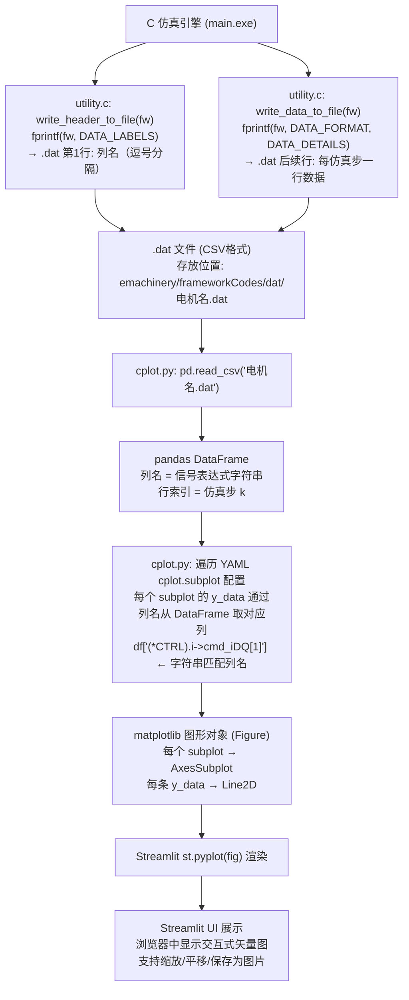
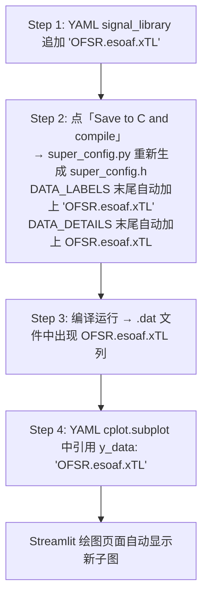
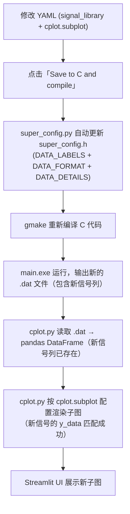

#  仿真绘图系统详解

**版本：** v1.0
**日期：** 2026-05
**适用对象：** 电机控制学习者、嵌入式开发者、需要理解 emachinery 仿真数据→matplotlib 绘图完整流程的用户

> **目标：** 彻底理解从 C 仿真引擎输出 `.dat` 文件 → Python pandas 解析 → matplotlib 绘图的完整数据管线，掌握如何添加新信号和自定义子图。

---

## 1. 绘图数据管线概览

emachinery 的仿真绘图管线是一个 **C → Python 全自动链路**：C 仿真引擎运行后输出 CSV 格式的 `.dat` 数据文件，Python 后处理层读取这些文件并渲染为 matplotlib 子图，最终在 Streamlit UI 中展示。



### 管线核心设计理念

整个管线中最关键的设计抉择是 **Python 端绝不解析 C 表达式**。`y_data` 值为 `(*CTRL).i->cmd_iDQ[1]`——这在 Python 看来只是一个普通的字符串，用于在 pandas DataFrame 的列名中做精确匹配查找。C 端负责将信号名称和对应数据写入同一文件的两端（列头 + 数据行），Python 端只做列名索引，不做任何 `eval()` 或表达式解析。这保证了：

1. 安全性：Python 端不会执行任何 C 代码
2. 一致性：只要 C 端和 YAML 端使用相同的字符串，数据就能正确匹配
3. 可维护性：添加新信号只需改三处（YAML signal_library + C 宏生成 + YAML cplot 引用）

---

## 2. `.dat` 文件详解

### 2.1 文件位置与命名

```text
E:\new_things\emachinery\frameworkCodes\dat\电机名.dat
```

文件名与 Streamlit 中选择的电机名称对应，例如选择 `SEW100W` 则生成 `SEW100W.dat`。

### 2.2 文件格式

`.dat` 文件是**标准 CSV 格式**的纯文本文件：

- **第 1 行（Header）**：列名，由逗号分隔的 C 表达式字符串组成
- **第 2 行起（Data）**：每行对应一个仿真步的数值数据，列顺序与第 1 行列名一一对应
- **编码**：ASCII

**示例内容（简化版）：**

```text
k,ACM.varOmega * MECH_RAD_PER_SEC_2_RPM,ACM.iDQ[0],ACM.iDQ[1],ACM.Tem,(*CTRL).timebase
0,0.0,0.0,0.0,0.0,0.0
1,0.0,0.0,0.0,0.0,0.0001
2,0.0,0.0,0.0,0.0,0.0002
3,1.5234,0.0012,0.8541,0.1235,0.0003
...
49999,400.0123,-0.0032,0.2456,0.0189,4.9999
```

### 2.3 三个关键宏

`.dat` 文件的列头和数据行内容由 C 代码中的三个宏决定，这三个宏由 `super_config.py` 根据 YAML 中的 `signal_library` **自动生成**并写入 `super_config.h`：

| 宏名 | 类型 | 内容示例 | 用途 |
|------|------|---------|------|
| `DATA_LABELS` | C 字符串宏 | `"k,ACM.varOmega * MECH_RAD_PER_SEC_2_RPM,ACM.iDQ[0],ACM.iDQ[1],...,(*CTRL).timebase\n"` | 写入 `.dat` 第 1 行作为列名 |
| `DATA_FORMAT` | C 格式字符串宏 | `"%d,%g,%g,%g,...,%g\n"` | 提供给 `fprintf` 的格式模板 |
| `DATA_DETAILS` | C 表达式宏 | `k, ACM.varOmega * MECH_RAD_PER_SEC_2_RPM, ACM.iDQ[0], ACM.iDQ[1], ..., (*CTRL).timebase` | 提供给 `fprintf` 的数据参数列表 |

**关键约束**：`DATA_LABELS`、`DATA_FORMAT`、`DATA_DETAILS` 三者必须在列数和列序上严格一致。`DATA_LABELS` 有 N 个逗号分隔的标签 → `DATA_FORMAT` 必须有 N 个格式说明符 → `DATA_DETAILS` 必须有 N 个表达式。

### 2.4 写入代码（`utility.c`）

```c
void write_header_to_file(FILE *fw) {
    fprintf(fw, DATA_LABELS);    // 写入第 1 行：列名
}

void write_data_to_file(FILE *fw) {
    fprintf(fw, DATA_FORMAT, DATA_DETAILS);  // 每仿真步写入一行数据
}
```

这两个函数在仿真主循环 `main()` 中被调用：

```c
// main.c 中的调用位置
write_header_to_file(fw);                          // 仿真开始前写一次

for (k = 0; k < NUMBER_OF_STEPS; k++) {
    _user_time_varying_parameters();
    machine_simulation();
    measurement();
    write_data_to_file(fw);                        // 每步都写一行
    main_switch(mode_select);
}
```

### 2.5 Python 读取

`cplot.py` 中使用 `pandas.read_csv` 读取 `.dat` 文件：

```python
data_file_name = f"../dat/{motor_name}.dat"
df = pd.read_csv(data_file_name, na_values=['1.#QNAN', '-1#INF00', '-1#IND00'])
```

- **自动解析**：`pd.read_csv` 将第 1 行解析为列名，后续行解析为 `float64` 类型数值，形成 DataFrame
- **NaN 处理**：`na_values` 参数处理 C 编译器在 Windows 下可能输出的特殊浮点异常值：
  - `1.#QNAN` → Windows MSVC 的 quiet NaN 表示
  - `-1#INF00` → 负无穷大
  - `-1#IND00` → 不定值（indeterminate，如 0/0）
- **索引列**：`k` 列（仿真步索引）作为 DataFrame 的一列，可用于 X 轴

---

## 3. 核心机制：列名匹配（不是 eval）

这是 emachinery 绘图系统**最重要的设计概念**，必须彻底理解。

### 3.1 Python 端不解析 C 表达式

在 YAML 配置中，你写的绘图信号是这样：

```yaml
cplot:
  subplot:
    - title: "Speed"
      y_title: "Speed [r/min]"
      y:
        - y_data: "ACM.varOmega * MECH_RAD_PER_SEC_2_RPM"
          y_label: "$\\omega_m$ (actual)"
        - y_data: "(*CTRL).i->cmd_varOmega * MECH_RAD_PER_SEC_2_RPM"
          y_label: "$\\omega_m^*$ (command)"
```

这里 `y_data` 的值 `ACM.varOmega * MECH_RAD_PER_SEC_2_RPM` 在 Python 端**就是一个普通字符串**。Python 代码**不会也不需要**解析这个 C 表达式。它只是把这个字符串作为 key，去 pandas DataFrame 中查找对应的列：

```python
# cplot.py 伪代码
y_values = df[y_data_string]  # 等同于 df["ACM.varOmega * MECH_RAD_PER_SEC_2_RPM"]
```

### 3.2 为什么能工作

这个机制之所以成立，是因为 **C 端写入 `.dat` 第 1 行的列名与 Python 端在 YAML 中使用的信号字符串完全相同**：

```text
第 1 步：YAML signal_library 定义信号
  signal_library:
    - "ACM.varOmega * MECH_RAD_PER_SEC_2_RPM"
    - "ACM.iDQ[0]"
    ...

第 2 步：super_config.py 读取 signal_library，生成 super_config.h
  #define DATA_LABELS "k,ACM.varOmega * MECH_RAD_PER_SEC_2_RPM,ACM.iDQ[0],...\n"
  #define DATA_FORMAT "%d,%g,%g,...\n"
  #define DATA_DETAILS k, ACM.varOmega * MECH_RAD_PER_SEC_2_RPM, ACM.iDQ[0], ...

第 3 步：C 仿真运行时，write_header_to_file 把 DATA_LABELS 写入 .dat 第 1 行
  → .dat 的列名就是 signal_library 中定义的字符串

第 4 步：Python pd.read_csv 读取 .dat，列名 = signal_library 中的字符串
  → df["ACM.varOmega * MECH_RAD_PER_SEC_2_RPM"] 就能直接取到数据

第 5 步：YAML cplot.subplot 中的 y_data = "ACM.varOmega * MECH_RAD_PER_SEC_2_RPM"
  → df[y_data] 就能成功获取该信号的全部数据
```

核心在于：**YAML signal_library → super_config.h DATA_LABELS → .dat 列头 → pandas 列名 → YAML cplot y_data 查找**——这五个环节使用的是同一个字符串，保证了端到端的一致性。

### 3.3 关键约束

由于上述机制，存在一个**硬约束**：

> 在 YAML `signal_library` 中添加的信号，必须在 C 代码的 `write_data_to_file` 中也有对应的数据记录（即出现在 `DATA_DETAILS` 宏中）。

如果你在 YAML 中添加了信号名但忘了在 C 端记录数据，绘图时会出现：

```text
Warning: there is no signal "OFSR.esoaf.xTL" in .dat file!
```

**这正是"列名匹配"而非"eval"的直接体现**——Python 不是在动态计算表达式，而是在 DataFrame 的列名列表中做字符串查找，找不到就会报 Warning。

---

## 4. `cplot` YAML 段完整语法

### 4.1 顶层结构

| 字段 | 类型 | 必填 | 默认值 | 说明 |
|------|------|------|--------|------|
| `title` | string | 否 | 无 | 整图总标题（显示在整个 Figure 顶部）。如果不指定则不显示总标题 |
| `x_data` | string | 否 | `(*CTRL).timebase` | 自定义 X 轴数据列名。默认使用控制器时间基准（仿真时间）。可以改为 `k`（用仿真步索引作为 X 轴）或其他信号 |
| `x_label` | string | 否 | `Time [s]` | X 轴标签文字。当 `x_data` 改为 `k` 时，应相应改为 `Step` |
| `width` | number | 是 | — | 整图宽度（英寸），决定整个 Figure 的宽度。典型值：8~14 |
| `height` | number | 是 | — | **每个子图**的高度（英寸）。注意：总图高度 = `height × 子图数量`。典型值：2~4 |
| `subplot` | list | 是 | — | 子图配置列表，数组中的每一项定义一个子图（垂直堆叠排列） |

### 4.2 子图（subplot 数组项）

| 字段 | 类型 | 必填 | 说明 |
|------|------|------|------|
| `title` | string | 是 | 子图标题，显示在子图顶部。支持 LaTeX 数学公式（如 `$i_d$ Current Response`） |
| `y_title` | string | 是 | Y 轴标签。支持 LaTeX 数学公式（如 `Current [A]`） |
| `y` | list | 是 | 曲线列表，数组中的每一项定义一条曲线。一个子图内可以绘制多条曲线，共享同一个 X 轴和 Y 轴 |

### 4.3 曲线（y 数组项）

| 字段 | 类型 | 必填 | 说明 |
|------|------|------|------|
| `y_data` | string | 是 | 信号表达式字符串，用于从 DataFrame 中查找对应列。**必须与 `signal_library` 和 `DATA_DETAILS` 中的表达式完全一致**（字符级精确匹配） |
| `y_label` | string | 是 | 图例（legend）标签。支持 LaTeX 数学公式语法，如 `$i_q^*$ (command)`、`$\\omega_m$ [r/min]` |

### 4.4 完整示例

```yaml
cplot:
  title: "PMSM Speed Control Step Response"
  x_data: "(*CTRL).timebase"
  x_label: "Time [s]"
  width: 12
  height: 3
  subplot:
    - title: "Speed Response"
      y_title: "Speed [r/min]"
      y:
        - y_data: "ACM.varOmega * MECH_RAD_PER_SEC_2_RPM"
          y_label: "$\\omega_m$ (actual)"
        - y_data: "(*CTRL).i->cmd_varOmega * MECH_RAD_PER_SEC_2_RPM"
          y_label: "$\\omega_m^*$ (command)"

    - title: "Q-axis Current"
      y_title: "Current [A]"
      y:
        - y_data: "ACM.iDQ[1]"
          y_label: "$i_q$ (actual)"
        - y_data: "(*CTRL).i->cmd_iDQ[1]"
          y_label: "$i_q^*$ (command)"

    - title: "Torque"
      y_title: "Torque [N·m]"
      y:
        - y_data: "ACM.Tem"
          y_label: "$T_{em}$"
        - y_data: "ACM.TLoad"
          y_label: "$T_{load}$"

    - title: "DC Bus Utilization"
      y_title: "Utilization Ratio"
      y:
        - y_data: "(*CTRL).o->dc_bus_utilization_ratio"
          y_label: "Vdc util"
```

**效果：** 生成一个 12 英寸宽、4 个子图（每个 3 英寸高）、垂直堆叠的图。第 1 个子图显示转速给定和反馈，第 2 个子图显示 q 轴电流，第 3 个子图显示转矩，第 4 个子图显示母线电压利用率。

---

## 5. `signal_library` 详解

### 5.1 定义与作用

`signal_library` 是 YAML 配置文件中的一个列表，定义了**哪些信号被记录到 `.dat` 文件中**：

```yaml
signal_library:
  - "k"
  - "ACM.varOmega * MECH_RAD_PER_SEC_2_RPM"
  - "ACM.iDQ[0]"
  - "ACM.iDQ[1]"
  - "ACM.Tem"
  - "ACM.TLoad"
  - "(*CTRL).i->cmd_varOmega * MECH_RAD_PER_SEC_2_RPM"
  - "(*CTRL).i->cmd_iDQ[0]"
  - "(*CTRL).i->cmd_iDQ[1]"
  - "(*CTRL).o->cmd_uDQ[0]"
  - "(*CTRL).o->cmd_uDQ[1]"
  - "(*CTRL).o->cmd_uAB[0]"
  - "(*CTRL).o->cmd_uAB[1]"
  - "(*CTRL).o->dc_bus_utilization_ratio"
  - "(*CTRL).timebase"
  - "ACM.theta_d/M_PI*180"
  - "ACM.uDQ[0]"
  - "ACM.uDQ[1]"
  - "ACM.uAB[0]"
  - "ACM.uAB[1]"
  - "ACM.KA"
  - "(*CTRL).i->iDQ[0]"
  - "(*CTRL).i->iDQ[1]"
  - "(*CTRL).s->xRho/M_PI*180"
  - "(*debug).set_rpm_speed_command"
  - "OFSR.esoaf.xOmg * ELEC_RAD_PER_SEC_2_RPM"
  - "OFSR.esoaf.xPos"
```

### 5.2 工作机制

1. 

`signal_library` 中的每个条目是一个字符串，对应一个 C 表达式
2. 点击「Save to C and compile」时，`super_config.py` 读取 `signal_library`，自动生成三个宏（`DATA_LABELS`、`DATA_FORMAT`、`DATA_DETAILS`）写入 `super_config.h`
3. C 仿真运行时，`DATA_LABELS` 写入 `.dat` 第 1 行，`DATA_DETAILS` 的值逐行写入
4. Python 端 `pd.read_csv` 读取后，每个 `signal_library` 条目成为 DataFrame 的一个列名
5. 在 YAML `cplot.subplot` 中，`y_data` 通过字符串匹配引用 DataFrame 的列

### 5.3 默认信号数量

默认的 `signal_library` 包含约 **25~30 个信号**，涵盖电机状态变量、控制器输入/输出、观测器状态和调试信号。实际数量取决于 `super_config.py` 中的默认生成逻辑。

### 5.4 修改后需要做什么

修改 `signal_library` 后：

1. **必须**重新点击「Save to C and compile」→ 触发 `super_config.py` 重新生成 `super_config.h`
2. 重新编译运行 C 仿真 → 新的 `.dat` 文件才包含新信号列
3. 在 YAML `cplot.subplot` 中才能引用新信号

---

## 6. 多用户配置合并机制

### 6.1 配置文件层级

emachinery 支持多用户并行开发，配置文件分为两层：

| 层级 | 文件 | 作用 |
|------|------|------|
| **基础层** | `user_config.yaml` | 默认仿真参数和绘图配置，所有用户共享 |
| **用户层** | `user_config_*.yaml` | 各用户的自定义配置（如 `user_config_wb.yaml`、`user_config_cjh.yaml`） |

### 6.2 `user_script_main.py` 中的合并逻辑

```python
def user_cplot_post_process(d_sim, user_plot_config, post_run):
    """
    根据 user.who_is_user 加载对应的 user_config_*.yaml，
    并与默认配置合并后返回最终的绘图配置。
    """
    who = d_sim.user.who_is_user
    # 根据 who 的值加载 user_config_{who}.yaml
    user_file = f"user_config_{who}.yaml"
    with open(user_file, 'r', encoding='utf-8') as f:
        user_config = yaml.safe_load(f)

    # ... 合并逻辑 ...
```

### 6.3 合并规则

| 配置段 | 合并方式 | 说明 |
|--------|---------|------|
| `signal_library` | **追加**（`.extend`） | 用户的信号追加到默认信号列表末尾，不删除默认信号。这保证了默认子图始终能正常工作 |
| `cplot.subplot` | **默认追加**，可选覆盖 | 默认将用户子图追加到默认子图后面。用户可通过设置标志位（如 `cplot_replace: true`）实现完全覆盖，即只显示用户定义的子图 |
| `cplot` 其他顶层键 | **覆盖** | `title`、`x_data`、`x_label`、`width`、`height` 如果用户在 `user_config_*.yaml` 中定义了，则覆盖默认值；未定义则保留默认值 |
| `config` 段（mpl/plt） | **覆盖** | matplotlib 相关的样式配置由用户 YAML 直接提供，覆盖默认设置 |

### 6.4 合并结果示例

假设默认配置定义了 7 个子图（Speed、iQ、Torque、iD、Vdc Util、uAB、Timebase），用户 `wb` 的配置追加了 2 个子图（ESO Speed Compare、Parameter Mismatch）：

- **最终绘图**：9 个子图垂直堆叠（7 个默认 + 2 个追加）
- **信号库**：默认 25 个信号 + wb 追加的 5 个信号 = 共 30 个信号列
- **图的宽度**：如果 wb 指定了 `width: 14`，则覆盖默认的 `width: 12`

---

## 7. 完整可观测信号参考表

以下信号在默认 `signal_library` 中均已定义，可在 `cplot.subplot` 的 `y_data` 中直接引用。

### a) 电机状态变量

| 信号表达式 | 含义 | 单位 | 典型用途 |
|-----------|------|------|---------|
| `ACM.x[0]` | 机械角度（状态变量 0） | rad | 查看转子绝对位置 |
| `ACM.x[1]` | 机械角速度（状态变量 1） | rad/s | 查看转速状态 |
| `ACM.x[2]` | 有功磁链 KA（状态变量 2） | Wb | 查看磁链动态（IM 中有变化，PMSM 中恒定） |
| `ACM.x[3]` | d 轴电流（状态变量 3） | A | 查看 d 轴电流状态 |
| `ACM.x[4]` | q 轴电流（状态变量 4） | A | 查看 q 轴电流状态 |

### b) 电机输出信号

| 信号表达式 | 含义 | 单位 | 典型用途 |
|-----------|------|------|---------|
| `ACM.varOmega * MECH_RAD_PER_SEC_2_RPM` | 机械转速 | rpm | 转速跟踪、速度环性能评估 |
| `ACM.theta_d/M_PI*180` | 电气角度 | deg（度） | 位置观测、角度误差分析 |
| `ACM.iDQ[0]` | d 轴电流（电机实际值） | A | id 观测、d 轴电流环性能 |
| `ACM.iDQ[1]` | q 轴电流（电机实际值） | A | iq 观测、转矩响应分析 |
| `ACM.iAB[0]` | α 轴电流（电机实际值） | A | 相电流等效值、电流波形观测 |
| `ACM.iAB[1]` | β 轴电流（电机实际值） | A | 相电流等效值、电流波形观测 |
| `ACM.uDQ[0]` | d 轴电压（电机实际承受电压） | V | 逆变器输出电压验证 |
| `ACM.uDQ[1]` | q 轴电压（电机实际承受电压） | V | 逆变器输出电压验证 |
| `ACM.uAB[0]` | α 轴电压（电机实际承受电压） | V | 电压矢量 α 分量观测 |
| `ACM.uAB[1]` | β 轴电压（电机实际承受电压） | V | 电压矢量 β 分量观测 |
| `ACM.Tem` | 电磁转矩 | N·m | 转矩观测、负载匹配分析 |
| `ACM.TLoad` | 负载转矩 | N·m | 负载阶跃响应分析 |
| `ACM.KA` | 有功磁链幅值 | Wb | 磁链观测、弱磁控制验证 |

### c) 控制器内部信号

| 信号表达式 | 含义 | 单位 | 典型用途 |
|-----------|------|------|---------|
| `(*CTRL).i->cmd_varOmega * MECH_RAD_PER_SEC_2_RPM` | 转速给定 | rpm | 速度环参考信号，对比实际转速评估跟踪性能 |
| `(*CTRL).i->varOmega * MECH_RAD_PER_SEC_2_RPM` | 转速反馈（传感器值） | rpm | 编码器/观测器提供的转速反馈值 |
| `(*CTRL).i->cmd_iDQ[0]` | d 轴电流给定 | A | 电流环 d 轴参考（通常为 0） |
| `(*CTRL).i->cmd_iDQ[1]` | q 轴电流给定 | A | 电流环 q 轴参考（速度环输出） |
| `(*CTRL).i->iDQ[0]` | d 轴电流反馈（传感器值） | A | 电流环 d 轴反馈输入 |
| `(*CTRL).i->iDQ[1]` | q 轴电流反馈（传感器值） | A | 电流环 q 轴反馈输入 |
| `(*CTRL).o->cmd_uDQ[0]` | d 轴电压指令 | V | 电流环 PI d 轴输出 |
| `(*CTRL).o->cmd_uDQ[1]` | q 轴电压指令 | V | 电流环 PI q 轴输出 |
| `(*CTRL).o->cmd_uAB[0]` | α 轴电压指令 | V | 逆变器 α 轴给定（经 InvPark 变换后） |
| `(*CTRL).o->cmd_uAB[1]` | β 轴电压指令 | V | 逆变器 β 轴给定（经 InvPark 变换后） |
| `(*CTRL).o->dc_bus_utilization_ratio` | 直流母线电压利用率 | 0~1 | 限幅检测：接近 1.0 表示进入过调制 |
| `(*CTRL).s->xRho/M_PI*180` | 控制器使用的电角度 | deg（度） | 无感控制中为观测角度，有感控制中为编码器角度 |

### d) 观测器信号

| 信号表达式 | 含义 | 单位 | 典型用途 |
|-----------|------|------|---------|
| `OFSR.esoaf.xOmg * ELEC_RAD_PER_SEC_2_RPM` | ESO 估算转速 | rpm | 无感速度反馈，与编码器值对比评估观测精度 |
| `OFSR.esoaf.xPos` | ESO 估算位置 | rad | 无感位置反馈，与编码器值对比评估观测精度 |
| `OBSV.theta_d/M_PI*180` | 观测器估计电角度 | deg（度） | 对比真实角度，评估观测器收敛性能 |
| `OBSV.varOmega * MECH_RAD_PER_SEC_2_RPM` | 观测器估计转速 | rpm | 对比真实转速，评估观测器动态跟踪性能 |

### e) 调试信号

| 信号表达式 | 含义 | 单位 | 典型用途 |
|-----------|------|------|---------|
| `(*debug).set_rpm_speed_command` | 用户设定的转速指令 | rpm | 参考信号、验证用户指令序列是否被正确注入 |
| `(*CTRL).timebase` | 控制器时间基准 | s | 时间参考轴（所有子图的默认 X 轴） |
| `k` | 仿真步索引 | — | 可用于替代时间作为 X 轴（`x_data: "k"`） |

### f) 感应电机额外信号

| 信号表达式 | 含义 | 单位 | 典型用途 |
|-----------|------|------|---------|
| `ACM.omega_syn` | 同步角速度 | rad/s | 滑差计算：ω_slip = ω_syn - ω_rotor |
| `ACM.omega_slip` | 滑差角速度 | rad/s | 滑差观测与控制（IM 的核心控制量） |

---

## 8. 自定义绘图示例

以 `user_config_wb.yaml` 为例，展示用户如何扩展默认绘图。基础配置是 7 个默认子图，`wb` 用户追加了以下自定义子图。

### 示例 1：添加 ESO 转速对比子图

```yaml
cplot:
  width: 14
  height: 3
  subplot:
    - title: "ESO Speed Compare"
      y_title: "Speed [r/min]"
      y:
        - y_data: "ACM.varOmega * MECH_RAD_PER_SEC_2_RPM"
          y_label: "$\\omega_m$ (encoder)"
        - y_data: "OFSR.esoaf.xOmg * ELEC_RAD_PER_SEC_2_RPM"
          y_label: "$\\hat{\\omega}_m$ (ESO)"
```

**效果：** 新增一个子图，对比编码器测量的真实转速和 ESO 扩张状态观测器估计的转速。两条曲线重合度越高，说明 ESO 观测精度越好。

### 示例 2：添加参数失配百分比显示子图

```yaml
    - title: "Parameter Mismatch [%]"
      y_title: "Mismatch [%]"
      y:
        - y_data: "OFSR.esoaf.xParamMismatch"
          y_label: "$\\Delta R_s$ [%]"
```

**效果：** 显示 ESO 估计的参数失配百分比。如果辨识的电机参数与真实值偏差较大，ESO 可以通过此信号反映出来。稳态时该值接近 0 说明参数准确，偏离 0 说明存在参数失配。

### 示例 3：添加扫频 -3dB 标记子图

```yaml
    - title: "Sweeping Frequency Response"
      y_title: "Magnitude [dB] / Phase [deg]"
      y:
        - y_data: "sweep_magnitude_dB"
          y_label: "Magnitude [dB]"
        - y_data: "sweep_phase_deg"
          y_label: "Phase [deg]"
```

**效果：** 扫频模式下自动计算频率响应的幅值和相位，找到 -3dB 带宽点，用于验证电流环/速度环的实际带宽是否达到设计值。

### 示例 4：修改高度和宽度调整布局

```yaml
cplot:
  width: 16     # 更宽的画布，适合展示较长时间跨度的数据
  height: 2.5   # 每个子图更矮，9 个子图时总高度 = 9 × 2.5 = 22.5 英寸（可滚动查看）
```

**效果：** 当子图数量较多（如 9~12 个）时，减小每个子图的高度可以避免总图过高，同时增大宽度使得每个子图有足够的横向空间展示细节。

---

## 9. 如何添加新信号（三步法教程）

假设你要添加 ESO 负载转矩估计信号 `OFSR.esoaf.xTL`，以下是完整操作流程。

### Step 1: 在 YAML `signal_library` 中添加新信号

编辑 `user_config.yaml`（或 `user_config_xxx.yaml`），在 `signal_library` 列表末尾追加：

```yaml
signal_library:
  # ... 已有信号 ...
  - "OFSR.esoaf.xTL"
```

> **重要：** 不要直接编辑 `super_config.h`！修改 YAML 后点击「Save to C and compile」让 `super_config.py` 自动重新生成。

### Step 2: 点击「Save to C and compile」

这个按钮触发以下自动流程：

1. 

`super_config.py` 读取更新后的 `signal_library`
2. 自动生成新的 `super_config.h`，其中 `DATA_LABELS`、`DATA_FORMAT`、`DATA_DETAILS` 三个宏都包含了 `OFSR.esoaf.xTL`
3. 调用 `gmake` 重新编译 C 代码
4. 运行 `main.exe`，生成新的 `.dat` 文件

### Step 3: 验证信号出现在 `.dat` 文件中

打开生成的 `.dat` 文件（如 `E:\new_things\emachinery\frameworkCodes\dat\SEW100W.dat`），检查第 1 行是否包含 `OFSR.esoaf.xTL`：

```text
k,ACM.varOmega * MECH_RAD_PER_SEC_2_RPM,...,OFSR.esoaf.xTL,(*CTRL).timebase
```

如果第 1 行有这个列名，说明信号已成功记录。

### Step 4: 在绘图中使用新信号

在 `user_config.yaml` 的 `cplot.subplot` 中添加新子图：

```yaml
cplot:
  subplot:
    # ... 已有子图 ...
    - title: "ESO Load Torque Estimation"
      y_title: "Torque [N·m]"
      y:
        - y_data: "ACM.TLoad"
          y_label: "$T_{load}$ (true)"
        - y_data: "OFSR.esoaf.xTL"
          y_label: "$\\hat{T}_{load}$ (ESO)"
```

完整实例过程总结：



---

## 10. 注意事项与常见错误

###  错误 1：YAML 中添加了信号但忘了在 C 代码中记录

**现象：**
```text
Warning: there is no signal "OFSR.esoaf.xTL" in .dat file!
```

**原因：** 在 YAML `signal_library` 中添加了信号，但没有重新点击「Save to C and compile」来触发 `super_config.py` 更新 `super_config.h`。

**解决：** 点击「Save to C and compile」，让 `super_config.py` 自动在 `DATA_LABELS` 和 `DATA_DETAILS` 中包含新信号。

###  错误 2：C 表达式语法错误（括号不匹配）

**现象：** 编译错误，gcc 报出语法错误。

**原因：** YAML `signal_library` 中写入的 C 表达式语法不正确，如：
```yaml
# 错误：括号不匹配
- "(*CTRL.i->cmd_iDQ[1]"
```

**解决：** 检查 C 表达式语法，确保括号匹配、箭头运算符 `->` 正确、数组索引正确。

###  错误 3：手动修改 `super_config.h/c` 后内容被覆盖

**现象：** 直接编辑了 `super_config.h`，下次点击「Save to C and compile」后修改丢失。

**原因：** `super_config.h` 和 `super_config.c` 由 Python 自动生成，每次点击按钮都会从 YAML 重新生成，覆盖任何手动编辑。

**解决：** 永远通过修改 YAML 配置来间接修改 `super_config.h/c`，不要直接编辑这两个自动生成的文件。

###  错误 4：`y_data` 字符串与 `DATA_LABELS` 不完全一致

**现象：**
```text
Warning: there is no signal "ACM.varOmega*MECH_RAD_PER_SEC_2_RPM" in .dat file!
```

**原因：** YAML 中写的 `y_data` 字符串和 `signal_library` 中的字符串存在差异，如缺少空格：
- `signal_library` 中：`ACM.varOmega * MECH_RAD_PER_SEC_2_RPM`（有空格）
- `y_data` 中：`ACM.varOmega*MECH_RAD_PER_SEC_2_RPM`（无空格）

**解决：** 确保 `y_data` 字符串与 `signal_library` 中的字符串**字符级完全一致**（包括空格、括号、大小写）。

###  正确的工作流总结



> **核心理念：** YAML 是唯一的配置入口。永远不要绕过 YAML 直接修改 C 代码或 `super_config.h/c`。所有的信号定义、绘图布局、参数配置都通过 YAML 驱动，`super_config.py` 充当 YAML → C 的自动翻译器。
