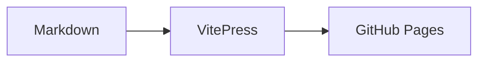

# Markdown 渲染验证

## 表格

| 项目 | 说明 |
| --- | --- |
| PFC | 功率因数校正 |
| FOC | 磁场定向控制 |

## 任务列表

- [x] 支持 Markdown 基础语法
- [ ] 支持 Mermaid

## Callout

::: tip
这是 VitePress 容器语法。
:::

## Mermaid



## SVG


## 代码

```ts
const duty = vin / vout
```
