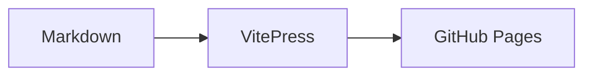

# Personal Knowledge Base Upgrade Implementation Plan

> **For agentic workers:** REQUIRED SUB-SKILL: Use superpowers:subagent-driven-development (recommended) or superpowers:executing-plans to implement this plan task-by-task. Steps use checkbox (`- [ ]`) syntax for tracking.

**Goal:** Upgrade `null42.github.io` from a working VitePress blog into a maintainable personal knowledge base with reliable content migration, full-content search, chaptered navigation, rich Markdown/Mermaid/SVG rendering, optional encrypted pages, comments, and one-command publishing.

**Architecture:** Keep GitHub Pages + VitePress as the public static site, but move knowledge-base behavior into focused build-time scripts and small Vue components. Markdown remains the canonical public source format; HTML sources are converted or attached during migration; encrypted content is built from local-only plaintext into browser-decryptable ciphertext so private plaintext is not committed.

**Tech Stack:** VitePress, Vue 3, TypeScript, Node scripts with `tsx`, `fast-glob`, `gray-matter`, `yaml`, Vitest, Mermaid, HTML parsing/conversion tooling, optional MiniSearch/Fuse-style search index, Giscus for comments, GitHub Pages.

---

## Current State

Repository: `E:\gitee_CodeStorage\xuexi\null42.github.io` (actual local path uses the Chinese folder name for learning)

Current capabilities:
- VitePress site publishes to `https://null42.github.io/`.
- Content lives under `content/`.
- Metadata is stored in Markdown frontmatter.
- `scripts/kb/fix.ts`, `scripts/kb/check.ts`, `scripts/kb/generate.ts`, `scripts/kb/migrate.ts`, and `scripts/kb/publish.ts` provide the current pipeline.
- `.vitepress/generated/articles.json` already includes article body text.
- `ArchivePage.vue` already performs simple client-side matching against title, summary, category, tags, and body.
- VitePress local search is enabled with `themeConfig.search.provider = 'local'`.
- Giscus dependency exists, but production configuration is not complete.

Main pain points:
- Much of the power-electronics knowledge base is HTML, not Markdown. The first migration batch copied simple Markdown pages, so the result looks thin.
- Search UX does not clearly expose body matches, snippets, ranking, or advanced filters.
- Sidebar treats categories as flat buckets instead of course-like chapter structures.
- Some content should be private/encrypted.
- Markdown rendering quality, Mermaid diagrams, SVG/images, tables, math-like notation, callouts, and code blocks need explicit support and tests.
- Comments are not fully enabled.
- The backend pipeline needs better import, metadata suggestion, validation, and publishing commands.

Reference facts used in this plan:
- VitePress uses Markdown-it and Shiki for Markdown parsing/highlighting, and exposes Markdown configuration through site config. See VitePress Site Config and Markdown docs.
- VitePress local search uses an in-browser MiniSearch index when `themeConfig.search.provider` is set to `'local'`.
- Mermaid renders text definitions into diagrams/SVG and can be used as a client-side renderer for Markdown-like diagram blocks.

---

## Round Overview

### Round 0: Baseline Audit And Encoding Cleanup

Purpose: make the existing project trustworthy before adding features. Several source files display as mojibake in PowerShell output even though browser output may be correct; this round verifies and fixes actual file encoding only where needed.

Deliverables:
- Clean UTF-8 source files for config and Vue components.
- Baseline tests for archive search, generated metadata, and rendering fixtures.
- A small fixture corpus for Markdown, Mermaid, SVG, and HTML import.

### Round 1: Rendering Foundation

Purpose: make the site a good technical documentation renderer before importing more material.

Deliverables:
- Markdown syntax support matrix and fixture page.
- Mermaid code fence rendering.
- SVG/image asset handling rules.
- Better tables, code blocks, callouts, task lists, footnotes, and internal links.

### Round 2: HTML And Markdown Migration Pipeline

Purpose: migrate real power/electronics and motor-control knowledge without losing structure.

Deliverables:
- HTML inventory report.
- HTML-to-Markdown conversion for common pages.
- Asset copy/rewrite for images/SVG.
- Power knowledge base sync from `E:\gitee_CodeStorage\瀛︿範\鐢垫簮` into `content/power`.
- Motor knowledge base sync from `E:\gitee_CodeStorage\瀛︿範\MotorControl-main\motor-learning-web` into `content/motor`.
- A published first batch for both power and motor content, not just importer scripts.
- Fallback strategy for pages that cannot be safely converted.
- Dry-run and apply modes with conversion quality reports.

### Round 3: Knowledge Structure And Navigation

Purpose: turn flat articles into chaptered knowledge bases.

Deliverables:
- Metadata model: `section`, `chapter`, `chapterOrder`, `order`, `type`, `difficulty`.
- Generated sidebar: section -> chapter -> article.
- Archive filters for section/chapter/tag/month/status/type.
- Blog/suibi split into technical/daily/time views.

### Round 4: Search System Upgrade

Purpose: provide full-content search with ranking, snippets, and filters.

Deliverables:
- Dedicated search page.
- Weighted title/heading/tag/body search.
- Body hit snippets with highlight.
- Chinese/English tokenization heuristics.
- Search index size guardrails.

### Round 5: Encrypted Articles

Purpose: protect selected personal/private pages in a static hosting environment.

Deliverables:
- Local-only plaintext source directory.
- Build-time encryption command.
- Client-side password prompt and decryption component.
- No private plaintext in git, generated static HTML, or search indexes.

### Round 6: Comments And Publishing Workflow

Purpose: make feedback and deployment routine.

Deliverables:
- Giscus fully configured for public articles.
- Comment visibility rules for encrypted/private pages.
- `npm run kb:all` one-command local pipeline.
- `npm run kb:deploy` build + root sync + push helper.
- Optional keyword suggestion report.

---

## File Structure Plan

Create:
- `docs/kb/content-model.md`: user-facing frontmatter and folder conventions.
- `docs/kb/rendering-support.md`: Markdown/Mermaid/SVG support matrix.
- `content/playground/rendering-fixture.md`: public fixture page for rendering checks.
- `content/search.md`: dedicated search page.
- `.vitepress/theme/components/MermaidDiagram.vue`: client-side Mermaid renderer.
- `.vitepress/theme/components/SearchPage.vue`: advanced knowledge-base search UI.
- `.vitepress/theme/components/EncryptedArticle.vue`: password prompt/decrypt UI.
- `.vitepress/theme/components/SvgFigure.vue`: optional SVG/image figure wrapper with caption support.
- `scripts/kb/import/inspect-source.ts`: source inventory.
- `scripts/kb/import/html-to-markdown.ts`: HTML conversion.
- `scripts/kb/import/assets.ts`: asset copy and path rewrite helpers.
- `scripts/kb/search/build-index.ts`: build structured search records.
- `scripts/kb/search/tokenize.ts`: Chinese/English tokenizer.
- `scripts/kb/search/snippets.ts`: match snippet generation.
- `scripts/kb/metadata/suggest-tags.ts`: keyword/tag suggestion.
- `scripts/kb/encrypt/encrypt.ts`: build encrypted payloads.
- `scripts/kb/sync-dist.ts`: safe root publishing sync.
- `tests/kb/rendering.test.ts`: Markdown/Mermaid/SVG fixture tests.
- `tests/kb/import-html.test.ts`: HTML conversion tests.
- `tests/kb/search.test.ts`: ranking/snippet/filter tests.
- `tests/kb/navigation.test.ts`: chaptered sidebar tests.
- `tests/kb/encryption.test.ts`: private content leak tests.
- `tests/kb/pipeline.test.ts`: one-command pipeline tests.

Modify:
- `.vitepress/config.ts`: Markdown plugins/config, search settings, generated sidebar, possibly Vite build options.
- `.vitepress/theme/index.ts`: register new Vue components.
- `.vitepress/theme/Layout.vue`: comment/encryption layout integration if needed.
- `.vitepress/theme/components/ArchivePage.vue`: replace simple archive search with shared search/index logic or keep it as a compact filter view.
- `.vitepress/theme/components/GiscusComments.vue`: production giscus configuration and visibility rules.
- `.vitepress/theme/style.css`: rendering, search, chapter, encrypted-page, Mermaid, SVG styles.
- `scripts/kb/types.ts`: richer metadata and generated record types.
- `scripts/kb/articles.ts`: scan, visibility, section/chapter fields, private exclusion rules.
- `scripts/kb/generate.ts`: generate sidebar, search index, archive data, tag/category/chapter metadata.
- `scripts/kb/migrate.ts`: delegate to import modules.
- `scripts/kb/check.ts`: validate rendering-sensitive content and metadata.
- `scripts/kb/publish.ts`: use safe dist sync and deployment checks.
- `package.json`: scripts and dependencies.

---

## Metadata Model

Target frontmatter:

```yaml
title: Concept: single-phase PFC current loop
date: 2026-06-21
updated: 2026-07-01
section: Power Control
chapter: 02-PFC
chapterTitle: Power Factor Correction
chapterOrder: 20
order: 30
category: Control Algorithm
type: concept
difficulty: intermediate
tags:
  - PFC
  - current-loop
  - control
suggestedTags:
  - PWM
  - ADC
source: power
sourcePath: lessons/0024-single-phase-pfc-current-loop.html
status: learning
visibility: public
comments: true
summary: The inner current loop of single-phase PFC tracks the current reference waveform.
```

Visibility values:
- `public`: published, indexed, commentable by default.
- `hidden`: built but omitted from archive/search unless explicitly included.
- `private`: local source only, not built, not indexed.
- `encrypted`: plaintext source is local-only; generated encrypted payload may be published.

Do not overwrite user-written fields. Scripts may only fill missing fields or write `suggestedTags`.

---

## Round 0: Baseline Audit And Encoding Cleanup

### Task 0.1: Verify Source Encoding And Fix Real Mojibake

**Files:**
- Modify: `.vitepress/config.ts`
- Modify: `.vitepress/theme/components/ArchivePage.vue`
- Test: `tests/kb/encoding.test.ts`

- [ ] **Step 1: Write the failing encoding test**

Create `tests/kb/encoding.test.ts`:

```ts
import fs from 'node:fs'
import { describe, expect, it } from 'vitest'

const utf8Files = [
  '.vitepress/config.ts',
  '.vitepress/theme/components/ArchivePage.vue'
]

describe('source encoding', () => {
  it('does not contain common mojibake markers in user-visible source text', () => {
    for (const file of utf8Files) {
      const text = fs.readFileSync(file, 'utf8')
      expect(text, file).not.toMatch(/[閻㈠灚绨畖閸忋劑鍎磡閺傚洨鐝穦閹兼粎鍌▅缁″洦鏋僝/)
      expect(text, file).toContain('鐭ヨ瘑搴?)
    }
  })
})
```

- [ ] **Step 2: Run the test and confirm it fails if mojibake is real**

Run:

```bash
npm test -- tests/kb/encoding.test.ts
```

Expected before fixing: FAIL if files really contain mojibake; PASS if the issue is terminal rendering only.

- [ ] **Step 3: Replace user-visible strings with valid UTF-8 only where the test proves corruption**

In `.vitepress/config.ts`, user-visible strings should be:

```ts
title: 'lx鐨勪釜浜虹煡璇嗗簱',
description: '鐢垫簮鎺у埗銆佺數鏈烘帶鍒躲€佷豢鐪熷拰宸ョ▼瀛︿範璁板綍',
nav: [
  { text: '棣栭〉', link: '/' },
  { text: '鐢垫簮鎺у埗', link: '/content/power/getting-started.html' },
  { text: '鐢垫満鎺у埗', link: '/content/motor/getting-started.html' },
  { text: '鏂囩珷搴?, link: '/archive.html' },
  { text: '鍏充簬鎴?, link: '/about.html' }
],
outline: {
  level: [2, 3],
  label: '鐩綍'
}
```

In `ArchivePage.vue`, use:

```ts
const ALL = '鍏ㄩ儴'
const query = ref('')
const category = ref(ALL)
const month = ref(ALL)
```

And template labels:

```vue
<input v-model="query" class="kb-search-input" aria-label="鍏抽敭璇嶆悳绱? title="鎼滅储 Buck / FOC / SVPWM / 閲囨牱鏃跺簭" />
<select v-model="category" class="kb-select" aria-label="鍒嗙被">
<select v-model="month" class="kb-select" aria-label="鏃堕棿">
<div class="kb-result-count">{{ filtered.length }} 绡囨枃绔?/div>
```

- [ ] **Step 4: Re-run tests**

Run:

```bash
npm test
npm run build
```

Expected: all tests pass and build succeeds.

- [ ] **Step 5: Commit**

```bash
git add .vitepress/config.ts .vitepress/theme/components/ArchivePage.vue tests/kb/encoding.test.ts
git commit -m "test: guard source encoding"
```

### Task 0.2: Add Rendering Fixture Page

**Files:**
- Create: `content/playground/rendering-fixture.md`
- Create: `content/playground/.category.yml`
- Test: `tests/kb/rendering.test.ts`

- [ ] **Step 1: Create fixture content**

Create `content/playground/.category.yml`:

```yaml
section: Playground
category: 娓叉煋楠岃瘉
source: manual
visibility: public
```

Create `content/playground/rendering-fixture.md`:

````md
---
title: Markdown 娓叉煋楠岃瘉
date: 2026-07-01
section: Playground
chapter: 00-Fixtures
category: 娓叉煋楠岃瘉
tags:
  - markdown
  - mermaid
  - svg
source: manual
status: reference
visibility: public
comments: false
summary: 鐢ㄤ簬楠岃瘉 Markdown銆丮ermaid銆丼VG銆佽〃鏍笺€佷唬鐮佸潡鍜?callout 鐨勬祴璇曢〉闈€?---

# Markdown 娓叉煋楠岃瘉

## 琛ㄦ牸

| 椤圭洰 | 璇存槑 |
| --- | --- |
| PFC | 鍔熺巼鍥犳暟鏍℃ |
| FOC | 纾佸満瀹氬悜鎺у埗 |

## 浠诲姟鍒楄〃

- [x] 鏀寔 Markdown 鍩虹璇硶
- [ ] 鏀寔 Mermaid

## Callout

::: tip
杩欐槸 VitePress 瀹瑰櫒璇硶銆?:::

## Mermaid



## SVG


## 浠ｇ爜

```ts
const duty = vin / vout
```
````

- [ ] **Step 2: Write fixture scan test**

Create `tests/kb/rendering.test.ts`:

```ts
import fs from 'node:fs'
import { describe, expect, it } from 'vitest'

describe('rendering fixture', () => {
  it('contains markdown, mermaid, svg, table, and code examples', () => {
    const text = fs.readFileSync('content/playground/rendering-fixture.md', 'utf8')
    expect(text).toContain('```mermaid')
    expect(text).toContain('| 椤圭洰 | 璇存槑 |')
    expect(text).toContain('![鎺у埗寤惰繜绀烘剰]')
    expect(text).toContain('::: tip')
    expect(text).toContain('```ts')
  })
})
```

- [ ] **Step 3: Run tests and build**

Run:

```bash
npm test -- tests/kb/rendering.test.ts
npm run build
```

Expected: test passes and VitePress builds the fixture page.

- [ ] **Step 4: Commit**

```bash
git add content/playground tests/kb/rendering.test.ts
git commit -m "test: add rendering fixture page"
```

---

## Round 1: Rendering Foundation

### Task 1.1: Add Mermaid Rendering For Markdown Code Fences

**Files:**
- Modify: `package.json`
- Modify: `.vitepress/config.ts`
- Create: `.vitepress/theme/components/MermaidDiagram.vue`
- Modify: `.vitepress/theme/index.ts`
- Modify: `.vitepress/theme/style.css`
- Test: `tests/kb/rendering.test.ts`

- [ ] **Step 1: Install dependency**

Run:

```bash
npm install mermaid
```

Expected: `package.json` and `package-lock.json` include `mermaid`.

- [ ] **Step 2: Add component**

Create `.vitepress/theme/components/MermaidDiagram.vue`:

```vue
<script setup lang="ts">
import { computed, nextTick, onMounted, ref, watch } from 'vue'
import mermaid from 'mermaid'

const props = defineProps<{
  code: string
}>()

const id = `mermaid-${Math.random().toString(36).slice(2)}`
const rendered = ref('')
const error = ref('')

const source = computed(() => decodeURIComponent(props.code))

async function renderDiagram() {
  error.value = ''
  rendered.value = ''
  await nextTick()
  try {
    mermaid.initialize({
      startOnLoad: false,
      securityLevel: 'strict',
      theme: document.documentElement.classList.contains('dark') ? 'dark' : 'default'
    })
    const result = await mermaid.render(id, source.value)
    rendered.value = result.svg
  } catch (err) {
    error.value = err instanceof Error ? err.message : String(err)
  }
}

onMounted(renderDiagram)
watch(source, renderDiagram)
</script>

<template>
  <figure class="kb-mermaid">
    <div v-if="rendered" class="kb-mermaid-svg" v-html="rendered" />
    <pre v-else-if="error" class="kb-mermaid-error"><code>{{ error }}</code></pre>
  </figure>
</template>
```

- [ ] **Step 3: Register component**

Modify `.vitepress/theme/index.ts`:

```ts
import MermaidDiagram from './components/MermaidDiagram.vue'

enhanceApp({ app }) {
  app.component('ArchivePage', ArchivePage)
  app.component('MermaidDiagram', MermaidDiagram)
}
```

- [ ] **Step 4: Transform mermaid fences in VitePress markdown config**

Modify `.vitepress/config.ts`:

```ts
markdown: {
  config(md) {
    const defaultFence = md.renderer.rules.fence!
    md.renderer.rules.fence = (tokens, idx, options, env, self) => {
      const token = tokens[idx]
      const info = token.info.trim()
      if (info === 'mermaid') {
        const encoded = encodeURIComponent(token.content)
        return `<MermaidDiagram code="${encoded}" />`
      }
      return defaultFence(tokens, idx, options, env, self)
    }
  }
}
```

- [ ] **Step 5: Style diagrams**

Add to `.vitepress/theme/style.css`:

```css
.kb-mermaid {
  margin: 24px 0;
  overflow-x: auto;
}

.kb-mermaid-svg {
  min-width: 320px;
}

.kb-mermaid-svg svg {
  max-width: 100%;
  height: auto;
}

.kb-mermaid-error {
  border: 1px solid var(--vp-c-danger-2);
  border-radius: 8px;
  padding: 12px;
  color: var(--vp-c-danger-1);
  background: var(--vp-c-danger-soft);
}
```

- [ ] **Step 6: Add build-level assertion**

Extend `tests/kb/rendering.test.ts`:

```ts
it('renders mermaid fences through the MermaidDiagram component after build', () => {
  const html = fs.readFileSync('content/playground/rendering-fixture.html', 'utf8')
  expect(html).toContain('MermaidDiagram')
})
```

If VitePress SSR output does not preserve the component name, adjust this test to inspect `.vitepress/dist/assets` for `kb-mermaid`.

- [ ] **Step 7: Verify**

Run:

```bash
npm test
npm run build
```

Expected: tests pass and the fixture page builds.

- [ ] **Step 8: Commit**

```bash
git add package.json package-lock.json .vitepress/config.ts .vitepress/theme tests/kb/rendering.test.ts
git commit -m "feat: render mermaid diagrams"
```

### Task 1.2: Define Markdown Support Matrix And Checks

**Files:**
- Create: `docs/kb/rendering-support.md`
- Modify: `scripts/kb/check.ts`
- Test: `tests/kb/rendering.test.ts`

- [ ] **Step 1: Document supported syntax**

Create `docs/kb/rendering-support.md`:

```md
# Rendering Support

## Supported

- Frontmatter metadata.
- Headings, paragraphs, blockquotes, lists, task lists.
- Tables.
- Fenced code blocks with syntax highlighting.
- VitePress custom containers: `::: tip`, `::: warning`, `::: danger`, `::: details`.
- Mermaid diagrams using fenced code blocks: ```` ```mermaid ````.
- Local SVG/PNG/JPG/GIF/WebP images with relative paths.
- Inline HTML only for safe documentation markup already supported by VitePress.

## Restricted

- Remote images are allowed only when explicitly whitelisted in content review.
- Raw `<script>` is not allowed.
- Private plaintext is not allowed in public `content/`.
- Large HTML pages should be converted to Markdown or attached as raw reference pages.
```

- [ ] **Step 2: Add check for unsafe script tags**

Modify `scripts/kb/check.ts` to fail when public Markdown contains raw `<script`:

```ts
if (record.body.match(/<script\b/i)) {
  warnings.push(`${record.relativePath}: raw <script> tags are not allowed`)
}
```

If `check.ts` currently only prints warnings, make unsafe script tags errors.

- [ ] **Step 3: Test the rule**

Add to `tests/kb/rendering.test.ts`:

```ts
it('documents safe rendering rules', () => {
  const docs = fs.readFileSync('docs/kb/rendering-support.md', 'utf8')
  expect(docs).toContain('Mermaid diagrams')
  expect(docs).toContain('Raw `<script>` is not allowed')
})
```

- [ ] **Step 4: Verify**

Run:

```bash
npm test
npm run kb:check
npm run build
```

Expected: all pass.

- [ ] **Step 5: Commit**

```bash
git add docs/kb/rendering-support.md scripts/kb/check.ts tests/kb/rendering.test.ts
git commit -m "docs: define rendering support"
```

### Task 1.3: Improve SVG And Image Handling Rules

**Files:**
- Create: `.vitepress/theme/components/SvgFigure.vue`
- Modify: `.vitepress/theme/index.ts`
- Modify: `.vitepress/theme/style.css`
- Modify: `scripts/kb/import/assets.ts`
- Test: `tests/kb/rendering.test.ts`

- [ ] **Step 1: Add figure component**

Create `.vitepress/theme/components/SvgFigure.vue`:

```vue
<script setup lang="ts">
defineProps<{
  src: string
  alt?: string
  caption?: string
}>()
</script>

<template>
  <figure class="kb-figure">
    
    <figcaption v-if="caption">{{ caption }}</figcaption>
  </figure>
</template>
```

- [ ] **Step 2: Register component**

Modify `.vitepress/theme/index.ts`:

```ts
import SvgFigure from './components/SvgFigure.vue'

app.component('SvgFigure', SvgFigure)
```

- [ ] **Step 3: Add styles**

Add:

```css
.kb-figure {
  margin: 24px 0;
}

.kb-figure img {
  display: block;
  max-width: 100%;
  height: auto;
  border: 1px solid var(--vp-c-divider);
  border-radius: 8px;
  background: var(--kb-surface);
}

.kb-figure figcaption {
  margin-top: 8px;
  color: var(--vp-c-text-2);
  font-size: 13px;
  text-align: center;
}
```

- [ ] **Step 4: Add asset helper API**

Create `scripts/kb/import/assets.ts`:

```ts
import fs from 'node:fs/promises'
import path from 'node:path'

const imageExtensions = new Set(['.svg', '.png', '.jpg', '.jpeg', '.gif', '.webp'])

export function isImageAsset(filePath: string): boolean {
  return imageExtensions.has(path.extname(filePath).toLowerCase())
}

export async function copyAsset(from: string, to: string): Promise<void> {
  await fs.mkdir(path.dirname(to), { recursive: true })
  await fs.copyFile(from, to)
}

export function toMarkdownImage(alt: string, relativePath: string): string {
  return `})`
}
```

- [ ] **Step 5: Test helper**

Add:

```ts
import { isImageAsset, toMarkdownImage } from '../../scripts/kb/import/assets'

it('recognizes SVG and image assets', () => {
  expect(isImageAsset('control-delay-timing.svg')).toBe(true)
  expect(isImageAsset('notes.md')).toBe(false)
  expect(toMarkdownImage('鍥?, 'assets\\a.svg')).toBe('![鍥綸(assets/a.svg)')
})
```

- [ ] **Step 6: Verify and commit**

```bash
npm test
npm run build
git add .vitepress/theme scripts/kb/import/assets.ts tests/kb/rendering.test.ts
git commit -m "feat: support documentation figures"
```

---

## Round 2: HTML And Markdown Migration Pipeline

### Task 2.1: Inspect Source Knowledge Bases

**Files:**
- Create: `scripts/kb/import/inspect-source.ts`
- Modify: `package.json`
- Test: `tests/kb/import-html.test.ts`

- [ ] **Step 1: Implement inventory script**

Create `scripts/kb/import/inspect-source.ts`:

```ts
import path from 'node:path'
import fg from 'fast-glob'

const roots = [
  { name: 'power', root: 'E:\\gitee_CodeStorage\\瀛︿範\\鐢垫簮' },
  { name: 'motor', root: 'E:\\gitee_CodeStorage\\瀛︿範\\MotorControl-main\\motor-learning-web' }
]

const patterns = ['**/*.md', '**/*.html', '**/*.svg', '**/*.png', '**/*.jpg', '**/*.jpeg', '**/*.gif', '**/*.webp']
const ignore = ['**/.git/**', '**/node_modules/**', '**/dist/**', '**/build/**', '**/slprj/**']

for (const source of roots) {
  const files = await fg(patterns, { cwd: source.root, ignore, onlyFiles: true })
  const groups = new Map<string, number>()
  for (const file of files) {
    const ext = path.extname(file).toLowerCase() || '(none)'
    groups.set(ext, (groups.get(ext) || 0) + 1)
  }
  console.log(JSON.stringify({ source: source.name, root: source.root, total: files.length, byExtension: Object.fromEntries([...groups.entries()].sort()) }, null, 2))
}
```

- [ ] **Step 2: Add package script**

Modify `package.json`:

```json
"kb:inspect": "tsx scripts/kb/import/inspect-source.ts"
```

- [ ] **Step 3: Run inventory**

Run:

```bash
npm run kb:inspect
```

Expected: JSON output showing counts for `.html`, `.md`, images, and SVG.

- [ ] **Step 4: Commit**

```bash
git add package.json scripts/kb/import/inspect-source.ts
git commit -m "feat: inspect source knowledge bases"
```

### Task 2.2: Convert Typical HTML Pages To Markdown

**Files:**
- Modify: `package.json`
- Create: `scripts/kb/import/html-to-markdown.ts`
- Create: `tests/fixtures/html/simple-lesson.html`
- Test: `tests/kb/import-html.test.ts`

- [ ] **Step 1: Install conversion dependencies**

Run:

```bash
npm install cheerio turndown
npm install -D @types/turndown
```

- [ ] **Step 2: Add HTML fixture**

Create `tests/fixtures/html/simple-lesson.html`:

```html
<!doctype html>
<html>
  <head><title>姒傚康锛欱oost Converter</title></head>
  <body>
    <h1>姒傚康锛欱oost Converter</h1>
    <p>Boost converter 鐢ㄧ數鎰熷偍鑳藉疄鐜板崌鍘嬨€?/p>
    <h2>鎺у埗妗嗗浘</h2>
    
    <pre><code>Vout = Vin / (1 - D)</code></pre>
  </body>
</html>
```

- [ ] **Step 3: Implement converter**

Create `scripts/kb/import/html-to-markdown.ts`:

```ts
import fs from 'node:fs/promises'
import path from 'node:path'
import * as cheerio from 'cheerio'
import TurndownService from 'turndown'

export interface HtmlConversionResult {
  title: string
  markdown: string
  assets: string[]
}

export async function convertHtmlFile(filePath: string): Promise<HtmlConversionResult> {
  const html = await fs.readFile(filePath, 'utf8')
  return convertHtml(html, path.dirname(filePath))
}

export function convertHtml(html: string, baseDir = ''): HtmlConversionResult {
  const $ = cheerio.load(html)
  $('script, style, noscript').remove()

  const title = normalizeSpace($('h1').first().text() || $('title').first().text() || 'Untitled')
  const assets: string[] = []

  $('img').each((_, element) => {
    const src = $(element).attr('src')
    if (src) assets.push(path.normalize(path.join(baseDir, src)))
  })

  const turndown = new TurndownService({
    codeBlockStyle: 'fenced',
    headingStyle: 'atx',
    bulletListMarker: '-'
  })

  turndown.addRule('preCode', {
    filter: (node) => node.nodeName === 'PRE',
    replacement: (_content, node) => {
      const code = node.textContent || ''
      return `\n\n\`\`\`text\n${code.trim()}\n\`\`\`\n\n`
    }
  })

  const body = $('body').html() || html
  const markdown = turndown.turndown(body).trim() + '\n'
  return { title, markdown, assets }
}

function normalizeSpace(value: string): string {
  return value.replace(/\s+/g, ' ').trim()
}
```

- [ ] **Step 4: Test converter**

Create `tests/kb/import-html.test.ts`:

```ts
import fs from 'node:fs'
import { describe, expect, it } from 'vitest'
import { convertHtml } from '../../scripts/kb/import/html-to-markdown'

describe('HTML import', () => {
  it('converts headings, paragraphs, images, and code blocks', () => {
    const html = fs.readFileSync('tests/fixtures/html/simple-lesson.html', 'utf8')
    const result = convertHtml(html, 'tests/fixtures/html')

    expect(result.title).toBe('姒傚康锛欱oost Converter')
    expect(result.markdown).toContain('# 姒傚康锛欱oost Converter')
    expect(result.markdown).toContain('Boost converter 鐢ㄧ數鎰熷偍鑳藉疄鐜板崌鍘嬨€?)
    expect(result.markdown).toContain('![Boost 鎺у埗妗嗗浘]')
    expect(result.markdown).toContain('```text')
    expect(result.assets.some((asset) => asset.endsWith('assets\\boost.svg') || asset.endsWith('assets/boost.svg'))).toBe(true)
  })
})
```

- [ ] **Step 5: Verify and commit**

```bash
npm test -- tests/kb/import-html.test.ts
git add package.json package-lock.json scripts/kb/import tests/fixtures tests/kb/import-html.test.ts
git commit -m "feat: convert html lessons to markdown"
```

### Task 2.3: Add Scoped Import Plan For Power Lessons

**Files:**
- Modify: `scripts/kb/migrate.ts`
- Create: `docs/kb/import-sources.md`
- Test: `tests/kb/import-html.test.ts`

- [ ] **Step 1: Document import sources**

Create `docs/kb/import-sources.md`:

```md
# Import Sources

## Power

- Source root: `E:\gitee_CodeStorage\瀛︿範\鐢垫簮`
- Markdown concepts: `concepts/power-electronics/**/*.md`
- HTML lessons: `lessons/**/*.html`
- Images/SVG: copied beside converted pages when referenced.

## Motor

- Source root: `E:\gitee_CodeStorage\瀛︿範\MotorControl-main\motor-learning-web`
- Chapter structure should be inferred from existing data/frontend folders first, then refined manually.
- First synchronized batch must publish real motor-control knowledge pages, not only the existing `getting-started.md` placeholder.

## Import Rules

- Dry-run is default.
- `--apply` writes files.
- Existing user-written frontmatter is not overwritten.
- HTML pages get `sourcePath`.
- Conversion reports include warnings for skipped scripts, missing images, empty headings, and low text length.
- Round 2 is not complete until both `content/power` and `content/motor` contain synchronized source-derived pages and those pages appear in the generated archive/sidebar/search data.
```

- [ ] **Step 2: Extend migrate source registry**

In `scripts/kb/migrate.ts`, add sources:

```ts
{
  name: 'power-lessons-html',
  root: 'E:\\gitee_CodeStorage\\瀛︿範\\鐢垫簮\\lessons',
  target: path.join(contentRoot, 'power', 'lessons'),
  patterns: ['**/*.html']
}
```

And route `.html` files through `convertHtmlFile()` before writing `.md`.

- [ ] **Step 3: Add dry-run output**

Dry-run output must include:

```text
[convert-html] source.html -> content/power/lessons/source.md
```

Apply output must include:

```text
[converted] source.html -> content/power/lessons/source.md
```

- [ ] **Step 4: Verify with first five pages**

Run:

```bash
npm run kb:migrate -- --source power-lessons-html
npm run kb:migrate -- --source power-lessons-html --limit 5 --apply
npm run kb:fix
npm run kb:check
npm run build
```

Expected: five converted lesson pages build successfully and contain real body content.

- [ ] **Step 5: Commit**

```bash
git add scripts/kb/migrate.ts docs/kb/import-sources.md content/power/lessons tests/kb/import-html.test.ts
git commit -m "feat: import power html lessons"
```

---

## Round 3: Knowledge Structure And Navigation

### Task 3.1: Extend Article Types With Section And Chapter

**Files:**
- Modify: `scripts/kb/types.ts`
- Modify: `scripts/kb/frontmatter.ts`
- Modify: `scripts/kb/articles.ts`
- Test: `tests/kb/articles.test.ts`

- [ ] **Step 1: Update types**

In `scripts/kb/types.ts`, extend frontmatter and records:

```ts
export interface ArticleFrontmatter {
  title?: string
  date?: string
  updated?: string
  section?: string
  chapter?: string
  chapterTitle?: string
  chapterOrder?: number
  order?: number
  category?: string
  type?: string
  difficulty?: string
  tags?: string[]
  suggestedTags?: string[]
  source?: string
  sourcePath?: string
  status?: string
  visibility?: 'public' | 'hidden' | 'private' | 'encrypted'
  comments?: boolean
  summary?: string
  [key: string]: unknown
}
```

- [ ] **Step 2: Complete missing fields conservatively**

In `completeArticleData`, infer:

```ts
section: fileData.section || directoryDefaults.section || fileData.category || directoryDefaults.category || '鏈垎绫?,
chapter: fileData.chapter || directoryDefaults.chapter,
chapterTitle: fileData.chapterTitle || directoryDefaults.chapterTitle || fileData.chapter,
chapterOrder: fileData.chapterOrder || directoryDefaults.chapterOrder,
order: fileData.order || directoryDefaults.order
```

- [ ] **Step 3: Include fields in article records**

In `scanArticles`, include:

```ts
section: String(record.completed.section || record.completed.category || '鏈垎绫?),
chapter: record.completed.chapter ? String(record.completed.chapter) : undefined,
chapterTitle: record.completed.chapterTitle ? String(record.completed.chapterTitle) : undefined,
chapterOrder: Number(record.completed.chapterOrder || 999),
order: Number(record.completed.order || 999)
```

- [ ] **Step 4: Test inference**

Add to `tests/kb/articles.test.ts`:

```ts
it('inherits section and chapter metadata from category files', async () => {
  const root = await fs.mkdtemp(path.join(os.tmpdir(), 'kb-article-'))
  const content = path.join(root, 'content')
  const chapter = path.join(content, 'power', '02-pfc')
  await fs.mkdir(chapter, { recursive: true })
  await fs.writeFile(path.join(content, 'power', '.category.yml'), 'section: 鐢垫簮鎺у埗\ncategory: 鐢垫簮鎺у埗\n')
  await fs.writeFile(path.join(chapter, '.category.yml'), 'chapter: 02-PFC\nchapterTitle: 鍔熺巼鍥犳暟鏍℃\nchapterOrder: 20\n')
  await fs.writeFile(path.join(chapter, 'current-loop.md'), '# 鐢垫祦鐜痋n\n姝ｆ枃銆?)

  const result = await scanArticles({ contentRoot: content })
  expect(result.articles[0].section).toBe('鐢垫簮鎺у埗')
  expect(result.articles[0].chapter).toBe('02-PFC')
  expect(result.articles[0].chapterTitle).toBe('鍔熺巼鍥犳暟鏍℃')
})
```

- [ ] **Step 5: Verify and commit**

```bash
npm test -- tests/kb/articles.test.ts
git add scripts/kb tests/kb/articles.test.ts
git commit -m "feat: add section and chapter metadata"
```

### Task 3.2: Generate Chaptered Sidebar

**Files:**
- Modify: `scripts/kb/generate.ts`
- Test: `tests/kb/navigation.test.ts`

- [ ] **Step 1: Write navigation test**

Create `tests/kb/navigation.test.ts`:

```ts
import { describe, expect, it } from 'vitest'
import type { ArticleRecord } from '../../scripts/kb/types'
import { buildSidebar } from '../../scripts/kb/generate'

describe('chaptered sidebar', () => {
  it('groups articles by section and chapter', () => {
    const articles = [
      { title: '鐢垫祦鐜?, url: '/a.html', section: '鐢垫簮鎺у埗', chapter: '02-PFC', chapterTitle: '鍔熺巼鍥犳暟鏍℃', chapterOrder: 20, order: 2, date: '2026-07-01', category: '鎺у埗', tags: [], source: 'test', status: 'learning', visibility: 'public', summary: '', path: 'a.md', body: '' },
      { title: '鍩虹', url: '/b.html', section: '鐢垫簮鎺у埗', chapter: '01-鍩虹', chapterTitle: '鍩虹姒傚康', chapterOrder: 10, order: 1, date: '2026-07-01', category: '鎺у埗', tags: [], source: 'test', status: 'learning', visibility: 'public', summary: '', path: 'b.md', body: '' }
    ] as ArticleRecord[]

    const sidebar = buildSidebar(articles)
    expect(sidebar).toContain('鐢垫簮鎺у埗')
    expect(sidebar).toContain('鍩虹姒傚康')
    expect(sidebar).toContain('鍔熺巼鍥犳暟鏍℃')
  })
})
```

- [ ] **Step 2: Export and rewrite `buildSidebar`**

Modify `scripts/kb/generate.ts`:

```ts
export function buildSidebar(articles: ArticleRecord[]): string {
  const bySection = new Map<string, ArticleRecord[]>()
  for (const article of articles) {
    const section = article.section || article.category || '鏈垎绫?
    const list = bySection.get(section) || []
    list.push(article)
    bySection.set(section, list)
  }

  const sections = [...bySection.entries()]
    .sort(([a], [b]) => a.localeCompare(b))
    .map(([section, sectionArticles]) => ({
      text: section,
      collapsed: false,
      items: buildChapterItems(sectionArticles)
    }))

  return `export const generatedSidebar = ${JSON.stringify(sections, null, 2)}\n`
}

function buildChapterItems(articles: ArticleRecord[]) {
  const noChapter = articles.filter((article) => !article.chapter)
  const byChapter = new Map<string, ArticleRecord[]>()
  for (const article of articles.filter((item) => item.chapter)) {
    const list = byChapter.get(article.chapter!) || []
    list.push(article)
    byChapter.set(article.chapter!, list)
  }

  const chapterItems = [...byChapter.entries()]
    .sort(([, a], [, b]) => (a[0].chapterOrder || 999) - (b[0].chapterOrder || 999))
    .map(([chapter, chapterArticles]) => ({
      text: chapterArticles[0].chapterTitle || chapter,
      collapsed: true,
      items: chapterArticles
        .sort((a, b) => (a.order || 999) - (b.order || 999) || a.title.localeCompare(b.title))
        .map((article) => ({ text: article.title, link: article.url }))
    }))

  const looseItems = noChapter
    .sort((a, b) => (a.order || 999) - (b.order || 999) || a.title.localeCompare(b.title))
    .map((article) => ({ text: article.title, link: article.url }))

  return [...chapterItems, ...looseItems]
}
```

- [ ] **Step 3: Verify**

```bash
npm test -- tests/kb/navigation.test.ts
npm run kb:generate
npm run build
```

Expected: generated sidebar groups power/motor content by chapters when metadata exists.

- [ ] **Step 4: Commit**

```bash
git add scripts/kb/generate.ts tests/kb/navigation.test.ts .vitepress/generated/sidebar.ts
git commit -m "feat: generate chaptered sidebar"
```

---

## Round 4: Search System Upgrade

### Task 4.1: Build Structured Search Index

**Files:**
- Create: `scripts/kb/search/tokenize.ts`
- Create: `scripts/kb/search/snippets.ts`
- Create: `scripts/kb/search/build-index.ts`
- Modify: `scripts/kb/generate.ts`
- Modify: `scripts/kb/types.ts`
- Test: `tests/kb/search.test.ts`

- [ ] **Step 1: Implement tokenizer**

Create `scripts/kb/search/tokenize.ts`:

```ts
const stopWords = new Set(['涓€涓?, '鍙互', '杩涜', '浣跨敤', '绯荤粺', '閫氳繃', '杩欓噷', '杩欎釜', '浠ュ強', '濡傛灉', 'the', 'and', 'for', 'with'])

export function tokenize(input: string): string[] {
  const lower = input.toLowerCase()
  const english = lower.match(/[a-z][a-z0-9_-]{1,}/g) || []
  const chinese = lower.match(/[\u4e00-\u9fa5]{2,}/g) || []
  return [...new Set([...english, ...chinese].filter((word) => !stopWords.has(word)))]
}
```

- [ ] **Step 2: Implement snippet builder**

Create `scripts/kb/search/snippets.ts`:

```ts
export function buildSnippet(body: string, query: string, radius = 60): string {
  const needle = query.trim().toLowerCase()
  if (!needle) return body.slice(0, radius * 2).trim()
  const index = body.toLowerCase().indexOf(needle)
  if (index < 0) return body.slice(0, radius * 2).trim()
  const start = Math.max(0, index - radius)
  const end = Math.min(body.length, index + needle.length + radius)
  return `${start > 0 ? '...' : ''}${body.slice(start, end).trim()}${end < body.length ? '...' : ''}`
}
```

- [ ] **Step 3: Build index records**

Create `scripts/kb/search/build-index.ts`:

```ts
import type { ArticleRecord } from '../types'
import { tokenize } from './tokenize'

export interface SearchRecord {
  title: string
  url: string
  section?: string
  chapter?: string
  category: string
  tags: string[]
  date: string
  summary: string
  body: string
  tokens: string[]
  visibility: string
}

export function buildSearchIndex(articles: ArticleRecord[]): SearchRecord[] {
  return articles
    .filter((article) => article.visibility === 'public')
    .map((article) => ({
      title: article.title,
      url: article.url,
      section: article.section,
      chapter: article.chapterTitle || article.chapter,
      category: article.category,
      tags: article.tags,
      date: article.date,
      summary: article.summary,
      body: article.body,
      tokens: tokenize([article.title, article.summary, article.category, ...(article.tags || []), article.body].join(' ')),
      visibility: article.visibility
    }))
}
```

- [ ] **Step 4: Generate `search-index.json`**

Modify `scripts/kb/generate.ts`:

```ts
import { buildSearchIndex } from './search/build-index'

await fs.writeFile(path.join(generatedRoot, 'search-index.json'), JSON.stringify(buildSearchIndex(articles), null, 2), 'utf8')
```

- [ ] **Step 5: Test body-token indexing**

Create `tests/kb/search.test.ts`:

```ts
import { describe, expect, it } from 'vitest'
import { tokenize } from '../../scripts/kb/search/tokenize'
import { buildSnippet } from '../../scripts/kb/search/snippets'
import { buildSearchIndex } from '../../scripts/kb/search/build-index'

describe('search index', () => {
  it('extracts English and Chinese technical tokens', () => {
    expect(tokenize('PFC 鐢垫祦鐜?current-loop PWM 閲囨牱鏃跺簭')).toContain('pfc')
    expect(tokenize('PFC 鐢垫祦鐜?current-loop PWM 閲囨牱鏃跺簭')).toContain('鐢垫祦鐜?)
    expect(tokenize('PFC 鐢垫祦鐜?current-loop PWM 閲囨牱鏃跺簭')).toContain('current-loop')
  })

  it('builds snippets around body matches', () => {
    expect(buildSnippet('鍓嶉潰寰堝鏂囧瓧锛岀數娴佺幆鐢ㄤ簬璺熻釜鍙傝€冪數娴侊紝鍚庨潰寰堝鏂囧瓧', '鐢垫祦鐜?)).toContain('鐢垫祦鐜?)
  })

  it('indexes body text for public articles only', () => {
    const index = buildSearchIndex([
      { title: 'A', url: '/a.html', section: '鐢垫簮', category: '鎺у埗', tags: [], date: '2026-07-01', summary: '', body: '姝ｆ枃鍖呭惈鐢垫祦鐜?, visibility: 'public', source: 'test', status: 'learning', path: 'a.md' },
      { title: 'B', url: '/b.html', section: '鐢垫簮', category: '鎺у埗', tags: [], date: '2026-07-01', summary: '', body: '绉佸瘑鍐呭', visibility: 'private', source: 'test', status: 'learning', path: 'b.md' }
    ] as any)
    expect(index).toHaveLength(1)
    expect(index[0].tokens).toContain('鐢垫祦鐜?)
  })
})
```

- [ ] **Step 6: Verify and commit**

```bash
npm test -- tests/kb/search.test.ts
npm run kb:generate
npm run build
git add scripts/kb/search scripts/kb/generate.ts scripts/kb/types.ts tests/kb/search.test.ts .vitepress/generated/search-index.json
git commit -m "feat: build full content search index"
```

### Task 4.2: Add Dedicated Search Page

**Files:**
- Create: `content/search.md`
- Create: `.vitepress/theme/components/SearchPage.vue`
- Modify: `.vitepress/theme/index.ts`
- Modify: `.vitepress/config.ts`
- Modify: `.vitepress/theme/style.css`
- Test: `tests/kb/search.test.ts`

- [ ] **Step 1: Create page**

Create `content/search.md`:

```md
---
title: 鎼滅储
layout: page
comments: false
---

# 鎼滅储

<SearchPage />
```

- [ ] **Step 2: Implement component**

Create `.vitepress/theme/components/SearchPage.vue`:

```vue
<script setup lang="ts">
import { computed, ref } from 'vue'
import searchIndex from '../../generated/search-index.json'

interface SearchRecord {
  title: string
  url: string
  section?: string
  chapter?: string
  category: string
  tags: string[]
  date: string
  summary: string
  body: string
}

const query = ref('')
const section = ref('鍏ㄩ儴')
const records = searchIndex as SearchRecord[]

const sections = computed(() => ['鍏ㄩ儴', ...Array.from(new Set(records.map((item) => item.section || item.category))).sort()])

const results = computed(() => {
  const needle = query.value.trim().toLowerCase()
  return records
    .filter((item) => section.value === '鍏ㄩ儴' || item.section === section.value || item.category === section.value)
    .map((item) => ({ item, score: scoreRecord(item, needle), snippet: makeSnippet(item, needle) }))
    .filter((entry) => !needle || entry.score > 0)
    .sort((a, b) => b.score - a.score || b.item.date.localeCompare(a.item.date))
})

function scoreRecord(item: SearchRecord, needle: string): number {
  if (!needle) return 1
  let score = 0
  if (item.title.toLowerCase().includes(needle)) score += 100
  if (item.tags.some((tag) => tag.toLowerCase().includes(needle))) score += 60
  if (item.summary.toLowerCase().includes(needle)) score += 40
  if (item.body.toLowerCase().includes(needle)) score += 10
  return score
}

function makeSnippet(item: SearchRecord, needle: string): string {
  const source = item.body || item.summary
  if (!needle) return item.summary
  const index = source.toLowerCase().indexOf(needle)
  if (index < 0) return item.summary
  const start = Math.max(0, index - 60)
  const end = Math.min(source.length, index + needle.length + 80)
  return `${start > 0 ? '...' : ''}${source.slice(start, end)}${end < source.length ? '...' : ''}`
}
</script>

<template>
  <section class="kb-search-page">
    <div class="kb-filterbar">
      <input v-model="query" class="kb-search-input" aria-label="鍏ㄦ枃鎼滅储" placeholder="鎼滅储鏍囬銆佹鏂囥€佹爣绛撅紝渚嬪 PFC / 鐢垫祦鐜?/ SVPWM" />
      <select v-model="section" class="kb-select" aria-label="鏍忕洰">
        <option v-for="item in sections" :key="item" :value="item">{{ item }}</option>
      </select>
    </div>

    <div class="kb-result-count">{{ results.length }} 鏉＄粨鏋?/div>

    <div class="kb-article-list">
      <a v-for="{ item, snippet } in results" :key="item.url" class="kb-article-card" :href="item.url">
        <span class="kb-article-date">{{ item.date }} 路 {{ item.section || item.category }}<template v-if="item.chapter"> / {{ item.chapter }}</template></span>
        <strong>{{ item.title }}</strong>
        <span class="kb-article-summary">{{ snippet }}</span>
        <span class="kb-tags">
          <span v-for="tag in item.tags" :key="tag" class="kb-tag">{{ tag }}</span>
        </span>
      </a>
    </div>
  </section>
</template>
```

- [ ] **Step 3: Register component and nav**

In `.vitepress/theme/index.ts`:

```ts
import SearchPage from './components/SearchPage.vue'
app.component('SearchPage', SearchPage)
```

In `.vitepress/config.ts`, add nav entry:

```ts
{ text: '鎼滅储', link: '/content/search.html' }
```

- [ ] **Step 4: Verify and commit**

```bash
npm test
npm run build
git add content/search.md .vitepress/config.ts .vitepress/theme
git commit -m "feat: add knowledge search page"
```

---

## Round 5: Encrypted Articles

### Task 5.1: Build Local-Only Encryption Pipeline

**Files:**
- Modify: `.gitignore`
- Create: `scripts/kb/encrypt/encrypt.ts`
- Create: `content/private/.gitkeep`
- Create: `content/encrypted/.gitkeep`
- Test: `tests/kb/encryption.test.ts`

- [ ] **Step 1: Ensure plaintext private source is ignored**

Modify `.gitignore`:

```text
content/private/**
!content/private/.gitkeep
```

- [ ] **Step 2: Implement encryption helper**

Create `scripts/kb/encrypt/encrypt.ts`:

```ts
import crypto from 'node:crypto'
import fs from 'node:fs/promises'

export interface EncryptedPayload {
  algorithm: 'AES-GCM'
  kdf: 'PBKDF2-SHA256'
  iterations: number
  salt: string
  iv: string
  ciphertext: string
}

export async function encryptMarkdown(markdown: string, password: string): Promise<EncryptedPayload> {
  const salt = crypto.randomBytes(16)
  const iv = crypto.randomBytes(12)
  const key = crypto.pbkdf2Sync(password, salt, 210_000, 32, 'sha256')
  const cipher = crypto.createCipheriv('aes-256-gcm', key, iv)
  const ciphertext = Buffer.concat([cipher.update(markdown, 'utf8'), cipher.final()])
  const tag = cipher.getAuthTag()
  return {
    algorithm: 'AES-GCM',
    kdf: 'PBKDF2-SHA256',
    iterations: 210_000,
    salt: salt.toString('base64'),
    iv: iv.toString('base64'),
    ciphertext: Buffer.concat([ciphertext, tag]).toString('base64')
  }
}

export async function writeEncryptedPayload(input: string, output: string, password: string): Promise<void> {
  const markdown = await fs.readFile(input, 'utf8')
  const payload = await encryptMarkdown(markdown, password)
  await fs.mkdir(output.replace(/[\\/][^\\/]+$/, ''), { recursive: true })
  await fs.writeFile(output, JSON.stringify(payload, null, 2), 'utf8')
}
```

- [ ] **Step 3: Test no plaintext leak behavior**

Create `tests/kb/encryption.test.ts`:

```ts
import { describe, expect, it } from 'vitest'
import { encryptMarkdown } from '../../scripts/kb/encrypt/encrypt'

describe('encrypted articles', () => {
  it('does not store plaintext in generated payload', async () => {
    const payload = await encryptMarkdown('绉樺瘑姝ｆ枃锛氱數婧愰」鐩褰?, 'passphrase')
    expect(JSON.stringify(payload)).not.toContain('绉樺瘑姝ｆ枃')
    expect(payload.algorithm).toBe('AES-GCM')
  })
})
```

- [ ] **Step 4: Verify and commit**

```bash
npm test -- tests/kb/encryption.test.ts
git add .gitignore scripts/kb/encrypt tests/kb/encryption.test.ts content/private/.gitkeep content/encrypted/.gitkeep
git commit -m "feat: add encrypted article pipeline"
```

### Task 5.2: Add Client Decryption Component

**Files:**
- Create: `.vitepress/theme/components/EncryptedArticle.vue`
- Modify: `.vitepress/theme/index.ts`
- Modify: `.vitepress/theme/style.css`

- [ ] **Step 1: Add component**

Create `.vitepress/theme/components/EncryptedArticle.vue`:

```vue
<script setup lang="ts">
import { ref } from 'vue'

const props = defineProps<{
  payloadUrl: string
}>()

const password = ref('')
const content = ref('')
const error = ref('')

async function decrypt() {
  error.value = ''
  content.value = ''
  try {
    const payload = await fetch(props.payloadUrl).then((response) => response.json())
    const salt = base64ToBytes(payload.salt)
    const iv = base64ToBytes(payload.iv)
    const encrypted = base64ToBytes(payload.ciphertext)
    const ciphertext = encrypted.slice(0, encrypted.length - 16)
    const tag = encrypted.slice(encrypted.length - 16)
    const keyMaterial = await crypto.subtle.importKey('raw', new TextEncoder().encode(password.value), 'PBKDF2', false, ['deriveKey'])
    const key = await crypto.subtle.deriveKey(
      { name: 'PBKDF2', salt, iterations: payload.iterations, hash: 'SHA-256' },
      keyMaterial,
      { name: 'AES-GCM', length: 256 },
      false,
      ['decrypt']
    )
    const plaintext = await crypto.subtle.decrypt({ name: 'AES-GCM', iv, tagLength: 128 }, key, concat(ciphertext, tag))
    content.value = new TextDecoder().decode(plaintext)
  } catch {
    error.value = '瀵嗙爜涓嶆纭紝鎴栧姞瀵嗗唴瀹规崯鍧忋€?
  }
}

function base64ToBytes(value: string): Uint8Array {
  return Uint8Array.from(atob(value), (char) => char.charCodeAt(0))
}

function concat(a: Uint8Array, b: Uint8Array): Uint8Array {
  const out = new Uint8Array(a.length + b.length)
  out.set(a)
  out.set(b, a.length)
  return out
}
</script>

<template>
  <section class="kb-encrypted">
    <input v-model="password" class="kb-search-input" type="password" aria-label="鏂囩珷瀵嗙爜" placeholder="杈撳叆鏂囩珷瀵嗙爜" />
    <button class="kb-button" type="button" @click="decrypt">瑙ｉ攣</button>
    <p v-if="error" class="kb-error">{{ error }}</p>
    <pre v-if="content" class="kb-decrypted"><code>{{ content }}</code></pre>
  </section>
</template>
```

- [ ] **Step 2: Register and style**

Register in `.vitepress/theme/index.ts`:

```ts
import EncryptedArticle from './components/EncryptedArticle.vue'
app.component('EncryptedArticle', EncryptedArticle)
```

Add CSS:

```css
.kb-encrypted {
  display: grid;
  gap: 12px;
  max-width: 640px;
}

.kb-button {
  width: fit-content;
  border: 1px solid var(--vp-c-brand-1);
  border-radius: 8px;
  padding: 8px 14px;
  color: #fff;
  background: var(--vp-c-brand-1);
}

.kb-error {
  color: var(--vp-c-danger-1);
}

.kb-decrypted {
  white-space: pre-wrap;
}
```

- [ ] **Step 3: Commit**

```bash
git add .vitepress/theme
git commit -m "feat: add encrypted article viewer"
```

Security note: this is static-site privacy, not server-side access control. Do not commit plaintext private documents.

---

## Round 6: Comments And Publishing Workflow

### Task 6.1: Complete Giscus Comments

**Files:**
- Modify: `.vitepress/theme/components/GiscusComments.vue`
- Modify: `.vitepress/theme/Layout.vue`
- Create: `docs/kb/comments.md`

- [ ] **Step 1: Document GitHub setup**

Create `docs/kb/comments.md`:

```md
# Comments

The site uses Giscus.

Required GitHub setup:

1. Enable Discussions in `null42/null42.github.io`.
2. Install the Giscus GitHub App for this repository.
3. Create or select a discussion category, usually `General`.
4. Fill these environment variables before build:
   - `VITE_GISCUS_REPO=null42/null42.github.io`
   - `VITE_GISCUS_REPO_ID=...`
   - `VITE_GISCUS_CATEGORY=General`
   - `VITE_GISCUS_CATEGORY_ID=...`

Comments are enabled only for public articles with `comments: true`.
Encrypted/private pages do not show comments by default.
```

- [ ] **Step 2: Ensure component reads frontmatter rules**

In `Layout.vue`, only render comments when:

```ts
const commentsEnabled = frontmatter.value.comments !== false && frontmatter.value.visibility !== 'encrypted'
```

- [ ] **Step 3: Verify**

Run:

```bash
npm run build
```

Expected: pages build; public article HTML includes giscus placeholder only when env vars are configured.

- [ ] **Step 4: Commit**

```bash
git add .vitepress/theme docs/kb/comments.md
git commit -m "feat: document and gate comments"
```

### Task 6.2: One-Command Pipeline

**Files:**
- Create: `scripts/kb/sync-dist.ts`
- Modify: `scripts/kb/publish.ts`
- Modify: `package.json`
- Test: `tests/kb/pipeline.test.ts`

- [ ] **Step 1: Implement safe dist sync**

Create `scripts/kb/sync-dist.ts`:

```ts
import fs from 'node:fs/promises'
import path from 'node:path'

const root = process.cwd()
const dist = path.join(root, '.vitepress', 'dist')

export async function syncDistToRoot(): Promise<void> {
  await removeIfExists(path.join(root, 'assets'))
  for (const file of ['404.html', 'about.html', 'archive.html', 'favicon.svg', 'hashmap.json', 'index.html', 'vp-icons.css']) {
    await removeIfExists(path.join(root, file))
    await copyIfExists(path.join(dist, file), path.join(root, file))
  }
  await copyDir(path.join(dist, 'assets'), path.join(root, 'assets'))
  await syncContentHtml(path.join(dist, 'content'), path.join(root, 'content'))
}

async function syncContentHtml(fromRoot: string, toRoot: string): Promise<void> {
  await removeHtmlFiles(toRoot)
  await copyHtmlFiles(fromRoot, toRoot)
}

async function removeHtmlFiles(dir: string): Promise<void> {
  for await (const file of walk(dir)) {
    if (file.endsWith('.html')) await fs.rm(file, { force: true })
  }
}

async function copyHtmlFiles(fromDir: string, toDir: string): Promise<void> {
  for await (const file of walk(fromDir)) {
    if (!file.endsWith('.html')) continue
    const relative = path.relative(fromDir, file)
    await copyIfExists(file, path.join(toDir, relative))
  }
}

async function* walk(dir: string): AsyncGenerator<string> {
  let entries: Awaited<ReturnType<typeof fs.readdir>>
  try {
    entries = await fs.readdir(dir, { withFileTypes: true })
  } catch {
    return
  }
  for (const entry of entries) {
    const full = path.join(dir, entry.name)
    if (entry.isDirectory()) yield* walk(full)
    else yield full
  }
}

async function removeIfExists(file: string): Promise<void> {
  await fs.rm(file, { recursive: true, force: true })
}

async function copyIfExists(from: string, to: string): Promise<void> {
  try {
    await fs.mkdir(path.dirname(to), { recursive: true })
    await fs.copyFile(from, to)
  } catch (error) {
    if ((error as NodeJS.ErrnoException).code !== 'ENOENT') throw error
  }
}

async function copyDir(from: string, to: string): Promise<void> {
  await fs.mkdir(to, { recursive: true })
  for await (const file of walk(from)) {
    const relative = path.relative(from, file)
    await copyIfExists(file, path.join(to, relative))
  }
}

if (import.meta.url === `file://${process.argv[1].replace(/\\/g, '/')}`) {
  await syncDistToRoot()
}
```

- [ ] **Step 2: Add scripts**

Modify `package.json`:

```json
"kb:analyze": "tsx scripts/kb/metadata/suggest-tags.ts",
"kb:sync": "tsx scripts/kb/sync-dist.ts",
"kb:all": "npm run kb:inspect && npm run kb:fix && npm run kb:check && npm run kb:generate && npm test && npm run build && npm run kb:sync",
"kb:deploy": "npm run kb:all && git status --short && git add -A && git commit -m \"chore: publish knowledge base\" && git push origin main"
```

- [ ] **Step 3: Add pipeline smoke test**

Create `tests/kb/pipeline.test.ts`:

```ts
import fs from 'node:fs'
import { describe, expect, it } from 'vitest'

describe('pipeline scripts', () => {
  it('defines one-command knowledge base scripts', () => {
    const pkg = JSON.parse(fs.readFileSync('package.json', 'utf8'))
    expect(pkg.scripts['kb:all']).toContain('kb:check')
    expect(pkg.scripts['kb:sync']).toContain('sync-dist')
  })
})
```

- [ ] **Step 4: Verify and commit**

```bash
npm test
npm run kb:all
git add package.json scripts/kb/sync-dist.ts tests/kb/pipeline.test.ts
git commit -m "feat: add one command publishing pipeline"
```

### Task 6.3: Keyword Suggestion Report

**Files:**
- Create: `scripts/kb/metadata/suggest-tags.ts`
- Test: `tests/kb/metadata.test.ts`

- [ ] **Step 1: Implement tag suggestion**

Create `scripts/kb/metadata/suggest-tags.ts`:

```ts
import fs from 'node:fs/promises'
import { scanMarkdownFiles } from '../articles'
import { tokenize } from '../search/tokenize'

const records = await scanMarkdownFiles()
const report = records.map((record) => {
  const tokens = tokenize(record.body)
  const counts = new Map<string, number>()
  for (const token of tokens) counts.set(token, (counts.get(token) || 0) + 1)
  const suggestions = [...counts.entries()]
    .sort((a, b) => b[1] - a[1] || a[0].localeCompare(b[0]))
    .slice(0, 8)
    .map(([word]) => word)
  return { path: record.relativePath, title: record.completed.title, suggestions }
})

await fs.mkdir('.vitepress/generated', { recursive: true })
await fs.writeFile('.vitepress/generated/tag-suggestions.json', JSON.stringify(report, null, 2), 'utf8')
console.log(`generated tag suggestions for ${report.length} files`)
```

- [ ] **Step 2: Test common-word filtering**

Create `tests/kb/metadata.test.ts`:

```ts
import { describe, expect, it } from 'vitest'
import { tokenize } from '../../scripts/kb/search/tokenize'

describe('metadata suggestions', () => {
  it('keeps technical terms and removes common words', () => {
    const tokens = tokenize('杩欎釜绯荤粺鍙互浣跨敤 PFC current-loop 鐢垫祦鐜?PWM 閲囨牱')
    expect(tokens).toContain('pfc')
    expect(tokens).toContain('current-loop')
    expect(tokens).toContain('鐢垫祦鐜?)
    expect(tokens).not.toContain('杩欎釜')
  })
})
```

- [ ] **Step 3: Verify and commit**

```bash
npm test -- tests/kb/metadata.test.ts
npm run kb:analyze
git add scripts/kb/metadata tests/kb/metadata.test.ts .vitepress/generated/tag-suggestions.json
git commit -m "feat: suggest metadata tags"
```

---

## Acceptance Checklist

Round 0:
- Source files that contain user-facing Chinese are valid UTF-8.
- Existing build and tests still pass.

Round 1:
- Fixture page renders tables, code blocks, callouts, Mermaid, and SVG.
- Mermaid diagrams work in light and dark mode.
- Raw unsafe script tags fail validation.

Round 2:
- `npm run kb:inspect` reports `.html` and `.md` source counts.
- At least five real power HTML lessons convert into useful Markdown with title, body, images/SVG, and code blocks.
- At least one representative motor knowledge batch syncs into `content/motor` with chapter metadata.
- The generated site includes both synchronized power and motor pages in archive/sidebar/search data.
- Converted pages build and are visible locally.

Round 3:
- Articles support `section`, `chapter`, `chapterTitle`, and `order`.
- Sidebar groups course-like content by chapters.
- Blog/suibi content can remain flat or be grouped by technical/daily/time metadata.

Round 4:
- Dedicated search page finds body-only matches.
- Search results show snippets around matched body text.
- Filters work by section/chapter/tag/month.
- Encrypted/private content is absent from public search indexes.

Round 5:
- Private plaintext is ignored by git.
- Generated encrypted payload does not contain plaintext.
- Encrypted pages require a password in the browser.

Round 6:
- Giscus comments are documented and gated by frontmatter.
- One-command pipeline runs checks, tests, build, and safe static sync.
- Tag suggestion report is generated without overwriting manual tags.

---

## Execution Recommendation

Recommended execution order:

1. Round 0 and Round 1 together: this creates a trustworthy rendering baseline.
2. Round 2: import a small but real sample of power HTML lessons.
3. Round 3: restructure navigation once real imported content exists.
4. Round 4: build search from real body content and metadata.
5. Round 5: add encryption after search/navigation are stable.
6. Round 6: finish comments and one-command deployment.

Do not implement Round 5 before Round 4. Search-index exclusion for private/encrypted content must be tested first.

Do not migrate all HTML at once. Convert five representative pages, inspect output quality, then batch-convert the rest.

Do not let generated metadata overwrite hand-written metadata. Scripts may fill missing fields and write `suggestedTags`, but manual `tags`, `category`, `section`, `chapter`, `summary`, and `visibility` must win.

